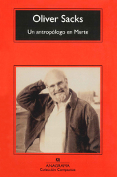

title: Un antropólogo en Marte - Oliver Sacks
summary: Reseña del libro 'Un antropólogo en Marte' de Oliver Sacks.
date: 2016-04-10 16:30:00

Leer este libro del recientemente fallecido neurólogo [Oliver Sacks](https://es.wikipedia.org/wiki/Oliver_Sacks) hace pensar sobre el concepto de "realidad".

El libro relata varios casos a los que hizo seguimiento a lo largo de su carrera. Casos como el del pintor que perdió la percepción del color a raíz de un accidente y que se vio forzado a sustituir su realidad anterior por otra distinta a la que no hubiera renunciado de haber podido tras haberse adaptado, pues le permitía percibir cosas en el mundo que antes no podía. U otro caso que se podría considerar opuesto, como fue el de una persona ciega desde la infancia a la que una operación le devolvió la vista en la cuarentena y que poco a poco terminó renunciando al nuevo don ya que sus estructuras neuronales habían construido una realidad válida partiendo de lo que tenía, haciendo que la visión la modificara hasta un grado insoportable.

Describe también varios casos del desconcertante [síndrome de Tourette](https://es.wikipedia.org/wiki/S%C3%ADndrome_de_Tourette). En mis tiempos de instituto conviví con un muchacho que seguramente correspondía con este síndrome. Como suele ser habitual en estos casos, y más en un ambiente adolescente, era objeto de numerosas burlas. Personalmente nunca llegué a burlarme de él, pero sí me desconcertaba. Ahora creo que ese muchacho era un valiente cuando menos.

El libro en general dibuja la casi imposibilidad de comprensión hacia los casos que más se alejan de la normalidad. En igual grado a ambos lados del espacio que separa las distintas realidades que viven unos (sus pacientes) y otro (Sacks). Pero a la vez es un ejercicio de tolerancia y escepticismo hacia lo diferente, siendo muy consiciente del poder que encierran estas personas al vivir otra realidad, en algunos aspectos aumentada y en otros reducida, no mejor ni peor sino más o menos válida para la suerte que les toque vivir. De la misma forma que un perro no elige vivir en un mundo "tan" olfativo pero construye su mundo en él y nos puede ayudar en ocasiones, personas con sistemas nerviosos diferentes como los autistas, pueden ayudarnos también, como [Temple Grandin](https://es.wikipedia.org/wiki/Temple_Grandin) ilustra muy bien.

<iframe width="854" height="480" src="https://www.youtube.com/embed/fn_9f5x0f1Q" frameborder="0" allowfullscreen></iframe>
