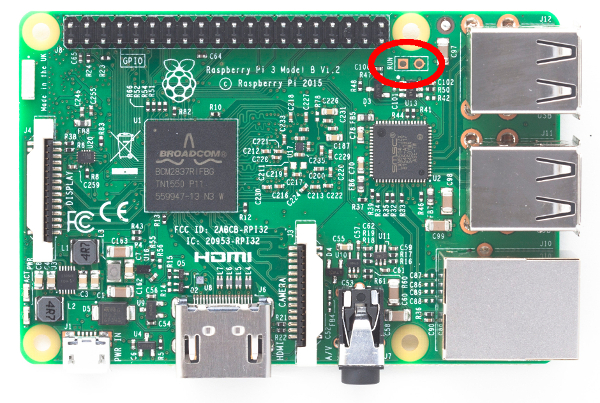
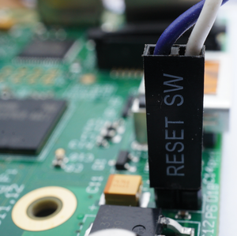
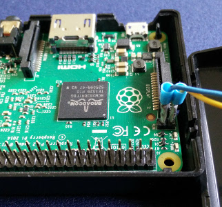

title: Interruputor de encendido para Raspberry Pi
summary: Instalación de un pulsador de reset/encendido en Raspberry Pi.
date: 2016-10-17 20:00:00

Una de las carencias de Raspberry Pi es la falta de botón de encendido o apagado. Algo que no es grave, sí resulta incómodo por ejemplo cuando se utiliza como [media center con Kodi](2015-03-14-raspi2-kodi-tvheadend.md) ya que puede no resultar sencillo quitar y poner el cable de encendido a la Raspberry estando ésta detrás del televisor enterrada en cables y aparatos. La opción lógica sería alimentar la Raspberry a través de una regleta de conexiones con interruptor, pero cuando no es posible/conveniente, hay alternativas. La comunidad ha desarrollado numerosos accesorios (como [éste](https://www.pi-supply.com/product/pi-supply-raspberry-pi-power-switch/)), pero existe una opción mucho más simplificada y barata que paso a describir.

Se trata de conectar un pulsador a los pines de reset que existen en todas las versiones de Raspberry Pi. En la placa se señalan con la etiqueta `Run` y según la versión se encuentran en uno u otro lugar. Por ejemplo en las versiones B+ y 2 está en el borde izquierdo justo debajo de los LEDs de actividad y encendido:

En la versión 3 está desplazado a la derecha del GPIO:

Pues bien, sólo hay que soldar un par de pines a esas dos conexiones:

En esos pines lo ideal sería enchufar un conector de pin hembra doble como éste:

Hasta que me haga con él he improvisado la conexión con unos terminales de empalme aplastados:

En el otro extremo de los cables se puede conectar cualquier tipo de interruptor o mejor un pulsador. Por ejemplo utilicé un tactile switch que me sobró del montaje de la [PiGRRL 2](2016-07-21-PIGRRL-2.md):

Se puede situar en la caja haciendo un agujero en un lugar que no interfiera con los componentes altos de la Raspberry y pegarlo con cola caliente:

Desde fuera el resultado final es el que puede verse en la imagen de cabecera del post.

El pulsador en realidad es un Reset. De hecho viene bien también en caso de un bloqueo de Kodi. Así, el apagado de la Raspberry tendremos que hacerlo de forma lógica. Para ello se puede utilizar el menú "Apagar" de Kodi (abajo a la izquierda en la pantalla principal). En mi caso incluso se apaga el televisor ya que Kodi debe enviar la orden a través del HDMI. Con esto la Raspberry queda apagada. Sólo queda el consumo residual del alimentador microUSB, pero supongo que si es medianamente inteligente será despreciable. Luego a la hora de encender sólo tengo que pulsar el switch. También en mi caso se enciende automáticamente el televisor a los 2 ó 3 segundos de haber pulsado el switch y aparece el interfaz Kodi en pantalla (en una Raspberry Pi 2).
