title: Crankshaft - AndroidAuto on Raspberry Pi
summary: Installing a Raspberry Pi with a 7" touchscreen in the dashboard console of an Opel Corsa model D.
date: 2018-10-18 22:30:00

!!! Info "Update 2019-07-07"
    After an update to Google Play Services in early July 2019, the touchscreen stopped responding while OpenAuto was running. It is reported as [issue #352](https://github.com/opencardev/crankshaft/issues/352) in the Crankshaft repository. [This post](2019-07-07-crankshaft-build.en.md) offers one possible workaround until a release integrating the fix appears.

!!! Info "Update 2019-07-22"
    After about 9 months of trouble-free use, the Mausberry Circuits Car Switch module stopped working. This happened after several days in which I had removed the Raspberry Pi and the screen (because of the Crankshaft issue mentioned in the previous update). I do not know whether that had any influence, but it seems too much of a coincidence. The problem lies in the printed circuit board that integrates the controller. The 12V to 5V converter module still works fine, so until I come up with a better solution I have removed the controller and powered the Raspberry Pi directly from the converter module, taking 12V from the ignition line. This way, when the ignition is turned off, the Raspberry Pi shuts down abruptly, but in theory the system is mounted read-only so there should be no issues.

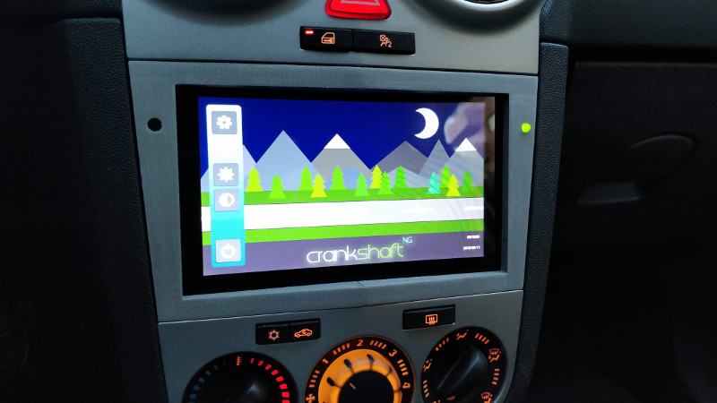

Below is a description of how to install a Raspberry Pi with a 7" touchscreen in the dashboard console of an Opel Corsa model D (2012), replacing the factory CD radio so it can be used as an AndroidAuto-compatible terminal.

The screen is the official 7" touchscreen from the Raspberry Pi Foundation, which is approximately the size of the 2DIN slot left by the car's CD radio. To secure it in the radio opening, a pair of parts are designed and manufactured with a 3D printer.

## Components

* [Radio removal tool](https://es.aliexpress.com/item/1-Pair-90mm-Car-Radio-Stereo-Removal-Key-Tool-For-Vauxhall-Opel-Corsa-C-Meriva-PC5/32767508369.html)
* [Raspberry Pi 3](https://www.amazon.es/dp/B01CD5VC92)
* [Official Raspberry Pi 7" touchscreen](https://es.rs-online.com/web/p/kits-de-desarrollo-de-display-de-graficos/8997466/)
* [USB microphone](https://es.aliexpress.com/item/Mini-Condenser-Microphone-USB-Lavalier-Microfone-for-Computer-PC-Laptop-etc-with-USB-connector/32805808159.html)
* [Power supply circuit](https://www.mausberrycircuits.com/collections/frontpage/products/3a-car-supply-switch-1)
* microSD card
* LED
* 220Ω resistor
* 4x M3x10 screw
* [Cable with JST connector](https://es.aliexpress.com/store/product/2-10Pairs-100-150mm-2-Pin-Connector-JST-Plug-Cable-Male-Female-For-RC-BEC-Battery/1994020_32870752993.html)
* [Female-to-female jumper wires](https://es.aliexpress.com/item/Electrical-Durable-Cables-40pcs-20cm-2-54mm-1p-1p-Pin-Female-to-Female-Color-Breadboard-Cable/32697942452.html)
* [3D-printed plastic mounting parts](https://www.thingiverse.com/thing:3162930)

## System preparation

The system we will load onto the microSD card is a special version of Raspbian with the [OpenAuto](https://github.com/f1xpl/openauto) package preinstalled, called Crankshaft, whose image can be downloaded from [here](https://github.com/opencardev/crankshaft/releases). We transfer the image to the microSD using a program such as [Etcher](https://etcher.io/).

## Removing the CD radio

This is what we are going to lose:

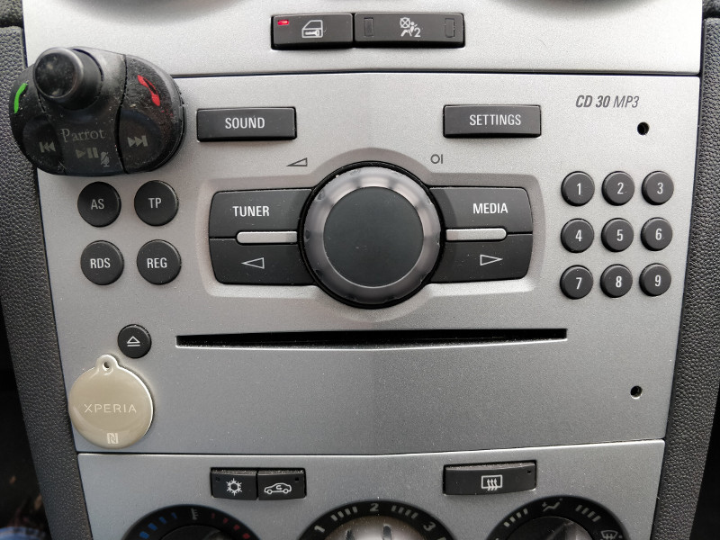

To remove it we need the tool included in the components list, which is inserted into the holes on both sides (in the photo, the holes on the left side are covered by the hands-free remote control and the NFC tag). The CD radio will slide out cleanly except for the antenna cables and the main connector, which we will have to disconnect.

## Power supply circuit

Properly powering the Raspberry Pi from the car battery is one of the most complex issues to solve in this project. We will discuss the tricky points later. We will start by locating the ground (GND), constant +12V, and ignition-switched +12V terminals on the CD radio connector. To begin with, the ignition-switched +12V terminal does not appear to be present.

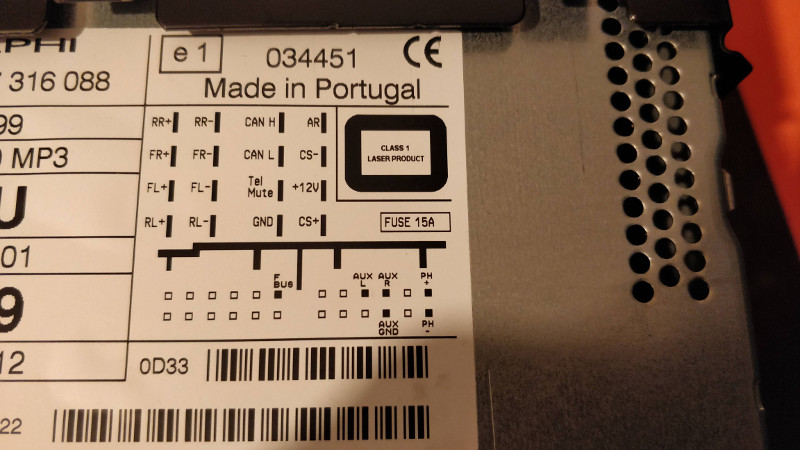

The car probably tells the CD radio that the ignition has been turned off through the CAN bus. Fortunately, my car came factory-equipped with a Parrot hands-free kit, whose installation tapped into the ignition-switched 12V line in the vehicle wiring harness. Otherwise, you would need to splice a wire somewhere you know that signal exists (for example, at the cigarette lighter connector).

Once the three indicated wires have been located, there are many ways to approach powering the system. Initially I chose the simple route and bought a small, cheap [12V to 5V converter circuit](https://es.aliexpress.com/item/1PCS-power-module-Adjustable-MP1584EN-DC-DC3A-power-step-down-descending-output-module-12-v9v5v3-LM2596/32624261712.html) (its output is actually adjustable between 0.8V and 20V) and connected it directly to the ignition wire. This way, when the car ignition was turned on, the Raspberry Pi powered up, and when it was turned off, the Raspberry Pi shut down. It worked very well, but this setup has the drawback that if the Raspberry Pi is not shut down first from the menus, the system on the microSD risks being corrupted. I thought I would remember to do that every time I stopped the car, but in reality I forgot roughly half the time, so I moved to a more sophisticated system. I believe the latest versions of Crankshaft mount the microSD card in read-only mode, so abrupt disconnections may not actually be a problem, but I feel safer with the setup I later adopted and describe below.

I got the Mausberry Circuits board listed in the components section. It is worth noting that it often goes out of stock. In fact, when I tried to buy it, it was unavailable, but I subscribed to the email notification that alerts you when it is back in stock and about a month later I was able to purchase it. There are several alternative boards (such as [this one](https://bluewavestudio.io/index.php/bluewave-shop/power-supply/bws-car-ps-v1-usb-detail)), but I like the Mausberry Circuits one more because it has a dual communication channel with the Raspberry Pi, so it not only tells it to shut down gracefully, but when it detects that the shutdown is complete, it cuts the power entirely. Other boards keep supplying power, which results in standby consumption that in my measurements is around 50mA, enough to drain the battery in about 4 weeks.

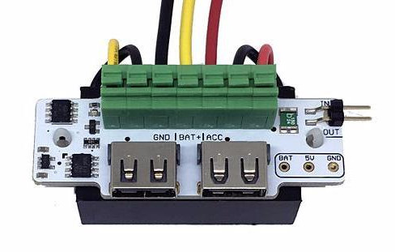

The input connections to the Mausberry Circuits Car Switch will therefore be the three mentioned above, which we need to locate in the console cavity left by the CD radio:

* GND (black wire)
* constant +12V (yellow wire)
* ignition +12V (red wire)

It is worth mentioning at this point that it is highly advisable to place a fuse on the car's 12V line or lines that we use. Fortunately, I had several wires with built-in fuses from old hands-free installations I have accumulated over the years.

As for the outputs, the 5V needed by the Raspberry Pi can be taken from one of the two USB ports, but I preferred to solder wires both to the Car Switch and to the Raspberry Pi. First, to avoid the bulkiness of a microUSB cable inside the dashboard, and second, to prevent disconnections caused by the car's vibrations. So I soldered a cable with a quick connector ([JST type](https://es.aliexpress.com/store/product/2-10Pairs-100-150mm-2-Pin-Connector-JST-Plug-Cable-Male-Female-For-RC-BEC-Battery/1994020_32870752993.html)) to the 5V and GND outputs visible at the bottom right of the Car Switch photo. I also soldered in parallel on those same pins an LED with its corresponding protection resistor (the 220Ω resistor listed in the components section) so I would have a visual indication of whether the Car Switch had definitively cut the power and could leave the car with peace of mind.

Finally, we place two wires on the IN and OUT pins at the top right, which we will later connect to the Raspberry Pi GPIO.

The final result is this:

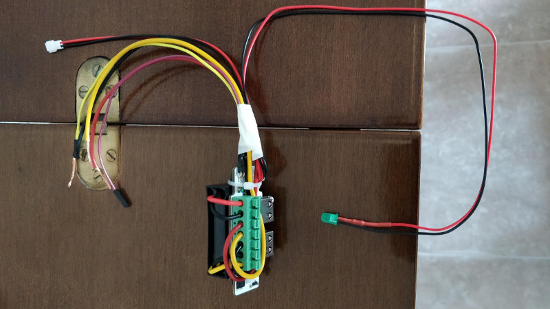

One of the parts designed for 3D printing that I link later is a box to protect the Car Switch assembly and its connections. The box has a small opening aligned with one of the two USB ports. By connecting a USB extension cable (female-to-male) through that opening, we ensure that the circuit does not move inside the box. I routed this extension cable downward together with the regular USB cable where we will connect the phone, so as to have a normal USB charging port "for guests" or for any other need (for example fast phone charging, since the Car Switch can provide 3A). If this extension cable is not installed, it is recommended to use some kind of tape to prevent the Car Switch from coming out of the box.

Finally, the other end of the power connector (JST) is soldered to the Raspberry Pi at the points labeled PP2 (+5V; in the photo the label is covered by the cable itself) and PP5 (GND). The following photos correspond to the Raspberry Pi 3 Model B. On the Model B+ I have verified that the points are in the same location. [This article](https://raspberrypi.stackexchange.com/questions/76653/powering-raspberry-pi-with-broken-micro-usb-connector) contains the schematic detailing the various available power points.

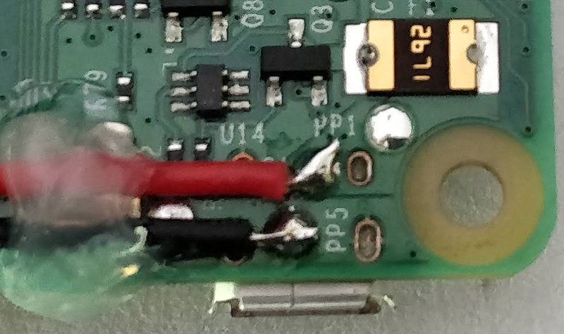

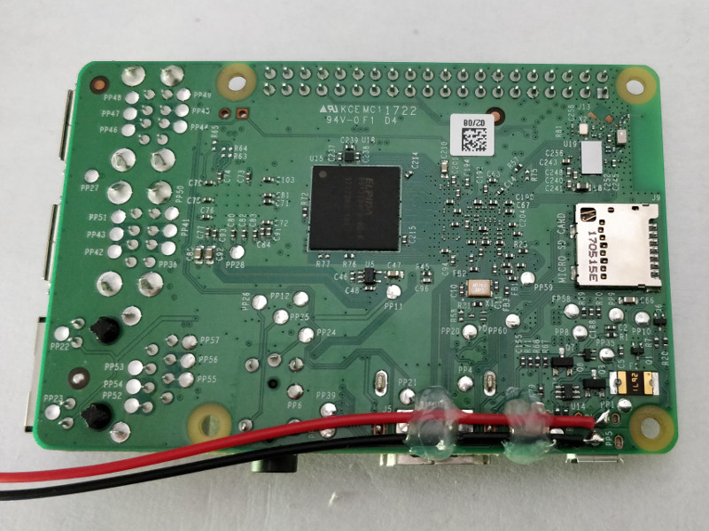

For the Car Switch circuit and the Raspberry Pi to communicate, besides placing the two jumper wires, a script must be installed on the Raspberry system to monitor the pin that reports the car ignition status. The system we installed in one of the first sections (Crankshaft) is based on Raspbian, so the script can be installed by following the instructions for that system in the "Installing the script" section of the [Car Setup](http://mausberrycircuits.com/pages/car-setup) page.

It can also be installed manually by copying the script to the path `/etc/switch.sh`, giving it execution permissions, and adding the following to the end of the `/etc/rc.local` file (just before `exit 0`) so it runs at startup:

```
/etc/switch.sh &
```

The script is this:

```bash
#!/bin/bash

#this is the GPIO pin connected to the lead on switch labeled OUT
GPIOpin1=23

#this is the GPIO pin connected to the lead on switch labeled IN
GPIOpin2=24

#Enter the shutdown delay in minutes
delay=0

echo "$GPIOpin1" > /sys/class/gpio/export
echo "in" > /sys/class/gpio/gpio$GPIOpin1/direction
echo "$GPIOpin2" > /sys/class/gpio/export
echo "out" > /sys/class/gpio/gpio$GPIOpin2/direction
echo "1" > /sys/class/gpio/gpio$GPIOpin2/value
let minute=$delay*60
SD=0
SS=0
SS2=0
while [ 1 = 1 ]; do
power=$(cat /sys/class/gpio/gpio$GPIOpin1/value)
uptime=$(</proc/uptime)
uptime=${uptime%%.*}
current=$uptime
if [ $power = 1 ] && [ $SD = 0 ]
then
SD=1
SS=${uptime%%.*}
fi

if [ $power = 1 ] && [ $SD = 1 ]
then
SS2=${uptime%%.*}
fi

if [ "$((uptime - SS))" -gt "$minute" ] && [ $SD = 1 ] && [ $power = 1 ]
then
poweroff
SD=3
fi

if [ "$((uptime - SS2))" -gt 20 ] && [ $SD = 1 ]
then
SD=0
fi

sleep 1
done
```

In the script we can see the GPIO pins that we will use and to which we will therefore connect the two jumper wires coming from the Car Switch:

* `Car Switch: IN  <-> GPIO24 :Raspberry`
* `Car Switch: OUT <-> GPIO23 :Raspberry`

In the previous list, we indicated the Raspberry GPIO pins by name, not by number (a very common source of confusion). In the following image, the names are outside the red rectangle and the numbers are inside it (also surrounded by a circle).

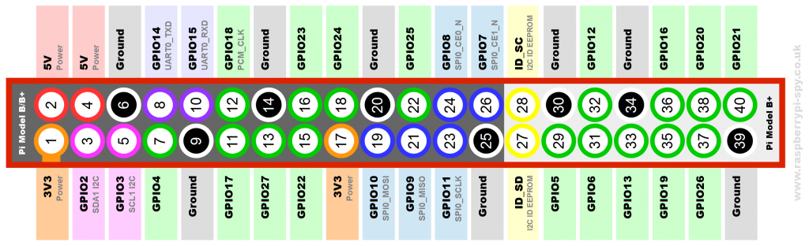

The script installation was done from a Linux computer by mounting the card on the system. To do it directly on a running Crankshaft system, keep in mind that in the latest versions the microSD is mounted in read-only mode to avoid corruption during sudden shutdowns. To remount in write mode, you need to execute one of these two commands depending on the partition you want to modify:

``` bash
crankshaft filesystem boot unlock
crankshaft filesystem system unlock
```

## Mounting the Raspberry Pi on the screen

The screen we will use has a mounting bracket for the Raspberry Pi on the back. We will screw in the spacers and connect the ribbon cable that links the screen to the Raspberry display connector. We still need to add some jumper wires to power the screen and let it communicate with the Raspberry; this can be done with simple female-to-female jumper wires (which actually come with the screen). To avoid disconnections caused by vibrations while driving, instead of using loose jumper wires I prepared a small cable with a pair of female header strips (a single one for the screen side and a double one for the Raspberry side). The result is more compact and secure, and looks like this:

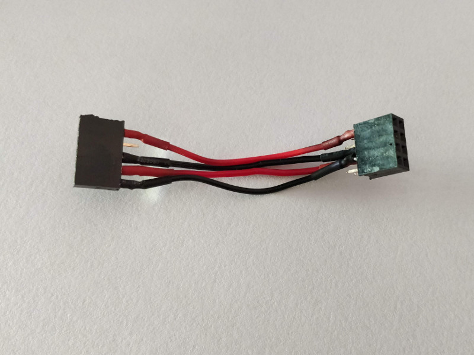

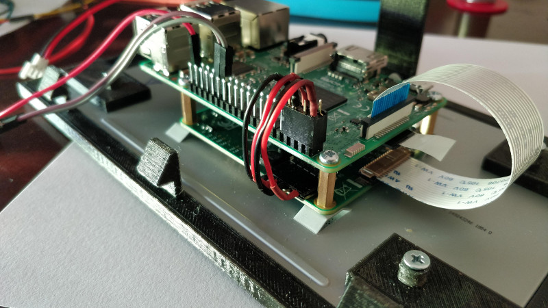

The pinout is as follows:

* `Screen: 5V  <-> PIN#02 :Raspberry`
* `Screen: GND <-> PIN#06 :Raspberry`
* `Screen: SCL <-> PIN#05 :Raspberry`
* `Screen: SDA <-> PIN#03 :Raspberry`

In the previous list, we indicated the Raspberry GPIO pins by number, not by name (unlike when we described the jumper wires that communicate with the Car Switch).

## Wiring

The following is the set of connections we will make between all the components just before performing the final mounting of the screen described in the next section:

1. Connecting the Car Switch to the car power lines, as discussed in the corresponding section:
    * Constant 12V line
    * Ignition 12V line
    * Ground line
2. Pin connection between the Car Switch and Raspberry Pi, also described earlier:
    * `Car Switch: IN  <-> GPIO24 :Raspberry`
    * `Car Switch: OUT <-> GPIO23 :Raspberry`
3. Raspberry Pi power JST connector.
4. USB microphone connected to the Raspberry Pi.
5. Micro USB cable (or USB-C in my case) connected to the Raspberry Pi and routed through the inside of the console so the phone can be connected in the cup holder tray area in front of the gear lever.
6. (Optional) USB extension cable (male-to-female) connected to the Car Switch and routed through the inside of the console to provide a fast-charging port in the cup holder tray area in front of the gear lever.

## Attaching the screen to the car console

To secure the screen-Raspberry assembly in the console opening left by the CD radio, we will use some 3D-printed parts. The link to download the STL files (and the scad files in case you want to modify them) is as follows:

[https://www.thingiverse.com/thing:3162930](https://www.thingiverse.com/thing:3162930)

They are basically two parts: one that fixes the screen into the opening and a frame to hide the gaps left around the screen so the assembly blends aesthetically into the car console. There are two versions of the part that holds the screen: a single-piece version and another split into several pieces to make it easier to print without supports. If you print the split version (recommended), it is not necessary to glue the parts together because by design they rest against one another with almost no movement. A note about one part that may seem odd: I mean a narrow and especially thin strip about 10 cm long. It is used to balance the support of the screen, because on the opposite side from where this piece is placed (the left side when viewed from the front), the screen has a thin sheet sticking out on that side (I think it is related to the touch digitizer). Since it is such a thin strip, you may omit it if you prefer.

Once the part or parts have been fitted to the screen, it looks like this:

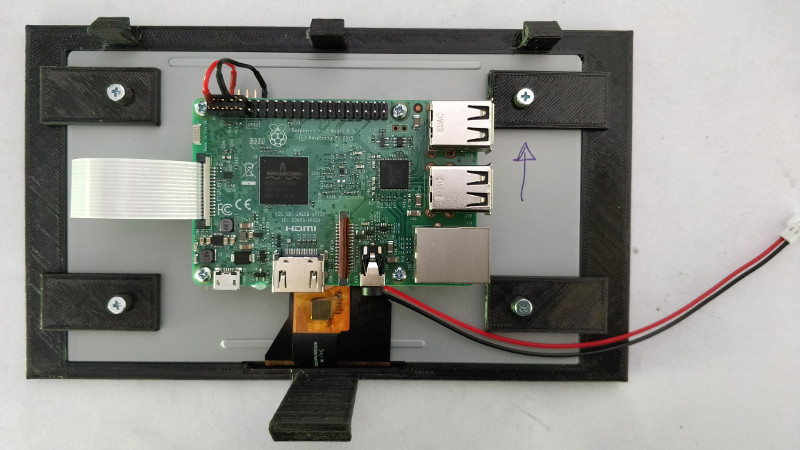

The screws used are M3x10. The support piece is held in the opening by the three upper tabs and the longer lower one. To remove the assembly, insert a spatula like those used to spread butter into the gap near the lower tab. By levering so that the tab disengages and tilting the assembly outward from the bottom, it should be possible to remove the screen and its support.

On both sides of the support and near the upper edge, there are two openings through which we can route the microphone and LED cables.

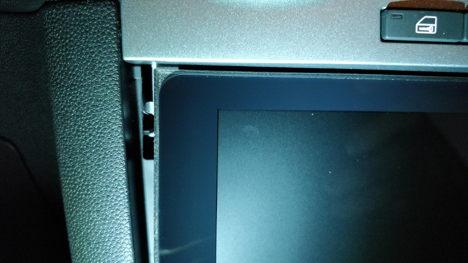

The electronics of the purchased microphone are inside the USB connector, which makes it bulky and large. To prevent the cable from hitting the inner wall of the opening, the cable exit was modified to make it angled. The cable was also cut down, since we only need about 20 cm, and the microphone casing (the small metal cylinder seen in the photo), which is not needed, was removed as well.

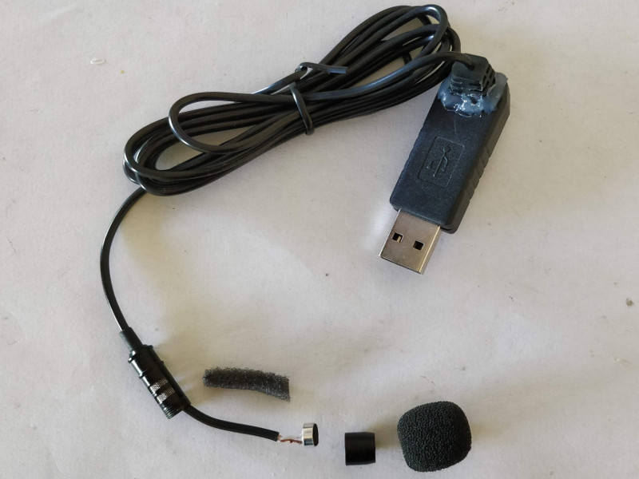

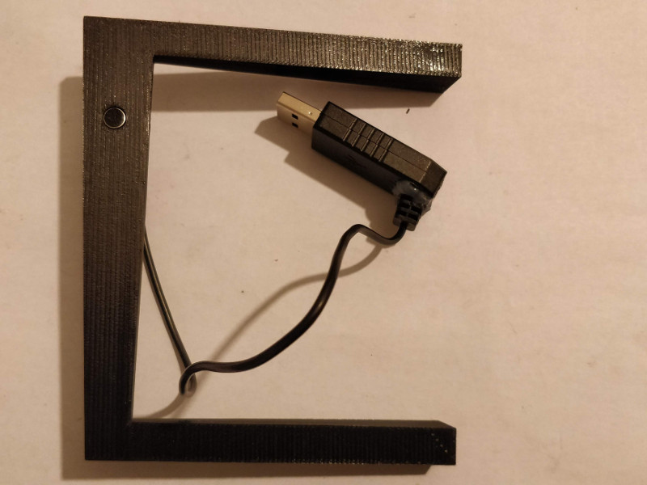

The result of the first version of the frame (still without the LED that I added when changing the power circuit) can be seen below. It is advisable to print at a 0.1 mm layer height because of the very shallow angle of the upper layers of the frame (due to the unusual shape of the Corsa console in that area).

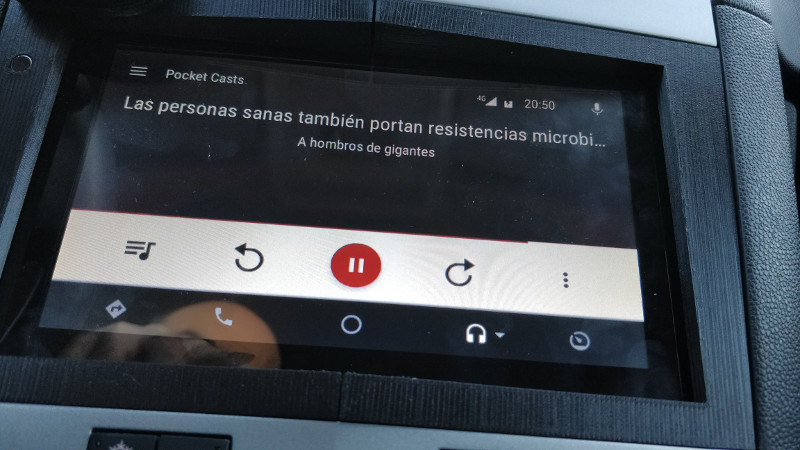

Finally, it is worth noting that the first version of the frame printed in PLA melted one afternoon when the car was parked in the sun.

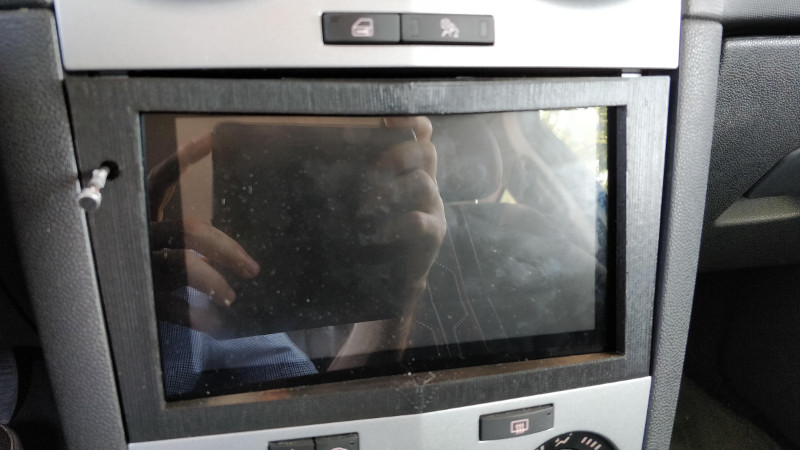

The solution was to print the parts in ABS. It was much more difficult to print, but this material certainly has advantages such as being able to sand the part (thus removing the ridges from layer changes) and, of course, withstanding without issues the heat that builds up when the car is exposed to the sun for hours. Here is the result of the second version in sanded ABS.

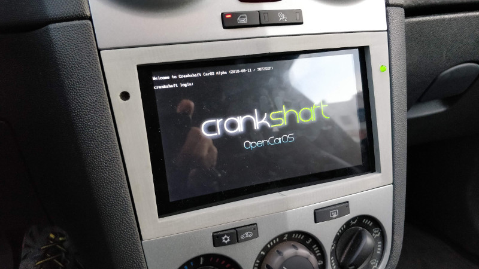

Two versions of the frame are provided: one in a single piece and another in two pieces that must later be glued together, since it is a wide part that may not fit on many 3D printer beds (as happened in my case). The frame will be attached using a few small pieces of double-sided tape.
