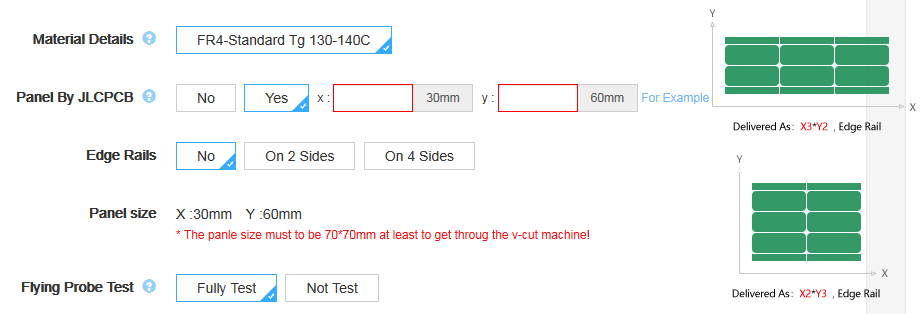
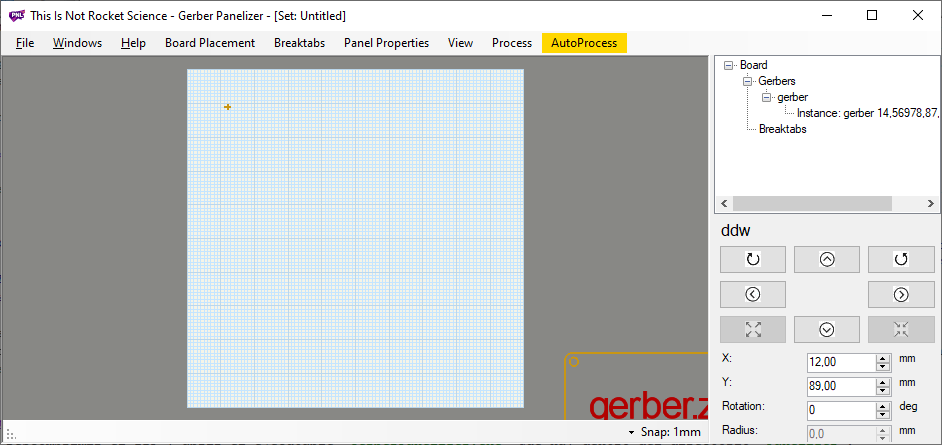
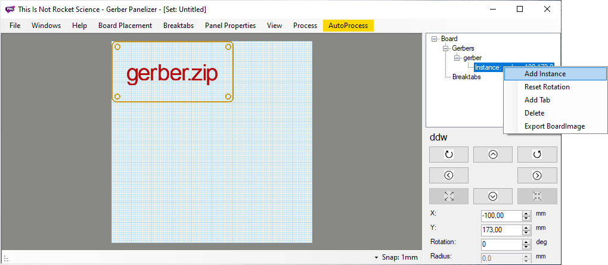
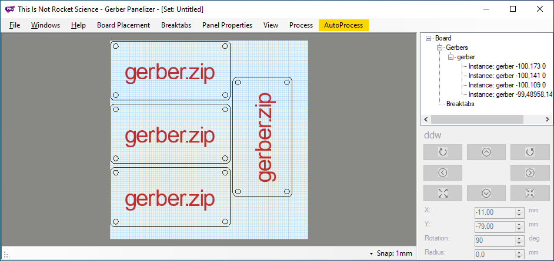
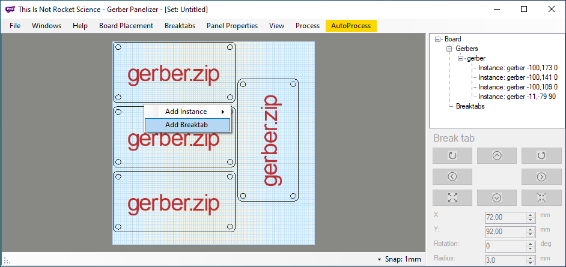
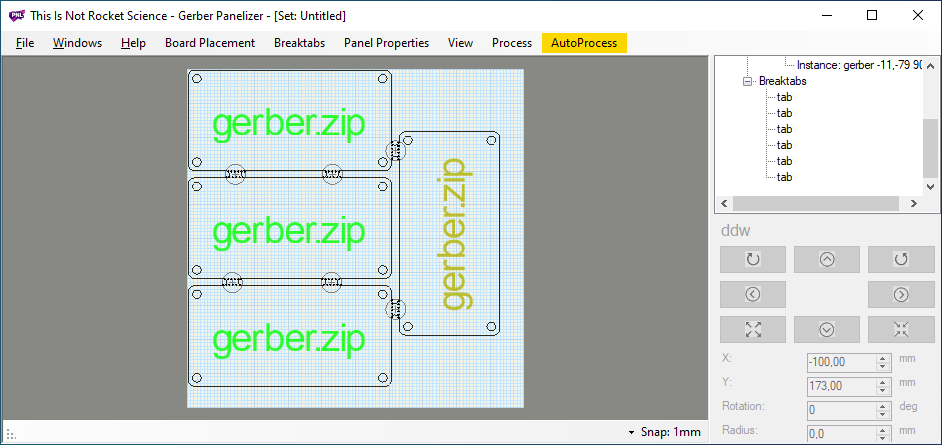
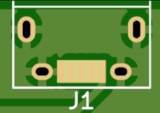
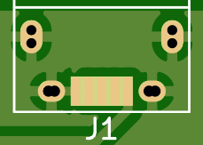
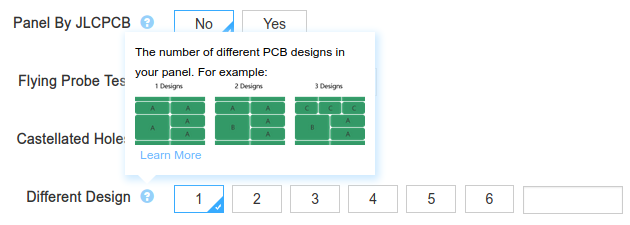

title: Panelizar PCB
summary: Panelización de varias PCBs para hacer un pedido más económico a JLCPCB.
date: 2020-02-16 19:04:00

Últimamente uso mucho el servicio de fabricación de PCBs de [JLCPCB](https://jlcpcb.com/). En la modalidad de prototipado, fabricar 5 placas de hasta 10x10cm cuesta 2€ (más unos 7€ de envío, pero suelo hacer pedidos múltiples, aunque en ese caso a partir de la segunda placa el coste es de 4€). Como los proyectos para los que tengo capacidad no pueden ser muy grandes, normalmente las placas que diseño quedan bastante por debajo de esas dimensiones. En esos casos, para aprovechar mejor el pedido se puede panelizar la PCB, es decir meter varias unidades de la misma en el fichero Gerber.

También se puede panelizar desde el mismo sitio, pero en ese caso ya no aplica la oferta de 2€.

## Preparar los Gerbers

Los Gerber deben utilizar las extensiones de tipo Protel. En las últimas versiones de KiCad se utiliza por defecto la misma extensión en todos los ficheros (`.GBR`) y el tipo de fichero/capa se codifica en el nombre. En estos casos para obtener las extensiones Protel podemos hacer dos cosas:

* Convertir las extensiones manualmente. Por ejemplo [en este enlace](https://support.jlcpcb.com/article/22-how-to-generate-the-gerber-files) podemos encontrar la correspondencia (ojo porque la correspondencia de la extensión `.GTO` es con la capa `F.SILKS` y no con la `F.MASK` como indica la tabla).
* Marcar la opción `Use Protel filename extensions` en el cuadro de diálogo de trazado de los Gerber. También la opción `PTH and NPTH in single file` del cuadro de diálogo de generación de los drill files.

## Panelización

Una vez que tengamos los [ficheros Gerber](https://es.wikipedia.org/wiki/Gerber_(formato_de_archivo)) con las extensiones Protel comprimidos en un ZIP, utilizaremos una utilidad gratuita para disponer varias copias de la PCB dentro del panel de 10x10cm que JLCPCB nos permite. Vamos a ver cómo hacerlo paso a paso.

1. Bajar la última release de las [GerberTools](https://github.com/ThisIsNotRocketScience/GerberTools) desde [aquí](https://github.com/ThisIsNotRocketScience/GerberTools/releases).
2. Descomprimir el ZIP y abrir el ejecutable `GerberPanelizer.exe` que hay dentro del directorio `Panelizer`.
3. Seleccionar `New` del menú `File`. Por defecto nos aparecerá un panel de 10x10cm que es lo que necesitamos. Si por algún motivo no ocurriera así o nos interesaran otras dimensiones, podemos cambiarlas en el menú `Panel Properties`.
4. Arrastrar el archivo ZIP que contiene los Gerber al panel. Aparecerá la silueta de la PCB en pantalla. Puede ocurrir que sólo veamos un aspa con forma de signo `+`. Suele ocurrir porque al diseñar la PCB en KiCad normalmente se sitúa en el centro del área de dibujo, y el punto en el que arrastramos el ZIP se asimila a la esquina superior izquierda de dicha área de dibujo. Para alcanzar a ver la silueta de la PCB y poderla arrastrar hasta el interior del panel, utilizar el menú `View > Scale 1:1`. También podemos probar a dar valores negativos a los parámetros `X` e `Y` que vemos en el panel derecho de la aplicación:

	

5. Una vez recolocada la PCB dentro del panel, añadiremos nuevas instancias de la misma haciendo click sobre la instancia inicial en el listado de la derecha. Como alternativa podemos hacer click con el botón derecho del ratón sobre el panel y seleccionar la entrada `Add Instance` del menú contextual:

	

6. Añadiremos todas las instancias de la placa que quepan en el panel. En ocasiones nos puede interesar girar una de las instancias. Para ello utilizaremos los controles que hay en el panel situado bajo el listado de instancias. Al girar puede ocurrir que la instancia desaparezca de la visualización por el problema descrito en el punto 4. De nuevo jugar con las opciones de zoom o dar valor manualmente a los campos `X` e `Y`:

	

7. Llega el momento de añadir las pestañas que unirán las distintas instancias para constituir un panel. Para ello haremos click sobre el punto donde deseemos colocar una pestaña de unión y seleccionaremos `Add Breaktab` del menú contextual. Advertir que para que la pestaña sea operativa, las instancias de la PCB deben estar separadas una distancia mínima. El programa nos advertirá sobre ello marcando la pestaña en rojo si sucede este problema:

	

8. Añadiremos por lo menos 2 pestañas por lado adyacente:

	

9. Sólo queda exportar el panel resultante mediante el comando de menú `File > Export Merged Gerbers`. Tras terminar el progreso que se muestra sobre una pequeña ventana, obtendremos dos vistas de ambas caras del panel y los Gerbers resultantes en el directorio que hayamos seleccionado donde guardar el resultado de la exportación.

Aquí podemos ver el proceso en video:

<iframe width="853" height="480" src="https://www.youtube.com/embed/iYrUztOn3dU" frameborder="0" allow="accelerometer; autoplay; encrypted-media; gyroscope; picture-in-picture" allowfullscreen></iframe>

!!! Warning "Advertencia"
    Debo mencionar que he observado que la utilidad Panelizer introduce un problema en el panel resultante. Por algún motivo pierde el detalle de los agujeros alargados y los convierte en dos agujeros hechos al comienzo y al final. Prestar atención por tanto a si nuestras huellas incluyen agujeros de este tipo.

    
    

!!! Info "Aclaración"
    A la vista de este artículo podría pensarse que podemos aprovechar el sistema de panelización para encargar varias PCBs en un mismo pedido sin más que añadir instancias de distintas PCBs al panel. En teoría hay que declarar cuántas PCBs distintas hay en un panel panelizado por el usuario en el parámetro `Different Design` a la hora de hacer el pedido. Desconozco si JLCPCB detectará y no admitirá este tipo de pedidos, aunque sospecho que así es.

    
