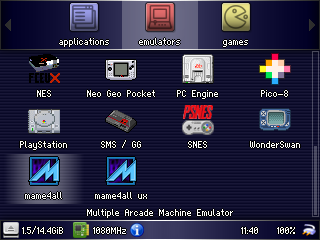
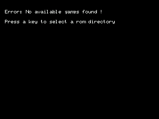
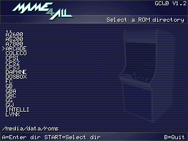
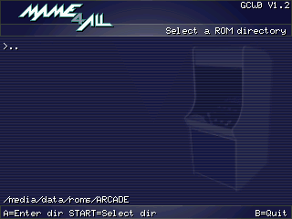
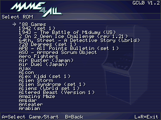
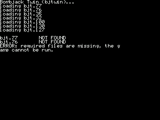

title: RG350 MAME4All
summary: Instalación y configuración de MAME4All en RG350.
date: 2020-05-14 11:00:00


MAME4All es otro port del conocido multiemulador de máquinas arcade, alternativo a [xMAME](2020-04-15-rg350_xmame.md). En principio implementa un romset más antiguo que los tres que implementa xMAME, pero aun así nos puede convenir instalarlo ya que algunos juegos se ejecutan mejor en MAME4All que en xMAME. Vamos a ver cómo instalarlo y configurarlo en la consola RG350.

## Instalación

El emulador tiene forma de OPK, como la mayoría de los emuladores para el sistema de la RG350 (OpenDingux). Encontramos dos variantes de este OPK:

* La del [repositorio original](https://github.com/alekmaul/mame4all) cuyo OPK compilado lo podemos encontrar [aquí](https://github.com/retrogamehandheld/OpenDingux/raw/master/Emulators/MAME4ALL_2014-01-04.opk) por ejemplo.
* Mod que permite usar el explorer para seleccionar las ROMs, presentada en [este foro](https://boards.dingoonity.org/retro-game-350rg-350/launch-xmame-or-mame4all-with-command-line/msg194412/#msg194412), desarrollada sobre [este repositorio](https://github.com/goldmojo/mame4all) y cuyo OPK podemos encontrar [aquí](https://github.com/goldmojo/mame4all/releases/download/Mame4All-params-v5/mame4all-params-5-skipwarnings.opk).

Nosotros vamos a utilizar la segunda variante que presenta dos lanzadores en GMenu2X, uno para lanzar el interfaz propio de MAME4All (`mame4all ux`) y otro para lanzar directamente ROMs desde el explorador. Esto último será lo que nos permita integrar MAME4All con otros frontends como EmulationStation, SimpleMenu o PyMenu.



Por tanto sólo tenemos que bajar el OPK elegido de la lista anterior y copiarlo a una de las dos rutas que explora GMenu2X para mostrar los lanzadores, es decir:

* Tarjeta interna: `/media/data/apps`
* Tarjeta externa: `/media/sdcard/apps`

## Configuración

La primera vez que tratemos de abrir el lanzador que nos lleva al interfaz propio de MAME4All (`mame4all ux` en el caso de que hayamos instalado el OPK con doble lanzador), aparecerá un mensaje de error y se nos pedirá que localicemos el directorio donde se encuentran las ROMs:



Navegaremos por el árbol de directorios hasta localizar nuestras ROMs:




Finalmente al seleccionar el directorio pulsando `Start` aparecerá el listado de las ROMs que se han reconocido correctamente:



!!! Note "Nota"
    Que aparezcan las ROMs en el listado sólo significa que se han encontrado con el nombre correcto. El contenido de las mismas no se comprueba hasta que intentamos abrirlas. Así es posible que algunas ROMs aparezcan pero luego no sean ejecutables. MAME4All nos mostrará un informe del problema que ha encontrado para ejecutar las ROMs.

    

MAME4All se basa en el [romset](retro-emulacion/rg-350.md#que-es-un-romset) 0.37b5, también conocido como 0.41, cuya definición podemos encontrar [aquí](http://www.progettosnaps.net/download?tipo=dat_mame&file=/dats/MAME/MAME_Dats_037-52.rar).

## Integración en frontends

Si hemos elegido la variante del OPK con el mod que permite seleccionar las ROMs mediante el explorer, MAME4All se podrá integrar con otros frontends como la mayoría de los emuladores. Por ejemplo esta es la definición como sistema en [SimpleMenu](2020-01-25-rg350_simplemenu.md):

```
[MAME4ALL]
execs = /media/data/apps/mame4all-params-5-skipwarnings.opk
romDirs = /media/data/roms/ARCADE/,/media/sdcard/roms/ARCADE/
romExts = .zip
aliasFile = /media/home/.simplemenu/alias.txt
```

Y esta en [PyMenu](2020-03-28-rg350_pymenu.md):

```
{
    "description": "MAME4All Arcade EMU",
    "hideFolders": true,
    "limitSelection": true,
    "name": "MAME4All",
    "overclock": "1080",
    "previews": "/media/data/roms/ARCADE/.previews",
    "selectionPath": "/media/data/roms/ARCADE",
    "system": "mame4all",
    "type": "emulator",
    "useFileFilter": true,
    "useGamelist": false,
    "useSelection": true
},
```

## Controles

A continuación se muestra una recopilación de controles de MAME4All:

|Control|Situación|Función|
|:------|:--------|:------|
|`Arriba` / `Abajo`|En frontend|Seleccionar ROM una a una|
|`Izquierda` / `Derecha`|En frontend|Seleccionar ROM página a página|
|`A`|En frontend|Abrir ROM seleccionada|
|`L1 + R1`|En frontend|Salir|
|`Select`|En frontend|Regenerar caché (para detectar nuevas ROMs añadidas)|
|`Arriba` / `Abajo`|En configuración de ROM|Seleccionar opción a cambiar|
|`Izquierda` / `Derecha`|En configuración de ROM|Cambiar opción|
|`A`|En configuración de ROM|Guardar opciones configuradas y abrir ROM|
|`B`|En configuración de ROM|Volver a la lista de ROMs|
|`A`, `B`, `X`, `Y`, `L`, `R`|En juego|Botones MAME 1,2,3,4,5,6|
|`Select`|En juego|Insertar moneda|
|`Start`|En juego|Comenzar 1P|
|`Start + Select`|En juego|Menu MAME|
|`Start + L1 + R1` o `Power` (según versión)|En juego|Salir del juego|
|`L1 + R1`|En juego|Pausa|
|`Select + R1`|En juego|Mostrar FPS|
|`Start + L1`|En juego|Mostrar Profiler|
|`L1 + B`|En juego|Hacer captura de pantalla (se almacena en `/media/data/local/home/.mame4all/snap`)|
