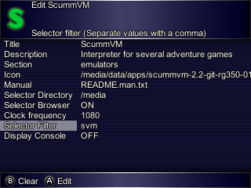

title: RG350 ScummVM en lanzadores
summary: Integración de ScummVM en lanzadores con selección de ROMs como SimpleMenu.
date: 2020-08-15 17:00:00


!!! Note "Nota"
    Este artículo ha sido posible gracias a la investigación realizada sobre el tema por [José Vicente Alberca](https://linkedin.com/in/jvalberca) y a los detalles y ficheros preparados que me ha entregado. Gracias.

ScummVM es uno de esos sistemas de emulación que en RG350, al igual que otros como OpenBOR, utiliza un interfaz propio para seleccionar y arrancar los juegos, lo que dificulta su integración en lanzadores como SimpleMenu, EmulationStation o PyMenu. A pesar de ello, en las últimas versiones existe un mecanismo previsto para poder realizar la integración con los selectores de ROMs de los lanzadores. Vamos a ver cómo.

Partimos de una instalación como la vista en [este artículo](2020-04-14-rg350_scummvm.md) anterior.

## Instalación de OPK con soporte de argumentos

Necesitamos una versión del emulador que admita o mejor dicho que lea argumentos o parámetros que se le pasen al ejecutable y que por medio de los mismos se le pueda indicar el juego a abrir. Esta es justo la mejora realizada en la versión de ScummVM que encontramos en este repositorio:

[https://github.com/goldmojo/scummvm-rg350/releases/tag/2.2gitRC2-params](https://github.com/goldmojo/scummvm-rg350/releases/tag/2.2gitRC2-params)

Bajamos pues el OPK (desde [este enlace](https://github.com/goldmojo/scummvm-rg350/releases/download/2.2gitRC2-params/scummvm-2.2-git-rg350-01132020-params.opk)) y sustituimos el emulador de ScummVM que teníamos instalado antes. Como siempre, para [instalar un nuevo OPK](2020-07-02-rg350_primeros_pasos.md#dondecomo-instalo-el-fichero-opk-del-emulador-que-he-bajado), lo que tenemos que hacer es copiarlo a uno de estos dos directorios:

* En tarjeta interna: `/media/data/apps`
* En tarjeta externa: `/media/sdcard/apps`

## Creación de targets

ScummVM reconoce los juegos por unos IDs basados en una contracción del nombre de los juegos de forma parecida a como hace por ejemplo FBA. La lista de IDs puede consultarse en [esta página](https://www.scummvm.org/compatibility/). El OPK instalado en el apartado anterior, externamente se comporta como la mayoría de los emuladores, es decir admite que le pasemos un fichero como argumento. Internamente (mediante un pequeño wrapper), disecciona la ruta completa del fichero anterior y entrega al ejecutable interno lo siguiente:

1. Ruta del directorio con los ficheros del juego.
2. Nombre del fichero sin extensión a modo de target.

Vamos a verlo con un ejemplo. Cogemos como muestra el juego **Day Of The Tentacle**. Según la [página que lista los IDs](https://www.scummvm.org/compatibility/), a este juego le corresponde el ID `tentacle`. En mi máquina por ejemplo los ficheros del juego se encuentran en `/media/data/roms/SCUMMVM/Day Of The Tentacle`. En concreto esto es lo que allí hay:

```
RG350M:/media/data/roms/SCUMMVM/Day Of The Tentacle # ls -l
drwxr-xr-x    2 root     root          4096 Feb  5  1970 MANIAC
-rw-r--r--    1 root     root     268965339 Feb  5  1970 MONSTER.SOU
-rw-r--r--    1 root     root          7932 Feb  5  1970 TENTACLE.000
-rw-r--r--    1 root     root      11378198 Feb  5  1970 TENTACLE.001
```

Creamos pues el fichero que se convertirá en el target. Del fichero sólo nos interesa el nombre. Puede estar vacío. Como hemos dicho el nombre del fichero tiene que ser `tentacle` y la extensión cualquiera, aunque parece que existe una convención para utilizar `svm`. Así pues creamos el fichero con un simple `touch` (esa es la forma rápida de hacerlo por SSH, pero como siempre se puede hacer por otros medios como FTP, SCP o DinguxCmdr):

```
RG350M:/media/data/roms/SCUMMVM/Day Of The Tentacle # touch tentacle.svm
RG350M:/media/data/roms/SCUMMVM/Day Of The Tentacle # ls -l
drwxr-xr-x    2 root     root          4096 Feb  5  1970 MANIAC
-rw-r--r--    1 root     root     268965339 Feb  5  1970 MONSTER.SOU
-rw-r--r--    1 root     root          7932 Feb  5  1970 TENTACLE.000
-rw-r--r--    1 root     root      11378198 Feb  5  1970 TENTACLE.001
-rw-r--r--    1 root     root             0 Aug 15 22:47 tentacle.svm
```

Sólo queda configurar el launcher que utilicemos para que filtre la extensión que hayamos elegido (`svm` en el ejemplo anterior) para que no nos permita seleccionar el resto de ficheros del juego que podrían no tener el nombre correspondiente al target.



A partir de ese momento, si vamos al directorio del juego, sólo nos debería aparecer el fichero correspondiente al target. Abriéndolo arrancará el juego directamente sin mediar el interfaz clásico de ScummVM:

<iframe width="640" height="480" src="https://www.youtube.com/embed/HQKXA7SM2oM" frameborder="0" allow="accelerometer; autoplay; encrypted-media; gyroscope; picture-in-picture" allowfullscreen></iframe>

## Integración en SimpleMenu

Vamos a ver cómo realizaríamos la integración en SimpleMenu.

Empezamos editando el fichero de configuración que contiene los sistemas instalados. En mi caso por ejemplo es un único fichero en la ruta:

```
/media/data/local/home/.simplemenu/section_groups/sections.ini
```

Allí creamos un bloque como el siguiente:

```
[SCUMMVM]
execs = /media/data/apps/scummvm-2.2-git-rg350-01132020-params.opk
romDirs = /media/data/roms/SCUMMVM/
romExts = .svm
aliasFile = /media/home/.simplemenu/alias.txt
```

No hay que olvidar añadir el nuevo sistema al parámetro `consoleList` dentro del bloque `[CONSOLES]` que hay al principio del fichero.

Naturalmente habrá que adaptar en cada caso las rutas de OPK y ROMs. Como vemos, hemos incluido en la configuración el fichero `alias.txt` para que los targets sean convertidos a los nombres largos de los juegos. Para que esto funcione hay que incorporar el listado de targets al fichero. José Javier ha extraído todos los nombres posibles de la [web de ScummVM](https://www.scummvm.org/compatibility/) por lo que sólo tenemos que sustituir [este fichero](files/posts/scummvm-launchers/alias.txt) en el directorio de home de SimpleMenu, es decir: `/media/data/local/home/.simplemenu`

Por último hay que comprobar que el theme que estemos utilizando contenga la definición del sistema `SCUMMVM`. Afortunadamente el theme oficial `GBZ35Remix` ya lo incorpora. En caso de utilizar uno que no lo contenga habrá que incorporar una entrada en el fichero de definición del theme (`theme.ini`) y los recursos necesarios.

Ya sólo queda abrir SimpleMenu y comprobar el resultado:

<iframe width="640" height="480" src="https://www.youtube.com/embed/7-B7dmMirV8" frameborder="0" allow="accelerometer; autoplay; encrypted-media; gyroscope; picture-in-picture" allowfullscreen></iframe>
