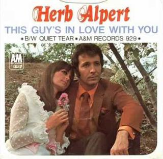

title: La canción que merece la pena escuchar
summary: This Guy's in Love with You de Herb Alpert.
date: 2020-08-31 19:00:00

Mientras terminan las últimas horas de mi particular versión del encierro al que en mayor o menor grado hemos estado todos sometidos los últimos meses, voy a contar aquí una de esas pequeñas historias ocurridas durante el mismo. Soy consciente de que se aparta mucho de la linea habitual de posts que se encuentran en este sitio.

!!! Note "Nota"
    El título del post "La canción que merece la pena escuchar" hace referencia a una sección que había al principio en [Todopoderosos](https://www.ivoox.com/podcast-todopoderosos_sq_f1147805_1.html), uno de mis podcasts favoritos.

## Tijuana Brass

La historia tiene sus raíces hace más de 40 años. Por aquella época casi todos los fines de semana mis padres nos llevaban a su pueblo natal, Tarazona. El viaje siempre iba acompañado de música porque era uno de los mejores remedios para evitar el mareo al que éramos propensos una de mis dos hermanas y yo mismo. Una de las pocas cassettes que teníamos era de los Tijuana Brass. Mis hermanas y yo nos sabíamos de memoria aquella cassette hasta el punto de replicar sus piezas en play back interpretando cada uno un instrumento (la marimba, las trompetas y trombones fundamentalmente). Todavía recuerdo bastante bien la mayoría de esos temas. Así sonaban:

<iframe width="853" height="480" src="https://www.youtube.com/embed/Cw09HthDTRw" frameborder="0" allow="accelerometer; autoplay; encrypted-media; gyroscope; picture-in-picture" allowfullscreen></iframe>

No sé si por ser parte de mi niñez o por no haber vuelto casi a encontrar aquella música fuera del escenario de aquellos viajes, siempre la consideré como música menor. Desconocía lo equivocado que estaba.

## Buscando un amigo para el fin del mundo

El segundo punto de la conjunción de detalles que me condujo a la canción, es una de las muchas (muchísimas) películas que he visto durante estos meses vividos casi exclusivamente en casa, [Buscando un amigo para el fin del mundo](https://www.imdb.com/title/tt1307068/). Realmente la había visto hace algo más de un año, y me gustó bastante, porque me suele atraer el estilo de cine que tiene, original, de ritmo pausado y sobre todo con buena música. Es de esas películas que guardé para ver en determinados momentos en que "sienta bien". Pero en ese momento desconocía su conexión con los Tijuana.

Tuvo su gracia ver esta película en los momentos más duros del confinamiento (tarde para vosotros). Es quizá la película más apocalíptica que conozco. Ni siquiera da pie al concepto de post-apocalipsis, no digo más. Realmente hasta el propio título deja clara la premisa, pero en cualquier caso solo es la excusa para poner en marcha la historia, no el fin (bueno sí, 🙄). Pero que nadie se asuste, no es un drama sino más bien una película romántica. Muy romántica.

Como decía antes la película tiene muy buena música y ya desde un primer visionado me llamaron mucho la atención tres piezas, siendo la que es motivo de este post la reservada para quizá el momento cumbre de la película. Pero volveré a ella, para desvelarla finalmente, tras el siguiente apartado.

## Movie Ticket Radio

El último detalle que logró fijar mi atención (y mucho) en el tema que os quería presentar es esta radio online: [http://www.movieticketradio.com/](http://www.movieticketradio.com/)

La descubrí hacia finales del año pasado y no he dejado de escucharla desde entonces, sobre todo cuando trabajo. Ha empeorado un poco hace unos tres meses cuando decidieron fusionar en uno los dos canales que tenían hasta entonces. Antes estaban los canales Classic y Pop, siendo el primero el que me tenía enganchado y que me ha hecho descubrir una gran cantidad de temas y de películas. Estoy particularmente agradecido a este sitio por haberme hecho conocer las siguientes películas (sobre todo la primera que se ha convertido en mi musical favorito):

* [The Music Man](https://www.imdb.com/title/tt0056262/)
* [Camelot](https://www.imdb.com/title/tt0061439/)
* [White Christmas](https://www.imdb.com/title/tt0047673/)
* [Animal Crackers](https://www.imdb.com/title/tt0020640/)
* [The King and I](https://www.imdb.com/title/tt0049408/)
* [Guys and Dolls](https://www.imdb.com/title/tt0048140/)
* [Yankee Doodle Dandy](https://www.imdb.com/title/tt0035575/)
* [South Pacific](https://www.imdb.com/title/tt0052225/)

Por si os interesa el canal, escucharlo a través del navegador es incómodo y da problemas. Está integrado en varias plataformas y apps para móvil como [TuneIn](https://play.google.com/store/apps/details?id=tunein.player) o [Simple Radio](https://play.google.com/store/apps/details?id=com.streema.simpleradio). En mi caso con el ordenador prefiero reproducirlo con VLC conectando este reproductor a esta URL: [http://listen.djcmedia.com/movieticketclassichigh](http://listen.djcmedia.com/movieticketclassichigh)

Varios de los temas de [Buscando un amigo para el fin del mundo](https://www.imdb.com/title/tt1307068/) aparecen recurrentemente en el canal, lo que intensificó mi atracción por el tema que nos ocupa, e hizo que investigara sobre su autor.

## Herb Alpert

Llegado este momento es cuando me doy cuenta de que el autor de la canción es el mismo que fundó el grupo Tijuana Brass de mi infancia y que lejos de ser un músico menor, ha sido uno de los más influyentes de su generación. Otra de las sorpresas ha sido comprobar que el bueno de Herb todavía vive, que ha estado en activo todo este tiempo y que ha dado continuas muestras de evolución y adaptación a los tiempos. Aquí podemos verlo tocando su inconfundible trompeta, en un video subido a su canal de YouTube hace tan solo 3 días enviando un mensaje optimista:

<iframe width="853" height="480" src="https://www.youtube.com/embed/f3xcybZ856Q" frameborder="0" allow="accelerometer; autoplay; encrypted-media; gyroscope; picture-in-picture" allowfullscreen></iframe>

Algunos de sus logros musicales son:

* Es la "A" del importante sello discográfico [A&M Records](https://es.wikipedia.org/wiki/A%26M_Records).
* 5 números uno y 28 álbumes en las listas de Billboard.
* 8 premios Grammy.
* 14 discos de platino y 15 discos de oro.
* Más de 72 millones de discos vendidos en el mundo.

Una vez que le había "puesto cara" a Herb, en posteriores visionados de la película me doy cuenta de que seguramente a su director o guionista, le gusta mucho este músico, ya que aparte de la canción por la que escribo el post, la protagonista de [Buscando un amigo para el fin del mundo](https://www.imdb.com/title/tt1307068/) aparece abrazada a un disco de Herb durante toda una importante escena (en realidad es a una colección de discos al frente de la cual aparece el de Herb):

## La canción

Llegamos ya por fin a la canción. Con semejantes expectativas ya casi solo puede defraudar.

Cada vez que suenan en Movie Ticket Radio los acordes de teclado electrónico del principio se me ponen los pelos de punta. En la [entrada de Wikipedia sobre Herb Alpert](https://es.wikipedia.org/wiki/Herb_Alpert) puede leerse lo siguiente sobre la canción:

> El único sencillo de Alpert que fue número uno durante este periodo (y el primer #1 corte de su sello A&M) fue: "Este Tipo Enamorado de Ti (This Guy's in Love with You)", creada recientemente por [Burt Bacharach](https://es.wikipedia.org/wiki/Burt_Bacharach) y [Hal David](https://es.wikipedia.org/wiki/Hal_David) en música y letra, todavía no tenía intérprete y se la dieron a Alpert que se lo dedicó a su primera esposa en un especial de Televisión CBS en 1968 titulado Beat of the Brass ofreciendo un raro vocal. La secuencia se grabó en la playa en Malibu. No se pensaba que la canción se volviese a emitir, pero después del especial, los miles de llamadas telefónicas a CBS preguntando por Herb convencieron al dueño del sello de Alpert para lanzarlo como single dos días después de que el show se emitiese. Las habilidades vocales de Alpert eran limitadas, pero esta canción era muy melódica y estaba hecha por un hacedor de éxitos como Bacharach. Herb la cantó con gran sentimiento y el éxito fue de inmediato, como un acto de magia y ello jugó a su favor. El sencillo apareció en mayo de 1968, llegó a la cima de las listas en cuatro semanas y estuvo en lo más alto entre los mejores hits del año; inicialmente menospreciado por los críticos y los melómanos como un tema para amas de casa, la expresiva grabación de Alpert en "This Guy's in Love with You" se considera ahora como una de las baladas emblemáticas del pop y todo un clásico.

Existe un [video digamos oficial](https://www.youtube.com/watch?v=o8ByJ1C0iR4) de la época del tema, que seguramente corresponde con lo emitido durante el especial de CBS mencionado en Wikipedia, pero ha envejecido muy mal, no como la canción. Por eso pongo el siguiente en el que solo suena el tema.

Sin más:

