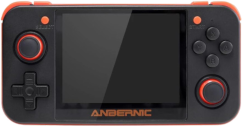
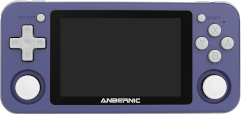
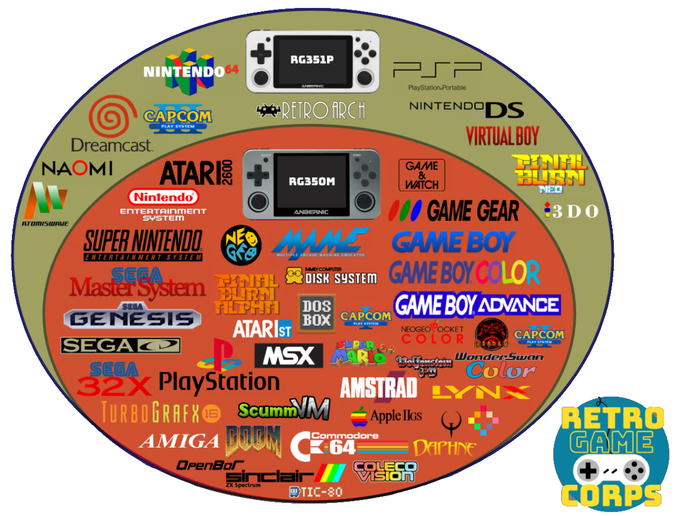
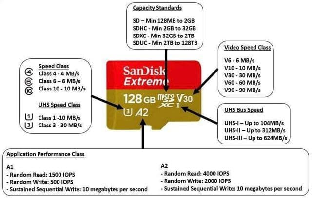

title: Retro Consoles
summary: Frequently asked questions about the different retro console models.
date: 2021-01-18 21:20:00

In this article we are going to answer the frequently asked questions that usually arise when comparing these two retro video game emulation consoles.

## Which models are worth it?

These types of consoles have become popular in recent years, and a number of manufacturers in China have produced many models across a very wide price and performance range ([here](https://docs.google.com/spreadsheets/d/1irg60f9qsZOkhp0cwOU7Cy4rJQeyusEUzTNQzhoTYTU/edit) you can consult a huge list). In this article we are going to focus on the RG350 models (and their P and M variants) and RG351 (also in P and M variants), since they are surely the most popular models. When we talk about RG350 without a final letter, we will be referring to the three models (original, P, and M). In the same way, when we talk about RG351, we will be referring to the two models (P and M).

## What specifications do the RG350 and RG351 consoles have?

#### RG350

* Processor: Ingenic JZ4770 MIPS
* Speed: 1GHz
* Cores: 1
* Memory card slots: 2
* Memory: 512MB
* 3.5" display aspect ratio: 4:3
    * Original and P model: 320x240 px
    * M model: 640x480 px

#### RG351

* Processor: RockChip RK3326 ARM
* Speed: 1.3-1.5GHz
* Cores: 4
* Memory card slots: 1
* Memory: 1024MB
* 3.5" display aspect ratio: 3:2
    * P model: 480x320 px
    * M model: 480x320 px

In terms of performance, the RG351 is superior to the RG350, but despite what the numbers may seem to suggest, the former does not quite double the performance of the latter. Measured based on the systems they are capable of emulating, we could say that the RG350 stops at PlayStation 1, while the RG351 can handle some games (not all) from Nintendo 64, Dreamcast, Sony PSP, and Nintendo DS. The following chart is a modification of an original from Retro Game Corps (it can be seen [here](https://retrogamecorps.files.wordpress.com/2020/11/systems.png)) where only the systems supported by the two consoles that interest us here have been kept:

Finally, it is recommended to watch the following videos where several consoles are compared:

<iframe width="853" height="480" src="https://www.youtube.com/embed/NdvSwJ0RZpY" frameborder="0" allow="accelerometer; autoplay; clipboard-write; encrypted-media; gyroscope; picture-in-picture" allowfullscreen></iframe>

<iframe width="853" height="480" src="https://www.youtube.com/embed/W0Y6Dwja0kU" frameborder="0" allow="accelerometer; autoplay; clipboard-write; encrypted-media; gyroscope; picture-in-picture" allowfullscreen></iframe>

<iframe width="853" height="480" src="https://www.youtube.com/embed/videoseries?list=PLo19xZgW7bjU86VVx58gk8Gsq9TyDyCjx" frameborder="0" allow="accelerometer; autoplay; clipboard-write; encrypted-media; gyroscope; picture-in-picture" allowfullscreen></iframe>

## Which models include Wifi?

* RG350: They do not include it, but some USB dongle models such as [this one](https://es.aliexpress.com/item/4000723233558.html) work.
* RG351P: It does not include it, but some USB dongle models such as [this one](https://es.aliexpress.com/item/4000817147623.html) work. Sellers usually include it with the console.
* RG351M: It has an integrated module inside.

## What is the point of the console having Wifi?

* RG350: Little use. There are a few emulators that support network play, but they are very few indeed. It somewhat facilitates updating emulators and the system with certain utilities, but these are really things that can be done by other means.
* RG351: The RetroArch system and the EmulationStation frontend that is used in practically all systems/firmwares released for this machine do take advantage of network connectivity to download game covers and videos, the games themselves, and to update the emulators or the whole system.

## Do the consoles come with ROMs?

It depends on the seller. In theory, it is illegal to sell products with ROMs that are under copyright (the vast majority). Despite that, although sellers do not state in the product listings that ROMs are included, they usually come with them. There is a difference here between the two types of console:

* RG350: Since it has two slots, the one called INT (because in the original model it was internal) is dedicated to the system. ROMs are not usually included there, but emulators are. If the console is offered with ROMs, sellers place them in the EXT slot. Therefore, when the seller offers us the possibility of buying the console with a second card, what they are actually offering us are the ROMs.
* RG351: Since it has a single slot, where everything has to go (system, emulators, and ROMs), this console usually always comes with ROMs.

## How are ROMs added?

* RG350: Since it has two microSD card slots, the most practical thing is to add them in the slot marked EXT. This card can be in FAT32 format, that is, the format in which newly purchased cards usually come formatted. ROMs on that card can be placed anywhere because later, when we open an emulator, it will normally show us a file browser to locate the ROMs wherever we have them. If the advice of installing them on the EXT card has been followed, they will be found starting from the `/media/sdcard` path, which is where that card is mounted in the system directory tree. In addition to FAT32, ROGUE supports the exFAT format, a more modern format commonly used on high-capacity cards. More details [here](2020-07-02-rg350_primeros_pasos.en.md#instalacion-de-roms).
* RG351: Although on this console we only have one card, it is normal for it to be partitioned so that ROMs are stored in a FAT32 or exFAT partition, so normally if we insert the card into the PC with a card reader, we can copy the ROMs to that partition just by dragging them. There are alternatives such as connecting the console to the network (with a Wifi adapter in the case of the P model or directly with the M model since it has the integrated adapter) and enabling some system to share the console files (this will depend on the system and version we have installed). In general, the most convenient and fastest thing is to plug the card into the PC.

## Is it worth buying the console with a microSD card full of games? (RG350)

The microSD cards these consoles come with are of very limited quality. On the RG350, a Toshiba card usually comes in the INT slot. It is very common for that card to cause problems when flashing (writing) an alternative firmware. On this console the EXT card is not of good quality either, so if it is purchased with the idea of getting a ROM collection (see the previous question), the most likely outcome is that they will have to be transferred to another card. It is even not uncommon for not all ROMs to be copyable because of format problems on the received card. In addition, the game collections that usually come on these cards are poorly organized compilations and in localizations from other countries. In general, it is recommended to save the extra cost of buying the console with a card for ROMs. Better to find them yourself.

## Do I need to update the console system as soon as I receive it?

It is not necessary. It is part of the fun for many of us, but the console will arrive with a fully functional system. It is true that there are usually several alternative firmwares (they are usually called Custom Firmwares or CFW), especially in the case of the RG351. It is another hobby that can be developed around these consoles because of their very open architecture. Development communities tend to form, and users benefit from that.

It is true that installing an alternative firmware on these machines carries minimal risk, given that everything that can be "broken" is located on the microSD cards, so in case of problems they will always be solved by changing the card. Let us say that they are not easy consoles to "brick" (see [Glossary of terms](#glossary-of-terms)). Even so, if you are reading these questions/answers, my advice is that, to avoid frustration, you use the console as it comes from the factory for at least a while while you acquire knowledge. The games that work, and there will be thousands of them (surely all the ones the console brings if it comes with them), will work in the same way on the original firmware.

If even so you decide to install a CFW after hearing the advantages of one distribution or another, as we said before, everything is on the card (the INT one in the RG350 and the only one the RG351 has), so we can always keep the original card exactly as it is and install the CFW on a new card. That way, like a cartridge, when we want to switch from one system to another we will only need to swap the microSD.

## What systems or firmwares exist for these consoles?

* RG350:
    * Base or stock system. It can be found [here](https://rs97.bitgala.xyz/). It is the only one in which HDMI works, although with issues.
    * ROGUE: The system we recommend here. It can be found [here](https://github.com/Ninoh-FOX/RG350-ROGUE-CFW/releases).
    * OpenDingux Beta: It promises to be the future of the console, but it is still not clear whether it will succeed. It has its virtues and, more than defects, youthful problems. It can be found [here](http://od.abstraction.se/opendingux/latest/).
* RG351:
    * 351ELEC: A derivative (fork) of EmuELEC that does not officially support the RG351. It is perhaps the system most faithful to the OGA philosophy (the machine the RG351 clones). It can be found [here](https://github.com/fewtarius/351ELEC/).
    * ArkOS: It is Ubuntu with RetroArch and EmulationStation installed to boot by default. Its main virtues include that the distribution updates itself every time system patches are published, as is usual in Ubuntu. It can be found [here](https://github.com/christianhaitian/arkos/wiki).
    * Batocera: The popular emulator distribution for SBCs and computers. It can be found [here](https://batocera.org/download). At present it seems the least recommendable.

## Which system is more recommendable for RG351, 351ELEC or ArkOS? (RG351)

Both are very similar in performance and functionality. 351ELEC is more similar to EmuELEC, which it derives from, and therefore tends to integrate more settings from the emulation system underneath it (RetroArch) into the main interface (EmulationStation). ArkOS follows a philosophy closer to the kind of RetroArch installation you would make on a computer; in fact, it is a stripped-down Ubuntu. The latter has advantages in that the system updates more easily and frequently (taking advantage of the repository system typical of Linux distributions). In return, it is a less robust system than 351ELEC, which is located in a read-only partition, so ArkOS will be easier to corrupt (during crashes or abrupt shutdowns).

Below is a video comparison:

<iframe width="853" height="480" src="https://www.youtube.com/embed/99IM3NZVOMo" frameborder="0" allow="accelerometer; autoplay; clipboard-write; encrypted-media; gyroscope; picture-in-picture" allowfullscreen></iframe>

## What differences are there between the P and M versions of the RG351? (RG351)

* RG351P: Plastic case and no internal Wifi, although the seller usually includes one in the box with a USB to USB Type-C adapter.
* RG351M: Metal case and Wifi module integrated into the board. Some users comment that the metal case gives better sensations when pressing the controls in general.

In all other characteristics they are exactly the same, including the display. The following video contains the comparison Retro Game Corps made of the two models:

<iframe width="853" height="480" src="https://www.youtube.com/embed/MBiOIheBwpI" frameborder="0" allow="accelerometer; autoplay; clipboard-write; encrypted-media; gyroscope; picture-in-picture" allowfullscreen></iframe>

## What differences are there between the original, P, and M versions of the RG350? (RG350)

* RG350: Plastic case. 320x240 non-laminated display, that is, the glass over the display is not directly bonded to it but slightly separated. Left stick on the upper side and d-pad on the lower side. INT card slot inside, which forces you to open the rear cover if you want to access it.
* RG350P: Plastic case. Laminated 320x240 display, which produces a more vivid image and improves the viewing angle by avoiding reflections and shadows from the glass over the display. INT slot accessible from the outside.
* RG350M: Metal case. Laminated 640x480 display. INT slot accessible from the outside. Some users comment that the metal case gives better sensations when pressing the controls in general.

In the following video we can see a direct comparison between the original model and the M model. As we listed earlier, there are more differences between these two models than if the RG350P were compared with the RG350M, but it is still interesting because of the sensations offered by the metal chassis:

<iframe width="853" height="480" src="https://www.youtube.com/embed/nbfA6vsDTlk" frameborder="0" allow="accelerometer; autoplay; clipboard-write; encrypted-media; gyroscope; picture-in-picture" allowfullscreen></iframe>

## Why does the RG350 have two microSD cards? (RG350)

Historical reasons. The RG350 is a clone of the [GZW Zero](http://www.gcw-zero.com/), a console born from a crowdfunding campaign that was quite successful. This console had this dual-card configuration with the idea of dedicating one to the operating system and applications, and the other to media (ROMs, videos, and audios). The system card has a Linux format, so it cannot be read from Windows or Mac systems. The external one supports the FAT32 format, which makes it very simple and practical to remove the card from the console, mount it with a card reader on the PC, and copy files onto it.

## What size should the system card be?

* RG350: As mentioned in the [previous question](#why-does-the-rg350-have-two-microsd-cards-rg350), the INT card is dedicated to the system. The Linux system used by the console is very minimalistic and fits perfectly on a 4GB card. Even so, 16GB cards are usually used because that is the minimum commonly found in stores. More details [here](retro-emulacion/rg-350.md#que-tamano-es-recomendable-que-tenga-la-tarjeta-interna).
* RG351: Since it only has one card slot and the console has no internal storage, the card will have to contain everything: operating system, applications, emulators, and ROMs. Therefore, the appropriate size will depend mainly on the ROMs we want to install, especially if we are going to use CD-based systems, whose ROMs (or more accurately ISOs, since they are disc dumps) take up quite a lot of space. The maximum theoretically supported card size is 256GB.

## Should the card or cards that come from the factory be replaced?

In general, the cards included by the manufacturer (or the ones sellers include in the EXT slot on the RG350) are not of the best quality. But replacing the system card is not trivial, that is, it is not enough to copy the contents of one card to another (see [another question](#can-i-copy-the-contents-of-one-card-to-another) later on). If you are going to continue with the system that came from the factory (at least for a while at the beginning as recommended in a [previous question](#do-i-need-to-update-the-console-system-as-soon-as-i-receive-it)), then it is not necessary to change the card. If you choose to install alternative firmware or a CFW, then the best option is to set aside the original card and install the new system on a new one, preferably from a reliable brand. In addition to avoiding the problems the original cards cause, especially when writing (flashing) new images, we will always be able to fall back on the original card to compare behavior if we have doubts about whether some capability of the console has problems. Or to claim the warranty if necessary.

## How do I choose a microSD card for the console?

It is recommended to follow the usual recommendations for any other product. Cheap cards, or cards that turn out to be fakes on marketplaces like Aliexpress, can ruin the gaming experience by causing slowness in operating system access. Although there is no absolute guarantee that a good-brand card will work without issues, it is most likely that there will be none. As for speed, the RG350 and RG351 are not the fastest devices on the market, so a class 10 card will be enough. However, since high-capacity cards are sometimes used because of the large volume a good ROM collection can have, it may indeed be worth acquiring a fast card so that ROMs can be loaded quickly from the computer. The maximum theoretical capacity supported in these consoles' slots is 256GB.

The following graphic explains how to interpret some of the codes that these cards usually carry:

## Can I copy the contents of one card to another?

* RG350: The internal one no. The external one yes. The internal one has two partitions and one of them is in Linux format. The external one is usually in FAT32 format, so its contents can be accessed and everything on it can be transferred to another card in the same FAT32 format. Since on this console the ROMs are usually what we are interested in preserving when we are going to change the system, we can change the internal card without the ROMs being affected.
* RG351: No. The card contains several partitions, and for the system to boot the location and contents of some of them must be respected. Programs must be used to make dumps of the entire card into an image (see [Glossary of terms](#glossary-of-terms)). The fact that this console only has one card slot has the disadvantage that if we want to write (flash) another alternative firmware onto the card, we are going to lose the ROMs, so they will have to be copied elsewhere first.

## Does the console have HDMI output?

* RG350: Yes, it does, but the official firmware did not support it until the middle of last year. Alternative firmwares (with ROGUE leading the way) still have not been able to bring this feature over because the manufacturer has not made the specifications public. In any case, the operation of many emulators through HDMI (especially Arcade and PlayStation) has latency and graphic distortion problems.
* RG351: It does not.

## Do USB-HDMI adapters work?

* RG350: Probably not, since I am not aware that this console's firmwares support them.
* RG351: There would be more possibilities here since distributions such as ArkOS exist, which are actually Ubuntu in disguise. In any case, I very much doubt that the speed of the console's USB bus supports the transfer rate necessary for it to work properly.

## Personal opinion

Technically speaking:

* RG350P: Better resolution and display aspect for 8- and 16-bit systems. Better price.
* RG350M: Better resolution and display aspect for 8- and 16-bit systems. Metal case that gives greater precision in handling. Higher resolution that allows graphical effects the 350P cannot display.
* RG351P/M: More processor power (approximately 50%) that allows raising the bar until it nearly reaches Dreamcast, N64, PSP, and Nintendo DS. A more modern frontend that offers a much better browsing experience when exploring systems and ROMs. In exchange, the display resolution and aspect are not the most suitable for viewing games in pixel-perfect mode. Interpolation filters must be applied.

A more personal assessment:

If you have not been in this for long, the RG351 is going to be more satisfying. If you are a hardcore retro enthusiast, the 350 machines are more attractive because of their history, community, and the graphical precision they allow.

## Glossary of terms

* EmuELEC: It is a Linux operating system based on CoreELEC that basically consists of a user interface or frontend (EmulationStation) and a system that integrates multiple emulators (RetroArch).

* Core: A concept normally linked to RetroArch. Cores are the RetroArch libraries that implement the emulation of a specific system. When a game or ROM is opened in RetroArch, you must load the core you want to run it with.

* ROMs: ROMs are file dumps of the digital medium where the code and data (sounds, for example) of the game were stored on the original machine. In old arcade machines and cartridge-based machines, this medium used to be non-volatile memory chips. In more modern machines they are normally CDs, DVDs, or Blu-rays. See more details [here](retro-emulacion/rg-350.md#emuladores-juegos-ports-aplicaciones).

* BIOS: BIOS files are similar to ROMs, but unlike them they are always present in the machine. That is, while ROMs are code specific to each game, which in a sense enters and leaves the machine (when you change the CD or cartridge), the BIOS is also code, but permanent machine code. See more details [here](retro-emulacion/rg-350.md#la-importancia-de-las-bios).

* Ports: A port is an application that runs a specific game, normally a classic, for which the code is available and someone has compiled it for our machine's system. Fan-made remakes or homebrew also fall into this category. See more details [here](retro-emulacion/rg-350.md#emuladores-juegos-ports-aplicaciones).

* ROMSET: Romset = set of ROMs, that is, a closed and defined set of ROMs. See more details [here](retro-emulacion/rg-350.md#que-es-un-romset).

* Image: It is a dump of a storage device (on these consoles it will be a microSD) where the complete and functional system is found (normally with operating system, emulators, frontend, and ROMs). It is made with the idea of replicating the installation of one machine onto many others. Normally these files take up almost as much as the capacity of the microSD they come from.

* Scraping: Obtaining metadata (synopsis, release date, genre, etc. for a game), covers, or game videos to make identification easier in the frontend or console handling interface.

* Bricking: Turning the console into a brick. That is, there is no way for it to boot. On the RG350 family of consoles this is completely impossible given that there is no flash memory on the board. With the RG351 there is slightly more possibility since there are a couple of chips on the board that have their own memory, but the probabilities are very remote. For practical purposes, both can be considered non-brickable.
