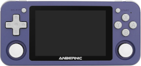

title: Retroconsolas
summary: Dudas frecuentes sobre los distintos modelos de retroconsolas.
date: 2021-01-18 21:20:00

En este artículo vamos a responder a las preguntas frecuentes que suelen surgir al comparar estas dos consolas de emulación de videojuegos retro.

## ¿Qué modelos merecen la pena?

Este tipo de consolas se han popularizado en los últimos años y unos cuantos fabricantes en China han producido numerosos modelos en un espectro de precio y prestaciones muy grande ([aquí](https://tinyurl.com/tgjowuw) puede consultarse un listado enorme). En este artículo vamos a centrarnos en los modelos RG350 (y sus variantes P y M) y RG351 (también en variantes P y M) ya que son seguramente los modelos más populares. Cuando hablemos de RG350 sin letra final, nos referiremos a los tres modelos (original, P y M). De la misma forma, cuando hablemos de RG351, nos referiremos a los dos modelos (P y M).

## ¿Qué características tienen las consolas RG350 y RG351?

#### RG350

* Procesador: Ingenic JZ4770 MIPS
* Velocidad: 1GHz
* Cores: 1
* Ranuras tarjeta de memoria: 2
* Memoria: 512MB
* Pantalla 3,5" relación aspecto: 4:3
    * Modelo original y P: 320x240 px
    * Modelo M: 640x480 px

#### RG351

* Procesador: RockChip RK3326 ARM
* Velocidad: 1,3-1,5GHz
* Cores: 4
* Ranuras tarjeta de memoria: 1
* Memoria: 1024MB
* Pantalla 3,5" relación aspecto: 3:2
    * Modelo P: 480x320 px
    * Modelo M: 480x320 px

En cuestión de rendimiento la RG351 es superior a la RG350, pero a pesar de lo que parezcan sugerir los números, la primera no llega a duplicar el rendimiento de la primera. Medido en base a los sistemas que son capaces de emular, podríamos decir que RG350 se queda en PlayStation 1 y RG351 se atreve con algunos juegos (no todos) de Nintendo 64, Dreamcast, Sony PSP y Nintendo DS. El siguiente gráfico es una modificación de un original de Retro Game Corps (se puede ver [aquí](https://retrogamecorps.files.wordpress.com/2020/11/systems.png)) donde se han dejado únicamente los sistemas que mueven las dos consolas que nos interesan aquí:

Por último se recomienda ver los siguientes videos donde se comparan varias consolas:

<iframe width="853" height="480" src="https://www.youtube.com/embed/NdvSwJ0RZpY" frameborder="0" allow="accelerometer; autoplay; clipboard-write; encrypted-media; gyroscope; picture-in-picture" allowfullscreen></iframe>

<iframe width="853" height="480" src="https://www.youtube.com/embed/W0Y6Dwja0kU" frameborder="0" allow="accelerometer; autoplay; clipboard-write; encrypted-media; gyroscope; picture-in-picture" allowfullscreen></iframe>

<iframe width="853" height="480" src="https://www.youtube.com/embed/videoseries?list=PLo19xZgW7bjU86VVx58gk8Gsq9TyDyCjx" frameborder="0" allow="accelerometer; autoplay; clipboard-write; encrypted-media; gyroscope; picture-in-picture" allowfullscreen></iframe>

## ¿Qué modelos llevan Wifi?

* RG350: No llevan, pero funcionan algunos modelos de pinchos USB como [éste](https://es.aliexpress.com/item/4000723233558.html).
* RG351P: No lleva, pero funcionan algunos modelos de pinchos USB como [este](https://es.aliexpress.com/item/4000817147623.html). Los vendedores suelen incluirlo con la consola.
* RG351M: Lleva un módulo integrado en el interior.

## ¿Para qué sirve que la consola lleve Wifi?

* RG350: Poca utilidad. Hay unos pocos emuladores que soportan juego en red, pero son realmente pocos. Facilita algo la actualización de emuladores y el sistema con ciertas utilidades, pero realmente son cosas que se pueden hacer por otros medios.
* RG351: El sistema RetroArch y el frontend EmulationStation que se utiliza prácticamente en todos los sistemas/firmwares aparecidos para esta máquina, sí sacan partido de la conexión a la red para descargar carátulas y videos de los juegos, los propios juegos y actualizar los emuladores o el sistema entero.

## ¿Las consolas llevan ROMs?

Depende del vendedor. En teoría es ilegar vender productos con ROMs que tienen derechos de autor (la inmensa mayoría). A pesar de ello, aunque los vendedores no declaran incluir las ROMs en las fichas de producto, suelen venir con ellas. Aquí hay diferencia entre los dos tipos de consola:

* RG350: Al tener dos ranuras, la denominada INT (porque en el modelo original era interna) se dedica al sistema. Aquí no suelen incluir ROMs, sí los emuladores. En caso de ofrecer la consola con ROMs los vendedores las ponen en la ranura EXT. Por tanto cuando el vendedor nos ofrece la posibilidad de comprar la consola con una segunda tarjeta, en realidad lo que nos está ofreciendo son las ROMs.
* RG351: Al tener una única ranura, donde tiene que ponerse todo (sistema, emuladores y ROMs), lo habitual es que esta consola venga siempre con ROMs.

## ¿Cómo se añaden ROMs?

* RG350: Al tener dos ranuras para tarjeta microSD, lo más práctico es añadirlas en la ranura marcada como EXT. Esta tarjeta puede estar en formato FAT32, es decir el formato en el que vienen formateadas normalmente las tarjetas recién compradas. Las ROMs en esa tarjeta pueden colocarse en cualquier lugar ya que más tarde cuando abramos un emulador, normalmente nos mostrará un explorador de archivos para localizar las ROMs donde las tengamos. Si se ha seguido el consejo de instalarlas en la tarjeta EXT, se encontrarán a partir de la ruta `/media/sdcard` que es donde se monta esa tarjeta en el arbol de directorios del sistema. ROGUE además del FAT32 soporta el formato exFAT, un formato más moderno que suele utilizarse en las tarjetas de gran capacidad. Más detalles [aquí](2020-07-02-rg350_primeros_pasos.md#instalacion-de-roms).
* RG351: Aunque en esta consola sólo tenemos una tarjeta, lo normal es que esté particionada de manera que las ROMs se alojen en una partición de tipo FAT32 o exFAT, por lo que normalmente si pinchamos la tarjeta en el PC con un lector de tarjetas, podremos copiar las ROMs a esa partición sin más que arrastrar. Hay alternativas como conectar la consola a la red (con un adaptador Wifi en el caso del modelo P o directamente con el modelo M ya que lleva el adaptador integrado) y activar algún sistema para compartir los archivos de la consola (dependerá del sistema y versión que tengamos instalado). En general lo más cómodo y rápido es pinchar la tarjeta en el PC.

## ¿Merece la pena comprar la consola con tarjeta microSD con juegos? (RG350)

Las tarjetas microSD que llevan estas consolas tienen una calidad muy justita. En la RG350 suele venir una tarjeta Toshiba en la ranura INT. Es muy frecuente que esa tarjeta dé problemas al flashear (grabar) un firmware alternativo. En esta consola la tarjeta EXT tampoco es de calidad, por lo que si se adquiere con la idea de conseguir una colección de ROMs (ver duda anterior), lo más probable es que haya que transferirlas a otra. Incluso no es infrecuente que no puedan copiarse todas las ROMs por problemas de formato en la tarjeta recibida. Además las colecciones de juegos que suelen venir en estas tarjetas son recopilaciones mal ordenadas y en localizaciones de otros paises. En general se recomienda ahorrar el extra de coste de comprar la consola con tarjeta para ROMs. Mejor buscarlas por uno mismo.

## ¿Tengo que actualizar el sistema de la consola nada más recibirla?

Necesario no es. Forma parte del entretenimiento para muchos de nosotros, pero la consola llegará con un sistema completamente funcional. Es cierto que existen normalmente varios firmwares alternativos (se suelen llamar Custom Firmwares o CFW), sobre todo en el caso de las RG351. Es otra de las aficiones que se pueden desarrollar sobre estas consolas al tener una arquitectura muy abierta. Suelen crearse comunidades de desarrollo y sus usuarios nos beneficiamos de ello.

Es cierto que instalar un firmware alternativo en estas máquinas tiene un riesgo mínimo, dado que todo lo "estropeable" se encuentra en las tarjetas microSD, por lo que en caso de problemas siempre se van a solucionar cambiando la tarjeta. Digamos que no son consolas fáciles de "brickear" (ver [Diccionario de términos](#diccionario-de-terminos)). A pesar de ello, si estás leyendo estas preguntas/respuestas mi consejo es que, para evitar frustraciones, utilices la consola tal y como se recibe de fábrica al menos durante un tiempo mientras vas adquiriendo conocimientos. Los juegos que funcionen, que van a ser miles (seguramente todos los que traiga la consola si viene con ellos) lo van a hacer de la misma forma en el firmware original.

Si aún así te animas a instalar un CFW, tras oír las ventajas que tiene tal o cual distribución, como decíamos antes, todo está en la tarjeta (la INT en la RG350 y la única que tiene la RG351), por lo que siempre podemos reservar la tarjeta original tal cual está e instalar el CFW sobre una tarjeta nueva. De esa forma, a modo de cartucho, cuando queramos cambiar de un sistema a otro sólo tendremos que cambiar la microSD.

## ¿Qué sistemas o firmwares existen para estas consolas?

* RG350:
    * Sistema base o stock. Se puede encontrar [aquí](https://rs97.bitgala.xyz/). Es el único en el que funciona el HDMI aunque con problemas.
    * ROGUE: El sistema que recomendamos aquí. Se puede encontrar [aquí](https://github.com/Ninoh-FOX/RG350-ROGUE-CFW/releases).
    * OpenDingux Beta: Promete ser el futuro de la consola, pero todavía no está claro si llegará a buen puerto. Tiene sus virtudes y sus, más que defectos, problemas de juventud. Puede encontrarse [aquí](http://od.abstraction.se/opendingux/latest/).
* RG351:
    * 351ELEC: Derivación (fork) de EmuELEC que no tiene soporte oficial a la RG351. Es quizá el sistema más fiel a la filosofía OGA (la máquina a la que la RG351 clona). Puede encontrarse [aquí](https://github.com/fewtarius/351ELEC/).
    * ArkOS: Es un Ubuntu con RetroArch y EmulationStation instalados para que arranque por defecto. Como virtudes principales están el que la distribución se actualiza por si sola cada vez que se publican parches del sistema como es habitual en Ubuntu. Puede encontrarse [aqui](https://github.com/christianhaitian/arkos/wiki).
    * Batocera: La popular distribución de emuladores para SBCs y ordenadores. Puede encontrarse [aquí](https://batocera.org/download). Actualmente parece la menos recomendable.

## ¿Qué sistema es más recomendable para RG351, 351ELEC o ArkOS? (RG351)

Ambos son muy parecidos en rendimiento y funcionalidad. 351ELEC se parece más a EmuELEC que es de donde deriva y por tanto tiende a integrar más ajustes del sistema de emulación que tiene debajo (RetroArch) en el interfaz principal (EmulationStation). ArkOS sigue una filosofía más próxima a la instalación de RetroArch que se haría en un ordenador, de hecho es un Ubuntu recortado. Esto último tiene ventajas en cuanto a que se actualiza el sistema más fácil y frecuentemente (aprovechando el sistema de repositorios habitual en las distribuciones Linux). A cambio es un sistema menos robusto que 351ELEC que se encuentra en una partición de solo lectura, por lo que ArkOS será más difícil que se corrompa (en cuelgues o en apagados abruptos).

A continuación una comparativa en video:

<iframe width="853" height="480" src="https://www.youtube.com/embed/99IM3NZVOMo" frameborder="0" allow="accelerometer; autoplay; clipboard-write; encrypted-media; gyroscope; picture-in-picture" allowfullscreen></iframe>

## ¿Qué diferencias hay entre las versiones P y M de la RG351? (RG351)

* RG351P: Carcasa de plástico y sin Wifi interno, aunque el vendedor suele incluir en la caja uno con un adaptador USB-USB type C.
* RG350M: Carcasa de metal y módulo Wifi integrado en la placa. Algunos usuarios comentan que la carcasa metálica transmite mejores sensaciones en la pulsación de los controles en general.

En el resto de características son exactamente iguales, incluyendo la pantalla. El siguiente video contiene la comparativa que hizo Retro Game Corps sobre los dos modelos:

<iframe width="853" height="480" src="https://www.youtube.com/embed/MBiOIheBwpI" frameborder="0" allow="accelerometer; autoplay; clipboard-write; encrypted-media; gyroscope; picture-in-picture" allowfullscreen></iframe>

## ¿Qué diferencias hay entre las versiones original, P y M de la RG350? (RG350)

* RG350: Carcasa de plástico. Pantalla de 320x240 no laminada, es decir el cristal que hay sobre la pantalla no se encuentra directamente pegado, sino ligeramente separado. Stick izquierdo en la parte superior y cruceta en la inferior. Ranura de tarjeta INT en el interior lo que obliga a abrir la tapa trasera en caso de querer acceder a ella.
* RG350P: Carcasa de plástico. Pantalla de 320x240 laminada, lo que produce una imagen más viva y mejora el ángulo de visión al evitarse los reflejos y sombras del cristal sobre la pantalla. Ranura INT accesible desde el exterior.
* RG350M: Carcasa de metal. Pantalla de 640x480 laminada. Ranura INT accesible desde el exterior. Algunos usuarios comentan que la carcasa metálica transmite mejores sensaciones en la pulsación de los controles en general.

En el siguiente video podemos ver una comparativa directa entre el modelo original y el modelo M. Como hemos enumerado antes, entre estos dos modelos hay más diferencias que si se comparara la RG350P con la RG350M, pero aún así resulta interesante, por las sensaciones que ofrece el chasis de metal:

<iframe width="853" height="480" src="https://www.youtube.com/embed/nbfA6vsDTlk" frameborder="0" allow="accelerometer; autoplay; clipboard-write; encrypted-media; gyroscope; picture-in-picture" allowfullscreen></iframe>

## ¿Por qué la RG350 lleva dos tarjetas microSD? (RG350)

Motivos históricos. La RG350 es un clon de la [GZW Zero](http://www.gcw-zero.com/), una consola surgida de un crowdfunding que tuvo bastante éxito. Esta consola tenía esta configuración doble de tarjetas con la idea de destinar una al sistema operativo y aplicaciones, y la otra a los medios (ROMs, videos y audios). La tarjeta de sistema tiene un formato Linux, por lo que no se puede leer desde los sistemas Windows o Mac. La externa soporta el formato FAT32 por lo que resulta muy sencillo y práctico extraer la tarjeta de la consola, montarla con un lector de tarjetas en el PC y copiar a ella los archivos.

## ¿Qué tamaño es recomendable que tenga la tarjeta del sistema?

* RG350: Como se ha comentado en la [pregunta anterior](#por-que-la-rg350-lleva-dos-tarjetas-microsd-rg350), la tarjeta INT está dedicada al sistema. El sistema Linux que lleva la consola es muy minimalista y cabe perfectamente en una tarjeta de 4GB. Aún así, se suelen utilizar tarjetas de 16GB porque es el mínimo que se encuentra en los comercios. Más detalles [aquí](retro-emulacion/rg-350.md#que-tamano-es-recomendable-que-tenga-la-tarjeta-interna).
* RG351: Al sólo disponer de una ranura para tarjetas y no tener la consola almacenamiento interno, la tarjeta tendrá que contenerlo todo: Sistema operativo, aplicaciones, emuladores y ROMs. Por tanto el tamaño adecuado dependerá principalmente de las ROMs que queramos instalar, sobre todo si vamos a poner sistemas basados en CD, cuyas ROMs (o mejor dicho ISOs puesto que son volcados de discos) ocupan bastante. El tamaño máximo de tarjeta soportado teóricamente es 256GB.

## ¿Hay que cambiar la tarjeta o tarjetas que trae de fábrica la consola?

En general las tarjetas que incluye el fabricante (o la que incluyen los vendedores en la ranura EXT en la RG350) no son de la mejor calidad. Pero sustituir la tarjeta del sistema no es trivial, es decir no sirve con copiar el contenido de una tarjeta en otra (ver [otra pregunta](#puedo-copiar-el-contenido-de-una-tarjeta-a-otra) más adelante). Si se va a continuar con el sistema que traía de fábrica (por lo menos durante un tiempo al principio como se recomendaba en una [pregunta anterior](#tengo-que-actualizar-el-sistema-de-la-consola-nada-mas-recibirla)), entonces no es necesario cambiar la tarjeta. Si se opta por instalar un firmware alternativo o CFW, entonces la mejor opción es apartar la tarjeta original e instalar el nuevo sistema en una nueva, a poder ser de una marca de garantía. Además de evitar los problemas que dan las tarjetas originales, sobre todo al grabar (flashear) imágenes nuevas, siempre podremos recurrir a la tarjeta original para comparar comportamientos en caso de que tengamos dudas de si alguna capacidad de la consola tiene problemas. O para reclamar la garantía llegado el caso.

## ¿Cómo elegir una tarjeta microSD para la consola?

Se recomienda seguir las recomendaciones habituales para cualquier otro producto. Las tarjetas baratas, o que resultan ser fakes en comercios como Aliexpress, pueden arruinar la experiencia de juego al producir lentitud en los accesos por parte del sistema operativo. Aunque no existe garantía absoluta de que una tarjeta de buena marca vaya a funcionar sin problemas, lo más probable es que no los haya. En cuanto a la velocidad, las RG350 y RG351 no son los equipos más rápidos del mercado, por lo que una tarjeta de class 10 será suficiente. Sin embargo dado que en ocasiones se utilizan tarjetas de alta capacidad por el gran volumen que puede tener una buena colección de ROMs, sí que puede merecer adquirir una tarjeta rápida para poder cargar las ROMs desde el ordenador rápidamente. La capacidad máxima teórica admitida en las ranuras de estas consolas es de 256GB.

El siguiente gráfico explica cómo se interpretan algunos de los códigos que suelen llevar estas tarjetas:

## ¿Puedo copiar el contenido de una tarjeta a otra?

* RG350: La interna no. La externa sí. La interna tiene dos particiones y una de ellas es de formato Linux. La externa suele estar en formato FAT32 por lo que se puede acceder a su contenido y transferir todo lo que en ella hay a otra tarjeta en el mismo formato FAT32. Como en esta consola las ROMs suele ser lo que nos interesa conservar cuando vamos a cambiar el sistema, podemos cambiar la tarjeta interna sin que las ROMs se vean afectadas.
* RG351: No. La tarjeta contiene varias particiones y para que el sistema arranque hay que respetar la situación y el contenido de algunas de ellas. Hay que utilizar programas para hacer volcados (dumps) de la tarjeta completa a una imagen (ver [Diccionario de términos](#diccionario-de-terminos)). El que esta consola sólo tenga una ranura para tarjetas tiene el inconveniente de que si queremos grabar (flashear) otro firmware alternativo en la tarjeta, vamos a perder las ROMs, por lo que habrá que copiarlas a otro sitio antes.

## ¿La consola lleva salida HDMI?

* RG350: Sí lleva, pero el firmware oficial no le ha dado soporte hasta mediados del año pasado. Los firmwares alternativos (con ROGUE a la cabeza) todavía no han podido importar esta función al no haber sido hechas públicas las especificaciones por el fabricante. De todas formas el funcionamiento de muchos emuladores a través de HDMI (sobre todo los Arcade y PlayStation) tienen problemas de latencia y distorsiones gráficas.
* RG351: No lleva.

## ¿Sirven los adaptadores USB-HDMI?

* RG350: Seguramente no ya que no me consta que los firmwares de esta consola los soporten.
* RG351: Aquí habría más posibilidades ya que existen distribuciones como ArkOS que en realidad son un Ubuntu enmascarado. De todas formas dudo mucho que la velocidad del bus USB de la consola soporte la tasa de transferencia necesaria para que funcione adecuadamente.

## Opinión personal

Técnicamente hablando:

* RG350P: Mejor resolución y aspecto de pantalla para sistemas 8 y 16 bit. Mejor precio.
* RG350M: Mejor resolución y aspecto de pantalla para sistemas 8 y 16 bit. Carcasa de metal que da mayor precisión en el manejo. Mayor resolución que permite efectos gráficos que la 350P no puede mostrar.
* RG351P/M: Más potencia de procesador (aproximadamente un 50%) que permite subir el listón hasta rozar Dreamcast, N64, PSP y Nintendo DS. Frontend más moderno que ofrece una experiencia de manejo explorando sistemas y ROMs muy superior. A cambio la resolución y aspecto de pantalla no resulta la más adecuada para ver los juegos en modo pixel perfect. Hay que aplicar filtros de interpolación.

Valoración más personal:

Si no llevas mucho tiempo en esto la RG351 te va a resultar más satisfactoria. Si eres un aficionado hardcore del retro, las 350 resultan máquinas más atractivas por historia, comunidad y la precisión gráfica que permiten.

## Diccionario de términos

* EmuELEC: Es un sistema operativo Linux basado en CoreELEC que se compone fundamentalmente de un interfaz de usuario o frontend (EmulationStation) y de un sistema que integra múltiples emuladores (RetroArch).

* Core o Núcleo: Concepto normalmente vinculado a RetroArch. Los cores son las librerías de RetroArch que implementan la emulación de un sistema concreto. Cuando se abre un juego o ROM en RetroArch, hay que cargar el core con el que lo queremos ejecutar.

* ROMs: Las ROMs son los volcados a fichero del soporte digital donde se almacenaba el código y los datos (sonidos por ejemplo) del juego en la máquina original. En viejas recreativas y en máquinas de cartucho, este soporte solían ser chips de memoria no volátil. En las máquinas más modernas normalmente son CDs, DVDs, Bluray's. Ver más detalles [aquí](retro-emulacion/rg-350.md#emuladores-juegos-ports-aplicaciones).

* BIOS: Las BIOS son unos ficheros parecidos a las ROMs que a diferencia de éstas están siempre presentes en la máquina. Es decir, así como las ROMs son código particular de cada juego, que digamos entra y sale de la máquina (cuando cambias el CD o cartucho), la BIOS también es código pero permanente de la máquina. Ver más detalles [aquí](retro-emulacion/rg-350.md#la-importancia-de-las-bios).

* Ports: Un port es una aplicación que ejecuta un juego concreto, normalmente un clásico, del que se dispone del código y que alguien ha compilado para el sistema de nuestra máquina. También entran dentro de esta categoría los remakes hechos por aficionados o homebrew. Ver más detalles [aquí](retro-emulacion/rg-350.md#emuladores-juegos-ports-aplicaciones).

* ROMSET: Romset = set de ROMs, es decir un conjunto cerrado y definido de ROMs. Ver más detalles [aquí](retro-emulacion/rg-350.md#que-es-un-romset).

* Imagen: Es un volcado de un dispositivo de almacenamiento (en estas consolas será una microSD) donde se encuentra el sistema completo y funcional (normalmente con sistema operativo, emuladores, frontend y ROMs). Se hace con la idea de replicar la instalación de una máquina en otras muchas. Normalmente estos ficheros ocupan casi tanto como la capacidad de la microSD de que proceden.

* Escrapear: Obtener metadatos (sinopsis, fecha de publicación, género, etc. de un juego), carátulas o videos de los juegos para facilitar su identificación en el frontend o interfaz de manejo de la consola.

* Brickear: Convertir la consola en un ladrillo. Es decir que no haya forma de que arranque. En las consolas de la gama RG350 es completamente imposible dado que no hay ninguna memoria flash en la placa. Con la RG351 existe algo más de posibilidad ya que hay un par de chips en la placa que tienen su propia memoria, pero las probabilidades son muy remotas. A efectos prácticos se pueden considerar las dos no brickeables.
