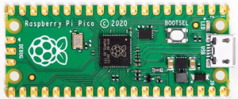
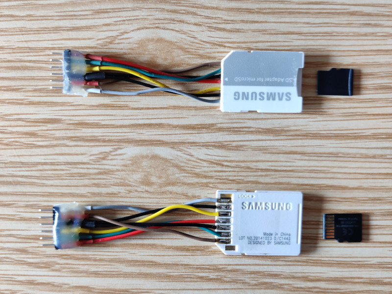
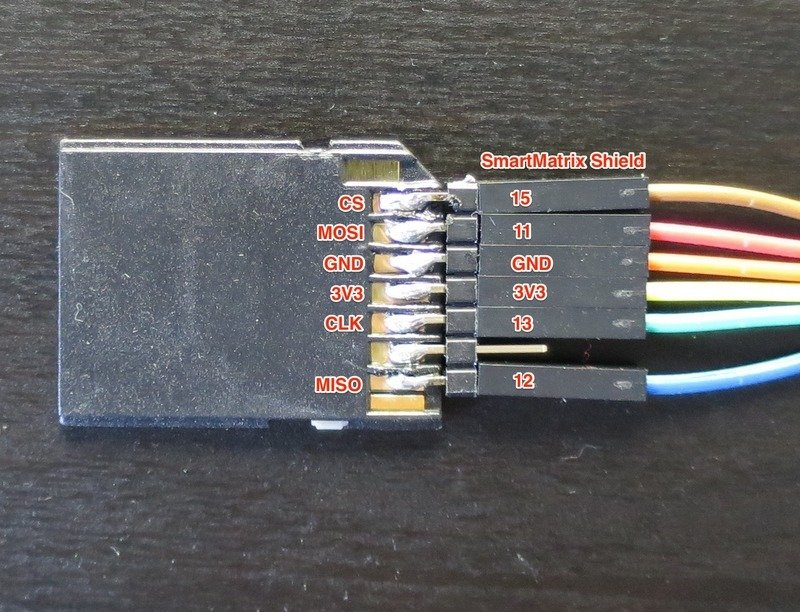
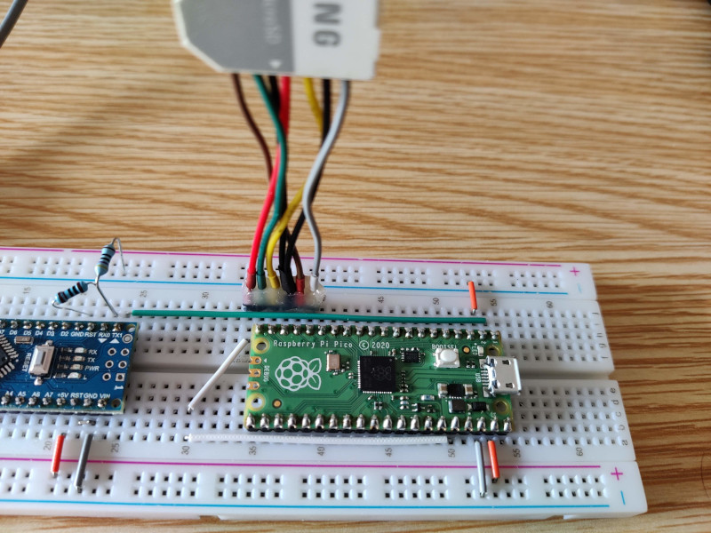
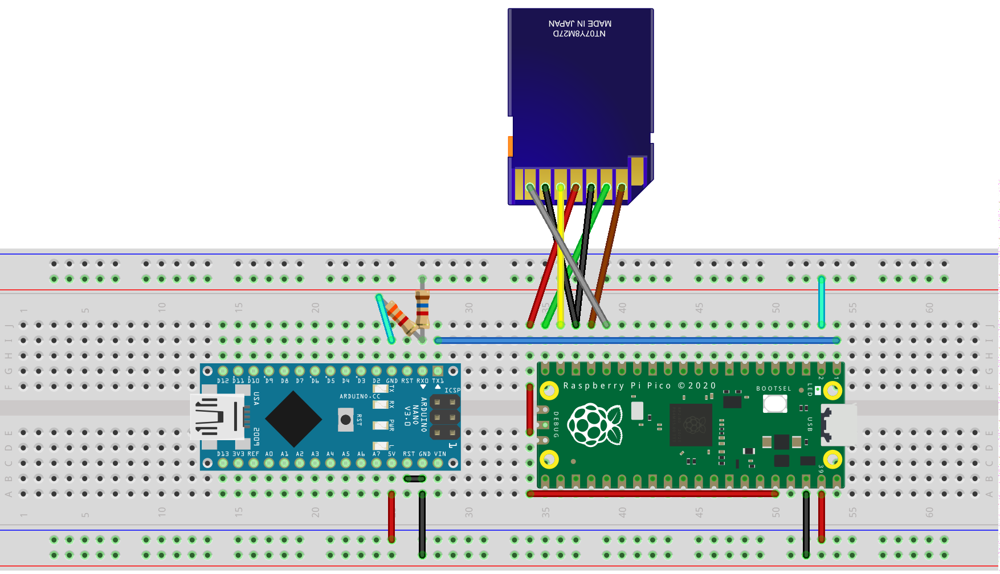

title: FUZIX on Raspberry Pi Pico
summary: Assembling and installing FUZIX (a UNIX variant) on Raspberry Pi Pico.
date: 2021-02-28 20:00:00



Recently, [this article](https://www.raspberrypi.org/blog/how-to-get-started-with-fuzix-on-raspberry-pi-pico/) appeared on the Raspberry Pi Foundation website explaining how to install the UNIX variant called FUZIX on the newly released Raspberry Pi Pico microcontroller. Apparently, FUZIX is a project that arose around the 8-bit Z-80 microprocessor, for which I have special affection since it is the only processor whose machine code I have come to know. Determined to build it to try it out, I found that it can be simplified quite a bit in three ways:

1. The dump they provide for the microSD is for the second partition, when they could have provided an image of the whole card, which would save the `fdisk` session steps needed to create the partitions and the subsequent `dd` used to load the dump of the second one.
2. The module they use to connect the microSD is not actually necessary, since Raspberry Pi Pico works at 3.3V and no signal level adaptation is needed, that is, the microSD can be wired directly to Raspberry Pi Pico.
3. As a serial port adapter, instead of using a Raspberry Pi, I use an Arduino Nano with the typical trick of bridging the RESET pin to GND. In this case, the RX line will indeed need to be adapted since Arduino works at 5V. This can be done better with a good UART-USB module capable of working at 3.3V, but I did not have one when writing this article.

Without further ado, let us look at the simplified steps to run FUZIX on Raspberry Pi Pico.

## microSD reader

As I mentioned before, connecting a microSD card can be done by directly wiring the microSD terminals correctly to pins 16 through 20 of Raspberry Pi Pico. Those pins host one of the SPI ports available on the microcontroller. SD and microSD cards can work in two modes, native SD and SPI. We will therefore use the latter. We only need to know the pinout to use in this mode. By doing a quick image search, for example for the string "spi microsd pinout", we find the answer:


The previous table also shows the correspondence between the pins of SD-format and microSD cards. We are going to take advantage of this correspondence to build a microSD card reader using one of the typical adapters that usually come with microSD cards. We will solder 7 wires directly to terminals 1 through 7, which we will later connect to Raspberry Pi Pico. The correspondence between the SD adapter terminals and Raspberry Pi Pico is as follows:

|SD adapter pin|SPI|Raspberry Pi Pico|
|:---------------|:--|:----------------|
|1|CS|Pin 17 (GP13)|
|2|MOSI|Pin 20 (GP15)|
|3|GND|Pin 18 (GND)|
|4|3.3V|Pin 36 (3V3 OUT)|
|5|SCK|Pin 19 (GP14)|
|6|GND|Pin 18 (GND)|
|7|MISO|Pin 16 (GP12)|
|8|-|-|
|9|-|-|

By wiring it onto a 1x6 pin header strip (we merge the two SD GND terminals), rearranging the wires so that the Raspberry Pi Pico pins remain in sequence (pins 16 to 20), and leaving the 3.3V pin after pin 20, we will be able to connect the adapter directly. The resulting adapter is the following:



The wiring can be made even easier and more flexible by taking advantage of the fact that the spacing of the SD terminals is one tenth of an inch, just like typical pin headers and breadboards, so a pin header strip can be soldered directly. The idea and the following photo are taken from [this site](https://www.esp8266.com/viewtopic.php?t=16016):



The built adapter can be connected directly to Raspberry Pi Pico. Note that the pin receiving the 3.3V supply (red wire) remains outside the footprint of Raspberry Pi Pico so that, using a pair of white jumpers, it is taken to pin 36, which is where we obtain the 3.3V supply.



## microSD image

The instructions in the [original article](https://www.raspberrypi.org/blog/how-to-get-started-with-fuzix-on-raspberry-pi-pico/) include a process which, using the `fdisk` command from a Raspberry Pi (or really from any Linux), allows two partitions to be created on the microSD (one for swap and one for the filesystem). We are given a dump of the second partition, which is loaded with the `dd` command. All of this could have been avoided by generating a dump of both partitions together. That is what can be found in the following file, which we can flash directly onto a microSD with programs such as [Balena Etcher](https://www.balena.io/etcher/).

> [card.img.gz](files/posts/fuzix/card.img.gz)

On Linux we can flash it directly with the following command, replacing the device (`/dev/mmcblk0` in the example) with the appropriate one:

```
gunzip card.img.gz -c | sudo dd of=/dev/mmcblk0 bs=1M status=progress conv=fsync
```

## Firmware for Raspberry Pi Pico

Although it can be found in the [original article](https://www.raspberrypi.org/blog/how-to-get-started-with-fuzix-on-raspberry-pi-pico/), I include it here again so the whole process can be followed without leaving this page:

> [fuzix.uf2](files/posts/fuzix/fuzix.uf2)

The way to load the firmware onto Raspberry Pi Pico is to connect it by USB to the computer while holding down the `BOOTSEL` button. At that moment, an external storage drive will be mounted on the computer where we will copy the previous file.

## Serial connection

We already have everything installed and prepared. We only need a way to connect to the system. The only means to connect to it is through the serial port on pins 1 and 2 (GP0 and GP1 respectively) of Raspberry Pi Pico. I do not know whether there is any reason that prevented the Pico USB port from being used for this purpose. It certainly would have been much more convenient.

To connect the Pico serial port to the computer, the best thing is to use a USB adapter module like [this one](https://www.banggood.com/RobotDyn-USB-TTL-UART-Serial-Adapter-CP2102-5V-3_3V-USB-A-Module-p-1244766.html). Since I did not have one at hand, I used the typical [trick of using an Arduino in permanent RESET mode](ingenieria/arduino.md#adaptador-serie). If we use this technique, we will need to build a voltage divider with a pair of resistors to adapt the voltage level so that the Pico RX line does not directly receive the 5V at which Arduino works. On the TX line this will not be necessary, since the Pico's 3.3V are enough for Arduino to interpret that voltage level as a digital 1 at 5V.

The following complete schematic shows the voltage divider as well as the way to power Raspberry Pi Pico from the 5V output that Arduino offers on one of its pins. We will bring those 5V to the Pico VSYS pin, which accepts between 1.8V and 5.5V. The divider resistors can be practically any value as long as the one in series on the RX line has approximately half the value of the one going to GND.



All that remains is to connect the Arduino to the computer over USB and use our favorite serial client at 115200 baud. For example, on Linux this can be done with the following command:

```
screen /dev/ttyUSB0 115200 8N1
```

If everything goes well, we will see the following on screen. Before asking for the username (`root`) and password (empty), the system will ask us for the date and time in order to set the system date:

```
FUZIX version 0.4pre1
Copyright (c) 1988-2002 by H.F.Bower, D.Braun, S.Nitschke, H.Peraza
Copyright (c) 1997-2001 by Arcady Schekochikhin, Adriano C. R. da Cunha
Copyright (c) 2013-2015 Will Sowerbutts <will@sowerbutts.com>
Copyright (c) 2014-2020 Alan Cox <alan@etchedpixels.co.uk>
Devboot
64kB total RAM, 64kB available to processes (15 processes max)
Enabling interrupts ... ok.
SD drive 0: hda: hda1 hda2
Mounting root fs (root_dev=2, ro): OK
Starting /init
init version 0.9.0ac#1
Cannot open file
Current date is Wed 2021-02-17
Enter new date: 2021-02-28
Current time is 22:21:10
Enter new time: 19:54

 ^ ^
 n n   Fuzix 0.3.1
 >@<
       Welcome to Fuzix
 m m

login: root

Welcome to FUZIX.
#

```
