title: RG350/RG280 Image
summary: Image for RG350 and RG280 consoles with emulators, ports, and frontends.
date: 2021-04-03 20:00:00

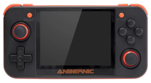

!!! Info "Update 2021-04-25"
    This article has been updated to reflect the changes introduced in version 10.1 of the image released on this date. To convert the original v10.0 into the new v10.1, there is a patch that applies the improvements and changes. The patch can be downloaded from [this link](https://drive.google.com/file/d/1CkzcEoEHl-cVUe2p58uNHw3Q_ijnLjJY/view?usp=sharing).

## Introduction

Here I describe the details of an internal card image prepared for the Anbernic RG350, RG350P, RG350M, RG280V, and RG280M emulation consoles. The image is a dump of a 4GB microSD with the ROGUE system (special thanks to [Ninoh-FOX](https://github.com/Ninoh-FOX) for support), ports, emulators, and RetroArch cores, and the GMenu2X, SimpleMenu (special thanks to [FGL82](https://github.com/fgl82) for support), and PyMenu frontends. It can be flashed onto a card of that size or larger. During the first boot, the main partition will be expanded to occupy all the available space on the card.

Download the image from the following links:

* [Panda](https://drive.google.com/file/d/1u7u3-sqD9aUX6wh698cwPlgyy2rEiuSS/view?usp=sharing) (RG350 and RG350P)
* [Mapache](https://drive.google.com/file/d/1y105Uub27XeMjLdf7X91RfaySqjpUsSN/view?usp=sharing) (RG350M)
* [Visón](https://drive.google.com/file/d/1P1WSF1VQ794ArNLQa291QEVXg6Yy90FZ/view?usp=sharing) (RG280V)
* [Musaraña](https://drive.google.com/file/d/1umrEsZ8OgXUJOGhuORDJPSFycGbMpP19/view?usp=sharing) (RG280M)

Alternatively, all images and patches can also be found on the Telegram channel [Code Animal images](https://t.me/code_animal_images). Using the channel has the additional advantage that you receive notifications when patches or new versions of the images appear.

The emulators and RetroArch cores have custom launchers with icons representing the machines they emulate for easier identification. The names of the emulators and cores have also been modified with the same idea in mind.

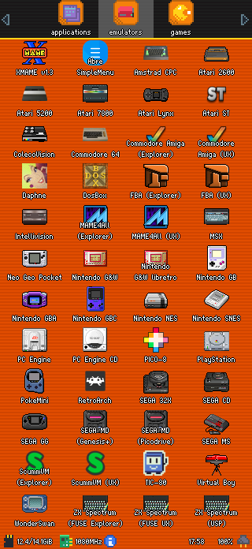
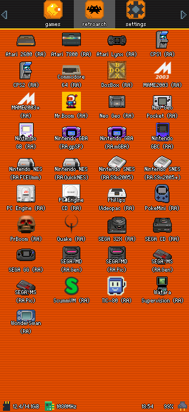

The installed ports or games are the following (some such as `Cannonball`, `OpenBOR`, `OpenJazz`, and `Solarus` need ROMs on the external card):

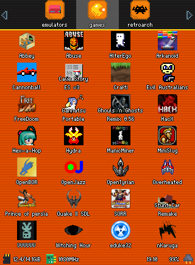

Finally, in [this document](https://docs.google.com/spreadsheets/d/1tXUCsvTqmq3SW0RjlzgE1kZbiWu5ykyYXIhSVtvRM0g/edit?usp=sharing) you can find details of the installed emulators and the RetroArch configurations for the cores available in the image.

## Backing up saves before flashing

If the console has been used with another system, we will probably want to keep the savestates from the games we have played. Therefore, before flashing this image, it is advisable to back them up. To make this task easier, the `Py Backup` application was created, described in [this article](http://apuntes.eduardofilo.es/2020-08-12-rg350_py_backup.html), and it comes preconfigured with all the savestate directories of the emulators installed in the image.

Basically, the procedure to make the backup is as follows. We start by working on the image currently on the console before flashing the one offered here:

1. Install the [OPK](https://github.com/eduardofilo/RG350_py_backup/releases/download/1.4.3/py_backup_1.4.3.opk).
2. Locate the application installed in the previous step. It will be found in the `applications` section of the different launchers. Once found, open it.

    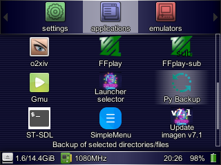

3. Press `B` to start the backup and confirm with `A` (when it reaches PCSX4All, it usually hangs for quite a while because the savestates for this emulator are large). You can disable backups for systems you are not interested in beforehand, but it is safer to leave them all enabled to avoid unpleasant surprises.

    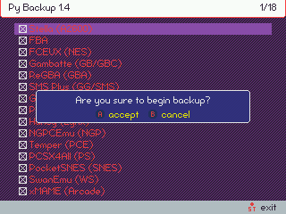

That is all to generate the backup. It is left in the `backups` directory of the external card, inside which a series of files with the `.tgz` extension will appear. Once the image has been flashed, we will have to restore it. To do so, proceed as follows:

1. Open the `Py Backup` application, which is already preinstalled in the image.
2. Press `X` to start restoring the backup and confirm with `A`.

    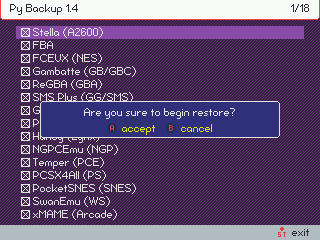

**Warning**: Save or *savestate* matching depends on ROM names. If we save a game when, for example, the ROM was called "001. Catrap.gb" and later try to recover it from a ROM called "Catrap.gb", it will not work. In that case, you will have to check the corresponding savestate directory (in the case of GB it is `/media/data/local/home/.gambatte/saves`) and rename the file so it matches the new ROM name.

Finally, a short video tutorial:

<iframe width="853" height="480" src="https://www.youtube.com/embed/LcRdPeFu5tw" title="YouTube video player" frameborder="0" allow="accelerometer; autoplay; clipboard-write; encrypted-media; gyroscope; picture-in-picture" allowfullscreen></iframe>

## Flashing the image

The image is contained in a single file in `img.gz` format. This means it is a direct dump of the card (`img`) compressed (`gz`). The file is around 1GB in size.

For flashing, it is recommended to use [Balena Etcher](https://www.balena.io/etcher/), which can use this format directly and is also compatible with the three main systems (Windows, MacOS, and Linux). The image can be flashed onto cards of 4GB and above.

On Linux it is faster and more direct to flash with the following commands (replacing the `/dev/mmcblk0` device in the example with the one that applies in your case):

```
$ sudo umount /dev/mmcblk0*
$ gunzip panda_v10.1.img.gz -c | sudo dd of=/dev/mmcblk0 bs=2M status=progress conv=fsync
```

It is not recommended to flash onto the same Toshiba card that comes with the console from the factory. Performance problems and errors have been observed with it. It is better to use a reliable brand card that is also fast.

In [this video](http://www.youtube.com/watch?v=VWJU3KR5MW4), you can see the process of opening the console and removing the internal card in the original RG350 (in RG350P/M and RG280V/M this is not necessary), as well as flashing an image with Balena Etcher on Windows. In the video, the image used is a clean ROGUE image (file `sd_image.bin`), but the process for the image discussed here (file `panda_v10.1.img.gz`, `mapache_v10.1.img.gz`, `vison_v10.1.img.gz`, or `musarana_v10.1.img.gz` depending on the console version) would be exactly the same, simply by selecting the corresponding file in Balena Etcher. Formatting the card as shown in the video is not actually necessary. You only need to follow the video up to minute 11:20, since from that point on what is done is adding emulators and games to the console, things that are already included in the image.

## Default frontend selection

During the first boot of the image, ROGUE processes run to consolidate the system. This involves several reboots. At some point, a selector appears with four options to choose the default launcher or frontend:

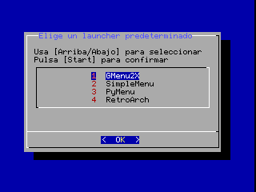

You only have to select the preferred launcher with the d-pad (up/down) and confirm with `Start`. At that point, the console will reboot again and you will end up in the selected launcher. If at any time you want to change the launcher, you can run the selector again using the `Launcher selector` application:

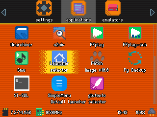
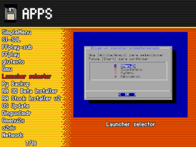
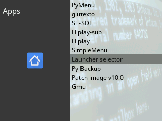

## Adding ROMs

The image does not include ROMs or BIOS, so we will have to provide them ourselves. All emulators and frontends are preconfigured to find ROMs in specific paths on the external card. These are the directories that must be respected to install ROMs (the path relative to the external card is shown; as we know, `roms/NEOGEO`, for example, corresponds to `/media/sdcard/roms/NEOGEO` in the console system):

|Path              |System              |Supported extensions|
|:---------------  |:-----------------  |:--------------------|
|roms/32X          |SEGA 32X            |.32x,.zip|
|roms/A2600        |Atari 2600          |.bin,.a26|
|roms/A5200        |Atari 5200          |.a52|
|roms/A7800        |Atari 7800          |.a78|
|roms/AMIGA        |Commodore Amiga     |.adf,.sna,.zip|
|roms/AMSTRAD      |Amstrad CPC         |.dsk,.hfe|
|roms/ARCADE       |xMAME               |.zip|
|roms/ATARIST      |Atari ST            |.st,.zip|
|roms/C64          |Commodore 64        |.crt,.d64,.t64,.bin|
|roms/COLECO       |ColecoVision        |.rom,.col|
|roms/CPS          |CPS                 |.zip|
|roms/DAPHNE       |Daphne              |.zip|
|roms/DOOM         |Doom                |.wad|
|roms/DOSBOX       |DosBOX              |.bat,.exe,.com|
|roms/FBA          |Final Burn Alpha    |.zip|
|roms/FC           |Nintendo NES        |.nes,.zip|
|roms/GB           |Nintendo GB         |.gb,.gz,.zip|
|roms/GBA          |Nintendo GBA        |.gba,.zip|
|roms/GBC          |Nintendo GBC        |.gbc,.zip|
|roms/GG           |SEGA GG             |.gg,.zip|
|roms/GW           |Nintendo G&W        |.ws,.wsc|
|roms/INTELLI      |Intellivision       |.int|
|roms/JAZZ         |OpenJazz (port)     | |
|roms/LYNX         |Atari Lynx          |.lnx,.zip|
|roms/MAME2003     |MAME2003            |.zip|
|roms/MAME4ALL     |MAME4All            |.zip|
|roms/MD           |SEGA MD             |.bin,.smd,.md,.zip|
|roms/MSX          |MSX                 |.rom,.zip|
|roms/NEOGEO       |Neo Geo             |.zip|
|roms/NGP          |Neo Geo Pocket      |.ngp,.ngc|
|roms/OUTRUN       |Cannonball (port)   | |
|roms/PCE          |PC Engine           |.pce,.tg16,.cue|
|roms/PCECD        |PC Engine CD        |.pce,.tg16,.cue|
|roms/PICO8        |PICO-8              |.png|
|roms/POKEMINI     |Pokemon Mini        |.zip|
|roms/PS           |PlayStation         |.mdf,.cue, .bin,.img,.ccd,.sub,.zip,.pbp,.chd|
|roms/QUAKE        |Quake               |.pak|
|roms/SCUMMVM      |ScummVM             |.svm|
|roms/SEGACD       |SEGA CD             |.cue|
|roms/SFC          |Nintendo SNES       |.smc,.sfc,.zip|
|roms/SMS          |SEGA MS             |.sms,.zip|
|roms/SOLARUS      |[Solarus](https://boards.dingoonity.org/gcw-releases/solarus-v1-4-4/) (port)      |.zip|
|roms/SUPERVISION  |Watara Supervision  |.sv|
|roms/TIC80        |TIC-80              |.tic|
|roms/VB           |Nintendo VB         |.vb|
|roms/VIDEOPAC     |Phillips Videopac   |.bin|
|roms/WSC          |WonderSwan          |.ws,.wsc|
|roms/ZX           |ZX Spectrum         |.z80,.scl,.trd,.tzx,.csw,.tap|
|OpenBOR/Paks      |OpenBOR (port)      |.pak|

**Warning**: Be careful with the OpenBOR case, which behaves irregularly because it requires a fixed path on the external card.

In the case of systems for which a RetroArch core exists, the `zip` and `7z` extensions will also work, since they are supported at the framework level. The `chd` extension is also supported in RetroArch cores for CD-based systems, namely `SEGACD` and `PCECD`.

## Adding BIOS

All emulators installed in the image (including RetroArch) have had the paths where BIOS files must reside redirected to the `bios` directory on the external card. Similarly to the ROM case, the `bios` directory at the root of the external card corresponds to the path `/media/sdcard/bios` in the console system.

Not all emulators need a BIOS. This is the case for machines that did not have one or whose function has been emulated. Below is the BIOS file that must be located, as well as the place where it should be placed. To help identify the correct files, their size in bytes and an MD5 hash are given. Cases where the BIOS is essential for the emulator to work are also marked. If `NO` is indicated, the emulator will work, but installing it is recommended to achieve the greatest compatibility with games. To check MD5 hashes, the cross-platform [Quickhash](https://www.quickhash-gui.org/) utility is recommended.

The sizes and hashes indicated are for BIOS files that have been verified to work, but they are not necessarily the only possible ones. That is, on some machines there are several possible BIOS versions, usually because several models of the machines existed (PlayStation is one of the most typical cases), or because someone developed BIOS files with enhanced capabilities (the typical case here is Neo Geo and its UNIBIOS).

|System|Path|Size|MD5 hash|Required?|
|:------|:---|-----:|:-------|:----------|
|Atari 5200|bios/5200.rom|2048|`281f20ea4320404ec820fb7ec0693b38`|Yes|
|Atari ST|bios/rom|196608|`036c5ae4f885cbf62c9bed651c6c58a8`|Yes|
|SEGACD|bios/bios_CD_E.bin|131072|`e66fa1dc5820d254611fdcdba0662372`|Yes|
|SEGACD|bios/bios_CD_J.bin|131072|`278a9397d192149e84e820ac621a8edd`|Yes|
|SEGACD|bios/bios_CD_U.bin|131072|`854b9150240a198070150e4566ae1290`|Yes|
|Intellivision|bios/exec.bin|8192|`62e761035cb657903761800f4437b8af`|Yes|
|Intellivision|bios/grom.bin|2048|`0cd5946c6473e42e8e4c2137785e427f`|Yes|
|PC Engine CD|bios/syscard3.pce|262144|`390815d3d1a184a9e73adc91ba55f2bb`|Yes|
|Commodore Amiga|bios/kick.rom|262144|`82a21c1890cae844b3df741f2762d48d`|Yes|
|Nintendo Famicom Disk System|bios/disksys.rom|8192|`ca30b50f880eb660a320674ed365ef7a`|Yes|
|Atari Lynx|bios/lynxboot.img|512|`fcd403db69f54290b51035d82f835e7b`|Yes|
|Phillips Videopac|bios/o2rom.bin|1024|`562d5ebf9e030a40d6fabfc2f33139fd`|Yes|
|SNK Neo Geo|bios/neogeo.zip|1950023|`36241192dae2823eaf3bf464dde6dbc6`|Yes in FBA, No in RetroArch|
|Nintendo GBA|bios/gba_bios.bin|16384|`a860e8c0b6d573d191e4ec7db1b1e4f6`|No, although recommended|
|PlayStation|bios/SCPH1001.BIN|524288|`924e392ed05558ffdb115408c263dccf`|No, although highly recommended|
