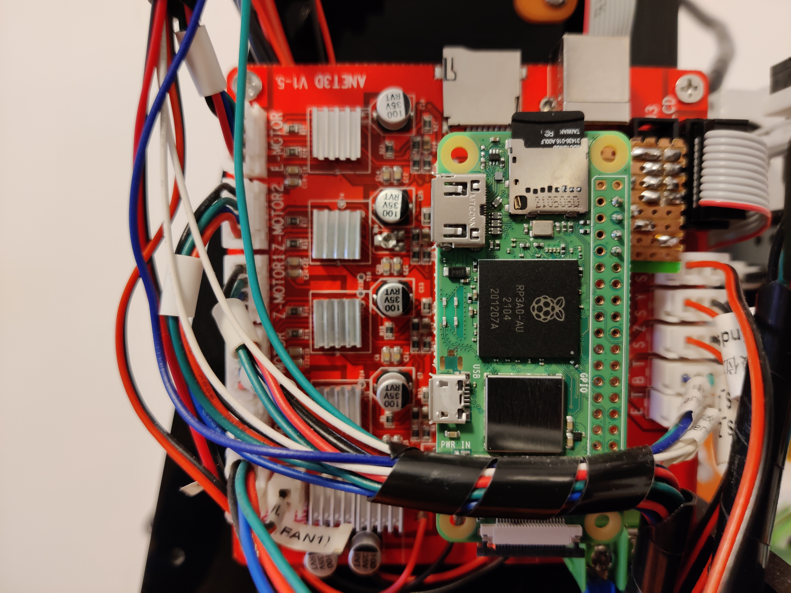
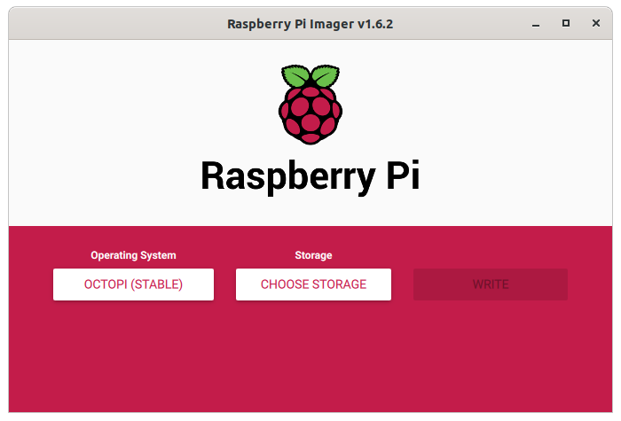
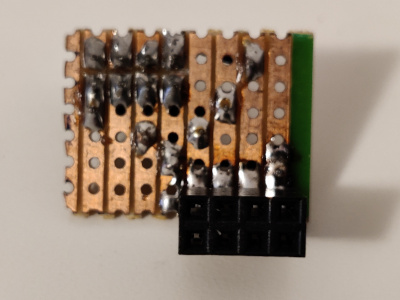
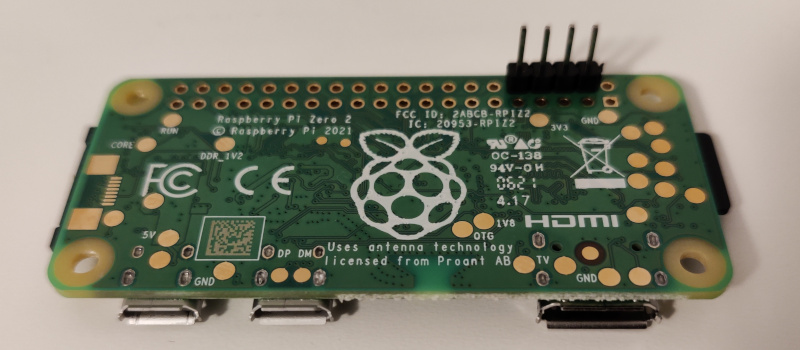
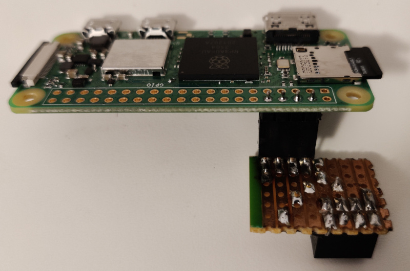
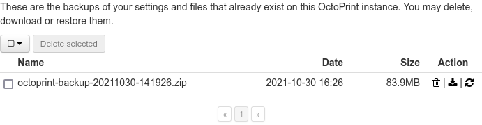

title: Raspberry Pi Zero 2 W Upgrade
summary: Upgrading a Raspberry Pi Zero to the model 2 for OctoPrint.
date: 2021-10-30 17:40:00



Exactly three years ago I carried out an [installation of a Raspberry Pi Zero](2018-10-20-Octoprint-en-Anet-A8.en.md) on an Anet A8 3D printer to manage prints with OctoPrint software. The use of this Raspberry Pi model is not recommended, since its power is a bit limited. I had noticed myself that some complex prints, especially when there are many curves, slowed down slightly. Not enough for the installation to stop being worthwhile, but the situation certainly was not ideal. After the announcement of the new [Raspberry Pi Zero 2 W](https://www.raspberrypi.com/products/raspberry-pi-zero-2-w/), I immediately thought it would be perfect for this role, so I went ahead with the upgrade. Here I describe the details of the change.

## Flashing OctoPrint

!!! Warning "Before flashing"
    In this installation we are going to recover the configuration from the [previous installation](2018-10-20-Octoprint-en-Anet-A8.en.md), so if we want to flash over the same card, we will need to move ahead the steps described in the [OctoPrint configuration](#octoprint-configuration) section

As in the original installation, the official distribution is used, which can also be installed from the [Raspberry Pi Imager](https://www.raspberrypi.com/software/) utility (it can be found under the `Other specific purpose OS` section).



## Network configuration

Once OctoPrint has been flashed, the first thing we need is Wifi connectivity so we can continue making adjustments over SSH. The SSH service is enabled by default in the OctoPrint image. To make the new OctoPrint installation connect to my router with a fixed IP, we do the following:

1. Mount the freshly flashed card on the PC.
2. Edit the `octopi-wpa-supplicant.txt` file in the boot partition.
3. Uncomment the block labeled `## WPA/WPA2 secured`, replacing it with the values for my SSID and password.
4. Replace `UK` with `ES` in the `country` parameter near the end.
5. Edit the `etc/dhcpcd.conf` file in the rootfs partition.
6. Add the following lines at the end of the file (replacing `IP`, `GATEWAY`, and `DNS` as appropriate):

    ```
    interface wlan0
    static ip_address=IP/24
    static routers=GATEWAY
    static domain_name_servers=DNS
    ```

After making these changes, insert the card into the Pi Zero 2 and power it on (and wait for it to reboot a couple of times, since on the first boot the rootfs partition is expanded to fill the whole card), and you will be able to access it over SSH with the user `pi` and the usual password `raspberry`. The first thing worth doing, as the system itself recommends, is changing the password of user `pi` with the `passwd` command.

## Serial port configuration

As mentioned in the [article about the original installation](2018-10-20-Octoprint-en-Anet-A8.en.md#disabling-bt-and-enabling-the-serial-port), the physical serial port on the Raspberry Pi GPIO is being used by the integrated Bluetooth adapter. We need to disable this adapter and the serial console associated with it, which gives us the ability to log in over the serial port. To do that, we do the following:

1. Mount the microSD on the PC again.
2. Edit the `config.txt` file in the boot partition.
3. Add the following lines at the end:

    ```
    dtoverlay=pi3-miniuart-bt
    enable_uart=1
    ```

4. Put the microSD back into the Raspberry and boot the system.
5. After logging in over SSH, run the `raspi-config` utility with `sudo`.
6. Go to the `Interfacing options > Serial` section and answer the two questions that will be asked as follows:

    * Would you like a login shell to be accessible over serial? -> No
    * Would you like the serial port hardware to be enabled? -> Yes

7. Reboot.

## Physical connection

We are going to reuse the old handmade adapter that was made for the [original installation](2018-10-20-Octoprint-en-Anet-A8.en.md#serial-connection-between-anet-a8-and-raspberry-pi). After desoldering it, this time we install a female pin header on the adapter and a male one on the Raspi Zero 2, so it can be removed from the printer and used for other projects when the printer is idle.







## OctoPrint configuration

In this case we are going to reuse the previous OctoPrint configuration by generating a backup and loading it into the new installation. To do that:

1. Boot the old installation.
2. Go to the following path in the web interface: `Settings (wrench icon) > OCTOPRINT > Backup & Restore`.
3. Click the `Create backup now` button there.
4. After waiting a while, an entry will appear in the list of completed backups:

    

5. Click the download icon to obtain the zip file.
6. Shut down the old installation and boot the new one.
7. When opening the web interface, we will find a wizard, whose very first step is precisely the one that allows loading the backup.

## Finishing up

After this step we would be done. The only thing left would be to install the Raspi Zero 2 in the place occupied by the old one, as shown in the header image.
