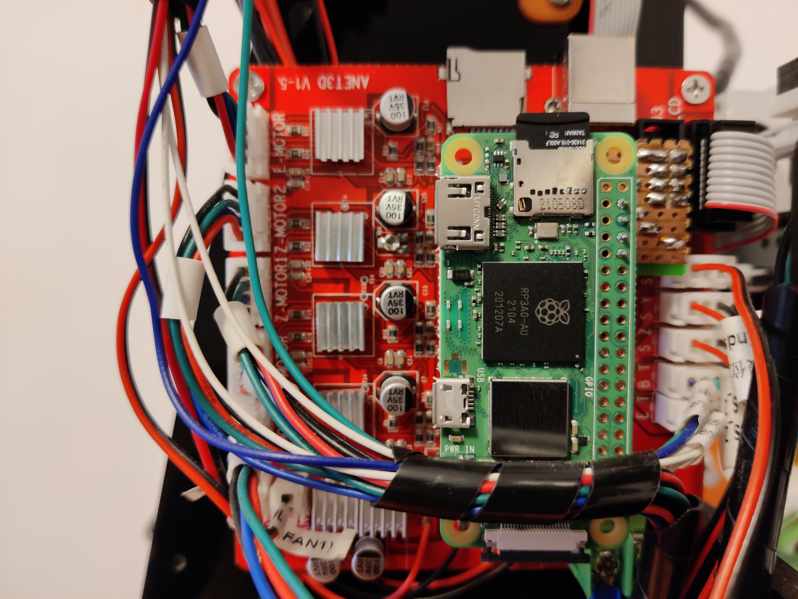
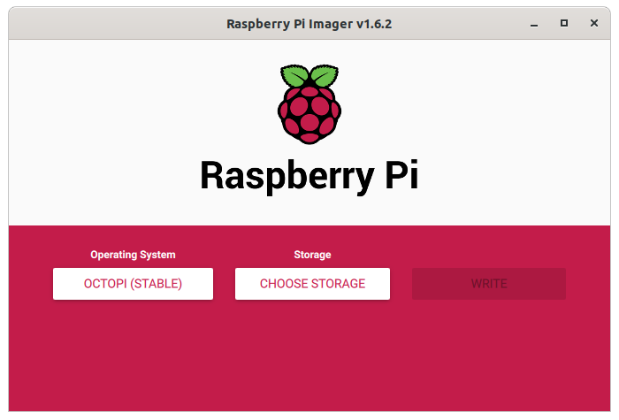
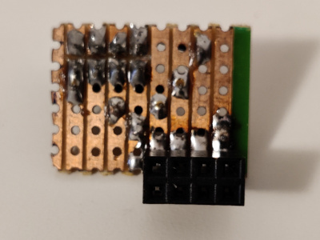
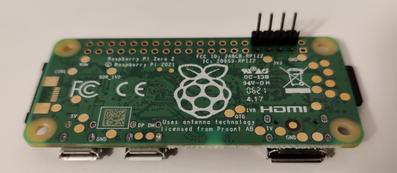
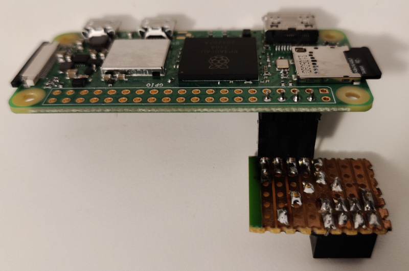
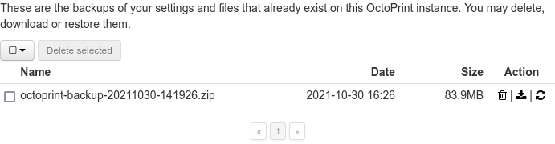

title: Raspberry Pi Zero 2 W upgrade
summary: Actualización de Raspberry Pi Zero al modelo 2 para OctoPrint.
date: 2021-10-30 17:40:00



Justo hace tres años realicé una [instalación de una Raspberry Pi Zero](2018-10-20-Octoprint-en-Anet-A8.md) en una impresora 3D Anet A8 para gestionar las impresiones con el software OctoPrint. El uso de este modelo de Raspberry Pi no está recomendado, ya que la potencia de la misma es un poco ajustada. Yo mismo había notado que algunas impresiones complejas (sobre todo cuando hay muchas curvas), se ralentizaban ligeramente. No tanto como para que dejara de merecer la pena la instalación, pero ciertamente la situación no era conveniente. Tras el anuncio del nuevo modelo [Raspberry Pi Zero 2 W](https://www.raspberrypi.com/products/raspberry-pi-zero-2-w/) en seguida pensé que sería perfecto para esta función, así que he procedido a la actualización. Aquí describo los detalles del cambio.

## Flasheo OctoPrint

!!! Warning "Antes de flashear"
    En esta instalación vamos a rescatar la configuración de la [instalación anterior](2018-10-20-Octoprint-en-Anet-A8.md), por lo que si queremos flashear sobre la misma tarjeta, habrá que adelantar los pasos que se comentan en el apartado [Configuración OctoPrint](#configuracion-octoprint)

Al igual que en la instalación original, se utiliza la distribución oficial que además se puede instalar desde la utilidad [Raspberry Pi Imager](https://www.raspberrypi.com/software/) (se encuentra dentro de la sección `Other specific purpose OS`).



## Configuración de red

Una vez flasheado OctoPrint, lo primero que interesa es conseguir conectividad a través de Wifi para poder continuar haciendo ajustes por SSH. El servicio SSH está activado por defecto en la imagen de OctoPrint. Para conseguir que la nueva instalación de OctoPrint se conecte a mi router con una IP fija, hacemos lo siguiente:

1. Montar la tarjeta recien flasheada en el PC.
2. Editar el fichero `octopi-wpa-supplicant.txt` que hay en la partición boot.
3. Descomentar el bloque que tiene la leyenda `## WPA/WPA2 secured`, sustituyendo los valores de mi SSID y password.
4. Sustituir `UK` por `ES` en el parámetro `country` que hay casi al final.
5. Editar el fichero `etc/dhcpcd.conf` que hay en la partición rootfs.
6. Al final del mismo añadir las siguientes líneas (sustituyendo `IP`, `GATEWAY` y `DNS` por lo que corresponda):

    ```
    interface wlan0
    static ip_address=IP/24
    static routers=GATEWAY
    static domain_name_servers=DNS
    ```

Tras hacer estos cambios, insertar la tarjeta en la Pi Zero 2 y alimentándola (y esperando a que se reinicie un par de veces, ya que en el primer arranque se expande la partición rootfs para ocupar toda la tarjeta), se consigue acceder por SSH con el usuario `pi` y el habitual password `raspberry`. Lo primero que conviene hacer como el propio sistema se encarga de recomendar, es cambiar el password del usuario `pi` con el comando `passwd`.

## Configuración de puerto serie

Tal y como se comentó en el [artículo de la instalación original](2018-10-20-Octoprint-en-Anet-A8.md#desactivacion-de-bt-y-activacion-de-puerto-serie), el puerto serie físico que hay en el GPIO de Raspberry Pi está en uso por el adaptador Bluetooth integrado. Hay que desactivar este adaptador y la consola serie que se asocia al mismo que nos da la posibilidad de iniciar sesión por el puerto serie. Para ello hacemos lo siguiente:

1. Volver a montar la microSD en el PC.
2. Editar el fichero `config.txt` que hay en la partición boot.
3. Añadir al final las lineas siguientes:

    ```
    dtoverlay=pi3-miniuart-bt
    enable_uart=1
    ```

4. Volver a poner la microSD en la Raspberry y arrancar el sistema.
5. Tras iniciar sesión por SSH ejecutar la utilidad `raspi-config` con `sudo`.
6. Acudir a la sección `Interfacing options > Serial` y responder de la siguiente forma a las dos preguntas que se harán:

    * Would you like a login shell to be accessible over serial? -> No
    * Would you like the serial port hardware to be enabled? -> Yes

7. Reiniciar.

## Conexión física

Vamos a aprovechar el viejo adaptador artesanal que se realizó para la [instalación original](2018-10-20-Octoprint-en-Anet-A8.md#conexion-serie-entre-anet-a8-y-raspberry-pi). Tras desoldarlo, esta vez instalamos una tira de pins hembra en el adaptador y una macho en la Raspi Zero 2, para poder extraerla de la impresora y utilizarla para otros proyectos cuando la impresora esté parada.







## Configuración OctoPrint

En este caso vamos a aprovechar la configuración anterior de OctoPrint generando un backup y cargándolo en la nueva instalación. Para ello:

1. Arrancar la vieja instalación.
2. Acudir a la siguiente ruta en el interfaz web: `Settings (llave inglesa) > OCTOPRINT > Backup & Restore`.
3. Allí pulsar el botón `Create backup now`.
4. Tras esperar un buen rato aparecerá una entrada en el listado de backups realizados:

    

5. Pulsar el icono de descarga para obtener el fichero zip.
6. Apagar la vieja instalación y arrancar la nueva.
7. Al abrir el interfaz web encontraremos un asistente, siendo el primer paso precisamente el que permite cargar el backup.

## Finalización

Tras este paso ya habríamos terminado. Sólo quedaría instalar la Raspi Zero 2 en el lugar que ocupaba la vieja, tal y como se veía en la imagen de cabecera.
