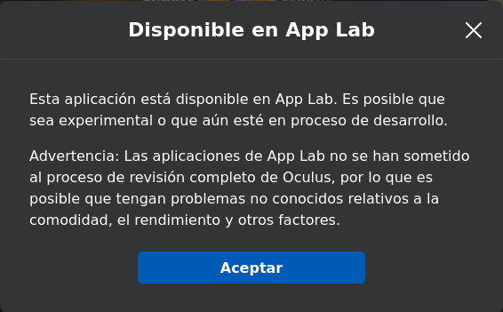
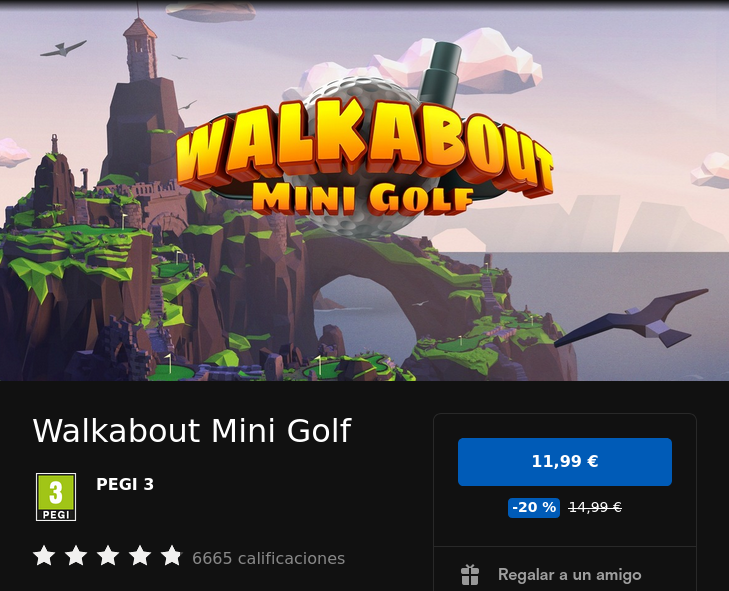

title: Adventures in VR
summary: Introduction to the VR world with Oculus Quest 2.
date: 2022-04-17 23:00:00

On February 17, 2022, I used a pair of [Oculus Quest 2](https://store.facebook.com/es/es/quest/products/quest-2/) for the first time. I mention the date because I feel it may be a turning point in my life. I suppose it sounds exaggerated, but that day I suddenly became convinced of all the predictions made in so many science-fiction films and books. Used well, virtual reality can be an extremely powerful tool to broaden access to, or enable entry into, areas that are difficult for many people to reach. But the purpose of this post was not to talk about philosophy, but rather to reflect some of the things I have learned since that day in case someone decides to walk the path toward this new "new world".

There are many other virtual reality headsets on the market right now, but here I am going to limit myself to what I know: the Oculus/Meta Quest 2 (from now on I will use only the name Oculus because it is the most representative in the history of these headsets). These currently have the largest market share, followed by PlayStation VR. The rest of the headsets on the market belong to the same type as the latter, that is, they are tied to another device such as a PS4 or a PC. Oculus differs in that the headset is standalone or self-sufficient. It has less raw power than the others, but in exchange it has other advantages. It is somewhat equivalent to the Nintendo Switch concept, which, while not comparable in power to the latest-generation consoles from other manufacturers, takes advantage of its limitations through portability and a lower price. I mention all this mainly because the concepts, market, and auxiliary devices that I will mention below, for the most part, cannot be easily transferred to other platforms.

I consider the Oculus Quest 2 to be what the English call an [MVP](https://es.wikipedia.org/wiki/Producto_viable_m%C3%ADnimo) (Minimum Viable Product). That is, you can tell that in its design most trade-offs were solved with the criterion of having something functional and valid but at the lowest possible cost. The final product works from the start, but there is room for improvement and the work of addressing those improvements is left to the user (if they consider it worthwhile), either by replacing some parts or buying accessories. Several of the following sections cover some of those aspects that can be improved.

## Getting applications

In general, games/experiences/applications (from now on we will call them "content") are obtained from the [Oculus Store](https://www.oculus.com/experiences/quest/). It should be said that prices are generally considerably higher than on PC-based VR platforms. The Oculus Quest 2 can be considered a game console, and content prices are usually in line with what you find in that space. The headset system is actually Android, and one might think prices would be more in line with what is seen in the Google store. I suppose the higher price point is related to the greater production cost of VR content compared with regular Android content. But as I mentioned earlier, the same game on SteamVR for PC/non-standalone headsets may cost 20% of what it costs in the Oculus store. The good news is that, to get started, there is a good amount of free content, as we will see later.

The Oculus Store has very strict criteria for allowing content in. For that reason, at the beginning of the headset's commercial life, an alternative market not controlled by the brand appeared, called [Sidequest](https://sidequestvr.com/). Within this "alternative store," besides content that, as I said before, could not enter the official store because of its filters, there is a lot of indie material that is often free. There are also demos of final applications where you can try part of the content before purchasing it. The downside is that you have to do a bit of tinkering to install content that is only available on Sidequest. It is not complicated: you need to enable developer mode on the headset, create a developer account (free), and connect the headset to a PC via USB.

When Oculus realized that Sidequest was drawing attention away from its official Oculus Store, it eventually opened a program to accept all that content that could not enter the store and was ending up on Sidequest. It is called [App Lab](https://applabgamelist.com/) and is partially integrated into the official store. App Lab content does not appear in official store searches, but links from [App Lab](https://applabgamelist.com/) allow installation through the official store without the tinkering required by Sidequest. We only receive a warning during installation reminding us that what we are about to install may have bugs or may not be fully finished.

A fourth way to access content is to use the system's built-in web browser and access the increasingly numerous contents compatible with the [WebXR](https://immersive-web.github.io/) and [OpenXR](https://www.khronos.org/openxr/) standards. There are even sites specialized in this kind of content, such as [ConstructArcade](https://constructarcade.com/). This technology is very accessible. If you are interested, I recommend taking a look at the code examples that can be found [here](https://immersive-web.github.io/webxr-samples/). It took me 5 minutes to improvise [this VR scene](https://niubit.net/media/local/niubitVR/) with the niubit logo.

## Application returns

There is an [application return policy](https://support.oculus.com/articles/orders-and-purchases/returns/index-returns/?locale=es_ES) in the official store that partially mitigates the anxiety caused by the high prices of buying something you have not been able to see beforehand (and in the VR world this is common, since a YouTube video or a blog article cannot convey immersion). The conditions for requesting a refund are:

1. Do it within 14 days of purchase.
2. Not have used the application for more than 2 hours.

## Offers and coupons

As I mentioned earlier, content prices in the official store are generally high. Leading games usually cost around €19/€29. Some get close to €40. I do not know whether for this reason Oculus has implemented several mechanisms to make content more accessible/appealing. The mechanisms are the following:

* Temporary discounts
* Temporary coupons
* Referral credit gift

Let's look at each system separately.

### Temporary discounts

These are simply offers that last a few days. They are very frequent, so I have developed the habit of waiting for content I am interested in to go on sale. For example, in the mere two months I have been watching the store, one of the games I like has already been on sale twice, as can be seen in the screenshot I just took:

The content detail page clearly shows the duration of the offer with a countdown that includes seconds, so we have very precise control over how long it will last.

[This page](https://queststoredb.com/) collects the current offers and free applications available at any given time.

### Temporary coupons

These are personal discount coupons that arrive through notifications in the Oculus app installed on the phone. In the two months I have been using it, I have received two coupons of this kind, one with a 25% discount and another with a 30% discount. The coupon usually lasts a week and can only be applied to a single purchase. Coupons of this type can be combined with the temporary discounts mentioned above, so by combining both discounts you can get content for practically half price.

One thing worth mentioning about temporary coupons is that if they are applied to content that we later return, the amount refunded is the application price without applying the coupon, which means they give us back more credit than they charged us when we made the purchase with the coupon applied. I do not know whether this is a platform bug or something deliberate, but it encourages using temporary coupons before they expire. So if we have a 30% coupon that is about to expire, it is worth taking the risk of buying an application with it to try it and then returning it. We will get the discount provided by the coupon as extra credit to buy other content in the future. In other words, in a way we manage to break the coupon's expiration date.

### Referral credit gift

Finally, there is a referral program by which, if a friend activates the account they then use on a new headset through a link we send them, the friend immediately receives €30 in Oculus Store credit (for hardware and software) and we also receive €30, although after a month.

If anyone is thinking of buying the headset and does not have someone to send them a referral link, ask me :-)

## Motion sickness

When talking about virtual reality, one of the first issues that comes up is motion sickness. In fact, it was the main reason I did not jump straight into buying the Quest when I first heard about it. As almost always happens, those fears faded when I heard someone trustworthy and experienced in the subject talk about it. Below I summarize the ideas I currently have on this matter.

To begin with, and very superficially, I will say that motion sickness is fundamentally caused by a discrepancy in the perception of movement between different senses, especially balance (the inner ear, which measures the accelerations and turns experienced by the body) and sight. Here we need to talk again about the difference between tethered headsets (PC or PlayStation) and standalone ones like Quest. With the former, if we face an experience that requires moving around, such as visiting a recreation of a castle, for example, we have no choice but to indicate movement with the controllers. With Quest, whenever we move within the safety space we have defined for playing, we can move using our feet, that is, by walking normally. The former can cause motion sickness; the latter absolutely does not. Naturally, with Quest in some experiences we will also need some kind of movement mechanism using the controllers, since the safety space is limited. So let us talk a bit more about what these controller-based movements consist of.

Movement with the controllers can be of several types; let us describe them separately:

* **Smooth**: This would be the equivalent of what is used in classic video games (non-VR), that is, the movement indicated with the D-pad or stick. This is by far the movement system that causes the most motion sickness, especially with fast and lateral movement. If the movement is slow and especially forward, there is usually not much problem. This type of movement is almost essential in popular FPS-style games, so it is not recommended to start with those kinds of games. Most people say that over time you develop "virtual legs" or "VR legs" and motion sickness stops appearing when using this movement system. Like almost every problem we want to overcome, it requires facing it, that is, feeling bad for a while while developing those "virtual legs." Supposedly during this learning phase it helps to simulate movement in real life by taking small steps (without actually moving forward) while using the controller to perform the advance gesture. It is also recommended to make slower movements at first, which can usually be controlled because movement is usually done with analog sticks. I am still working on it, mainly because FPS games are the ones that interest me the least.
* **Gesture-based movement**: In this case we are also able to move smoothly without making actual movement in real life, but instead of using the controller to indicate the direction in which we want to move, we do it with some hand gesture. For some reason, our brain does not have as much trouble handling the sensory discrepancy when it is done this way. Two examples:
    * [Gorilla Tag](https://www.oculus.com/experiences/quest/4979055762136823/): This game is something of the paradigm of what we are talking about. To move forward in this tree-based chase game, the only way is to propel ourselves by hitting the ground with our hands, as if we were jumping with them.
    * [Mission: ISS: Quest](https://www.oculus.com/experiences/quest/2094303753986147/): It was one of the first VR experiences I enjoyed. It is a recreation of the ISS. In the tutorial they teach you to move inside the station by floating like astronauts do, propelling yourself with one of the sticks, that is, with "smooth" movement. The result was immediate motion sickness. Later I discovered (the tutorial probably mentions it, I just do not remember anymore) that I could also propel myself with my hands from some handhold. Or simply by pushing off a wall as in Gorilla Tag. That way the motion sickness did not appear.
* **Teleportation**: In this case we point with the controller to the place we want to move to and appear there instantly. This kind of movement does not cause any motion sickness at all, but depending on the type of game it can ruin the experience, because if movement has to be very fast, we will feel as if we are watching one of those current superhero movies in which the director cannot hold a shot for 2 seconds. It is perfect, however, for calm games such as [Walkabout Mini Golf](https://www.oculus.com/experiences/quest/2462678267173943/). Speaking of this game, it is worth noting that it combines the two techniques that cause the least motion sickness (movement with our feet inside the safety space and teleportation), and both systems fit the dynamics of mini golf perfectly.

Another aspect that can lead to motion sickness is a low refresh rate, which can produce sickness not when moving within the virtual environment, but simply by turning your head. Deep down this is another version of the same problem: if the refresh rate is very low (say 30Hz), when making a quick head turn we will see a sequence of 2 or 3 frames spread along that turn, so there is a large discrepancy between what we see and what our brain expects to perceive. It can be said that today this problem no longer really exists; it was something that affected headsets from earlier generations. Quest 2 runs, for example, at 90Hz in general and can even be *overclocked* to 120Hz at the cost of lower battery life. With those refresh rates, this problem can be considered solved.

## Recommended applications

The following is a list of the most interesting content I have found for the Oculus Quest 2 so far.

* [Anne Frank House VR](https://www.oculus.com/experiences/quest/1958100334295482/): [free] A recreation and guided tour (in several languages including Spanish) of the house where Anne hid with 7 other people for two years. Highly recommended.
* [Apollo 11](https://www.oculus.com/experiences/quest/2164469606967296/): [€9.99] A recreation of several key maneuvers from the Apollo 11 mission. Only for space nerds. For everyone else, paying €10 probably will not be worth it.
* [Arkio](https://www.oculus.com/experiences/quest/2280319701979278/): [free] An architectural design application. I have not explored it much. I would probably spend time on Gravity Sketch first.
* [ARK-ADE Demo](https://www.oculus.com/experiences/quest/4131321390259404/): [free] I discovered it among applications similar to Cartidge'81 and it immediately caught my attention. It is an on-rails shooter like that one, much more advanced but also more expensive. This is the demo.
* [Bait!](https://www.oculus.com/experiences/quest/2082595615120854/): [free] A pretty charming fishing game. It is simple and relaxing, and also a very accessible experience when you are just starting out.
* [Beat Saber - Demo](https://www.oculus.com/experiences/quest/1758986534231171/): [free] Beat Saber is one of the most popular applications on the platform. But as we mentioned in the corresponding section, that usually means around €30. I ended up buying the [full application](https://www.oculus.com/experiences/quest/2448060205267927/) using one of the [periodic coupons](#temporary-coupons). At first I was close to returning it because, even though I find the application almost perfect, the song selection is quite far from my personal tastes. Most tracks sound like the kind of motivational music they play in gyms or some clothing stores. In the end I found a few acceptable tracks, and the quality of the app together with my interest in sports experiences made me keep it.
* [Bigscreen Beta](https://www.oculus.com/experiences/quest/2497738113633933/): [free] A kind of private or public movie theater room (there are several options) where you can watch video content together with other people, whether proposed by the platform itself, hosted online, or possessed by everyone in the room. I have not tried it, but in theory if a friend and I had the same file, we could watch it together.
* [Bogo](https://www.oculus.com/experiences/quest/1893756264000446/): [free] A kind of Tamagotchi, that is, a pet you have to care for/play with/feed. I admit I have only opened it a couple of times, but it is useful even if only to show VR to visitors.
* [Cartridge'81](https://www.oculus.com/experiences/quest/4500006453452515/): [€4.99] A retro-styled on-rails shooter. It does not have a lot of depth, but I have always liked shooting games (aim-based ones more than FPSs) and this one fits my taste quite well.
* [Crisis VRigade](https://www.oculus.com/experiences/quest/3926597184026195/): [€4.99] One of my favorite games of all time is PlayStation's Time Crisis. Fans of light gun games know that it is a genre that was lost when television technology moved from CRT to flat LCD/Plasma screens. Apparently, allowing for the difference in precision enabled by the gun/CRT combination, this genre has reappeared in the VR space. So when I found this game thanks to a friend's recommendation, I jumped on it. The title of the game really seems to refer to Time Crisis. Crisis VRigade is a game that is already a few years old and comes from other platforms, so the graphics are not cutting-edge. There is a second part with graphics more in line with the Quest 2, but it costs €19.99 and is not in Spanish. Until I finish the first one, I do not plan to buy the second. I still have not played it much (damn Walkabout), but what little I tried I liked a lot. Really the closest thing to Time Crisis that I remember.
* [ConstructArcade](https://constructarcade.com/): [free - web] A collection of minigames made with WebXR.
* [DeoVR Quest](https://www.oculus.com/experiences/quest/2382576078453818/): [free] It is a media player. Useful for playing video content that we have copied to the headset or that we have available over the network on our computer or NAS (though I have not actually tested that latter use yet).
* [Echo VR](https://www.oculus.com/experiences/quest/2215004568539258/): [free] One of the most popular games. Again, I have not gotten past the initial tutorial, but it is not hard for me to imagine that it will be interesting. It is a kind of multiplayer handball game in zero gravity. I need to explore it.
* [Eleven Table Tennis](https://www.oculus.com/experiences/quest/1995434190525828/): [€19.99] The first application I bought and one of my favorites. The game has menus that could be much better, but once the matches start it is simply a 10 out of 10. I regularly play with a friend and we both think it is very hard to improve in that respect. Given the characteristics of Ping Pong, in terms of the space needed to play it and the effort it requires (paddle and ball weight), it fits VR simulation perfectly. With full-size tennis, for example, you would have to make some compromises. That said, because of the game's speed, when playing with a human opponent you need to watch the connection latency.
* [Elixir](https://www.oculus.com/experiences/quest/3793077684043441/): [free] Another must-have, although in this case it is short, meaning it ends quickly and leaves you wanting more, but it is perfect. I do not want to spoil the experience; you just have to enjoy it. One of the few with high-quality Spanish audio.
* [Goliath: Playing with Reality](https://www.oculus.com/experiences/quest/3432432656819712/): [free] This experience defies classification. It is, broadly speaking, a story, though a strange one, very strange. In some passages there is quite a bit of interaction, but in general you just have to go with it. Very interesting.
* [Gorilla Tag](https://www.oculus.com/experiences/quest/4979055762136823/): [free] An unclassifiable game. It is very indie and the graphics do not seem up to par, but again I think it is a multiplatform game and certainly does not look like something from a major studio. But it is definitely interesting. It is basically playing tag with more people whom you hear talking from a distance (things get pretty lively; in English, naturally). It takes a while to understand how you are supposed to move, which is by hitting the ground with your hands to propel yourself in the opposite direction. To climb trees, you have to grip the trunk with your hands and push yourself upward.
* [Gravity Sketch](https://www.oculus.com/experiences/quest/1587090851394426/): [free] More than a game or an experience, it is an application in the traditional sense. Specifically, a 3D design application. It is, for example, the application used by the designers of the Walkabout Mini Golf courses, as can be seen in [this video](https://www.youtube.com/watch?v=Bi5XqkCIrxU).
* [Half + Half](https://www.oculus.com/experiences/quest/2035353573194060/): [free] A simply charming social game. Inside the world of Half + Half we take on the appearance of a rounded little figure with a distorted voice. Everything seems designed so that abuse between players is not possible. Everything is sweetened in such a way that you can share gameplay experiences with other anonymous players pleasantly and without conflict.
* [INVASION!](https://www.oculus.com/experiences/quest/3323166227771391/): [free] A 3D story with a slight touch of interaction. Again, ideal for visitors.
* [Liminal](https://www.oculus.com/experiences/quest/3158342884265828/): [free] I have not explored it much either, but it is a series of relaxing experiences close to meditation.
* [Maloka](https://www.oculus.com/experiences/quest/4014704425248676/): [free] Very similar to the previous one. I should mention that it attracted me because one of the narrators seems to be Neil de Grasse Tyson, although I have not been able to verify it in the application's credits.
* [Mission: ISS: Quest](https://www.oculus.com/experiences/quest/2094303753986147/): [free] Essential for space nerds. It is a 3D recreation of the International Space Station in which you can move freely while solving a few simple challenges proposed to you. I should mention that this was the first time I experienced the famous VR motion sickness, but there is a trick: move using your hands instead of the analog stick that controls smooth movement, by pushing off the walls as astronauts do in real life.
* [MoonRider](https://moonrider.xyz/): [free - web] A Beat Saber clone made with WebXR, so you have to open it with the headset's web browser. The content is created by the community based on songs obtained from public servers such as YouTube (that is my assumption), so we can easily find hundreds of popular songs.
* [Nocturne](https://www.oculus.com/experiences/quest/3618101344910000/): [free] A kind of Guitar Hero for classical music. It takes some time to get the hang of it, but if you like classical music, give it a chance because it can produce interesting sounds.
* [Notes on blindness](https://www.oculus.com/experiences/quest/1946326588770583/): [free] An experience dedicated to explaining how blind people perceive the world.
* [Oculus First Contact](https://www.oculus.com/experiences/quest/2188021891257542/): [free] When the headset starts for the first time, an application called [First Steps](https://www.oculus.com/experiences/quest/1863547050392688/) opens (actually I am not sure whether it opens automatically or is just suggested; I do not remember). This other app is very similar and came with the original Oculus Quest. It is different from First Steps, but it is also very worthwhile, especially for showing VR to visitors.
* [On the morning you wake (to the end of the world)](https://www.oculus.com/experiences/quest/4873390506111025/): [free] An experience about an incident that occurred in Hawaii a few years ago in which the population received a missile attack alert for the islands. Everything is recreated using photogrammetry.
* [Pavlov Shack beta](https://www.oculus.com/experiences/quest/3649611198468269/): [free] I still have not played this game. It belongs to the FPS (First Person Shooter) genre, which is not one of my favorites. I admit I installed it in case it gets accepted into the official Oculus Store in the future and stops being free, so I would already have it acquired. According to everyone, it is one of the good FPS titles available for the Quest 2. I assume it will be nauseating, though.
* [Rec Room](https://www.oculus.com/experiences/quest/2173678582678296/): [free] A social game to which I have not given many chances yet (I have not finished the introductory tutorial). Even though it does not have the most advanced graphics (probably because it is a multiplatform experience), everyone says that together with VRChat it is another of the most established Metaverses. Inside, we can find group games such as Laser Tag, water parks, parkour, climbing walls, etc. We can even design our own games.
* [Space Explorers](https://www.oculus.com/experiences/quest/3006696236087408/): [free] Again, essential for space nerds. In this case they are 360º videos recorded on the ISS. So the image is real in this case, not synthetic as in *Mission: ISS: Quest*, but in exchange we cannot choose the point of view and are merely passengers.
* [SUPERHOT VR - Demo](https://www.oculus.com/experiences/quest/1780841635357133/): [free] Another one of those games you have to try at least once, and thanks to the demo we can.
* [Tea For God](https://www.oculus.com/experiences/quest/3762343440541585/): [free] This game is on my personal podium. It is an infiltration-style game. Its main virtue lies in the way it takes advantage of the real play space we have available. It generates a network of impossible labyrinths (because the corridors cross even though we are not aware of it) so that you get the feeling of exploring a much larger space than the one we actually have to play in. Below I include a video I recorded of a friend, although as always it is impossible to convey the total feeling of immersion it produces.

    <iframe width="794" height="696" src="https://www.youtube.com/embed/pJFERfLgtN8" title="YouTube video player" frameborder="0" allow="accelerometer; autoplay; clipboard-write; encrypted-media; gyroscope; picture-in-picture" allowfullscreen></iframe>

* [The Key](https://www.oculus.com/experiences/quest/3457685900909916/): [free] The first VR story/film I enjoyed on the headset. And one of the best of all I have seen. A clear example of the new cinema arriving thanks to this technology.
* [The world beyond](https://www.oculus.com/experiences/quest/4873390506111025/): [free] A mini-game/experience to test the new mixed reality capabilities that Meta incorporated into the operating system starting around v40.
* [VR Animation Player](https://www.oculus.com/experiences/quest/2515021945210953/): [free] Another one I have not explored much. It is a viewer for animation content. VR animation, that is, consuming this content from within the animations themselves.
* [VRChat](https://www.oculus.com/experiences/quest/1856672347794301/): [free] One of the platform's essential applications, which I still have not explored but dare to recommend. In some places you read that it is one of the 2 or 3 consolidated Metaverses that currently exist.
* [VRtuos](https://www.oculus.com/experiences/quest/3827275690649134/?utm_source=oculusapplab.com): [free] A virtual piano in which a real keyboard can be mapped so that you feel the real keys when pressing them in VR. This makes it possible to learn pieces in a way similar to Guitar Hero.
* [Walkabout Mini Golf](https://www.oculus.com/experiences/quest/2462678267173943/): [€14.99] In my opinion the first truly essential title among everything I have seen so far. It consists of mini golf courses in charming environments. At the moment there are 8 open courses and 3 DLCs. Each course has a harder mode that is unlocked by finding hidden balls in each of the holes of the normal course. Then, in the hard course, there is a puzzle game to find hidden treasures that let us obtain a gift object that I will not reveal. Neither these hidden minigames nor the main game itself, that is, mini golf, ever become tiresome. In fact, this game is the reason why my exploration of the VR world that began on February 17 became much slower once I bought it two weeks later. I usually end every day by playing at least 9 holes to relax before going to sleep. As I said, essential.
* [We Live Here](https://www.oculus.com/experiences/quest/2537261906377373/): [free] A representative of what can be considered a new form of cinema thanks to VR. It tells us a story with a certain level of interaction. This kind of content usually does not have much depth, that is, it does not last long and we probably would not want to consume it more than a couple of times, but again it is something you have to see and show to visitors.
* [Within](https://www.oculus.com/experiences/quest/2560149374058829/): [free] A curated list of VR content hosted on platforms such as YouTube.
* [YouTube VR](https://www.oculus.com/experiences/quest/2002317119880945/): [free] One of those essential applications on any platform. What can I say about YouTube? Just mention that, naturally, the many 180/360º and 3D contents are especially enjoyable with VR glasses.

## Straps

The strap or face-mounting system is one of the elements that can be improved quite a lot, as we mentioned at the beginning. I am one of those who believe the included one is perfectly functional (like everything that comes with the headset), but since I realized from the start that the headset had arrived to stay, I decided it was worth exploring all the possibilities for improving/making the experience easier.

Oculus itself sells, or rather sold (since they were removed from sale because they broke easily), a strap called the Elite Strap with a rigid dial adjustment instead of an elastic one. But in the more than one year that the Oculus Quest 2 has been on the market, multiple manufacturers have presented their own proposals. After studying the market, I am going to point out the ones that seem most noteworthy to me.

Before starting, it is worth saying that the following two types of straps can be considered to exist:

* *Halo type*: I mean the PlayStation VR concept, which holds the headset on the head like a helmet, that is, resting on or pressing against the forehead and the back of the head. The headset hangs from the halo so that in theory it would even be possible not to rest it on the face. Some people even remove the facial interface, that is, the anatomically shaped piece that normally rests on the face and lights the play area with IR lights to prevent light leakage into the headset.
* *Elite Strap type*: This is the one that imitates the operation of that strap or of the original elastic-strap design, that is, the one that presses the headset against our face. In this case the facial interface naturally becomes essential, and in fact if we go for this format it may be worth finding a facial interface that is more comfortable or better adapted to our face.

The second type may seem less convenient than the halo type, but at least in my case it has turned out to be preferable. When playing golf with a halo-type strap, the headset would shift when I lowered my head to hit the ball. It also seems clear that for very vigorous games such as sports titles, the halo type may be less convenient because the headset can wobble, making it easy to lose the optical "sweet spot." In any case, after studying the issue quite a bit, there does not seem to be any consensus. That is, it is a matter of taste and head shape, for which one type of strap seems to fit better than the other in each case.

As for halo-type straps, I would point out:

* [BOBOVR M2](https://www.amazon.es/dp/B094FL7K9L/): It is perhaps the most representative.
* [GOMRVR](https://es.aliexpress.com/item/1005001619417239.html): A kind of clone that costs a third as much and that I can recommend because I actually bought it and can confirm that it is very well built, although, as I mentioned earlier, it has not turned out to be the best option for me.

As for Elite Strap-type options, there are:

* [KIWI](https://www.amazon.es/dp/B098JTDPQC/): This is the option I am betting on.
* [AUBIKA](https://www.amazon.es/dp/B09JKL4TW6/): It exists in a version with an integrated battery.

## Battery

The Oculus Quest 2 battery is about 3600mAh. With normal use, the battery lasts around 3 hours, but I am very particular about the treatment lithium batteries should receive, so I always try to stay between 40% and 80% capacity, which means the usage period, if I do not want to leave that range, is about an hour and a half. For this reason, one of the first accessories to acquire is a power bank. In my case I bought [this one](https://www.amazon.es/gp/product/B019GJLER8/), which seemed to have a good balance between capacity and weight, since I wanted to carry it attached to the headset, as was my case. The right place to hold the power bank is at the back of the headset, where it acts as a counterweight. To do this, people usually use zip ties or Velcro straps, although in my case I hope to take advantage of the many designs other users have made for 3D printing, such as [this one](https://www.thingiverse.com/thing:5143137), which is made to fit the power bank I bought.

The power bank I use has the advantage of more or less supplying the current drawn by the headset under normal use, so if I connect it from the beginning, with the headset's internal battery at 80% as I like it, that level remains throughout the whole session, varying by at most 5% up or down depending on the situation. In this way the internal battery practically does not consume charge cycles.

## Lenses on Aliexpress

Needing prescription glasses to correct vision problems is an obstacle when using VR headsets. Although the Oculus Quest 2 includes in the box an accessory that moves the facial interface away from the lenses, theoretically leaving space to use the visor with our prescription glasses, at least in my case it has not worked. I suppose, again, that it depends on each person's head/face shape. I also suppose, although I have not experimented with it, that if you want to use the Oculus Quest 2 with glasses, halo-type straps may work better because in theory they even allow removing the facial interface.

The definitive solution is, again, to buy a separate accessory. In this case, lenses that are placed over the ones built into the visor. In my case I used the service recommended in the places I consulted: [WidmoVR](https://widmovr.com/). The lenses they sent me are of excellent quality, but the price was also excellent, in the high direction.

Later I learned that there are sellers on Aliexpress ([1](https://es.aliexpress.com/item/1005005949726611.html), [2](https://es.aliexpress.com/item/1005001629892253.html), [3](https://es.aliexpress.com/item/1005003567310605.html)) that offer the same service for a third of the price. After trying one of these options, I can confirm that the quality is the same.

If you have access to a 3D printer, a very interesting option is [this one](https://www.thingiverse.com/thing:3642004).

## Farewell

This concludes the VR guide article. See you in the metaverse...
