title: Miyoo Mini UART
summary: UART port extraction to access the system terminal.
image: images/posts/2022-08-08_mmiyoo_uart/mmiyoo_uart.jpg
date: 2022-08-08 17:00:00

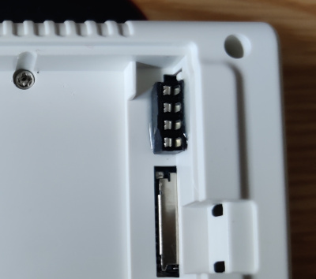

In this article we are going to see a modification of the Miyoo Mini emulation retro console to extract the UART port that exists on the PCB and thus be able to access it without opening the case. This UART port is also connected to a system terminal, which will help us a lot during the development or customization of the console system.

Before starting with the procedure, it should be noted that the modification is not simple. Being such a small machine, there is little space to pass cables or place the external connector.

## Procedure

1. We open the console. We will find the UART port pads under the screen flex cable.

    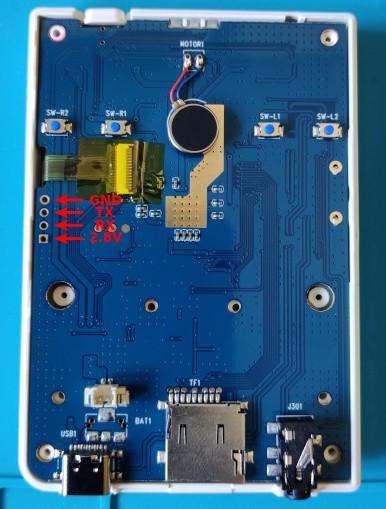

2. We are looking for a place where we can put some kind of connector with 3 or 4 pins. Actually 3 is enough, but since we are doing the modification, we will try to route the 4 pins of the full port. We found that there is a space (in Miyoo Mini v2) in the battery compartment where you can place half a 2x4 socket resulting a mini female 4 pin socket. Traditional female pin sockets are too tall so you would not be able to close the battery cover. Here we see the socket before and after cutting it in half (actually in the left picture it was already cut, but I have supported the two halves so you can see where the piece came from).

    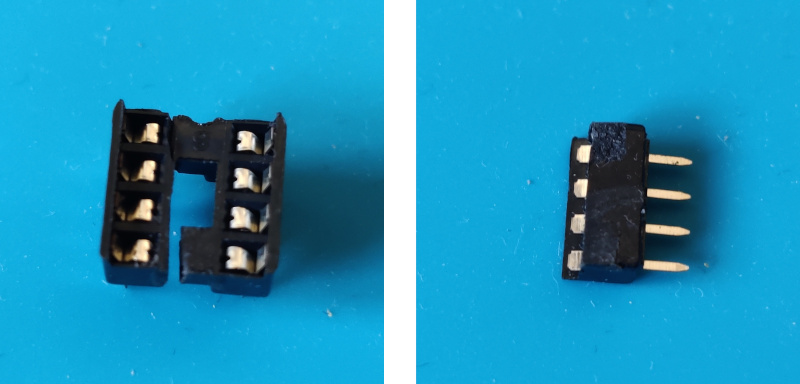

3. The mini female pin socket we have manufactured fits perfectly in the position shown in the picture.

    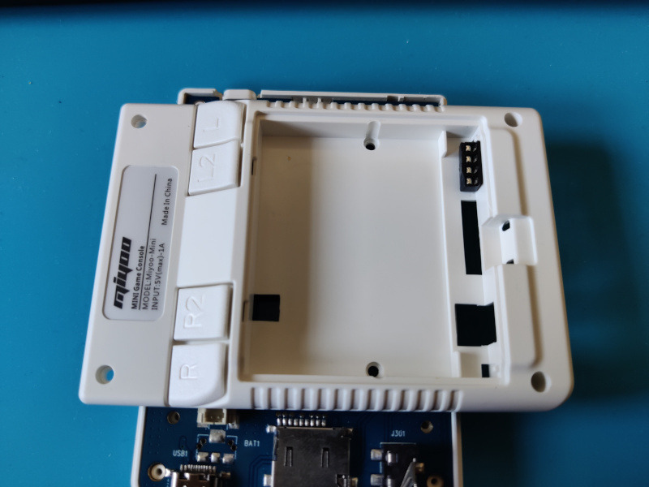

4. We glue the mini pin socket with epoxy resin.

    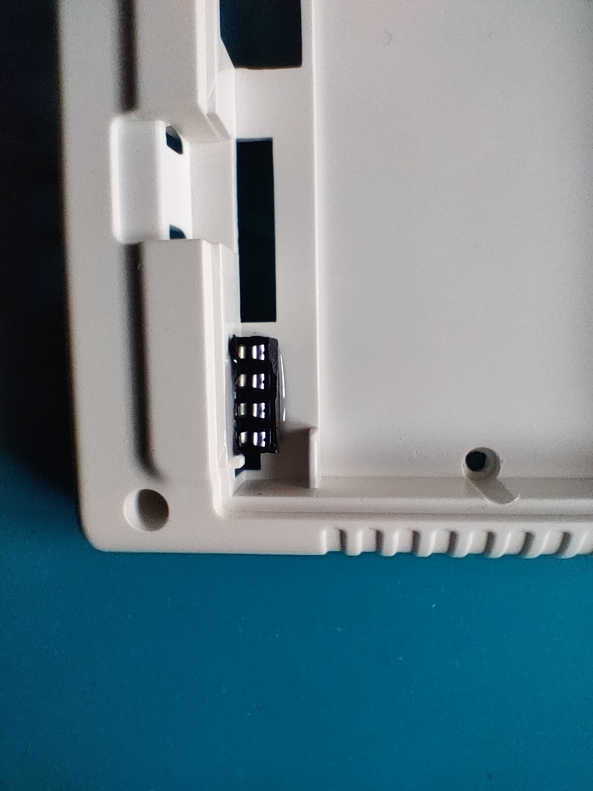

5. On the inside of the case we have to bend the socket pins so that they do not collide with the PCB (as we mentioned at the beginning, the inside of the device is very well used).

    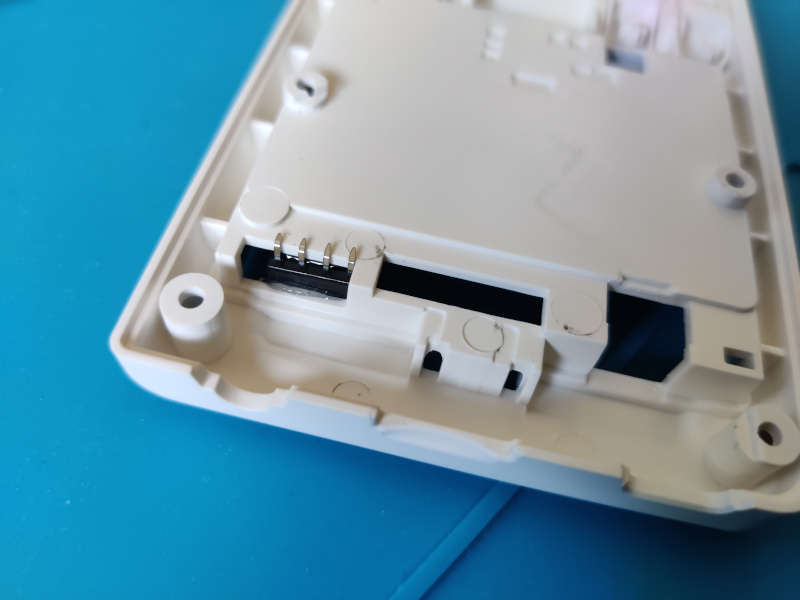

6. The most complicated phase of the process begins. As we have already mentioned, there is very little free space inside the device. For example, the case to which we have just glued the mini socket is completely supported on the PCB along the entire surface of the hole where the battery is housed. We are going to route the connections around this hole. Even so the space is limited, so we chose to use varnished cables instead of wires with traditional PVC insulation. The varnished cable is also a single wire, which will help us to route it, since once deformed, it retains its shape. We look for the varnished cable for example in an old broken laptop power supply. It is sure that at least it will contain varnished cable in the transformer, but when we open it we find the three coils that we point out in the picture (the transformer is the one on the right).

    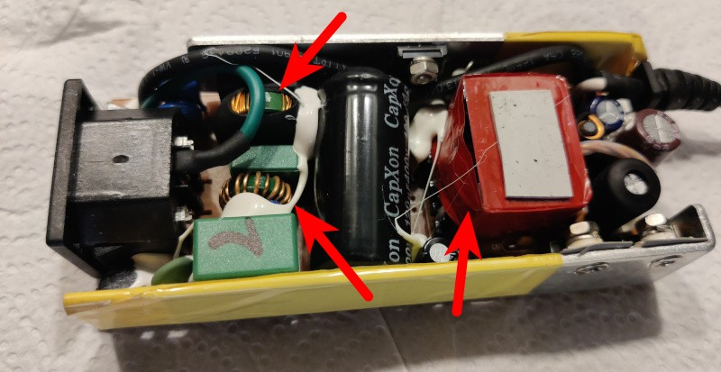

7. Finally we choose the coil that has an intermediate wire thickness (I didn't disassemble the transformer, but I'm sure it would have had thinner wire). From it we extract 4 fragments of about 12cm. It is necessary to remember that being varnished cable, it will be necessary to scrape or to dissolve somehow the varnish in the ends so that we can solder. The scraping can be done with a blade or with sandpaper.

    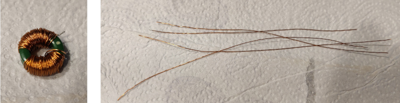

8. Now begins the most laborious part. We start by soldering the four wires to the socket pins. We bend the wires with the form of the bent pins of the socket so that there is more contact surface for the soldering. In the picture it does not appear because it was installed at the end, but it is very convenient to cover the solder joints with insulating tape or better Kapton tape (which is thinner), to prevent them from scratching the PCB and end up causing a short. It is easier to place the tape over the PCB, but in that case we will have to estimate by eye the area to cover, although there is no problem to put more tape than necessary to ensure the operation.

    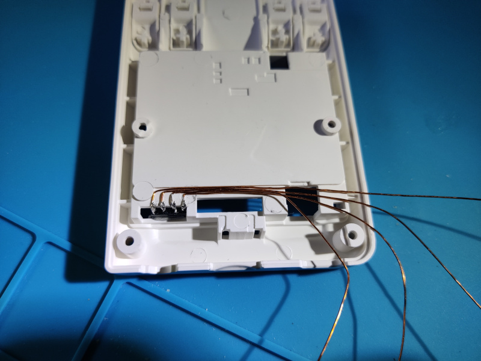

9. Now we patiently route the wires, shaping them with tweezers or fine pliers and fixing them from time to time with hot glue for example.

    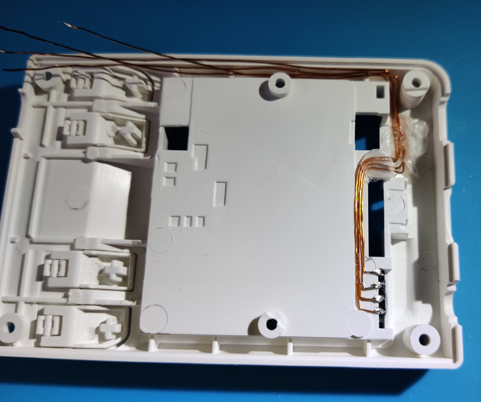

10. When we approach the final position of the wires, we will cut them staggered (finding out which one is which with respect to the soldering of the socket with the multimeter in continuity mode). We will also make a small bend that will be the one that we will introduce in the pads of the port on the PCB. It is necessary to remember that again we will have to remove the varnish of this end of the wires, what we will do preferably before making the fold.

    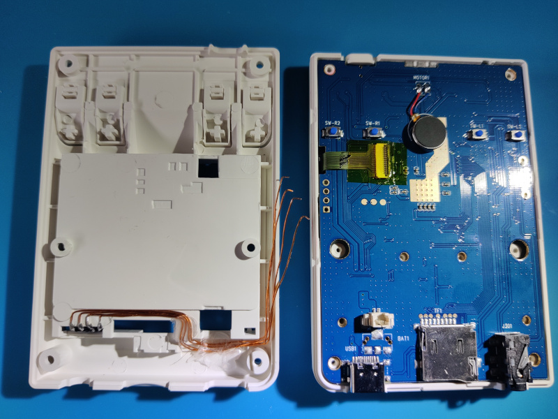

11. Now we solder the cables to the PCB.

    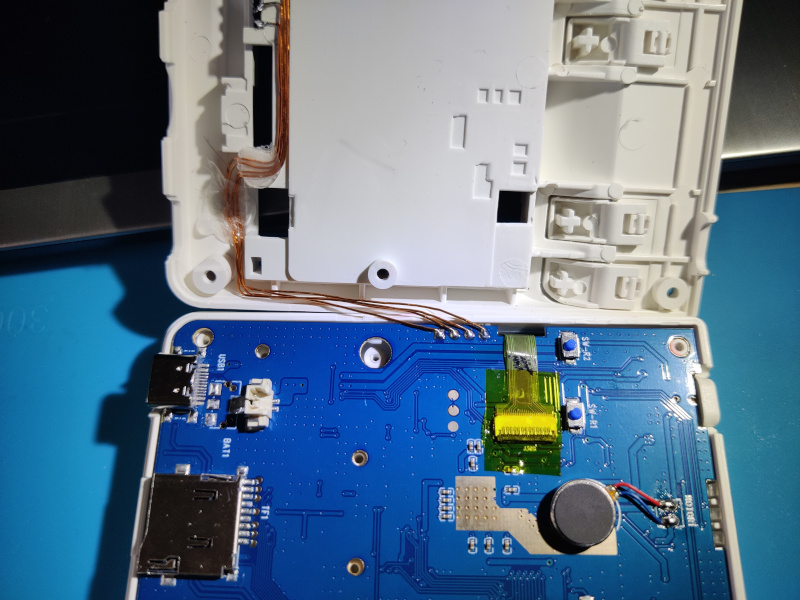

12. We can now close the console. Keep an eye on the cables that run near the lip between the two halves of the case to avoid catching any of them. Now we have our UART port in sight.

    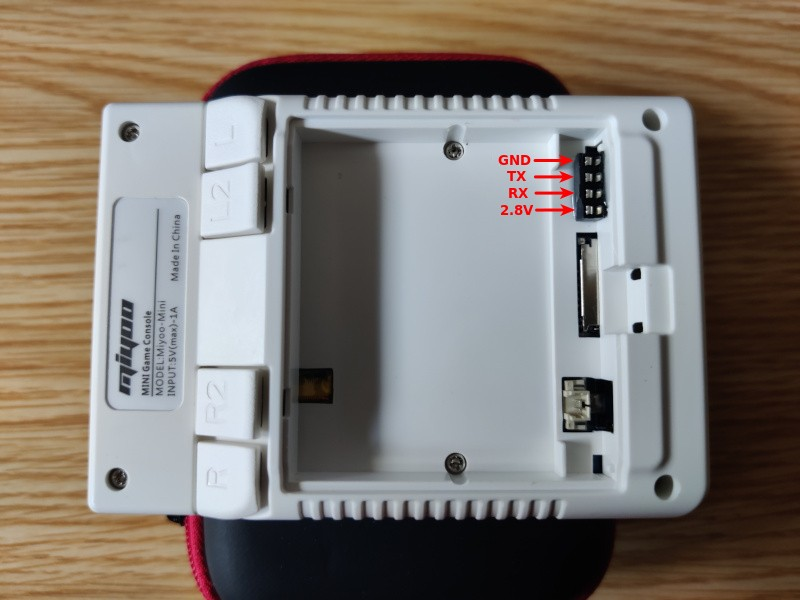

## Connection

To connect to the UART port just exposed, we use the typical UART-USB adapter. In my case I use [this one](https://www.amazon.es/dp/B07BBPX8B8) which has quite a lot of possibilities. As client I use `screen` in Linux launched as follows since the port speed is 115200bps:

```bash
sudo screen /dev/ttyUSB0 115200 8N1
```

We will only use the GND, RX and TX pins, crossing the last two with those of the UART-USB adapter, that is to say wiring the RX of the device to the TX of the adapter and vice versa. Although we do not use the power supply line (2.8V in this device), we will configure the UART-USB adapter to 3.3V so that the signal levels that travel by RX/TX are as similar as possible.

An example:

<iframe width="806" height="453" src="https://www.youtube.com/embed/Df2k8gsOvtM" title="Miyoo Mini UART session" frameborder="0" allow="accelerometer; autoplay; clipboard-write; encrypted-media; gyroscope; picture-in-picture" allowfullscreen></iframe>