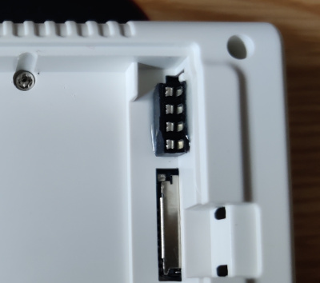
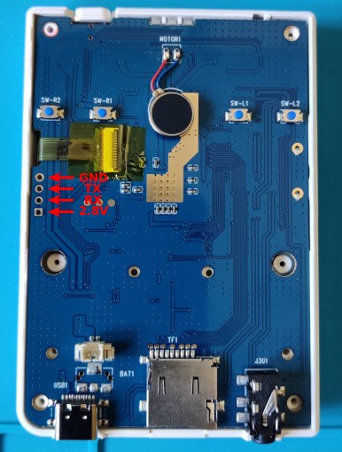
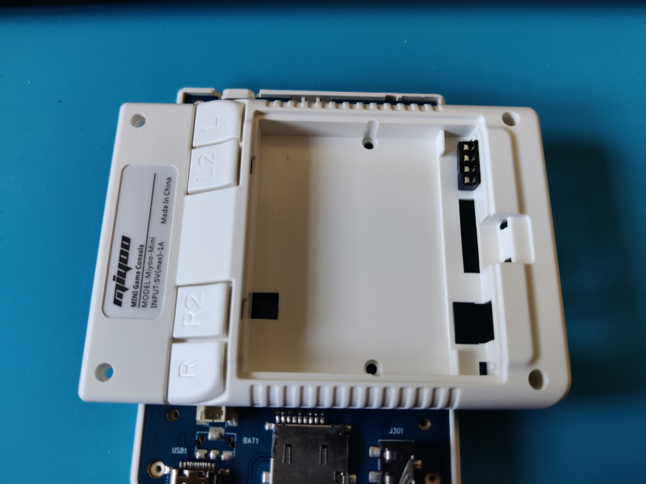
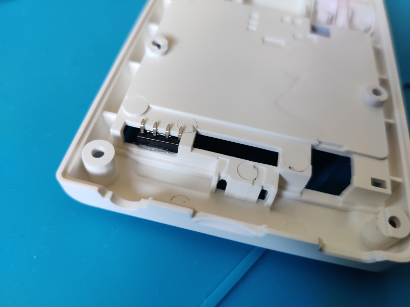
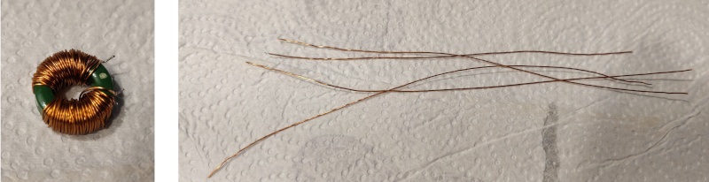
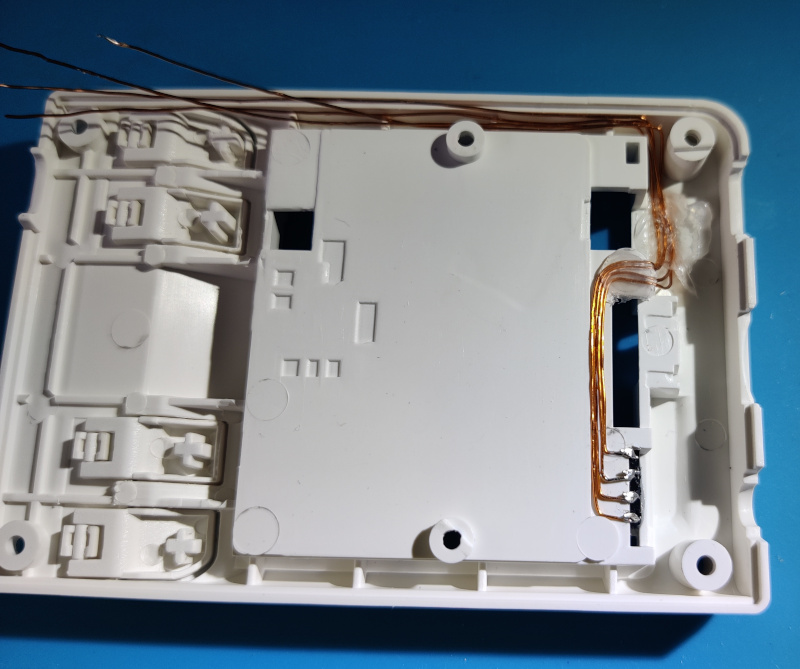
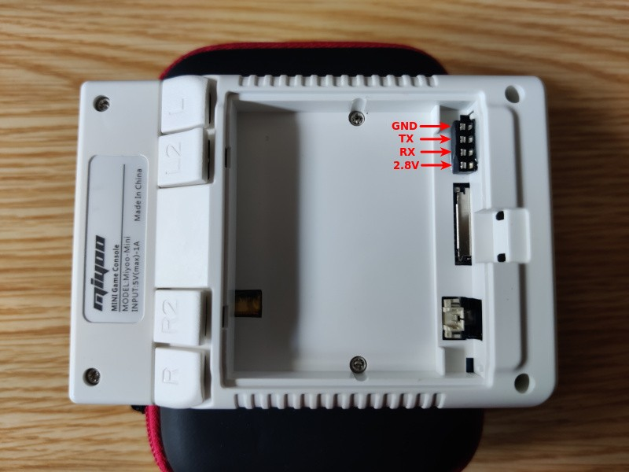

title: Miyoo Mini UART
summary: Extracción de puerto UART para tener acceso a la terminal del sistema.
image: images/posts/2022-08-08_mmiyoo_uart/mmiyoo_uart.jpg
date: 2022-08-08 17:00:00



En este artículo vamos a ver una modificación de la retroconsola de emulación Miyoo Mini para extraer el puerto UART que existe en la PCB y así poder tener acceso a él sin abrir la carcasa. Dicho puerto UART además está conectado con una terminal del sistema, lo que nos ayudará mucho durante el desarrollo o la personalización del sistema de la consola.

Antes de empezar con el procedimiento, comentar que la modificación no es sencilla. Al ser una máquina tan pequeña, hay poco espacio para pasar cables o situar el conector exterior.

## Procedimiento

1. Abrimos la consola. Encontraremos los pads del puerto UART bajo la salida de la cinta de datos de la pantalla.

    

2. Buscamos un sitio donde poder colocar algún tipo de puerto con 3 ó 4 pines. Realmente con 3 es suficiente, pero ya que estamos haciendo la modificación, intentaremos rutear los 4 pines del puerto completo. Encontramos que hay un espacio (en la v2 de la Miyoo Mini) en el compartimento de la batería donde se puede colocar medio zócalo de 2x4 cortado por la mitad de manera que quede una tira de 4 pines hembra. Las tiras de pin hembra tradicionales son demasiado altas por lo que no se podría cerrar la tapa de la batería. Aquí vemos el zócalo antes y después de partirlo por la mitad (realmente en la foto de la izquierda ya estaba cortado, pero he apoyado las dos mitades para que se entienda de dónde ha salido la pieza).

    

3. La mini tira de pin hembra que hemos fabricado encaja perfectamente en la posición que se muestra en la foto.

    

4. Pegamos la mini tira de pin con resina epoxi.

    

5. Por el lado interior de la carcasa tenemos que doblar los pines del zócalo para que no colisionen con la PCB (como comentábamos al principio, el interior de la consola está muy bien aprovechado).

    

6. Comienza la fase más complicada del proceso. Como hemos comentado ya, hay muy poco espacio libre en el interior de la consola. Por ejemplo la carcasa a la que acabamos de pegar el mini zócalo está completamente apoyada en la PCB en toda la superficie del hueco donde se aloja la batería. Vamos pues a rutear las conexiones rodeando este hueco. Aún así el espacio es reducido, por lo que optamos por utilizar cables barnizados en lugar de hilos con envoltura PVC tradicional. El cable barnizado además al ser de un sólo hilo, nos ayudará a enrutarlo, ya que una vez deformado, conserva su forma. Buscamos el cable barnizado por ejemplo en un viejo alimentador de portátil estropeado. Es seguro que al menos contendrá cable barnizado en el transformador, pero al abrirlo encontramos los tres bobinados que señalamos en la foto (el transformador es el de la derecha).

    

7. Finalmente escogemos la bobina que tiene un espesor de cable intermedio (no desmonté el transformador, pero seguro que habría tenido el cable más fino). De ella extraemos 4 fragmentos de unos 12cm. Hay que recordar que al ser cable barnizado, habrá que rascar o disolver de alguna forma el barniz en los extremos para que podamos soldar. El raspado se puede hacer con una cuchilla o con papel de lija.

    

8. Comienza ahora sí la parte más laboriosa. Empezamos soldando los cuatro cables a los pines del zócalo. Curvamos los cables con la forma de los pines doblados del zócalo para que haya más superficie de contacto para la soldadura. En la foto no aparece porque se instaló al final, pero es muy conveniente cubrir las soldaduras con cinta aislante o mejor cinta Kapton (que es más fina), para evitar que éstas arañen la PCB y terminen provocando un puente. Es más sencillo colocar la cinta sobre la PCB, pero en ese caso tendremos que estimar a ojo la zona a cubrir, aunque no hay problema en poner más cinta de la cuenta para asegurar la operación.

    

9. Ahora sí, con paciencia vamos enrutando los cables, dando forma con unas pinzas o alicates finos y fijándolos de vez en cuando con cola caliente por ejemplo.

    

10. Cuando nos acerquemos a la posición final de los cables, los cortaremos escalonadamente (averiguando cual es cual respecto de las soldaduras del zócalo con el polímetro en modo continuidad). También haremos un pequeño doblez que será el que introduciremos en los pads del puerto en la PCB. Hay que recordar que de nuevo tendremos que retirar el barniz de este extremo de los cables, lo que haremos preferentemente antes de hacer el doblez.

    

11. Sólo resta hacer las soldaduras en la PCB.

    

12. Ya podemos cerrar la consola. Hay que vigilar los cables que discurren cerca del labio que hay entre las dos mitades de la carcasa para evitar que pillemos alguno de ellos. Ya tenemos nuestro puerto UART a la vista.

    

## Conexión

Para conectar al puerto UART recien expuesto, utilizamos el típico adaptador UART-USB. En mi caso utilizo [éste](https://www.amazon.es/dp/B07BBPX8B8) que tiene bastantes posibilidades. Como cliente utilizo `screen` lanzado de la siguiente forma ya que la velocidad del puerto es 115200bps:

```bash
sudo screen /dev/ttyUSB0 115200 8N1
```

Sólo utilizaremos los pines GND, RX y TX, cruzando los dos últimos con los del adaptador UART-USB, es decir cableando el RX de la consola al TX del adaptador y viceversa. Aunque no utilizamos la línea de alimentación (2.8V en esta consola), configuraremos el adaptador UART-USB a 3.3V para que los niveles de señal que viajan por RX/TX sean lo más parecidos posible.

Un ejemplo:

<iframe width="806" height="453" src="https://www.youtube.com/embed/Df2k8gsOvtM" title="Miyoo Mini UART session" frameborder="0" allow="accelerometer; autoplay; clipboard-write; encrypted-media; gyroscope; picture-in-picture" allowfullscreen></iframe>