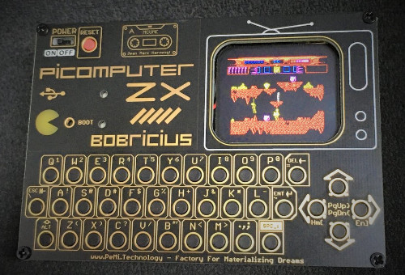

title: Picomputer ZX
summary: Assembling a kit to build a handheld ZX Spectrum.
date: 2012-09-09 12:00:00
draft: true

## Components

|Quantity|Component|Purchase link|Price|
|:-------|:---------|:------------|:----|
|1|Waveshare RP2040-Plus 4MB|https://www.waveshare.com/product/rp2040-plus.htm|€8.56 + shipping|

* 37x [Tactile switch 7x6x6 (DTS63K)](https://es.aliexpress.com/item/32854062885.html)
* 1x [SD Card reader](https://www.aliexpress.com/item/32802051702.html)
* 1x [1.69" TFT display](https://www.aliexpress.com/item/1005004721706705.html)
* 1x [LPT1109DS buzzer](https://www.aliexpress.com/item/1005003481223193.html)
* 1x [BSS123 transistor](https://www.aliexpress.com/item/32874888412.html)
* 1x [10Ω 0603 resistor](https://www.aliexpress.com/item/1005001436923851.html)
* 1x [4k7Ω 0603 resistor](https://www.aliexpress.com/item/1005001436923851.html)
* 1x [JS202011CQN switch](https://www.aliexpress.com/item/1005004336997724.html)

## Firmware

https://github.com/fruit-bat/pico-zxspectrum/raw/main/uf2/ZxSpectrumPicomputerZX.uf2