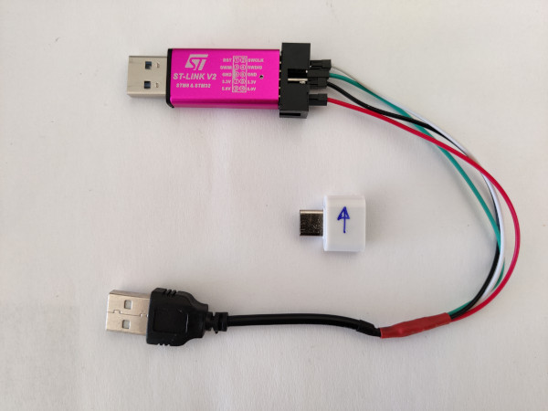

title: G&W Zelda hack
summary: Desbloqueo del firmware de la G&W Zelda.
date: 2012-09-09 12:00:00
draft: true


Un conocido fabricante japonés de videojuegos empezó a distribuir hace algo más de dos años, un par de máquinas replicando el aspecto de algunas de las viejas G&W, sobre la base de un STM32H7 que ejecuta un firmware baremetal con emuladores de NES y GB, tres juegos clásicos y una aplicación reloj inspirados en la franquicia Zelda. La máquina resulta muy interesante por las virtudes de estar basada en un microcontrolador, en lugar de un microprocesador, es decir gran duración de la pequeña batería que contiene (la de un joycon de Switch), arranque y modo suspensión instantáneos. El soporte de datos es un pequeño chip flash NOR de 4MB, suficiente para alojar los emuladores y juegos mencionados, pero muy escaso si se quiere sacar partido de la máquina y de su relativamente potente microcontrolador.

El firmware original sirve para comprobar la solvencia de la plataforma para emular al menos las máquinas de 8 bit que funcionan originalmente, por lo que en seguida el dispositivo resultó atractivo para la comunidad hacker. Al poco tiempo de empezar a comercializarse ya aparecieron procedimientos para modificar la máquina de manera que se pudieran instalar más emuladores y juegos. Lo más habitual es sustituir el chip flash por otro de 64MB, y los emuladores soportados en la actualidad son:

* Amstrad CPC6128
* Atari 7800
* ColecoVision
* Gameboy / Gameboy Color
* G&W / LCD Games
* MSX1/2/2+
* NES
* PC Engine / TurboGrafx-16
* Sega Game Gear
* Sega Genesis / Megadrive
* Sega Master System
* Sega SG-1000
* Watara Supervision

En este artículo vamos a ver los pasos para realizar esta modificación.

## Modificación hardware

Toda la modificación del software se hace a través del puerto SWD que habitualmente tienen los microcontroladores STM32 para programar su memoria flash interna y depurar los desarrollos. Este puerto SWD se encuentra en la PCB sin poblar, es decir sin pines o conectores soldados.


Para hacer la conexión con dicho puerto hay varias opciones:

* Soldar cables directamente.
* Introducir cables limpios inclinándolos para que hagan contacto y sujetándolos con cinta adhesiva para que se mantenga el contacto.
* Utilizar [pinzas sonda de conexión](https://www.amazon.es/gp/product/B009UOHE1K/) especializadas.
* Utilizar [pinzas pogo pin](https://es.aliexpress.com/item/1005004869027755.html) (1.27mm Single row5P).
* Rutear los pines SWDIO y SWCLK hacia el puerto USB-C.

Como mi interés por esta máquina más que para jugar es para experimentar con ella, me decido por realizar el ruteado del puerto SWD al USB-C. Este último puerto sólo tiene conectados los pines de alimentación ya que está previsto únicamente para cargar la máquina. Por tanto se pueden utilizar los pines D+ y D- que están libres para cablearlos a los pines SWDIO y SWCLK que son los únicos imprescindibles del puerto SWD. Necesitaremos también conectar a 5V y GND, pero estos ya se encuentran cableados en el puerto USB-C. El ruteado se hace con un fino cable barnizado de los que se utilizan para construir bobinas. La soldadura a los dos pines centrales del puerto USB-C que son los que corresponden a D+ y D- es complicada al tener un paso muy pequeño, pero con paciencia y flux puede lograrse.


Una vez resuelto la única parte difícil del procedimiento, es decir soldar los cables al puerto USB, se van sujetando cada cierta distancia con cinta Kapton y dirigiendo hacia la zona de la batería por donde se aprovecha el rebaje a ambos lados que hay del alojamiento que la rodea para pasar uno de los cables. El otro se conduce por el espacio que hay entre alojamiento de la batería y la PCB. De esta forma se consigue que ambos cables no puedan tocarse, aunque en teoría al estar barnizados no debería haber problema, se adopta este camino separado como precaución adicional.


Una vez que los cables alcanzan las proximidades del puerto SWD, se utilizan los dos test pads que pueden verse en la foto para realizar las soldaduras.


La correspondencia entre D+ y D- en el puerto USB-C con los SWDIO y SWCLK del puerto SWD, puede hacerse de cualquier forma siempre que tengamos claro donde está cada cual para más tarde hacer el adaptador USB-SWD que necesitaremos. En este montaje se ha optado por la siguiente correspondencia.

* D+ ↔ SWDIO
* D- ↔ SWCLK

!!! Warning
    La idea en un principio era adoptar la correspondencia utilizada en [esta otra guía](https://facelesstech.wordpress.com/2022/01/08/game-and-watch-hacking-with-rpi/), pero por un error cometido al principio, se terminó haciendo justo al revés. Como se comentaba antes, en realidad no es problema siempre que se tenga claro cómo están hechas las conexiones. Este aviso es sólo por si alguien intenta seguir ambas guías de forma simultánea, para que se tenga en cuenta dicha diferencia.

Una vez hecho el ruteado del puerto, necesitaremos construir el adaptador para poder extraer las señales SWDIO y SWCLK del puerto USB-C. Para ello se corta un cable USB-A convencional para tener acceso a los cuatro cables que contiene por separado y se sueldan a ellos conectores hembra de pin. El adaptador se completa con un adaptador USB-A a USB-C que se marca para orientarlo correctamente cuando lo vayamos a utilizar, ya que sólo hemos ruteado los pines D+ y D- de uno de los dos lados (el puerto USB-C es simétrico).


Los colores de los cables suelen estar estandarizados de la siguiente forma:

* Rojo: 5V
* Negro: GND
* Verde: D+
* Blanco: D-

## Sistema operativo de trabajo

Antes de empezar con el procedimiento de desbloqueo y programación propiamente dicho, unos comentarios sobre la plataforma de trabajo. Hay varias posibilidades y desafortunadamente cada una de ellas tiene sus propios problemas. En general todos los repositorios que se verán más adelante están diseñados para trabajar en Linux. Se puede trabajar sobre Windows utilizando máquinas virtuales y desde MacOS adaptando algunos pasos de los procedimientos, pero ninguno de estos caminos fueron probados durante la elaboración de esta guía. Aquí se ha utilizado únicamente la vía de Linux, ya sea en un PC convencional (con Ubuntu 22.04) o en una Raspberry Pi 3+ (con Raspbian Bullseye 32 y 64 bit). A continuación se detalla las plataformas utilizadas y los problemas fundamentales que tiene cada una de ellas:

* PC - Ubuntu 22.04: Sólo se puede utilizar un programador STLink v2. Desgraciadamente las versiones clónicas suelen funcionar mal y ese fue el caso durante las pruebas realizadas aquí.
* Raspberry Pi - Raspbian Bullseye 32bit: No se encuentra compilado el paquete `gcc-arm-none-eabi` en versión 10 o superior que se necesita y compilarlo sobre una Raspberry Pi 3 es complicado y sobre todo lento.
* Raspberry Pi - Raspbian Bullseye 64bit: No es fácil instalar las dependencias del repositorio [game-and-watch-patch](https://github.com/BrianPugh/game-and-watch-patch), en concreto el módulo Python `keystone-engine` (hay que utilizar memoria virtual para que no se agote la memoria durante la compilación y se producen errores que requieren modificar las fuentes).

En general la mejor opción es la primera, ya que no sólo contamos con la mayor potencia de un PC para compilar, sino que la programación por STLink es mucho más rápida. En caso de utilizar la vía de Raspberry Pi (por no tener un buen programador STLink fundamentalmente), si no se va a utilizar el repositorio [game-and-watch-patch](https://github.com/BrianPugh/game-and-watch-patch) para hacer dual boot, es mucho más sencillo realizar el procedimiento sobre Raspbian 64bit, ya que encontraremos el compilador `gcc-arm-none-eabi` en formato binario.

En todo caso aquí se van a dar instrucciones para las tres vías consideradas y posibles soluciones a algunos de los problemas encontrados.

## Entorno PC - Ubuntu 22.04

#### Conexión

Empezamos haciendo la conexión del programador con el adaptador realizado. El cableado es el siguiente:

* Rojo: 5V
* Negro: GND
* Verde: SWDIO
* Blanco: SWCLK



#### Preparación entorno

No estoy seguro de si es necesario, ya que no hubo suerte con el STLink v2 clónico adquirido, pero creo que es necesario parchear el firmware del mismo siguiendo alguna de las opciones de [esta guía](https://www.schuerewegen.tk/download/stlink_v2_clone_hardware_reset_patch_v5.txt) (en mi caso pude seguir el método #2 sin problemas).

Empezamos instalando algunos requisitos:

```
sudo apt update
sudo apt upgrade
sudo apt install libnewlib-arm-none-eabi build-essential git python3-pip libncurses-dev binutils-arm-none-eabi python3 libhidapi-hidraw0 libftdi1 libftdi1-2 libjaylink-dev
```

Crear el fichero `/etc/udev/rules.d/49-stlinkv2.rules` con el siguiente contenido:

```
# stm32 discovery boards, with onboard st/linkv2
# ie, STM32L, STM32F4.

SUBSYSTEMS=="usb", ATTRS{idVendor}=="0483", ATTRS{idProduct}=="3748", \
    MODE:="0666", \
    SYMLINK+="stlinkv2_%n"

# If you share your linux system with other users, or just don't like the
# idea of write permission for everybody, you can replace MODE:="0666" with
# OWNER:="yourusername" to create the device owned by you, or with
# GROUP:="somegroupname" and mange access using standard unix groups.
```

Instalar compilador cruzado:

```
mkdir ~/gnw
cd ~/gnw
wget https://armkeil.blob.core.windows.net/developer/Files/downloads/gnu-rm/10.3-2021.10/gcc-arm-none-eabi-10.3-2021.10-x86_64-linux.tar.bz2
sudo tar xjf gcc-arm-none-eabi-10.3-2021.10-x86_64-linux.tar.bz2 -C /usr/share
```

Instalar OpenOCD parcheado. El commit utilizado duante la elaboración de esta guía es el [9a464c4](https://github.com/kbeckmann/ubuntu-openocd-git-builder/commit/9a464c45a746e13dcea41d2b734e0001ecc67c14):

```
git clone https://github.com/kbeckmann/ubuntu-openocd-git-builder.git
cd ubuntu-openocd-git-builder
./build.sh
sudo dpkg -i openocd-git_0.12.0-40-gcda39f929_amd64.deb
```

Ajustar variables de entorno globales (este paso será necesario realizarlo cada vez que cambiemos de sesión):

```
export ADAPTER=stlink
export OPENOCD="/opt/openocd-git/bin/openocd"
export GCC_PATH=/usr/share/gcc-arm-none-eabi-10.3-2021.10/bin
```

Desbloquear consola. Los 5 scripts que hay que ejecutar emiten mensajes muy explícitos por consola que habrá que seguir al pie de la letra. El commit utilizado duante la elaboración de esta guía es el [7d99781](https://github.com/ghidraninja/game-and-watch-backup/commit/7d99781f9081d86bacf976c282ddf4ee2803a266):

```
cd ~/gnw
git clone https://github.com/ghidraninja/game-and-watch-backup.git
cd game-and-watch-backup

./1_sanity_check.sh rpi zelda
./2_backup_flash.sh rpi zelda
./3_backup_internal_flash.sh rpi zelda
./4_unlock_device.sh rpi zelda
./5_restore.sh rpi zelda
```

Instalar RetroGo. El commit utilizado duante la elaboración de esta guía es el [682b60e](https://github.com/sylverb/game-and-watch-retro-go/commit/682b60ec73055ebd6738a036d9b243beaea0b2c2):

```
cd ~/gnw
git clone --recurse-submodules https://github.com/sylverb/game-and-watch-retro-go
cd game-and-watch-retro-go
pip install -r requirements.txt
```

Copiar las ROMs que se quieren instalar en el directorio `~/gnw/game-and-watch-retro-go/roms` en los directorios correspondientes a cada sistema y compilar:

```
make clean GNW_TARGET=zelda
make romdef GNW_TARGET=zelda
make COVERFLOW=1 JPG_QUALITY=90 COMPRESS=lzma GNW_TARGET=zelda EXTFLASH_SIZE_MB=64 PT_PT=0 FR_FR=0 IT_IT=0
```

Al final de la compilación se obtiene un informe del espacio ocupado por el binario resultante en la flash externa. Con esto se puede depurar la selección de ROMs hasta encontrar una combinación que quepa en el espacio disponible. Una vez que se encuentre una combinación válida (se recomienda dejar espacio para los savestates), flashear con el siguiente comando:

```
make flash COVERFLOW=1 JPG_QUALITY=90 COMPRESS=lzma GNW_TARGET=zelda EXTFLASH_SIZE_MB=64 PT_PT=0 FR_FR=0 IT_IT=0
```

## Documentación paletochan

bueno, el repositorio es un poco lioso, hay que saltar de un sitio a otro pero, ahora te pongo aqui lo que he conseguido usar con exito
Este el que lo hizo y su video: https://www.youtube.com/watch?v=Rsi8p5gbaps

el video es mas para documentarte que para usarlo
Este tipo tiene 2 videos de un tutorial: https://www.youtube.com/watch?v=mIJeOWxkfPs

es el que he seguido, mayormente para abrir la consola y hacer el backup por 1a vez
grupo de reddit con casi todos los links: https://www.reddit.com/r/GameAndWatchMods/wiki/index

Interesan al principio los de github, en este orden:
https://github.com/ghidraninja/game-and-watch-backup - para el 1er backup del firmware
https://github.com/kbeckmann/game-and-watch-retro-go para instalar por 1a vez retro-go en la memoria original

una vez que te has metido con esto, querras actualizar la memoria. Tiene tela. si te muestro como ha quedado la mia, lo flipas. pero mayormente la salve de una catastrofe ya que los concectores de la memoria de la pcb se me despegaron, y al menos 2 se rompieron. tirando de cable he recuperado la consola. que penita verla 😉
pero cerrada no se nota nada 😄
tienes este video del tipo de antes actualizando la memoria: https://www.youtube.com/watch?v=41VCfiRKWDI

pero este video tambien es muy bueno: https://www.youtube.com/watch?v=z2huEGAS0mc

y una vez que tienes la memoria mas grande, tienes que empezar a trabajar de otra forma. Mi idea ha sido tener el firmware original y retro-go a la vez. la consola se enciende como si nada hubiera cambiado pero al presionar Start+Left entras en retro-go. Genial. Y tengo caratulas. Para ello, he seguido los pasos de este repo: https://github.com/olderzeus/game-and-watch-retro-go/tree/NewUI

eso si, no consigo que me funcione solo siguiendo los pasos. Tengo conflictos con el firmware original cuando tengo instalado el de las caratulas 1o. Lo he solucionado instalando retro-go sin caratulas (el link que mencione antes) y firmware original juntos. una vez eso funciona, sobreescribo el firmware de retro-go con el de las caratulas y ya lo tengo todo funcionando
y hasta aqui he llegado 🙂
ahora estoy intentando meter las roms de Game&Watch. Tenia las de extension .mgw pero no son compatibles. hay que meter las que hay dentro del romset the MAME (gnw_*.zip). Las he encontrado pero tengo unos problemas de errores con el script asi que, aun estoy en ello (este es el repo para comprimir las roms https://github.com/bzhxx/LCD-Game-Emulator)
aparte de esto, aun no he investigado que mas hay. Seguro que Nino podria ayudar mas pasado este punto, es esta mucho mas avanzado que yo
y por ultimo, el servidor de discord: https://discord.gg/rE2nHVAKvn
ea 🙂

Y por fin he resuelto el problema de las roms de G&W. Parece que no podia crear yo mi propio artwork, necesitas un fichero que se llama default.lay para cada juego. He encontrado el artwork aqui: https://drive.google.com/drive/u/0/folders/1vl9O-0jIGCHHY_lrWpOwBtqTXEKsVGOY

## Enlaces:

* [Chips compatible G&W flash upgrade](https://www.reddit.com/r/GameAndWatchMods/wiki/flash-upgrade/)
* [Esquemático G&W Mario](https://github.com/Upcycle-Electronics/game-and-watch-hardware)
* [Links varios en Reddit](https://www.reddit.com/r/GameAndWatchMods/comments/mr8hxs/click_here_for_links/)
* [Links de Tim Schuerewegen](https://www.schuerewegen.tk/gnw/)
* [Personalización de defaults](https://www.reddit.com/r/GameAndWatchMods/comments/10kpwz5/making_your_own_defaults_for_retrogo_on/)
* ROMs G&W:
    * [LCD-Game-Shrinker](https://gist.github.com/DNA64/16fed499d6bd4664b78b4c0a9638e4ef)
    * [Artwork G&W hydef](https://drive.google.com/drive/folders/1IbSRYTfKoKDgZfJZTZdnKFSpBvCvgJZV)
    * [Artwork G&W hydef previews](https://drive.google.com/drive/folders/1aVBEWQsgY9UaJ0D-VrTzY80pUnYJ0jfY)
    * [Artwork G&W DarthMarino](https://drive.google.com/drive/u/0/folders/1vl9O-0jIGCHHY_lrWpOwBtqTXEKsVGOY)
* [Lista compatibilidad juegos MD](https://cryptpad.fr/sheet/#/2/sheet/edit/blA68Hq6JiCLdHR0St26pgho/)

Vídeo en español

* https://www.youtube.com/watch?v=FzyKdBgUUGc

Vídeos de RTC:

* https://www.youtube.com/watch?v=BFVnix-D600
* https://www.youtube.com/watch?v=Qrjg7XoVsko

Tutoriales:

* https://facelesstech.wordpress.com/2022/01/08/game-and-watch-hacking-with-rpi/
* https://community.element14.com/challenges-projects/project14/hacktheholidays/b/blog/posts/the-n-o-before-christmas-upgrade-time
* https://gist.github.com/DNA64/ae58ccdca9416e9eacb8cd392f5cb7fd
* Repositorios:
    * [backup y restore OFW](https://github.com/ghidraninja/game-and-watch-backup)
    * [retrogo](https://github.com/sylverb/game-and-watch-retro-go)
    * [parcheado OFW para dual boot](https://github.com/BrianPugh/game-and-watch-patch)

## Compilación en Raspi

```
sudo apt update -y
sudo apt upgrade -y
sudo apt install -y libnewlib-arm-none-eabi build-essential git python3-pip libncurses-dev binutils-arm-none-eabi python3 libhidapi-hidraw0 libftdi1 libftdi1-2 cmake

mkdir ~/gnw
cd ~/gnw
# En 32bit
# Bajar fichero gcc-arm-none-eabi-10.3-2023.01-armv7l-linux.tar.bz2 de https://mega.nz/file/P05U3ApL#mcD32Ru_2CojMdupsGky1MmEEIgSoJeg2-Y0HJV_j0g
sudo tar xjf gcc-arm-none-eabi-10.3-2023.01-armv7l-linux.tar.bz2 -C /usr/share
export GCC_PATH=/usr/share/gcc-arm-none-eabi-10.3-2023.01/bin

# En 64bit
wget https://armkeil.blob.core.windows.net/developer/Files/downloads/gnu-rm/10.3-2021.10/gcc-arm-none-eabi-10.3-2021.10-aarch64-linux.tar.bz2
sudo tar xjf gcc-arm-none-eabi-10.3-2021.10-aarch64-linux.tar.bz2 -C /usr/share
export GCC_PATH=/usr/share/gcc-arm-none-eabi-10.3-2021.10/bin

git clone https://github.com/kbeckmann/ubuntu-openocd-git-builder.git
cd ubuntu-openocd-git-builder
./build.sh
# En 32bit: openocd-git_0.12.0-rc3-1-gdfe57baa1_armhf.deb
sudo dpkg -i openocd-git_0.12.0-rc3-1-gdfe57baa1_arm64.deb

cd ~/gnw
git clone https://github.com/ghidraninja/game-and-watch-backup.git
cd game-and-watch-backup

export ADAPTER=rpi
export OPENOCD="/opt/openocd-git/bin/openocd"

./1_sanity_check.sh rpi zelda
./2_backup_flash.sh rpi zelda
./3_backup_internal_flash.sh rpi zelda
./4_unlock_device.sh rpi zelda
./5_restore.sh rpi zelda

cd ~/gnw
git clone --recurse-submodules https://github.com/sylverb/game-and-watch-retro-go
cd game-and-watch-retro-go
pip install -r requirements.txt
make clean GNW_TARGET=zelda
make romdef GNW_TARGET=zelda
make COVERFLOW=1 JPG_QUALITY=90 COMPRESS=lzma GNW_TARGET=zelda EXTFLASH_SIZE_MB=64 PT_PT=0 FR_FR=0 IT_IT=0
make flash COVERFLOW=1 JPG_QUALITY=90 COMPRESS=lzma GNW_TARGET=zelda EXTFLASH_SIZE_MB=64 PT_PT=0 FR_FR=0 IT_IT=0


External flash usage
    Capacity:     57884672 Bytes ( 55.203 MB)
    Usage:        49807529 Bytes ( 47.500 MB)
    Free:          8077143 Bytes (  7.703 MB)
```

## Compilación en Ubuntu

Parchear el firmware del STLink v2 siguiendo estos pasos:

```
# Method 2

Firmware "V2J37S7 STM8/STM32 Debugger".

1) Go to https://www.st.com/en/development-tools/stsw-link007.html.
2) Download "en.stsw-link007_V2-37-27.zip" and extract it.
3) Extract "com\st\stlinkupgrade\core\f2_3.bin" from "AllPlatforms\STLinkUpgrade.jar".
4) Patch "f2_3.bin".
5) Replace original "f2_3.bin" in .jar with patched version.
6) Double-click .jar to upgrade to patched firmware.

OR

1) Go to https://www.st.com/en/development-tools/stm32cubeprog.html.
2) Download "en.stm32cubeprg-win32_v2-7-0.zip" and install it.
3) Extract "com\st\stlinkupgrade\core\f2_3.bin" from "C:\Program Files (x86)\STMicroelectronics\STM32Cube\STM32CubeProgrammer\Drivers\FirmwareUpgrade\STLinkUpgrade.jar".
4) Patch "f2_3.bin".
5) Replace original "f2_3.bin" in .jar with patched version.
6) Double-click .jar to upgrade to patched firmware.

f2_3.bin (original)
00000970  01 94 8C 66 83 73 74 87 52 F4 C2 09 F9 69 A1 68
00000980  5C 90 84 57 BA 6A 7D 4A 2D 6C 23 FE B1 61 1A 8D
00001EF0  91 85 86 A3 FB CA 22 15 35 06 D7 73 21 24 B9 B1
00007890  7F 67 2E 5D 10 CD 3F 52 A1 68 5D 09 D6 91 48 86
000078A0  3D 87 1B D6 44 E0 10 44 B8 2C 94 7C 69 28 7E 00

f2_3.bin (patched)
00000970  26 44 00 F1 4B 73 D0 A1 49 B2 5B 7A 54 E6 D5 6D
00000980  74 5E 06 92 74 88 C4 3B 06 DB A9 90 D0 A1 45 26
00001EF0  B9 70 FE E0 FE E9 C5 BA B8 CF 23 50 7B E5 24 77
00007890  D0 FA AD 25 19 A8 10 B0 04 57 62 28 A6 E5 4C B5
000078A0  83 BA 91 00 42 4E E4 57 7D F4 57 E9 F6 E3 F8 38
```

Crear el fichero `/etc/udev/rules.d/49-stlinkv2.rules` con el siguiente contenido:

```
# stm32 discovery boards, with onboard st/linkv2
# ie, STM32L, STM32F4.

SUBSYSTEMS=="usb", ATTRS{idVendor}=="0483", ATTRS{idProduct}=="3748", \
    MODE:="0666", \
    SYMLINK+="stlinkv2_%n"

# If you share your linux system with other users, or just don't like the
# idea of write permission for everybody, you can replace MODE:="0666" with
# OWNER:="yourusername" to create the device owned by you, or with
# GROUP:="somegroupname" and mange access using standard unix groups.
```


```
sudo apt update
sudo apt upgrade
sudo apt install libnewlib-arm-none-eabi build-essential git python3-pip libncurses-dev binutils-arm-none-eabi python3 libhidapi-hidraw0 libftdi1 libftdi1-2 libjaylink-dev

mkdir ~/gnw
cd ~/gnw
wget https://armkeil.blob.core.windows.net/developer/Files/downloads/gnu-rm/10.3-2021.10/gcc-arm-none-eabi-10.3-2021.10-x86_64-linux.tar.bz2
sudo tar xjf gcc-arm-none-eabi-10.3-2021.10-x86_64-linux.tar.bz2 -C /usr/share

git clone https://github.com/kbeckmann/ubuntu-openocd-git-builder.git
cd ubuntu-openocd-git-builder
./build.sh
sudo dpkg -i openocd-git_0.12.0-40-gcda39f929_amd64.deb

cd ~/gnw
git clone https://github.com/ghidraninja/game-and-watch-backup.git
cd game-and-watch-backup

export ADAPTER=stlink
export OPENOCD="/opt/openocd-git/bin/openocd"
export GCC_PATH=/usr/share/gcc-arm-none-eabi-10.3-2021.10/bin

./1_sanity_check.sh rpi zelda
./2_backup_flash.sh rpi zelda
./3_backup_internal_flash.sh rpi zelda
./4_unlock_device.sh rpi zelda
./5_restore.sh rpi zelda

cd ~/gnw
git clone --recurse-submodules https://github.com/sylverb/game-and-watch-retro-go
cd game-and-watch-retro-go
pip install -r requirements.txt
make clean GNW_TARGET=zelda
make romdef GNW_TARGET=zelda
make COVERFLOW=1 JPG_QUALITY=90 COMPRESS=lzma GNW_TARGET=zelda EXTFLASH_SIZE_MB=64 PT_PT=0 FR_FR=0 IT_IT=0
make flash COVERFLOW=1 JPG_QUALITY=90 COMPRESS=lzma GNW_TARGET=zelda EXTFLASH_SIZE_MB=64 PT_PT=0 FR_FR=0 IT_IT=0
```

## Con OFW en Raspi

```
# Ampliación swap
sudo dphys-swapfile swapoff
sudo vi /etc/dphys-swapfile
# Cambiar: CONF_SWAPSIZE=1024
sudo dphys-swapfile setup
sudo dphys-swapfile swapon
reboot

# Instalación keystone-engine
wget https://files.pythonhosted.org/packages/0a/65/3a2e7e55cc1db188869bbbacee60036828330e0ce57fc5f05a3167ab4b4d/keystone-engine-0.9.2.tar.gz
tar -zxvf keystone-engine-0.9.2.tar.gz
cd keystone-engine-0.9.2
# »»»» Edit line 114 in setup.py:
# obj_dir = os.path.join(BUILD_DIR, 'llvm', 'lib', 'arm-linux-gnueabihf')
pip install --upgrade pip
pip install .

cd ~/gnw
git clone https://github.com/BrianPugh/game-and-watch-patch.git
cd game-and-watch-patch
pip install -r requirements.txt
make download_sdk
<copia de flash_backup_zelda.bin y internal_flash_backup_zelda.bin a este directorio>
make clean
make PATCH_PARAMS="--device=zelda" LARGE_FLASH=1 flash_patched
cd ~/gnw/game-and-watch-retro-go
make clean GNW_TARGET=zelda
make romdef GNW_TARGET=zelda
make flash COVERFLOW=1 JPG_QUALITY=90 COMPRESS=lzma GNW_TARGET=zelda EXTFLASH_SIZE_MB=60 EXTFLASH_OFFSET=4194304 INTFLASH_BANK=2
```

## Respaldo de savestates

Guardar copia de `build/gw_retro_go.elf`

```
cd ~/gnw/game-and-watch-retro-go
scripts/saves_backup.sh build/gw_retro_go.elf
```

Los savestates quedan en `~/gnw/game-and-watch-retro-go/save_states`.


So found out you can extract your battery save .srm from the .save file from your G&W. Make sure to create a in game battery save then do a retro go save. Back that up then run this dd command
dd if=game.save skip=53248 bs=1 of=game.srm


## Restauración de savestates

Utilizar copia de `build/gw_retro_go.elf`. Los savestates tienen que estar en `~/gnw/game-and-watch-retro-go/save_states` y coincidir los nombres con los de las ROMs.

```
cd ~/gnw/game-and-watch-retro-go
scripts/saves_restore.sh build/gw_retro_go.elf
```

## Lista juegos G&W

```
gnw_ball.zip        Game & Watch Ball.gw                                        OK
gnw_bfightn.zip     Game & Watch Balloon Fight (New Wide Screen).gw             OK
gnw_bfight.zip      Game & Watch Balloon Fight (Crystal Screen).gw              OK
gnw_bjack.zip       Game & Watch Black Jack.gw                                  OK
gnw_boxing.zip      Micro Vs. System Boxing.gw                                  OK
gnw_bsweep.zip      Game & Watch Bomb Sweeper.gw                                OK
gnw_chef.zip        Game & Watch Chef.gw                                        OK
gnw_climbern.zip    Game & Watch Climber (New Wide Screen).gw                   OK
gnw_climber.zip     Game & Watch Climber (Crystal Screen).gw                    OK
gnw_dkcirc.zip      Game & Watch Donkey Kong Circus.gw                          OK
gnw_dkhockey.zip    Micro Vs. System Donkey Kong Hockey.gw                      OK
gnw_dkjrp.zip       Game & Watch Donkey Kong Jr. (Panorama Screen).gw           OK
gnw_dkjr.zip        Game & Watch Donkey Kong Jr. (New Wide Screen).gw           OK
gnw_dkong2.zip      Game & Watch Donkey Kong II.gw                              OK
gnw_dkong3.zip      Micro Vs. System Donkey Kong 3.gw                           OK
gnw_dkong.zip       Game & Watch Donkey Kong.gw                                 OK
gnw_egg.zip         Game & Watch Egg.gw                                         OK (fallan controles al principio)
gnw_fireatk.zip     Game & Watch Fire Attack.gw                                 OK (fallan controles al principio)
gnw_fires.zip       Game & Watch Fire (Silver).gw                               OK
gnw_fire.zip        Game & Watch Fire (Wide Screen).gw                          OK
gnw_flagman.zip     Game & Watch Flagman.gw                                     OK
gnw_gcliff.zip      Game & Watch Gold Cliff.gw                                  OK
gnw_ghouse.zip      Game & Watch Green House.gw                                 OK
gnw_helmet.zip      Game & Watch Helmet (CN-17 version).gw                      OK
gnw_judge.zip       Game & Watch Judge (green version).gw                       ??
gnw_lboat.zip       Game & Watch Life Boat.gw                                   OK
gnw_lion.zip        Game & Watch Lion.gw                                        OK
gnw_manholeg.zip    Game & Watch Manhole (Gold).gw                              OK
gnw_manhole.zip     Game & Watch Manhole (New Wide Screen).gw                   OK (fallan controles al principio)
gnw_mariocm.zip     Game & Watch Mario's Cement Factory (New Wide Screen).gw    OK
gnw_mariotj.zip     Game & Watch Mario The Juggler.gw                           OK
gnw_mario.zip       Game & Watch Mario Bros..gw                                 OK
gnw_mbaway.zip      Game & Watch Mario'\''s Bombs Away.gw                       OK
gnw_mickdon.zip     Game & Watch Mickey & Donald.gw                             OK
gnw_mmousep.zip     Game & Watch Mickey Mouse (Panorama Screen).gw              OK
gnw_mmouse.zip      Game & Watch Mickey Mouse (Wide Screen).gw                  OK (fallan controles al principio)
gnw_octopus.zip     Game & Watch Octopus.gw                                     OK
gnw_opanic.zip      Game & Watch Oil Panic.gw                                   OK
gnw_pchute.zip      Game & Watch Parachute.gw                                   OK
gnw_popeye.zip      Game & Watch Popeye (Wide Screen).gw                        OK
gnw_rshower.zip     Game & Watch Rain Shower.gw                                 OK
gnw_sbuster.zip     Game & Watch Safe Buster.gw                                 OK
gnw_smbn.zip        Game & Watch Super Mario Bros. (Crystal Screen).gw          OK
gnw_smb.zip         Game & Watch Super Mario Bros. (New Wide Screen).gw         OK
gnw_squish.zip      Game & Watch Squish.gw                                      OK
gnw_ssparky.zip     Game & Watch Spitball Sparky.gw                             OK
gnw_stennis.zip     Game & Watch Snoopy Tennis.gw                               OK
gnw_tbridge.zip     Game & Watch Turtle Bridge.gw                               OK
gnw_tfish.zip       Game & Watch Tropical Fish.gw                               OK
gnw_vermin.zip      Game & Watch Vermin.gw                                      OK
gnw_zelda.zip       Game & Watch Zelda.gw                                       OK
```

## ROMs que no funcionan

* MD: Virtua Racing
* SMS: Fantasy zone ii
* SMS: Golden axe
* SMS: Outrun
* SMS: Space harrier
* GB: Battletoads
* Coleco: Frogger I
* A7800: Super skate boarding
* NES: Micromachines
* NES: Battletoads
* MD: Landstalker - The Treasures of King Nole (da error al comprimir)

## Controles

Holding the `PAUSE/SET` button while pressing other buttons have the following actions:

| Button combination           | Action                                                                 |
| ---------------------------- | ---------------------------------------------------------------------- |
| `PAUSE/SET` + `GAME`         | Store a screenshot. (Disabled by default on 1MB flash builds)          |
| `PAUSE/SET` + `TIME`         | Toggle speedup between 1x and the last non-1x speed. Defaults to 1.5x. |
| `PAUSE/SET` + `UP`           | Brightness up.                                                         |
| `PAUSE/SET` + `DOWN`         | Brightness down.                                                       |
| `PAUSE/SET` + `RIGHT`        | Volume up.                                                             |
| `PAUSE/SET` + `LEFT`         | Volume down.                                                           |
| `PAUSE/SET` + `B`            | Load state.                                                            |
| `PAUSE/SET` + `A`            | Save state.                                                            |
| `PAUSE/SET` + `POWER`        | Poweroff WITHOUT save-stating.                                         |
| `PAUSE/SET` + `Up` + `POWER` | Mantener durante 4 segundos para Factory Reset.                        |
