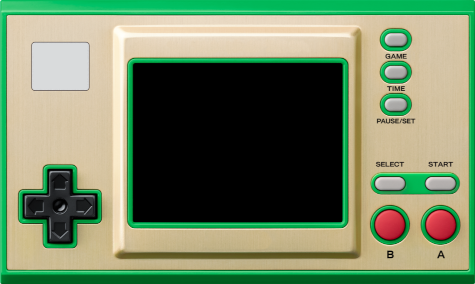
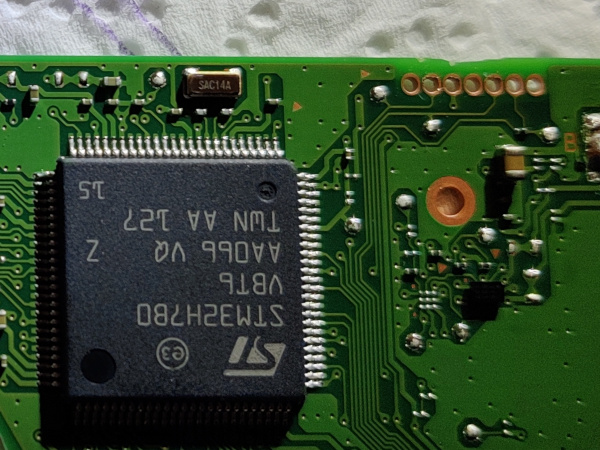
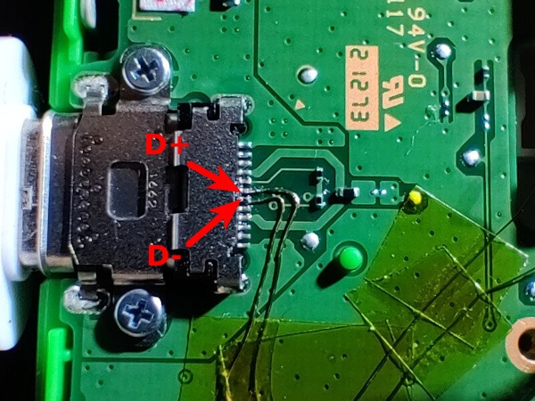
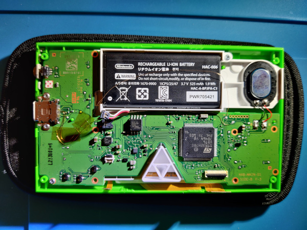
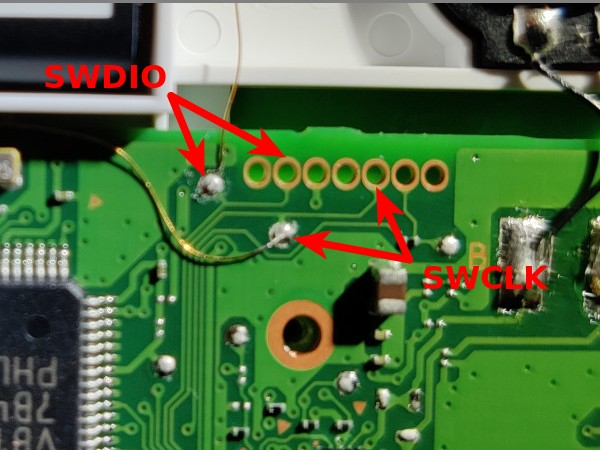
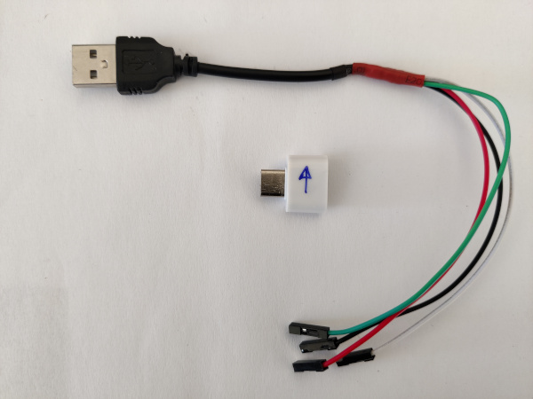
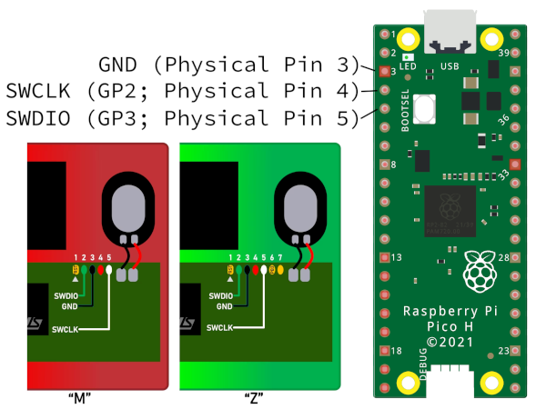

title: G&W Zelda hack
summary: Desbloqueo del firmware de la G&W Zelda.
date: 2022-09-09 12:00:00
draft: true



Un conocido fabricante japonés de videojuegos empezó a distribuir en 2022, un par de máquinas replicando el aspecto de algunas de las viejas G&W, sobre la base de un STM32H7 que ejecuta un firmware baremetal con emuladores de NES y GB, tres juegos clásicos y una aplicación reloj inspirados en la franquicia Zelda. La máquina resulta muy interesante por las virtudes de estar basada en un microcontrolador, en lugar de un microprocesador, es decir gran duración de la pequeña batería que contiene (la de un joycon de Switch), arranque y modo suspensión instantáneos. El soporte de datos es un pequeño chip flash NOR de 4MB (en el caso del modelo Zelda), suficiente para alojar los emuladores y juegos mencionados, pero muy escaso si se quiere sacar partido de la máquina y de su relativamente potente microcontrolador.

El firmware original sirve para comprobar la solvencia de la plataforma para emular al menos las máquinas de 8 bit que funcionan originalmente, por lo que en seguida el dispositivo resultó atractivo para la comunidad hacker. Al poco tiempo de empezar a comercializarse ya aparecieron procedimientos para modificar la máquina de manera que se pudieran instalar más emuladores y juegos.

La primera modificación importante propuesta por la comunidad consistía en sustituir el chip flash por otro de 64MB para disponer de más espacio para juegos y emuladores. Tiempo después la modificación evolucionó para incluir un slot de tarjetas microSD donde almacenar los juegos y savestates, convirtiendo a la máquina así modificada en una máquina de emulación portátil inigualable en aspectos como portabilidad, tamaño, duración de la batería y tiempos de arranque.

Con cualquiera de las dos modificaciones se consigue emular las siguientes máquinas:

* Amstrad CPC6128 (beta)
* Atari 2600
* Atari 7800
* ColecoVision
* Gameboy / Gameboy Color
* Game & Watch / LCD Games
* MSX1/2/2+
* Nintendo Entertainment System
* PC Engine / TurboGrafx-16
* Pokémon Mini
* Sega Game Gear
* Sega Genesis / Megadrive
* Sega Master System
* Sega SG-1000
* Tamagotchi P1
* Watara Supervision

En este artículo vamos a describir los pasos para realizar esta última modificación. En realidad se realizarán las dos modificaciones, dado que si se utiliza la tarjeta microSD, cada vez que carguemos un juego nuevo se grabará en el chip flash, y el original de 4MB soporta pocos ciclos de escritura dado que no estaba previsto que se utilizara de esta forma.

## Conexión al puerto SWD

El desbloqueo del procesador y la modificación del firmware se hacen a través del puerto SWD que habitualmente tienen los microcontroladores STM32 para programar su memoria flash interna y depurar los desarrollos. Este puerto SWD se encuentra en la PCB sin poblar, es decir sin pines o conectores soldados.



Para hacer la conexión con dicho puerto hay varias opciones:

* Soldar cables directamente.
* Introducir cables limpios inclinándolos para que hagan contacto y sujetándolos con cinta adhesiva para que se mantenga el contacto.
* Utilizar [pinzas sonda de conexión](https://www.amazon.es/gp/product/B009UOHE1K/) especializadas.
* Utilizar [pinzas pogo pin](https://es.aliexpress.com/item/1005004869027755.html) (1.27mm Single row5P).
* Rutear los pines SWDIO y SWCLK hacia el puerto USB-C.

#### Versión difícil

Como empecé a cacharrear con la máquina antes de que apareciera el mod de microSD, en su momento realicé el ruteado del puerto SWD al USB-C. Si se va a terminar realizando el mod de microSD no merece mucho la pena el esfuerzo, dado que a partir de entonces el flasheo del firmware se realizará desde la propia microSD. De todas formas, a propósitos de documentación vamos a describir cómo se haría el ruteado.

El puerto USB-C sólo tiene conectados los pines de alimentación ya que está previsto únicamente para cargar la máquina. Por tanto se pueden utilizar los pines D+ y D- que están libres para cablearlos a los pines SWDIO y SWCLK que son los únicos imprescindibles del puerto SWD. Necesitaremos también conectar a 5V y GND, pero estos ya se encuentran cableados en el puerto USB-C. El ruteado se hace con un fino cable barnizado de los que se utilizan para construir bobinas. La soldadura a los dos pines centrales del puerto USB-C que son los que corresponden a D+ y D- es complicada al tener un paso muy pequeño, pero con paciencia y flux puede lograrse.



Una vez resuelto la única parte difícil del procedimiento, es decir soldar los cables al puerto USB, se van sujetando cada cierta distancia con cinta Kapton y dirigiendo hacia la zona de la batería por donde se aprovecha el rebaje a ambos lados que hay del alojamiento que la rodea para pasar uno de los cables. El otro se conduce por el espacio que hay entre alojamiento de la batería y la PCB. De esta forma se consigue que ambos cables no puedan tocarse, aunque en teoría al estar barnizados no debería haber problema, se adopta este camino separado como precaución adicional.



Una vez que los cables alcanzan las proximidades del puerto SWD, se utilizan los dos test pads que pueden verse en la foto para realizar las soldaduras.



La correspondencia entre D+ y D- en el puerto USB-C con los SWDIO y SWCLK del puerto SWD, puede hacerse de cualquier forma siempre que tengamos claro donde está cada cual para más tarde hacer el adaptador USB-SWD que necesitaremos. En este montaje se ha optado por la siguiente correspondencia.

* D+ ↔ SWDIO
* D- ↔ SWCLK

!!! Warning
    La idea en un principio era adoptar la correspondencia utilizada en [esta otra guía](https://facelesstech.wordpress.com/2022/01/08/game-and-watch-hacking-with-rpi/), pero por un error cometido al principio, se terminó haciendo justo al revés. Como se comentaba antes, en realidad no es problema siempre que se tenga claro cómo están hechas las conexiones. Este aviso es sólo por si alguien intenta seguir ambas guías de forma simultánea, para que se tenga en cuenta dicha diferencia.

Una vez hecho el ruteado del puerto, necesitaremos construir el adaptador para poder extraer las señales SWDIO y SWCLK del puerto USB-C. Para ello se corta un cable USB-A convencional para tener acceso a los cuatro cables que contiene por separado y se sueldan a ellos conectores hembra de pin. El adaptador se completa con un adaptador USB-A a USB-C que se marca para orientarlo correctamente cuando lo vayamos a utilizar, ya que sólo hemos ruteado los pines D+ y D- de uno de los dos lados (el puerto USB-C es reversible).



Los colores de los cables suelen estar estandarizados de la siguiente forma:

* Rojo: 5V
* Negro: GND
* Verde: D+
* Blanco: D-

#### Versión fácil

La manera recomendada para hacer la conexión al puerto SWD es mediante [pinzas sonda de conexión](https://www.amazon.es/gp/product/B009UOHE1K/) especializadas. Para aplicar dischas pinzas, es recomendable desconectar previamente la batería de la consola. El conector de la batería salta fácilmente al introducir una pieza fina de plástico por debajo del mismo.


## Sonda de programación

Ya tenemos resuelto dónde conectar en la consola. Ahora necesitamos un dispositivo capaz de adaptar ese puerto SWD del microcontrolador, al ordenador desde el que vayamos a programarlo. Las opciones son:

* [Raspberry Pi Pico](https://www.raspberrypi.com/products/raspberry-pi-pico/) (Recomendado)
* [STLink](https://www.st.com/en/development-tools/st-link-v2.html)
* [JLink](https://www.segger.com/products/debug-probes/j-link/#models)
* [DAPLink](https://daplink.io/)
* [Raspberry Pi (GPIO)](https://projects.raspberrypi.org/en/projects/physical-computing/1)

En mi caso me decanté por usar una Raspberry Pi Pico. Para que funcione como sonda de programación SWD hay que cargarle el firmware [debugprobe](https://github.com/raspberrypi/debugprobe). En concreto en mi caso utilicé el fichero [](https://github.com/raspberrypi/debugprobe/releases/download/picoprobe-cmsis-v1.0.3/debugprobe.uf2) de [esta release](https://github.com/raspberrypi/debugprobe/releases/tag/picoprobe-cmsis-v1.0.3) en concreto. Para flashear la Pico sólo hay que conectarla al ordenador por USB mientras pulsamos el botón `BOOTSEL` para forzar el modo en el que se monta como una unidad de almacenamiento y arrastrar el fichero .uf2 a esa unidad.

Una vez programada la Pico, sólo queda hacer las conexiones de los cables que habíamos conectado al puerto SWD de la Game&Watch. Podemos utilizar el mismo tipo de pinzas que aplicamos a la consola, aunque en mi caso utilicé otras similares pero un poco más robustas, ya que el espaciado de los pines GPIO de la Pico es mucho mayor.


El conexionado entre Game&Watch y Raspberry Pi Pico es:

|Pico|GnW|Color |
|:---|:--|:-----|
|   3|  3|Negro |
|   4|  5|Blanco|
|   5|  2|Verde |



## Desbloqueo del microcontrolador

Una vez resuelta la conectividad a la placa, el primer paso en la modificación es el desbloqueo del microcontrolador STM32H7 para que podamos sustituir el firmware que hay en su memoria flash interna así como poder escribir en la memoria flash externa (con código que inyectaremos en el propio microcontrolador).

Esta tarea se efectúa con el conjunto de utilidades [gnwmanager](https://github.com/BrianPugh/gnwmanager). Este paquete se encuentra registrado en [PyPI](https://pypi.org/project/gnwmanager/) por lo que se puede instalar muy fácilmente con `pip` (preferiblemente dentro de un entorno virtual Python).

```bash
$ pip install gnwmanager
$ gnwmanager install openocd
```

Ahora, tras volver a conectar la batería de la consola si la habíamos desconectado, ejecutaremos el siguiente comando:

```
(gnwmanager) $ gnwmanager unlock
```

Una salida típica sería:

```
(gnwmanager) [edu@thinkpad ~]$ gnwmanager unlock

If interrupted, resume unlocking with:
    gnwmanager unlock --backup-dir=backups-2025-10-27-19-28-14

Detected ZELDA game and watch.
Backing up itcm to "backups-2025-10-27-19-28-14/itcm_backup_zelda.bin"... complete!
Backing up external flash to "backups-2025-10-27-19-28-14/flash_backup_zelda.bin"... complete!
Flashing payload to external flash... complete!


Payload successfully flashed. Perform the following steps:

1. Fully remove power, then re-apply power.
2. Press the power button to turn on the device; the screen should turn blue.

Press the "enter" key when the screen is blue: 
Backing up internal flash to "backups-2025-10-27-19-28-14/internal_flash_backup_zelda.bin"... complete!
Unlocking device... complete!
Restoring firmware... complete!
Unlocking complete!
Pressing the power button should launch the original firmware.
```

Aparecerán los ficheros `internal_flash_backup_zelda.bin`, `flash_backup_zelda.bin` y `itcm_backup_zelda.bin` en un directorio `backups-FECHA-HORA` que conviene guardar.

## Controles

Holding the `PAUSE/SET` button while pressing other buttons have the following actions:

| Button combination           | Action                                                                 |
| ---------------------------- | ---------------------------------------------------------------------- |
| `PAUSE/SET` + `GAME`         | Store a screenshot. (Disabled by default on 1MB flash builds)          |
| `PAUSE/SET` + `TIME`         | Toggle speedup between 1x and the last non-1x speed. Defaults to 1.5x. |
| `PAUSE/SET` + `UP`           | Brightness up.                                                         |
| `PAUSE/SET` + `DOWN`         | Brightness down.                                                       |
| `PAUSE/SET` + `RIGHT`        | Volume up.                                                             |
| `PAUSE/SET` + `LEFT`         | Volume down.                                                           |
| `PAUSE/SET` + `B`            | Load state.                                                            |
| `PAUSE/SET` + `A`            | Save state.                                                            |
| `PAUSE/SET` + `POWER`        | Poweroff WITHOUT save-stating.                                         |
| `PAUSE/SET` + `Up` + `POWER` | Mantener durante 4 segundos para Factory Reset.                        |
