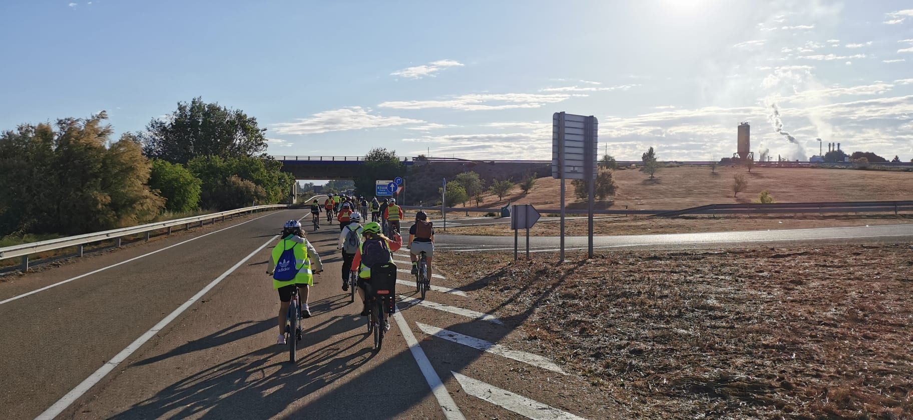
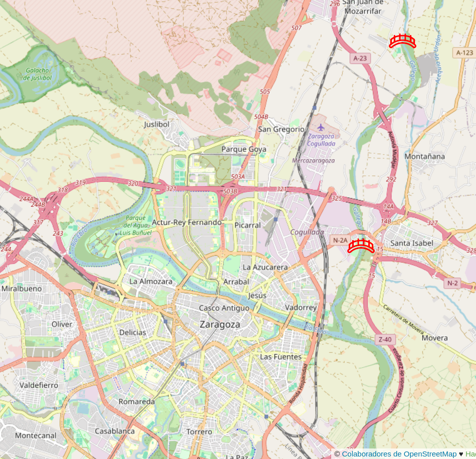
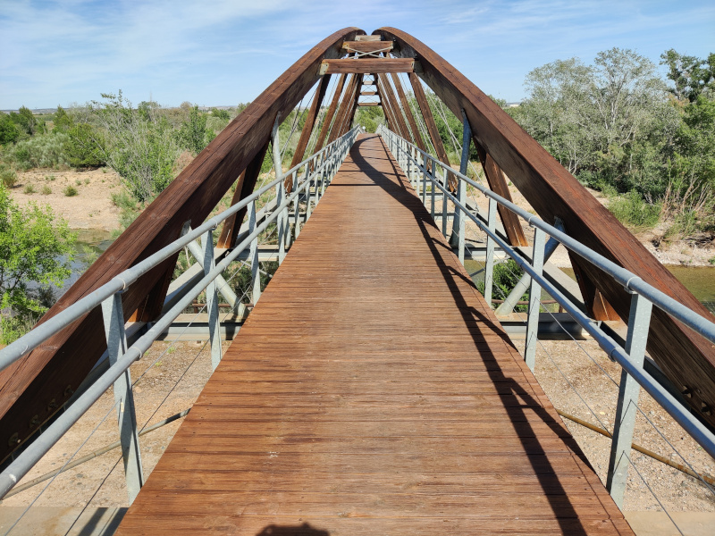
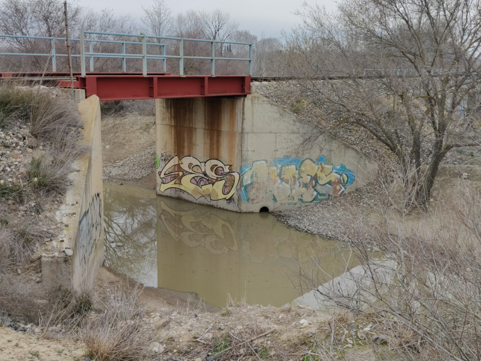
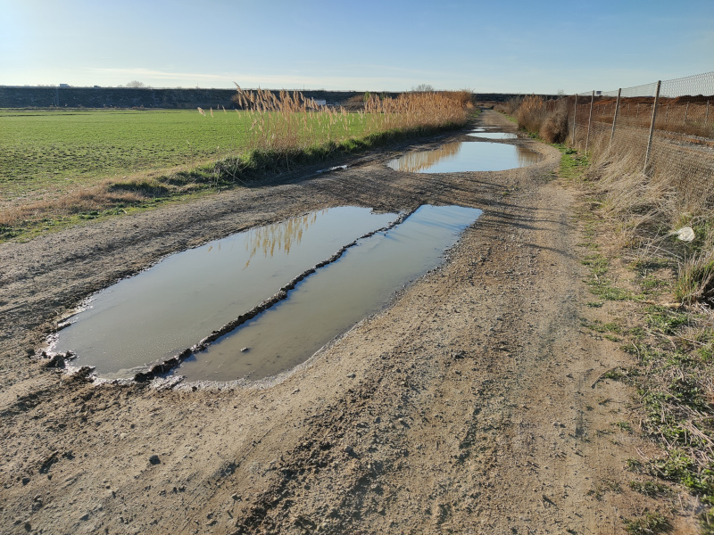
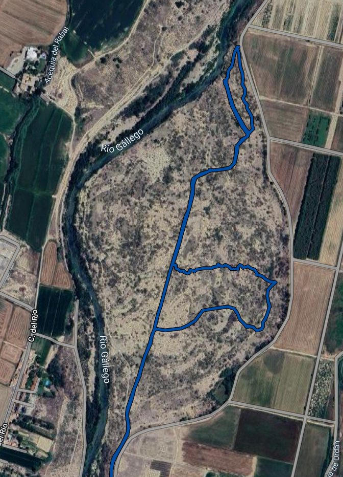
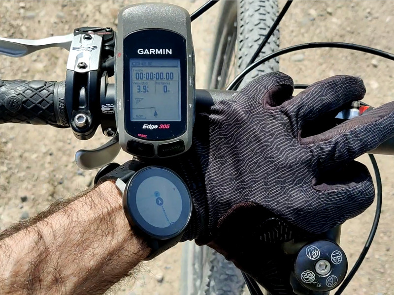
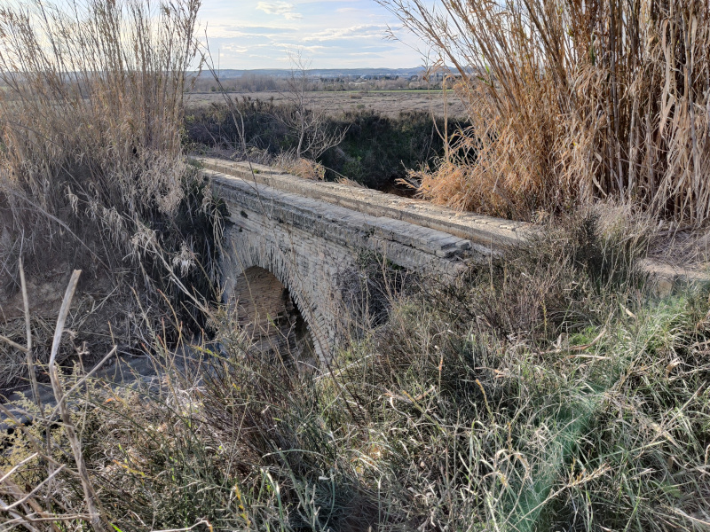

title: Vías Zaragoza - Campus en bicicleta
summary: Vías para acceder desde Zaragoza al Campus de Aula Dei en bicicleta.
image: images/posts/2024-05-31_campus_aula_dei_en_bici/peloton.jpg
date: 2024-05-31 08:00:00

Foto de Javier Rodrigo

!!! Warning "Ruta por margen derecha cortada"
    El camino que discurre por la margen derecha del Gállego (la ruta con nombre "Azud - Campus (por margen der. Gállego)" en la tabla final) está cortado por desprendimientos entre los waypoints 14 y 15, cuando se pasa junto a un muro que rodea un terreno muy próximo al propio río, al menos en fecha 2025-02-18. Una opción para evitar ese punto es salir momentáneamente a la carretera de Cogullada que discurre frente al lado opuesto del terreno con el muro.

Actualmente trabajo en el Campus de Aula Dei, a unos 15Km de Zaragoza. Aunque existen varias opciones para acudir al campus en autobús, en mi caso particular la combinación de rutas y horarios no es favorable, por lo que desde un principio opté por ir en bicicleta. Tras unos días realizando pruebas, ajusté la ruta y la equipación para hacerla más conveniente y segura. En este post enumero las distintas opciones que he terminado conociendo y describo a mi parecer sus ventajas e inconvenientes.

## Problemas y soluciones

Hay que comentar desde un principio que desafortunadamente el acceso al campus en bicicleta no es muy favorable. Por un lado existen las barreras naturales de la acequia de Urdán y sobre todo el río Gállego para el que existen muy pocos pasos. Si no tenemos en cuenta los puentes de las distintas carreteras, sólo existen las pasarelas peatonales de [Santa Isabel](https://osm.org/go/b_84LYjOF-?m=) y la [próxima a San Juan de Mozarrifar](https://osm.org/go/b_85hJ7oE-?m=) que se indican en el plano siguiente. La foto que hay a continuación del plano es de la segunda pasarela.

Por otro lado, la carretera de acceso al campus (A-123) carece de arcén en gran parte de su trazado, tiene límite de 70 km/h, muchas incorporaciones/salidas y considerable tráfico de tractores, camiones y autobuses (sobre todo a las horas de comienzo y fin de la jornada), por lo que la considero inconveniente para ciclistas. Pero evitar las carreteras conlleva algunos inconvenientes que vamos a analizar.

#### Ensuciamiento de la bicicleta

Los caminos en verano son muy polvorientos y en invierno se embarran y forman lagunas. Ambas situaciones ensucian la bicicleta, sobre todo el polvo en verano que ataca la transmisión (cadena, platos y piñones), bujes y pedalier. Para el barro y los charcos lo mejor es que la bicicleta disponga de guardabarros, aunque en mi caso particular no los puedo (ni quiero) poner.

Considerando ambos problemas, aún así me he decantado por utilizar los caminos rurales y limpiar la bicicleta con la frecuencia que la situación requiera. Pero hay momentos puntuales, tras varios días de lluvia por ejemplo, en los que conviene tener una alternativa por asfalto. Para esa situación, y en mi caso particular, recurro a la carretera que conecta San Gregorio con San Juan de Mozarrifar que termina en la carretera de Cogullada, otra buena alternativa si se accede desde una zona situada al noroeste de Zaragoza. Ambos tramos de carretera tienen poco tráfico y límite de 50 km/h. Desde la carretera de Cogullada se puede acceder a la [pasarela cerca de San Juan](https://osm.org/go/b_85hJ7oE-?m=) saliendo hacia el campo de fútbol de San Juan.

De todas formas en términos de minimizar el ensuciamiento y mantenimiento de la bicicleta, la mejor ruta en mi opinión es la que me enseñó el compañero Magí que utilizando la [pasarela de Santa Isabel](https://osm.org/go/b_84LYjOF-?m=) para superar el Gállego, transcurre por asfalto hasta más arriba de la Montañanesa. Es la denominada `Azud - Campus (margen izq. Gállego, asfalto)` en la tabla de rutas final. Poco antes de llegar a la acequia de Urdán (en [este punto](https://osm.org/go/b_8406Z8?m=)) tenemos las opciones de terminar por caminos rurales por la izquierda o girar a la derecha para salir [delante de la Montañanesa](https://osm.org/go/b_842C5~g-?m=) a la carretera de Montañana de la que recorreremos un pequeño tramo hasta tomar el [Camino el Soaso](https://osm.org/go/b_842ylME-?m=) para alcanzar el campus íntegramente por asfalto y por vías con poco tráfico. Si no utilizo personalmente esta ruta es porque tengo que dar algo de vuelta para poder acceder a ella y porque disfruto más rodando por caminos rurales con la bicicleta de montaña.

Otra ruta un poco más larga pero íntegramente por asfalto y que minimiza el tránsito por la carretera de Montañana es la que me enseñó el compañero Ricardo y que desde Santa Isable discurre enteramente por calzadas paralelas a la de Montañana. Es la denominada `Azud - Campus (todo asfalto 3)` en la tabla de rutas final.

En cuanto a la limpieza de la bicicleta en sí, he llegado al compromiso de fijarme exclusivamente en la transmisión (cadena, platos y piñones). He terminado usando lubricante basado en cera, que tiene el inconveniente de que hay que reponerlo cada pocos días (3 ó 4) pero a cambio la cadena no acumula la típica mugre mezcla de grasa y polvo. Utilizo el de la marca [X-sauce](https://www.amazon.es/dp/B01CXILFJ6) (en tiendas de comercio local cuesta la mitad que en Amazon).

Una vez al mes llevo la bicicleta a un lavadero de coches. Empiezo limpiando la cadena con un [accesorio para facilitar la tarea](https://www.decathlon.es/es/p/limpiador-cadena-bicicleta/_/R-p-334700?mc=8651030) que lleno de desengrasante biodegradable (la marca [BLUB](https://www.amazon.es/dp/B084S7C3PX) en concreto me da un resultado excelente). Tras eso, retiro las pastillas de freno para que no se contaminen y le doy un manguerazo a la bicicleta. En casa seco, aplico [WD-40](https://www.amazon.es/dp/B00K7XZEZ6) en las articulaciones de los desviadores y lubrico la cadena con el producto mencionado antes.

#### Charcos y barro

El tema de los charcos puede parecer menor, pero al menos la pasada temporada fría (2023/2024), desde octubre hasta abril han existido en varios puntos de mi ruta habitual, tres zonas difíciles de pasar, es decir, el problema va más allá de que se ensucie la bicicleta. Uno de los puntos es el [puente del ferrocarril](https://osm.org/go/b_841ChW5?m=) que accede a la Montañanesa en su paso sobre la pista que trascurre por la margen derecha del Gállego. Afortunadamente descubrí que poco antes de ese punto sale una vía a la derecha que permite pasar el puente por [uno de sus vanos menores](https://osm.org/go/b_840dYW?m=) más adelante.

Otro paso incluso peor, dado que no existe alternativa una vez que estás allí (está entre una valla y un campo que en ocasiones no es practicable), es el que hay en un [punto del camino muy próximo al puente comentado antes](https://osm.org/go/b_84fr992?m=). Durante todos estos meses fríos han existido unas lagunas cuyos bordes se mantenían permanentemente embarrados por el agua que desplazaban los vehículos al pasar. En los peores momentos la alternativa era dar un poco de vuelta subiendo un poco por la carretera de Cogullada para acceder al camino que discurre por el otro lado de la vía del ferrocarril y de paso evitar el puente.

#### Frío y noche

En invierno el principal enemigo es el frío en las manos y la iluminación. Para lo primero he probado muchos modelos de guantes con y sin calefacción, y no ha sido hasta adquirir los últimos que no he conseguido solucionar el problema. Desafortunadamente en el momento de escribir este artículo no se encuentran a la venta, aunque podría ser por no estar todavía en la temporada de invierno. Son el modelo "HEAT CONCEPT BIKE" de la marca [Ekoi](https://www.ekoi.es).

En cuanto a la iluminación, hace tiempo que adquirí un foco potente (parecido a [éste](https://es.aliexpress.com/item/1005007131009248.html)) para las excursiones veraniegas nocturnas. Empecé a tener problemas con la batería, pero por lo que he podido ver el formato de las mismas es bastante estándar o popular (8,4V) por lo que pude encontrar [reemplazo](https://es.aliexpress.com/item/32877254810.html) fácilmente.

#### Mayor riesgo de pinchazos

Aquí sólo puedo hacer la natural recomendación de llevar bomba encima para por lo menos poder ir hinchando la rueda en caso de pinchar hasta llegar al destino. En mi caso llevo las ruedas montadas sin cámara o en tubeless, cosa que recomiendo a pesar de los inconvenientes que tiene (requiere mantenimiento y es mucho más engorroso desmontar el neumático). Gracias a ello me he podido olvidar del tema de los pinchazos desde hace años (salvo un par de episodios dramáticos en los que el neumático se hubiera destrozado llevase lo que llevase).

#### Más tiempo de viaje

Utilizar los caminos rurales conlleva más tiempo por una parte por la menor velocidad de circulación y por otra por los rodeos que hay que hacer para lograr la conexión de pistas. Aunque como puede verse en el mapa final con las rutas, la mayoría son bastante directas.

#### Orientación inicial

Relacionado con el punto anterior existe la posibilidad de despistarse, al menos durante los primeros días, sobre todo si se utiliza la opción de los caminos rurales, al no haber señalización y ser los caminos/campos parecidos. El primer día que intenté ir al campus en bicicleta fue un desastre. Tuve que improvisar en las proximidades del recinto porque la ruta que llevaba pretrazada con Google Maps me llevaba por un paso bloqueado. [Ese día](https://connect.garmin.com/modern/activity/11031310117) empleé una hora más de la cuenta dando vueltas por un terreno salvaje que hay entre el Gállego y el recinto del campus y más adelante atravesando unos campos encharcados que parecían una buena opción para atajar 🤦.

Para evitar este problema, por una parte conviene utilizar la herramienta adecuada para trazar la ruta, que no es Google Maps como el compañero Miguel me enseñó, sino otra basada en los mapas de [OpenStreetMap](https://www.openstreetmap.org/) como [GraphHopper](https://graphhopper.com/maps) donde sí están correctamente mapeado el perímetro del recinto del campus. Por otra parte, conviene llevar un GPS que nos permita seguir la ruta sin tener que parar a mirar el mapa. En mi caso empecé utilizando un viejo Garmin Edge 305 que ya que ahora domino de memoria las distintas opciones, puedo prestar a otras personas que se animen a ir en bici al campus para que se aprendan el recorrido. Si se dispone de un soporte de manillar para smartphone, también se puede utilizar una aplicación de navegación como [OsmAnd](https://play.google.com/store/apps/details?id=net.osmand) con los tracks precargados.

## Rutas

A continuación se enumera la colección de rutas que he seleccionado. Uno de los objetivos de la selección ha sido cubrir distintos puntos de partida repartidos por el noreste de Zaragoza. Otro el que existan opciones que discurran íntegramente por asfalto, bien por los días en que los caminos estén embarrados o pensando en las personas que sólo cuenten con bicicletas de carretera. El tiempo estimado que aparece en la tabla es una aproximación que puede variar en función de la forma física, el tipo de bicicleta y las condiciones meteorológicas (¡hola cierzo!). En la columna de observaciones se indican los puntos conflictivos o a tener en cuenta en cada ruta. Por último, la primera columna contiene un enlace para descargar los tracks GPX de forma que se puedan instalar en aplicaciones como la mencionada [OsmAnd](https://play.google.com/store/apps/details?id=net.osmand).

| Ruta | Distancia | Tiempo estimado | Observaciones |
|------|-----------|-----------------|---------------|
|[Juslibol/Actur - Campus (por San Gregorio)](files/posts/2024-05-31_campus_aula_dei_en_bici/Juslibol-Actur---Campus-(por-San-Gregorio).gpx)|14,38 km|40m-1h|Hay que cruzar la carretera de Huesca pero se puede hacer por paso elevado. 🚧|
|[Arrabal/Picarral - Campus (por Corbera Alta)](files/posts/2024-05-31_campus_aula_dei_en_bici/Arrabal-Picarral---Campus-(por-Corbera-Alta).gpx)|13,05 km|35m-55m|🚧|
|[Cogullada - Campus (Carretera Cogullada)](files/posts/2024-05-31_campus_aula_dei_en_bici/Cogullada---Campus-(Carretera-Cogullada).gpx)|9,95 km|30m-45m|Poco tráfico. 🚧|
|[Azud - Campus (por margen der. Gállego)](files/posts/2024-05-31_campus_aula_dei_en_bici/Azud---Campus-(por-margen-der.-Gállego).gpx)|13,00 km|35m-55m|La más divertida. 🚧|
|[Azud - Campus (margen izq. Gállego, asfalto)](files/posts/2024-05-31_campus_aula_dei_en_bici/Azud---Campus-(margen-izq.-Gállego,-asfalto).gpx)|12,05 km|35m-50m|En mi opinión la mejor, buen equilibrio entre rapidez, pocos coches, limpieza de bici y opción a terminar del todo por asfalto.|
|[Azud - Campus (margen izq. Gállego, caminos)](files/posts/2024-05-31_campus_aula_dei_en_bici/Azud---Campus-(margen-izq.-Gállego,-caminos).gpx)|11,73 km|35m-50m|Paralela a la anterior, sin coches pero ensucia más la bicicleta. 🚧|
|[Azud - Campus (todo asfalto)](files/posts/2024-05-31_campus_aula_dei_en_bici/Azud---Campus-(todo-asfalto).gpx)|13,08 km|35m-55m|Tramo compartido con tráfico rodado desde Montañanesa hasta entrada a Camino el Saso.|
|[Azud - Campus (todo asfalto 2)](files/posts/2024-05-31_campus_aula_dei_en_bici/Azud---Campus-(todo-asfalto-2).gpx)|12,12 km|35m-50m|Tramo compartido con tráfico rodado desde Santa Isabel hasta Montañana.|
|[Azud - Campus (todo asfalto 3)](files/posts/2024-05-31_campus_aula_dei_en_bici/Azud---Campus-(todo-asfalto-3).gpx)|13,02 km|35m-55m|Sólo discurre por la carretera de Montañana un pequeño tramo con arcén.|

El emoji 🚧 en las observaciones de algunas de las rutas de la tabla significa que hay que hacer el paso por el acueducto sobre la acequia de Urdán. Se trata del acueducto de la foto. Puede ser un poco complicado de pasar junto a la bici, sobre todo cuando transporta agua o está mojado, ya que se vuelve resbaladizo y es estrecho. En caso de no verlo claro, se puede pasar al otro lado de la acequia por un paso a nivel que hay más adelante a unos 400m.

<iframe width="100%" height="300px" frameborder="0" allowfullscreen allow="geolocation" src="https://umap.openstreetmap.fr/es/map/vias-zaragoza-campus-en-bicicleta_1071113?scaleControl=false&miniMap=false&scrollWheelZoom=false&zoomControl=true&editMode=disabled&moreControl=true&searchControl=null&tilelayersControl=null&embedControl=null&datalayersControl=true&onLoadPanel=none&captionBar=false&captionMenus=true"></iframe>
<a href="https://umap.openstreetmap.fr/es/map/vias-zaragoza-campus-en-bicicleta_1071113?scaleControl=false&miniMap=false&scrollWheelZoom=true&zoomControl=true&editMode=disabled&moreControl=true&searchControl=null&tilelayersControl=null&embedControl=null&datalayersControl=true&onLoadPanel=none&captionBar=false&captionMenus=true">Ver a pantalla completa</a>
