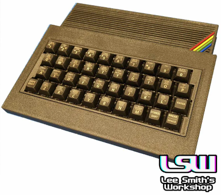
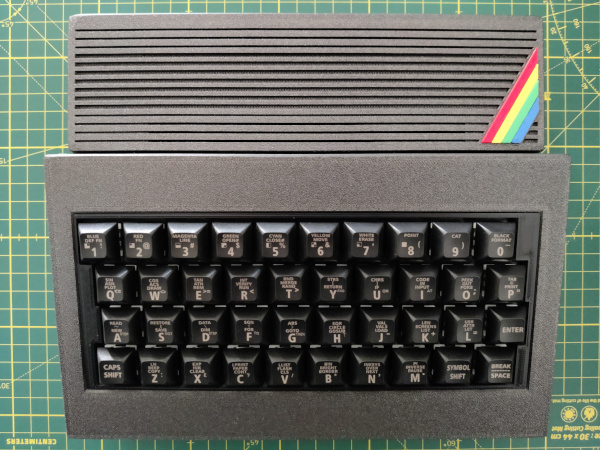
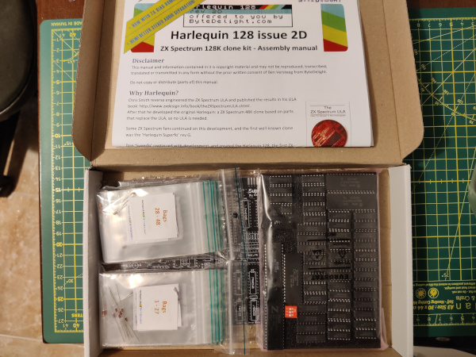
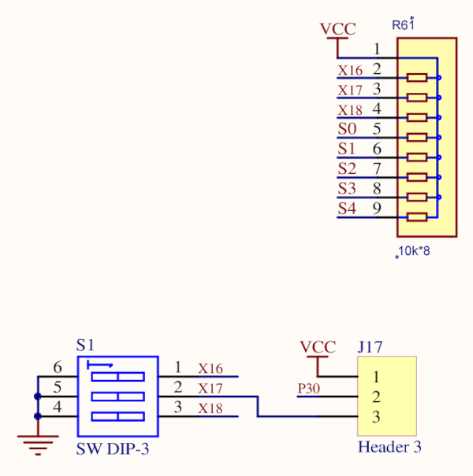
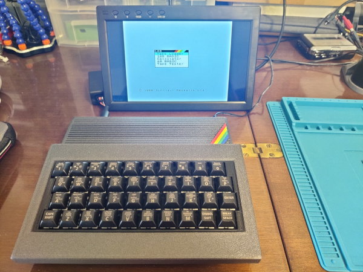

title: ZX Mechtrum
summary: Building a ZX Mechtrum Harlequin, that is, a ZX Spectrum with the Harlequin 128 board and a mechanical keyboard.
image: images/posts/2024-09-09_zx_mechtrum/mechtrum_logo.png
date: 2024-09-09 12:00:00

For a while, I’ve wanted to assemble a [ZX Spectrum Harlequin 128](https://www.bytedelight.com/?product=harlequin-128k-rev-2d-black-large-diy-kit) kit. It’s the perfect Spectrum (128KB, supports all models/ROMs from the various versions produced by Sinclair and Amstrad, and with components that can still be acquired today, including the ULA, which has been replaced by discrete logic). However, the option of purchasing a replica case of the original 48K (rubber keys) didn’t really excite me.

A few months ago, I came across Lee Smith’s [ZX Mechtrum](https://leesmithsworkshop.co.uk/products/the-mechtrum-mechanical-keyboard-zx-spectrum-case) project, a case for 48KB-format boards with a mechanical keyboard, and it seemed like the perfect complement for the Harlequin. In fact, in the [video from the More Fun Making It channel](https://www.youtube.com/watch?v=Gr8KhQHaJr4), through which I learned of its existence, its creator mentions that he plans to install a Harlequin 128 in one of these cases soon.

Since there are already several videos and guides for both the [Harlequin kit](https://www.youtube.com/watch?v=s1klr5vRye0) and the [ZX Mechtrum](https://www.youtube.com/watch?v=O_FdXpOi2W4) case, I won’t detail the assembly process but will instead describe it generally and mention some peculiarities and problems I encountered.

#### Mechtrum

Since the Harlequin 128 kit is distributed by Byte Delight, its availability is quite stable, so the most critical point of the plan was acquiring the [Mechtrum from Lee Smith](https://leesmithsworkshop.co.uk/products/the-mechtrum-mechanical-keyboard-zx-spectrum-case), as selling products is not his main activity. In fact, I managed to get the last unit from a batch he made in late 2023. As of writing this (September 2024), it’s back on sale, but it’s not expected to remain available for long. In any case, I was able to acquire a unit that arrived pre-assembled. My unit came with 3 faceplates, one for the 48K, another for the [Sifzif 512](https://github.com/UzixLS/zx-sizif-512/), and one for the Harlequin 128.

#### Harlequin 128

The Harlequin 128 is a design by Don Superfo, and the PCB can be purchased through the links provided in the [project’s base repository](https://github.com/DonSuperfo/Superfo-Harlequin-128). The repository also contains the BOM (Bill Of Materials) for the different versions with all the necessary components. However, by far the easiest option is to purchase one of the kits distributed by Ben Versteeg from [Byte Delight](https://www.bytedelight.com/). The kit comes with an issue 2D version PCB and all the necessary components to assemble it, conveniently sorted into bags along with a manual that makes it almost impossible to get lost. There are times when it’s not available in his store, but it’s just a matter of staying alert or subscribing to availability notifications. In my case, I had to wait a couple of months for it to become available again.

The only problem I encountered during assembly was that, according to the manual, the R61 resistor array is optional if you’re not going to install the joystick interface. However, these resistors, in addition to serving the joystick port, also act as pullups for the ROM bank selection microswitches, so without them, selecting ROM banks higher than 0 was unstable. After installing the R61 array, everything worked correctly.

#### Resultado

The result is a dream come true: a 128K Spectrum with a mechanical keyboard and reliable components. And it’s a beauty. 🤩

