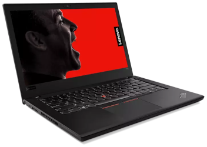

title: Arch Linux Installation on Lenovo ThinkPad T480
summary: Complete procedure to install Arch Linux alongside SteamOS with dual boot on Lenovo ThinkPad T480.
image: images/posts/2025-06-28_thinkpad_t480/thinkpad_t480.png
date: 2025-06-28 22:30:00



After stumbling upon several videos praising the Lenovo ThinkPad T480 and feeling slightly dissatisfied with the laptop I bought last summer as my main device, I decided to buy a second-hand one. Specifically, I bought the T480 model with an Intel Core i5-8250U processor, 16GB RAM, and a 1TB SSD. It cost €252 delivered the next day, and I purchased it from a specialized refurbisher whose videos I had also seen, so I expected the machine to be in good condition. And it was. The laptop arrived in impeccable condition, like new, with both its batteries functional (internal and external). The ThinkPad T480 originally had many configuration options available. For this reason, when buying it from a refurbisher, it may come with different hardware features. Here is the full spec sheet where all hardware options can be seen: [PSREF Lenovo ThinkPad T480](https://psref.lenovo.com/syspool/Sys/PDF/ThinkPad/ThinkPad_T480/ThinkPad_T480_Spec.PDF).

The Lenovo ThinkPad T480 is a 14" laptop with an excellent keyboard, an IPS FullHD screen (1920x1080), and good connectivity (2 USB-C ports, one of them Thunderbolt, 2 USB-A 3.0 ports, HDMI, Ethernet, SD card reader, and audio/mic jack). Internally it's very customizable, as it has two SODIMM RAM slots, an SSD in a SATA slot that can be converted to M.2, a couple of PCIe ports for additional SSD storage or a 5G modem, and the internal battery is also easily replaceable. Moreover, [Linux compatibility is excellent](https://wiki.archlinux.org/title/Lenovo_ThinkPad_T480), as Lenovo provides Linux drivers and the community has developed drivers for the rest of the components.

What follows is the full procedure I used to install Arch Linux on it.

## Disk repartitioning

The laptop comes with Windows 11 Pro installed occupying the entire disk. The plan is to keep it and make room to install Arch Linux alongside. The 1TB SSD is perfect to accommodate two operating systems without issues.

The first step is to shrink the Windows partition. To do so, BitLocker must be disabled. In the Windows 11 installation that came with the machine, BitLocker was already disabled. We can shrink the partition using Windows itself, through the `Disk Management` tool (search in Start menu or press Win+X). Once there, right-click the `C:` partition and select `Shrink Volume...`. In my case, I shrank it by 750GB, leaving around 220GB for Windows.

Windows installations have a small recovery partition at the end of the disk. When shrinking the main partition, the free space appears before this recovery partition. Thus, when creating Linux partitions later, their numbering will be higher than the recovery partition but will physically be located before it. This is not a problem when using GPT partitioning schemes.

## Base installation

For the base system installation, I chose the conventional route following the [installation guide](https://wiki.archlinux.org/title/Installation_guide) from the Arch wiki. This installation uses an ISO of an Arch live system that we boot from a removable USB drive and use to install the minimal packages for a bootable, very basic system.

Before we begin, it's worth noting that due to the dynamic nature of Arch Linux, this guide may become outdated. I recommend checking the [official guide](https://wiki.archlinux.org/title/Installation_guide) if something doesn't go as expected.

Here is the step-by-step installation process:

1. Download the [Arch Linux ISO](https://archlinux.org/download/). I used [this version](https://ftp.rediris.es/mirror/archlinux/iso/2025.06.01/archlinux-2025.06.01-x86_64.iso).
2. Flash the ISO to a USB stick using [Balena Etcher](https://www.balena.io/etcher/) or the `dd` command in Linux (if you [know how to use it](sistemas/raspi.md#backup-de-la-sd-comprimiendo-al-vuelo)):

    ```bash
    sudo dd bs=4M if=archlinux-2025.06.01-x86_64.iso of=/dev/sdX conv=fsync oflag=direct status=progress
    ```

3. Boot the laptop with the USB stick inserted. Press `Enter` when prompted to interrupt normal boot, then press `F12` to enter the `Boot Menu`.
4. Select the option to boot from the removable device, listed as `USB HDD: Mass Storage Device`.
5. Once the Arch live system boots, run the following commands in order. If using a wired Ethernet connection, you can skip the `iwctl` session (replace `<SSID>` with your network name and enter the password when prompted):

    ```bash
    # loadkeys es
    # iwctl
    [iwd]# station wlan0 scan
    [iwd]# station wlan0 get-networks
    [iwd]# station wlan0 connect <SSID>
    [iwd]# exit
    # timedatectl
    # fdisk /dev/sda
    ```

6. In `fdisk`, create the following partitions:
    * `sda5`: 8GB, type `Linux swap`, ID `19`.
    * `sda6`: Remaining space (724.4GB), type `Linux filesystem`, ID `20`.

7. Exit `fdisk` by typing `w` and pressing `Enter`. Continue with the following commands (replace `<USER>` with your desired username):

    ```
    # mkfs.ext4 /dev/sda6
    # mkswap /dev/sda5
    # mount /dev/sda6 /mnt
    # mount --mkdir /dev/sda1 /mnt/boot/efi
    # swapon /dev/sda5
    # pacstrap -K /mnt base base-devel linux linux-firmware sudo vi ntfs-3g networkmanager intel-ucode grub efibootmgr os-prober
    # genfstab -U /mnt >> /mnt/etc/fstab
    # arch-chroot /mnt
    # ln -sf /usr/share/zoneinfo/Europe/Madrid /etc/localtime
    # hwclock --systohc
    # vi /etc/locale.gen    # Uncomment 'en_US.UTF-8 UTF-8' and 'es_ES.UTF-8 UTF-8'
    # locale-gen
    # echo "LANG=es_ES.UTF-8" > /etc/locale.conf
    # echo "KEYMAP=es" > /etc/vconsole.conf
    # echo "thinkpad" > /etc/hostname
    # echo -e "\n127.0.0.1    localhost\n::1    localhost\n127.0.1.1    thinkpad.localdomain thinkpad" >> /etc/hosts
    # passwd
    # useradd -m -G wheel,audio,video,storage -s /bin/bash <USER>
    # passwd <USER>
    # visudo                # Uncomment '%wheel ALL=(ALL) ALL'
    # systemctl enable NetworkManager
    # vi /etc/default/grub  # Uncomment 'GRUB_DISABLE_OS_PROBER=false'
    # os-prober
    # grub-install --target=x86_64-efi --efi-directory=/boot/efi --bootloader-id=GRUB
    # grub-mkconfig -o /boot/grub/grub.cfg
    # su - <USER>
    ```

## Graphical environment installation

We continue from where we left off, that is, in the chroot session from the Arch Linux live installer. From now on we'll use a regular user (not root), so we'll often use `sudo`.

1. Now install the graphical environment — I chose XFCE4. If you prefer another one, [here](https://wiki.archlinux.org/title/Desktop_environment#Officially_supported) is a list of officially supported desktop environments and instructions.

    ```bash
    $ sudo pacman -Syy
    $ sudo pacman -S xfce4 xfce4-goodies xorg xdg-user-dirs pavucontrol gvfs gvfs-smb thunar-archive-plugin unzip unrar lightdm lightdm-gtk-greeter lightdm-gtk-greeter-settings pipewire pipewire-pulse pipewire-alsa wireplumber git cmake
    $ sudo systemctl enable lightdm
    ```

2. Install the `yay` package manager to install packages from AUR:

    ```bash
    $ git clone https://aur.archlinux.org/yay.git
    $ cd yay
    $ makepkg -si
    ```

3. Finally, install some useful applications and packages:

    ```bash
    $ sudo pacman -S firefox firefox-i18n-es libreoffice-fresh gimp vlc vlc-plugins-all usbutils htop btop openssh man-pages-es xdg-user-dirs-gtk alsa-utils network-manager-applet blueman fwupd gparted terminator vlc gimp shutter audacity openshot ghex net-tools sshuttle
    $ sudo systemctl start sshd
    $ sudo systemctl enable sshd
    ```

4. Exit the chroot session, unmount the partitions, and reboot:

    ```bash
    $ exit
    # exit
    # umount -R /mnt
    # reboot
    ```

## NetworkManager and Bluetooth Applets

To make the NetworkManager applet work properly, we need to install the `network-manager-applet` package and add it to XFCE4 autostart. We’ll do something similar for Bluetooth. Once in the graphical environment, run:

```bash
$ sudo pacman -S network-manager-applet blueman
$ sudo systemctl start bluetooth
$ sudo systemctl enable --now bluetooth
```

Now add both applets to XFCE4 autostart. Go to `Settings > Session and Startup > Application Autostart` and click `Add`. In `Name`, enter `NetworkManager Applet`, in `Command`, enter `nm-applet`, and you can leave `Comment` empty or write something like `NetworkManager applet`. Do the same for Bluetooth: name `Bluetooth`, command `blueman-applet`, optional comment.

## Installing pamac

To make graphical package management easier, install `pamac`:

```bash
$ yay -S pamac-aur
```

Once installed, open it (search for `Add/Remove Software` in the application menu) and enable AUR support under `Preferences > Third Party > Enable AUR support`.

## Conclusion

And that’s it. Now we have a dual boot Arch Linux / Windows system on the ThinkPad T480.

## Links of interest

* [Arch Linux Installation Guide](https://wiki.archlinux.org/title/Installation_guide)
* [Installation and configuration of Arch Linux on a Lenovo T480 laptop](https://wiki.archlinux.org/title/Lenovo_ThinkPad_T480)
* [Lenovo ThinkPad T480 Specification Sheet](https://psref.lenovo.com/syspool/Sys/PDF/ThinkPad/ThinkPad_T480/ThinkPad_T480_Spec.PDF)
* [Firmware updates with fwupd](https://wiki.archlinux.org/title/Fwupd)
* [Howdy for Linux](https://github.com/boltgolt/howdy): Howdy provides Windows Hello™ style authentication for Linux. Use your built-in IR emitters and camera in combination with facial recognition to prove who you are.
* [Install Libreboot on Lenovo ThinkPad T480 and/or T480s](https://libreboot.org/docs/install/t480.html)
* Thunderbolt firmware problem:
    * [Critical Intel Thunderbolt Software and Firmware Updates - ThinkPad](https://pcsupport.lenovo.com/gb/en/products/laptops-and-netbooks/thinkpad-t-series-laptops/thinkpad-t480s-type-20l7-20l8/solutions/ht508988-critical-intel-thunderbolt-software-and-firmware-updates-thinkpad)
    * [EPROM replacement](https://www.youtube.com/watch?v=TzpOLO0vVoM)