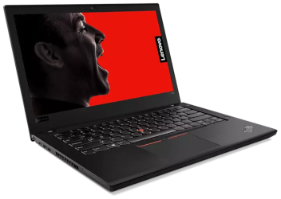

title: Instalación Arch Linux en Lenovo ThinkPad T480
summary: Procedimiento completo para instalar Arch Linux junto a SteamOS con dual boot en Lenovo ThinkPad T480.
image: images/posts/2025-06-28_thinkpad_t480/thinkpad_t480.png
date: 2025-06-28 22:30:00



Tras cruzarme por casualidad con varios vídeos contando las excelencias del Lenovo ThinkPad T480 y de estar ligeramente disgustado con el portátil que adquirí el verano pasado como equipo principal, decidí comprar uno de segunda mano. En concreto el modelo que compré es el T480 con un procesador Intel Core i5-8250U, 16GB de RAM y disco SSD de 1TB. Costó 252€ puesto en casa al día siguiente, y fue adquirido en un vendendor especializado en reacondicionar equipos del que también vi algún vídeo por lo que esperaba que el equipo estuviera en buen estado. Así fue. El equipo llegó con un aspecto impecable, como nuevo, con sus dos baterías funcionales (la interna y la externa). El ThinkPad T480, en su momento tenía muchas opciones de configuración a la hora de adquirirlo. Por este motivo, al comprarlo en una de estas empresas de reacondicionamiento, es posible que el equipo tenga características distintas. Esta es la hoja de especificaciones del equipo donde pueden verse todas las opciones de hardware: [PSREF Lenovo ThinkPad T480](https://psref.lenovo.com/syspool/Sys/PDF/ThinkPad/ThinkPad_T480/ThinkPad_T480_Spec.PDF).

El Lenovo ThinkPad T480 es un portátil de 14" con un teclado excelente, una pantalla IPS FullHD (1920x1080) y una buena conectividad (2 puertos USB-C uno de ellos Thunderbolt, 2 puertos USB-A 3.0, HDMI, Ethernet, lector de tarjetas SD y jack de auriculares/micrófono). Internamente es muy modificable, ya que tiene la RAM en dos sockets SODIMM, el disco SSD en un socket SATA que se puede convertir en M.2, un par de puertos PCIe donde se puede conectar más almacenamiento intento SSD o cosas como un modem 5G y la batería interna es también sustituible fácilmente. Además, la [compatibilidad con Linux está asegurada](https://wiki.archlinux.org/title/Lenovo_ThinkPad_T480), ya que Lenovo proporciona drivers para Linux y la comunidad ha desarrollado drivers para el resto de componentes.

Lo que sigue es el procedimiento completo que he utilizado para instalar Arch Linux en él.

## Reparticionado del disco

El equipo trae Windows 11 Pro instalado ocupando todo el disco. El plan es mantenerlo y hacer sitio para instalar Arch Linux junto a él. El tamaño de 1TB del disco SSD del equipo es perfecto para poder alojar dos sistemas operativos sin problemas.

El primer paso es encoger la partición de Windows. Para poder hacerlo, BitLocker debe estar desactivado. En la instalación de Windows 11 que trae el equipo, BitLocker estaba ya desactivado. La partición la podemos encoger con el propio Windows en marcha, desde el `Administrador de discos` (buscándolo en el menú Inicio o pulsando Win+X). Una vez en el Administrador de discos, pulsamos con el botón derecho del ratón sobre la partición `C:` y seleccionamos la opción `Reducir volumen...`. En mi caso, reduje el volumen en 750GB, quedando la partición de Windows con un tamaño de unos 220GB.

En las instalaciones de Windows, hay una patición pequeña al final del disco que es la partición de recuperación. Al encoger la partición principal, el espacio libre queda antes de esta partición y por tanto, al crear las particiones para Linux más adelante, éstas tendrán un número superior a la partición de recuperación, pero se encontrarán antes. Esto en sistemas de archivos GPT no es un problema.

## Instalación base

Para el proceso de instalación del sistema base me decanté por el camino convencional siguiendo las instrucciones de la [guía de instalación](https://wiki.archlinux.org/title/Installation_guide) en el wiki de Arch. Dicha instalación utiliza una ISO de un sistema Arch que podremos arrancar desde una unidad extraíble USB con el que instalaremos los paquetes mínimos para tener un sistema arrancable y muy básico.

Antes de comenzar, comentar que por las características tan dinámicas de la distribución Arch Linux, es muy posible que esta guía quede desactualizada en algún momento. Por lo que recomiendo consultar la [guía oficial](https://wiki.archlinux.org/title/Installation_guide) en caso de encontrar que algo no sale como se supone.

A continuación vemos paso a paso el proceso de instalación:

1. Descargar la [ISO de Arch Linux](https://archlinux.org/download/). En concreto en mi caso utilicé [ésta versión](https://ftp.rediris.es/mirror/archlinux/iso/2025.06.01/archlinux-2025.06.01-x86_64.iso).
2. Instalar la ISO en un pendrive. Puede utilizarse un programa como [Balena Etcher](https://www.balena.io/etcher/) o el comando `dd` de Linux si se [sabe manejar](sistemas/raspi.md#backup-de-la-sd-comprimiendo-al-vuelo) (donde `/dev/sdX` es el dispositivo del pendrive; puede comprobarse con el comando `lsblk`):

    ```bash
    sudo dd bs=4M if=archlinux-2025.06.01-x86_64.iso of=/dev/sdX conv=fsync oflag=direct status=progress
    ```

3. Arrancar el portátil con el pendrive insertado. Pulsar `Enter` cuando ofrece interrumpir el proceso normal de arranque y acto seguido `F12`. Esto hace que el ordenador arranque en el `Boot Menu`.
4. Seleccionar la opción para arrancar desde el dispositivo extraíble que aparecerá en el menú como `USB HDD: Mass Storage Device`.
5. Una vez que termine de arrancar el sistema live de instalación de Arch, ejecutar los siguiente comandos en orden. En caso de conectar a la red por cable Ethernet, se puede evitar la sesión con `iwctl` (en la cual sustituiremos `<SSID>` por nuestro SSID e introduciremos la contraseña cuando se nos pida):

    ```bash
    # loadkeys es
    # iwctl
    [iwd]# station wlan0 scan
    [iwd]# station wlan0 get-networks
    [iwd]# station wlan0 connect <SSID>
    [iwd]# exit
    # timedatectl
    # fdisk /dev/sda
    ```

6. En el programa `fdisk` crear las siguientes particiones (en mi caso):
    * `sda5`: 8GB, tipo `Linux swap`, con el identificador `19`.
    * `sda6`: Espacio restante (724,4GB), tipo `Linux filesystem`, con el identificador `20`.

7. Salir de `fdisk` escribiendo `w` y pulsando `Enter`. Continuar con los siguientes comandos (sustituir `<USER>` por el nombre de usuario que se quiera crear):

    ```
    # mkfs.ext4 /dev/sda6
    # mkswap /dev/sda5
    # mount /dev/sda6 /mnt
    # mount --mkdir /dev/sda1 /mnt/boot/efi
    # swapon /dev/sda5
    # pacstrap -K /mnt base base-devel linux linux-firmware sudo vi ntfs-3g networkmanager intel-ucode grub efibootmgr os-prober
    # genfstab -U /mnt >> /mnt/etc/fstab
    # arch-chroot /mnt
    # ln -sf /usr/share/zoneinfo/Europe/Madrid /etc/localtime
    # hwclock --systohc
    # vi /etc/locale.gen    # Descomentar 'en_US.UTF-8 UTF-8' y 'es_ES.UTF-8 UTF-8'
    # locale-gen
    # echo "LANG=es_ES.UTF-8" > /etc/locale.conf
    # echo "KEYMAP=es" > /etc/vconsole.conf
    # echo "thinkpad" > /etc/hostname
    # echo -e "\n127.0.0.1    localhost\n::1    localhost\n127.0.1.1    thinkpad.localdomain thinkpad" >> /etc/hosts
    # passwd
    # useradd -m -G wheel,audio,video,storage -s /bin/bash <USER>
    # passwd <USER>
    # visudo                # Descomentar '%wheel ALL=(ALL) ALL'
    # systemctl enable NetworkManager
    # vi /etc/default/grub  # Descomentar 'GRUB_DISABLE_OS_PROBER=false'
    # os-prober
    # grub-install --target=x86_64-efi --efi-directory=/boot/efi --bootloader-id=GRUB
    # grub-mkconfig -o /boot/grub/grub.cfg
    # su - <USER>
    ```

## Instalación entorno gráfico

Continuamos donde nos habíamos quedado, es decir en la sesión chroot desde el sistema live de instalación de Arch Linux. Lo haremos ya con el usuario normal (no root) por lo que a partir de ahora haremos uso con frecuencia de `sudo`.

1. Ahora vamos a instalar el entorno gráfico, en mi caso XFCE4. En caso de elegir otro, [aquí](https://wiki.archlinux.org/title/Desktop_environment#Officially_supported) hay una lista de entornos gráficos soportados oficialmente por Arch Linux y las instrucciones correspondientes.

    ```bash
    $ sudo pacman -Syy
    $ sudo pacman -S xfce4 xfce4-goodies xorg xdg-user-dirs pavucontrol gvfs gvfs-smb thunar-archive-plugin unzip unrar lightdm lightdm-gtk-greeter lightdm-gtk-greeter-settings pipewire pipewire-pulse pipewire-alsa wireplumber git cmake
    $ sudo systemctl enable lightdm
    ```

2. Instalar el gestor de paquetes `yay` para poder instalar paquetes desde AUR:

    ```bash
    $ git clone https://aur.archlinux.org/yay.git
    $ cd yay
    $ makepkg -si
    ```

3. Por último instalar algunos programas y paquetes que nos serán útiles:

    ```bash
    $ sudo pacman -S firefox firefox-i18n-es libreoffice-fresh gimp vlc usbutils htop btop openssh man-pages-es xdg-user-dirs-gtk alsa-utils network-manager-applet blueman fwupd
    $ sudo systemctl start sshd
    $ sudo systemctl enable sshd
    ```

4. Cerramos la sesión chroot, desmontamos las particiones y reiniciamos el sistema:

    ```bash
    $ exit
    # exit
    # umount -R /mnt
    # reboot
    ```

## Applet NetworkManager y Bluetooth

Para que el applet de NetworkManager funcione correctamente, debemos instalar el paquete `network-manager-applet` y añadirlo al autostart de XFCE4. Vamos a hacer algo parecido con el Bluetooth. Para ello, una vez iniciado el entorno gráfico, ejecutar:

```bash
$ sudo pacman -S network-manager-applet blueman
$ sudo systemctl start bluetooth
$ sudo systemctl enable --now bluetooth
```

Ahora debemos añadir los applets al autostart de XFCE4. Para ello, ir a `Configuración > Sesión y arranque > Aplicaciones de inicio` y pulsar en `Añadir`. En el campo `Nombre` escribir `NetworkManager Applet`, en `Comando` escribir `nm-applet` y en `Comentario` podemos dejarlo vacío o poner algo como `Applet de NetworkManager`. Hacemos lo mismo para el Bluetooth, añadiendo un nuevo applet con el nombre `Bluetooth`, el comando `blueman-applet` y un comentario opcional.

## Instalación pamac

Para facilitar la instalación de paquetes desde la interfaz gráfica, vamos a instalar `pamac`:

```bash
$ yay -S pamac-aur
```

Una vez instalado, abrirlo (buscando `Añadir/Quitar software` en el cajón de aplicaciones) y activar el soporte AUR en `Preferencias > Terceros > Activar soporte de AUR`.

## Conclusión

Y esto sería todo. Ahora tenemos un sistema dualboot Arch Linux / Windows en el ThinkPad T480.