title: G&W Zelda hack
summary: Installation of alternative firmware on G&W Zelda and modification to add microSD slot.
date: 2026-03-08 15:45:00
draft: true

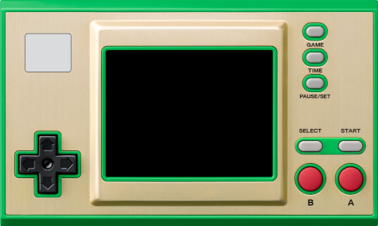

A well-known Japanese video game manufacturer began selling a pair of machines at the end of 2022, replicating the appearance of some of the old G&W, based on an STM32H7 microcontroller running a baremetal firmware with NES and GB emulators, three classic games and a clock application inspired by the Zelda franchise. The machine is very interesting because of the virtues of being based on a microcontroller instead of a microprocessor, that is, great battery life (the one from a Switch joycon), instant boot and sleep mode. The storage medium is a small 4MB NOR flash chip (in the case of the Zelda model), enough to host the mentioned emulators and games, but very scarce if you want to take advantage of the machine and its relatively powerful CPU.

The original firmware serves to verify the solvency of the platform to emulate at least the 8-bit machines that originally run, so the device immediately became attractive to the hacker community. Shortly after it went on sale, [procedures appeared to unlock and modify the machine](https://www.youtube.com/watch?v=Rsi8p5gbaps) so that more emulators and games could be installed.

The first major modification proposed by the community consisted of replacing the flash chip with a 64MB one to have more space for games and emulators. Later, the modification evolved to include a microSD card slot to store games and savestates, as well as to greatly simplify the update process, turning the modified machine into an unparalleled portable emulation machine in aspects such as portability, size, battery life, and boot times.

With either of the two modifications, it is possible to emulate the following machines:

* Amstrad CPC6128 (beta)
* Atari 2600
* Atari 7800
* ColecoVision
* Gameboy / Gameboy Color
* Game & Watch / LCD Games
* MSX1/2/2+
* Nintendo Entertainment System
* PC Engine / TurboGrafx-16
* Pokémon Mini
* Sega Game Gear
* Sega Genesis / Megadrive
* Sega Master System
* Sega SG-1000
* Tamagotchi P1
* Watara Supervision

In this article we will describe the steps to perform these two modifications. The modification to add the microSD slot also requires replacing the flash, since every time we load a new game from the microSD it will be written to the flash chip, and the original 4MB one supports few write cycles since it was not intended to be used this way.

The entire process has been performed on a Linux system. In principle, development on Windows and MacOS X systems is also possible, but the steps to install the requirements and necessary software will necessarily change.

## Connection to the SWD port

Unlocking the processor and modifying the firmware are done through the SWD port that STM32 microcontrollers usually have to program their internal flash memory and debug developments. This SWD port is located on the PCB unpopulated, that is, without soldered pins or connectors.

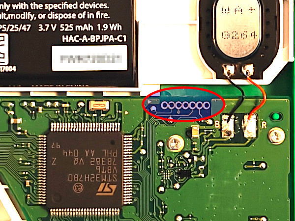

To make the connection to this port there are several options:

* Solder wires directly.
* Insert bare wires or male pin wires, tilting them to force contact.
* Use specialized [connection probe clips](https://www.amazon.es/gp/product/B009UOHE1K/).
* Use [pogo pin clips](https://es.aliexpress.com/item/1005007602295920.html) (Single row 5pin).
* Route the SWDIO and SWCLK pins to the USB-C port.

#### Hard version

Since I started tinkering with the machine before the microSD mod appeared, at the time I routed the SWD port to the USB-C. If you end up doing the microSD mod, the effort is not very worthwhile, since from then on flashing the firmware will be done from the microSD itself. However, for documentation purposes we will describe how the routing would be done.

The USB-C port only has the power pins connected since it is only intended to charge the machine. Therefore, the D+ and D- pins that are free can be used to wire them to the SWDIO and SWCLK pins, which are the only essential ones for the SWD port. We will also need to connect to 5V and GND, but these are already wired in the USB-C port. The routing is done with fine enameled wire like the one used to build coils. Soldering to the two central pins of the USB-C port which correspond to D+ and D- is complicated having a very small pitch, but with patience and flux it can be achieved.

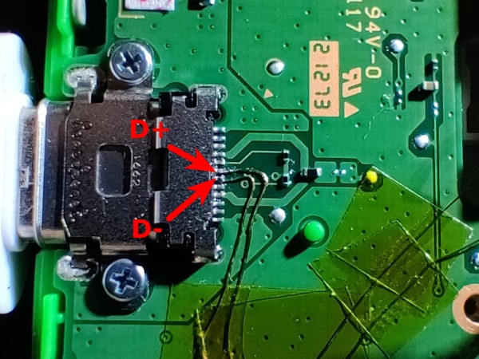

Once the only difficult part of the procedure is solved, that is, soldering the wires to the USB port, these are secured every so often with Kapton tape and directed towards the battery area where the recess on both sides of the housing that surrounds it is used to pass one of the cables. The other is routed through the space between the battery housing and the PCB. This way both cables cannot touch each other, although in theory being varnished there should be no problem, this separate path is adopted as an additional precaution.

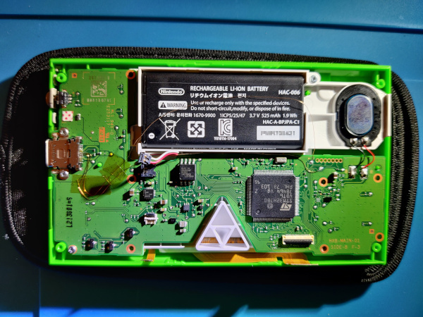

Once the wires reach the vicinity of the SWD port, the two test pads that can be seen in the photo are used to solder them.

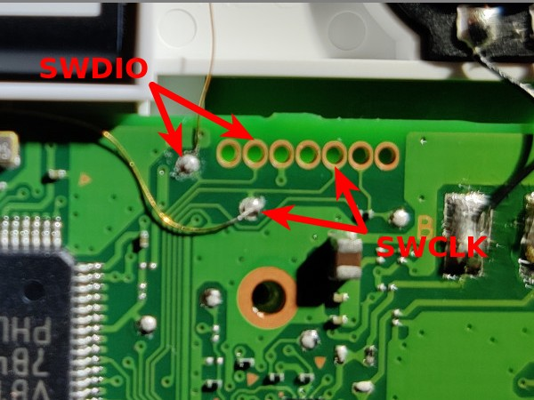

The correspondence between D+ and D- on the USB-C port with SWDIO and SWCLK of the SWD port can be done in any way as long as we are clear on where each one is to later make the USB-SWD adapter we will need. In this assembly the following correspondence has been chosen:

* D+ ↔ SWDIO
* D- ↔ SWCLK

!!! Warning
    The idea at first was to adopt the correspondence used in [this other guide](https://facelesstech.wordpress.com/2022/01/08/game-and-watch-hacking-with-rpi/), but due to a mistake made at the beginning, it ended up being done exactly the other way around. As mentioned earlier, it's really not a problem as long as you know how the connections are made. This warning is only in case someone tries to follow both guides simultaneously, so that this difference is taken into account.

Once the port is routed, we will need to build the adapter to extract the SWDIO and SWCLK signals from the USB-C port. To do this, cut a conventional USB-A cable to have access to the four separate cables it contains and solder female pin connectors to them. The adapter is completed with a USB-A to USB-C adapter that is marked to orient it correctly when we are going to use it, since we have only routed the D+ and D- pins on one of the two sides (the USB-C port is reversible).

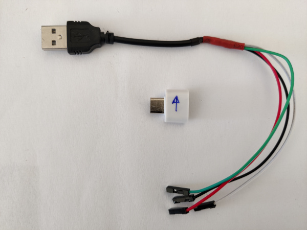

The cable colors are usually standardized as follows:

* Red: 5V
* Black: GND
* Green: D+
* White: D-

#### Easy version

The recommended way to make the connection to the SWD port (if you don't want to solder, which is the most reliable option) is using specialized [connection probe clips](https://www.amazon.es/gp/product/B009UOHE1K/). To apply these clips, it is recommended to previously disconnect the console's battery. The battery connector pops off easily by inserting a thin piece of plastic underneath it.

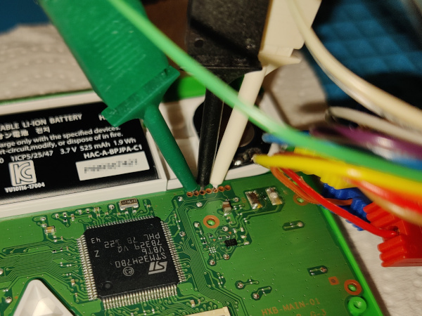

## Programming probe

We have solved where to connect on the console. Now we need a device capable of communicating with that SWD port of the microcontroller. The options are:

* [Raspberry Pi Pico](https://www.raspberrypi.com/products/raspberry-pi-pico/) (Recommended)
* [STLink](https://www.st.com/en/development-tools/st-link-v2.html)
* [JLink](https://www.segger.com/products/debug-probes/j-link/#models)
* [DAPLink](https://daplink.io/)
* [Raspberry Pi (GPIO)](https://projects.raspberrypi.org/en/projects/physical-computing/1)

I chose to use a Raspberry Pi Pico. For it to work as an SWD programming probe, the [debugprobe](https://github.com/raspberrypi/debugprobe) firmware must be loaded. In my case I used the [picoprobe.uf2](https://github.com/raspberrypi/debugprobe/releases/download/picoprobe-cmsis-v1.0.3/picoprobe.uf2) file from [this specific release](https://github.com/raspberrypi/debugprobe/releases/tag/picoprobe-cmsis-v1.0.3). To flash the Pico, just connect it to the computer via USB while pressing the `BOOTSEL` button to force the mode in which it mounts as a storage drive and drag the `.uf2` file to that drive. After autoflashing, the Pico will automatically restart and begin to function as an SWD programming probe.

Once the Pico is programmed, the only thing left is to make the connections of the cables that we had connected to the SWD port of the Game&Watch. We can use the same type of clips that we applied to the console, although in my case I used similar ones but slightly more robust, since the spacing of the GPIO pins of the Pico is much larger.

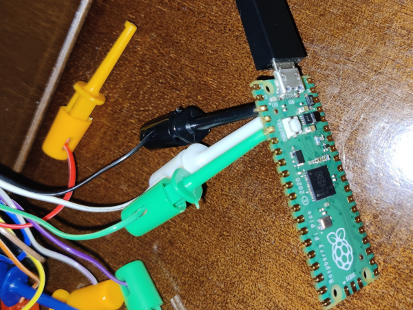

The wiring between Game&Watch and Raspberry Pi Pico is:

|Pico|GnW|Color |
|:---|:--|:-----|
|   3|  3|Black |
|   4|  5|White |
|   5|  2|Green |

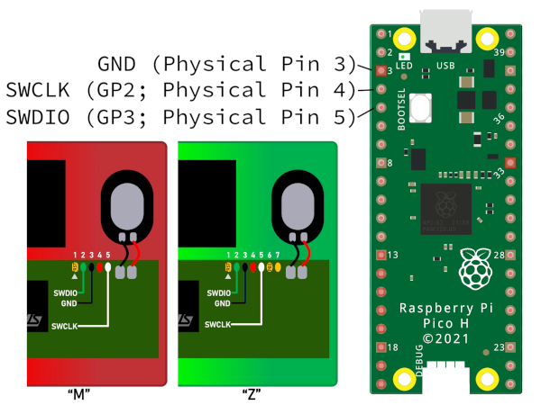

## Microcontroller unlocking

Once the connectivity to the board is solved, the first step in the modification is unlocking the STM32H7 microcontroller so that we can replace the firmware in its internal flash memory as well as write to the external flash memory (with code that we will inject into the microcontroller itself).

This task is performed with the [gnwmanager](https://github.com/BrianPugh/gnwmanager) utility suite. This package is registered on [PyPI](https://pypi.org/project/gnwmanager/) so it can be installed very easily with `pip` (preferably inside a Python virtual environment).

```bash
$ pip install gnwmanager
$ gnwmanager install openocd
```

Now, after reconnecting the console's battery if we had disconnected it, we will execute the following command:

```
(gnwmanager) $ gnwmanager unlock
```

The process will pause on a couple of occasions giving instructions through the terminal that we must follow. A typical output would be:

```
(gnwmanager) [edu@thinkpad ~]$ gnwmanager unlock

If interrupted, resume unlocking with:
    gnwmanager unlock --backup-dir=backups-2025-10-27-19-28-14

Detected ZELDA game and watch.
Backing up itcm to "backups-2025-10-27-19-28-14/itcm_backup_zelda.bin"... complete!
Backing up external flash to "backups-2025-10-27-19-28-14/flash_backup_zelda.bin"... complete!
Flashing payload to external flash... complete!


Payload successfully flashed. Perform the following steps:

1. Fully remove power, then re-apply power.
2. Press the power button to turn on the device; the screen should turn blue.

Press the "enter" key when the screen is blue: 
Backing up internal flash to "backups-2025-10-27-19-28-14/internal_flash_backup_zelda.bin"... complete!
Unlocking device... complete!
Restoring firmware... complete!
Unlocking complete!
Pressing the power button should launch the original firmware.
```

The files `internal_flash_backup_zelda.bin`, `flash_backup_zelda.bin` and `itcm_backup_zelda.bin` will appear in a `backups-DATE-TIME` directory that should be saved.

If we turn on the console at this point, we won't notice any change, meaning it will run the original firmware, but now the chip will be unprotected and we can flash another firmware to it.

## Modification 1: retro-go

#### Flash replacement

At this time we start modifying the console seriously. As mentioned at the beginning, the microcontroller's external storage chip is a flash memory of only 4MB (Zelda model). Not only is it small for loading many games, but it has few write cycles, so replacing games frequently, or caching them when making the modification to add the microSD, can wear it out quickly. The usual modification is to desolder the original 4MB flash chip and replace it with a 64MB one, specifically the [MX25U51245GZ4I00](https://es.aliexpress.com/item/1005005138227815.html) model.

To remove the original flash chip, it is highly recommended to extract the console's motherboard, disconnecting the two data ribbon cables from the screen, desoldering the speaker, and removing all screws. Once we have the board on the workbench, we protect the surroundings of the chip with kapton tape and extract it by applying flux and hot air with a heat gun.

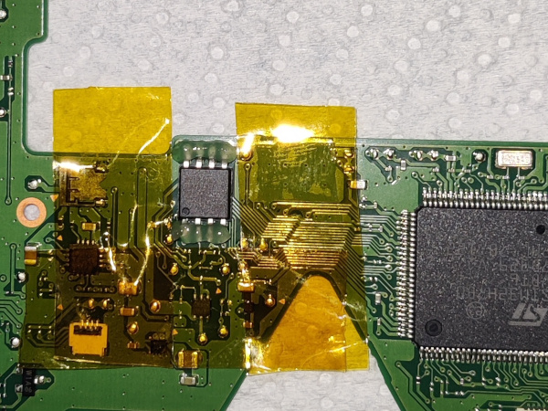

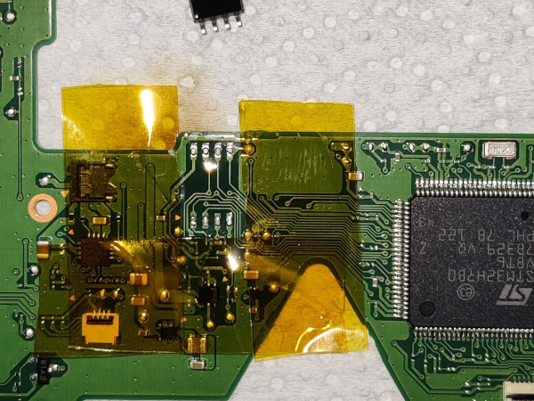

Next, we clean the footprint of the chip we just removed with desoldering braid. Also, although it must be done with great care, it helps to scratch (with the tip of tweezers, for example) the solder mask of the PCB to expand outwards the solderable surface of the chip's solder footprint.

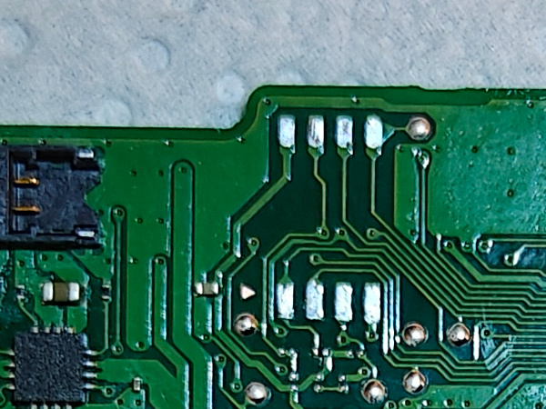

The new flash chip has a surface mount QFN-8 format that is not easy to solder. It is recommended to apply flux and pre-tin the pads of said chip on the bottom. I also recommend putting a strip of kapton tape on the bottom so that it does not rest directly on the PCB, which would hinder the flow of solder through the pads.

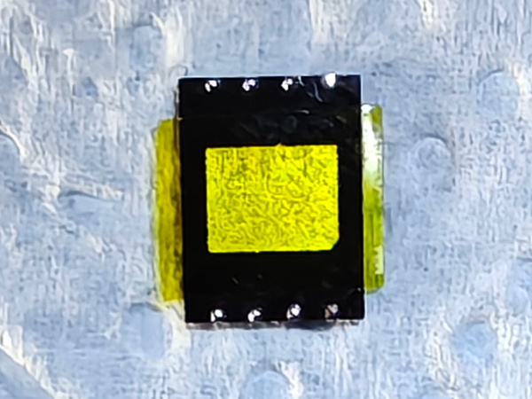

You must pay close attention to the dot on the chip's package that marks pin number 1, which corresponds to the one with an indicator triangle on the PCB as can be seen in the second photo of the following.

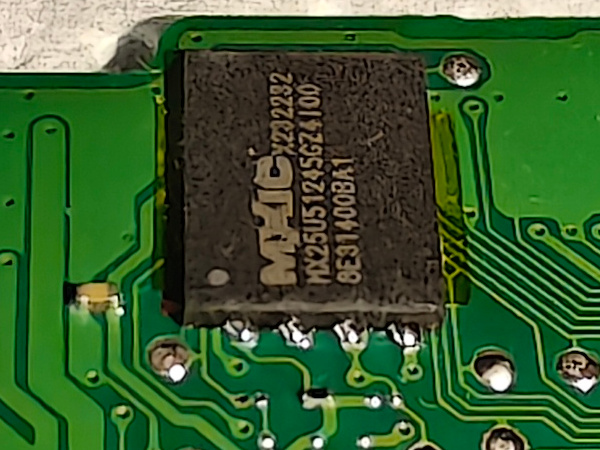

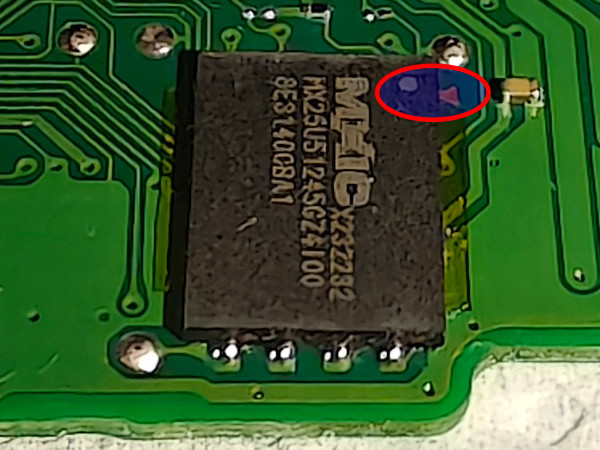

#### Flashing retro-go

Once the chip is installed, it's time to flash the firmware. For this modification, I choose not to set up dual boot, that is, not to install the patched original firmware alongside retro-go, to have all the flash memory space dedicated to games. To do this we start by downloading its repository:

```bash
cd ~/git
git clone --recursive https://github.com/sylverb/game-and-watch-retro-go
cd game-and-watch-retro-go
```

Once the code is downloaded, it's time to install the ROMs in the directories corresponding to the different supported machines that we will find in `~/git/game-and-watch-retro-go/roms/`. For example, to install the NES ROMs, we copy the ROMs to `~/git/game-and-watch-retro-go/roms/nes/`. If we want cover art for the games, we will place the images in jpg or png format in the same directories and with the same file names of the corresponding ROMs. For example, for the `zelda.nes` ROM, we will place the cover at `~/git/game-and-watch-retro-go/roms/nes/zelda.jpg`.

We have to keep in mind that all ROMs and their covers must fit in the 64 MB flash chip we installed in the console. Most ROMs compress, so as a starting rule, we will use the criteria of choosing ROMs for a total size of roughly double (128MB).

Now it's time to build the firmware (if we are not going to use covers to take advantage of the space of their files to be able to put more ROMs, do not include the `COVERFLOW` and `JPG_QUALITY` environment variables in the build and flash commands):

```bash
make docker_build
make docker

(docker) export GNW_TARGET=zelda
(docker) export ADAPTER=cmsis-dap
(docker) make clean
(docker) COVERFLOW=1 JPG_QUALITY=90 EXTFLASH_SIZE_MB=64 make -j$(nproc)
```

When building finishes, we will be informed of the resulting binary size that will be flashed to the chip. For example:

```
External flash usage
    Capacity:     61050880 Bytes ( 58.223 MB)
    Usage:        54335345 Bytes ( 51.818 MB)
    Free:          6715535 Bytes (  6.404 MB)
```

With that information in sight we can iterate the process adding or removing ROMs until obtaining a binary of about 55MB, since something must be anticipated for the game savestates.

Once we are satisfied with the space usage, we will flash the firmware reconnecting the programming probe discussed in the [Programming probe](#programming-probe) section.

```bash
(docker) COVERFLOW=1 JPG_QUALITY=90 EXTFLASH_SIZE_MB=64 make flash_gnwmanager
(docker) gnwmanager disable-debug
```

A typical output would be:

```bash
docker@53335bdd9199:/opt/workdir$ COVERFLOW=1 JPG_QUALITY=90 EXTFLASH_SIZE_MB=64 make flash_gnwmanager
Entering 'LCD-Game-Emulator'
Entering 'blueMSX-go'
Entering 'caprice32-go'
Entering 'fceumm-go'
Entering 'gwenesis'
Entering 'potator'
Entering 'prosystem-go'
Entering 'retro-go-stm32'
Entering 'smw'
Entering 'tamalib'
Entering 'zelda3'
[ BASH ] Checking for updated roms
100%|█████████████████████████████████████████████████████████████████| 208/208 [04:20<00:00,  1.25s/it]
docker@53335bdd9199:/opt/workdir$ gnwmanager disable-debug
docker@53335bdd9199:/opt/workdir$
```

!!! Warning
    In the [retro-go version](https://github.com/sylverb/game-and-watch-retro-go/tree/b80630d0d1b3fbdeeb5e2e6e78bf5643a7de211e) at the time of writing this, when finishing the `make flash_gnwmanager` command an error appeared (mentioning the `OFFSET` parameter). Investigating it seemed to be a minor problem that only prevented the deactivation of the processor's debug mode. This can have implications on battery consumption, and that's why I include the manual execution of debug deactivation at the end. I managed to stop the error from appearing by replacing lines 1028 to 1031 of the `Makefile.common` file:
        ```
        	@$(GNWMANAGER) flash $(INTFLASH_ADDRESS) $(BUILD_DIR)/$(TARGET)_intflash.bin \
		-- flash ext $(BUILD_DIR)/$(TARGET)_extflash.bin --offset=$(EXTFLASH_OFFSET) \
		-- start $(INTFLASH_ADDRESS) \
		$(RESET_DBGMCU_CMD)
        ```
    with:
        ```
        	@$(GNWMANAGER) flash $(INTFLASH_ADDRESS) $(BUILD_DIR)/$(TARGET)_intflash.bin \
		-- flash ext $(BUILD_DIR)/$(TARGET)_extflash.bin --offset=$(EXTFLASH_OFFSET) \
		-- start $(INTFLASH_ADDRESS)
        ```

It is important that we keep the `build/gw_retro_go.elf` file because we will need it to extract the savestates in the future.

#### Backup retro-go savestates

If later we want to extract the game savestates, to be able to reinstall them after flashing a new firmware, first we will need to place the `gw_retro_go.elf` file we obtained in the previous step in the `build` directory. Then we can restart the docker environment and run the backup script:

```bash
cd ~/git/game-and-watch-retro-go
make docker

(docker) export GNW_TARGET=zelda
(docker) export ADAPTER=cmsis-dap
(docker) ./scripts/saves_backup.sh build/gw_retro_go.elf
```

The savestates will appear in the `~/git/game-and-watch-retro-go/save_states` subdirectory. Once we have built and flashed a new firmware, we can restore them by running the restoration script:

```bash
(docker) ./scripts/saves_restore.sh
```

Restoration is done intelligently, that is, if we have savestates of a game that is not in the new firmware, that savestate will not be installed on the console, to avoid wasting flash memory space.

## Modification 2: retro-go-sd

#### microSD slot module installation

As with the modification for normal retro-go, to use retro-go-sd you must start by making a hardware modification to the console. This time it is more complicated, especially the final phase of soldering the module directly onto the microcontroller's pins, which have a very small pitch.

The module consists of the microSD card reader itself and 4 components. All this soldered onto a flex-type PCB. The complete list of components is:

* 1 [microSD card reader](https://es.aliexpress.com/item/1005008902154552.html)
* 1 [100kΩ 0603 resistor](https://es.aliexpress.com/item/1005005677654015.html) or 0805
* 2 [1μF 0603 capacitors](https://es.aliexpress.com/item/1005003512666695.html) or 0805
* 1 [RT9193-28GB voltage regulator](https://es.aliexpress.com/item/1005007136710461.html). There are people who have reported problems with this model bought on Aliexpress and recommend the "MIC5504-2.8YM5-TR" as a replacement.
* 1 flex PCB: Here the version by [PrimoAngelo](https://github.com/sylverb/game-and-watch-retro-go-sd/raw/refs/heads/main/assets/MicroSD_Zelda_Final.zip) is used. The original one usually referenced in most guides is the one by [Tim Schuerewegen / hundshamer](https://github.com/sylverb/game-and-watch-retro-go-sd/raw/refs/heads/main/assets/GnW_SD_v2.zip).

We will begin by soldering the components onto the flex PCB.

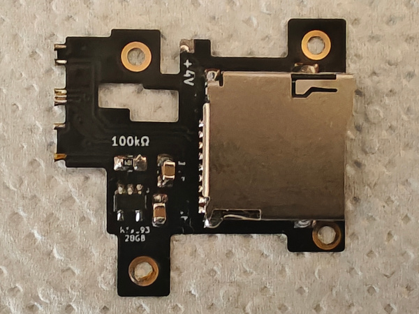

The next step as we said at the beginning will be the difficult step of installing the module in the console. We remove the four screws that fall on its surface and present it in a way that we get the pads of the flex to align with the pins of the microcontroller while these end up at their feet, that is, like this.

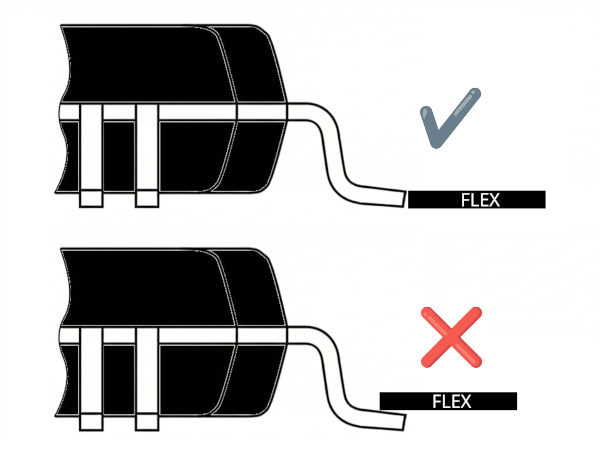

Once it is aligned to our liking, we will proceed to fix it in its position by driving in the four screws. Now is when we will have to arm ourselves with patience and high-quality flux to manage to solder the pads of the flex and simultaneously avoid bridges between them. It will be necessary to check the continuity of the solders as well as the non-existence of bridges between adjacent pins. If we finally succeed, all that remains is to add a solder point between the pad marked with `+4V` and the capacitor terminal next to it.

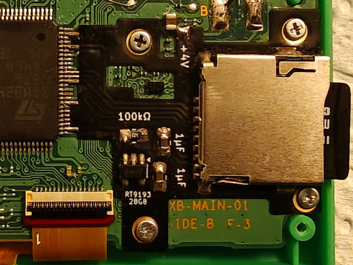

#### Bootloader flashing

The next step will be to flash the bootloader along with the console's patched original firmware to allow dual boot (this time it is worthwhile as we have practically unlimited space for ROMs on the microSD). From the directory where the console backup files are located and with a Python environment that has `gnwmanager` installed, we will execute the following command:

```bash
(gnwmanager) $ gnwmanager flash-patch zelda internal_flash_backup_zelda.bin flash_backup_zelda.bin --bootloader
```

A typical output would be:

```bash
(gnwmanager) $ gnwmanager flash-patch zelda internal_flash_backup_zelda.bin flash_backup_zelda.bin --bootloader
100%|███████████████████████████████████████████████████████████████████| 16/16 [00:58<00:00,  3.66s/it]
```

If we turn on the console at that moment, after removing the programming probe, we will see that the (patched) original firmware starts. After pressing `GAME + LEFT`, the bootloader will execute and, as Retro-Go SD is not yet installed in the internal flash of the STM32 at that moment, we will be shown the following warning:

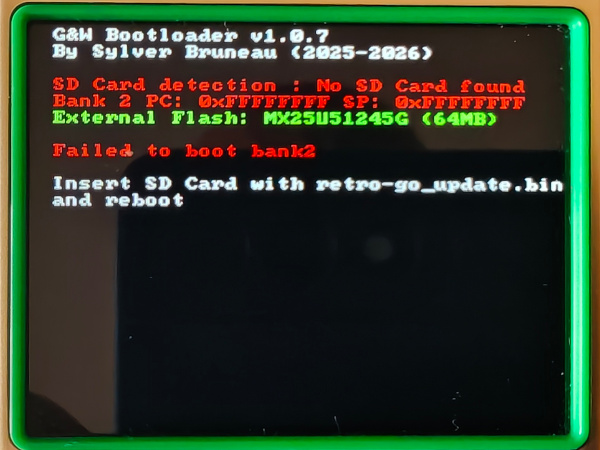

#### Retro-Go SD installation

All that remains is to install the Retro-Go SD firmware. To do this, we will copy the `retro-go_update.bin` file that we will download from the latest release published by Sylverb in the [Retro-Go SD repository](https://github.com/sylverb/game-and-watch-retro-go-sd/releases) to the root directory of the microSD. When booting for the first time, we will see on screen how the retro-go files and emulator cores are copied to the microSD itself.

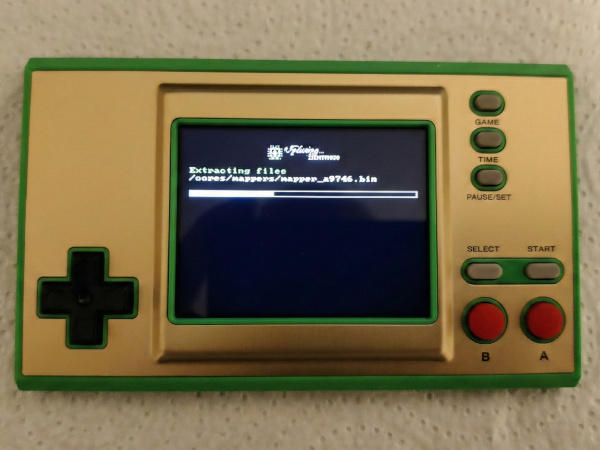

At the same time, the following directory structure will be created on the microSD:

```
retro-go/
├── CONFIG
├── bios/
│   ├── coleco/
│   ├── msx/
│   ├── nes/
├── cores/
│   ├── mappers/
│   ├── a2600.bin
│   ├── a2600_defprops.bin
│   ├── a7800.bin
│   └── ...
├── data/
│   ├── a2600/
│   ├── a7800/
│   ├── amstrad/
│   └── ...
├── fonts/
│   ├── cp1251_greybeard.bin
│   ├── cp1251_sans_serif.bin
│   ├── cp1251_sans_serif_bold.bin
│   └── ...
└── roms/
    ├── a2600/
    ├── a7800/
    ├── amstrad/
    └── ...
```

All that remains is to copy the ROMs we want to emulate to the corresponding directories. If we want cover art for the games, we will need to create the `covers` subdirectory with the same subdirectories as the `roms` directory and place the images there. These must be in a special IMG format that we will generate with a [script included in the Retro-Go SD repository](https://github.com/sylverb/game-and-watch-retro-go-sd/blob/main/README.md#cover-art-generator-gencoverspy). The IMG file names must match those of the ROMs in their corresponding directory.

#### Back case

When installing the microSD slot, you need to modify the back cover of the console because the reader falls over some support posts on the d-pad. You also need to drill a hole in the side to allow access to the microSD so you can extract and insert it when you want to change games, rescue savestates, or update the firmware. To perform the drilling, [there are some tools](https://www.printables.com/model/1269910-zelda-game-and-watch-sd-card-drill-jig/files) designed by the user facelesstech that help keep the slot clean. You can see how this modification is performed in the video at the end of this article.

There is an alternative if we don't want to risk permanently damaging the original cover, and that is to 3D print the model created by the user Aradia, which can be downloaded [here](https://github.com/sylverb/game-and-watch-retro-go-sd/raw/refs/heads/main/assets/GnW_Zelda_back_shell.stl).

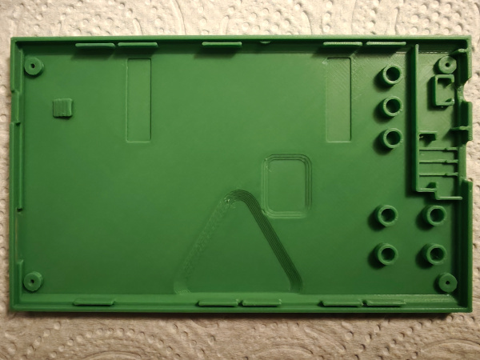

The green color I found most similar to the Zelda console is the [15-Green from OVERTURE](https://www.amazon.es/dp/B0DHKZCL75).

## Controls

Below we indicate the key combinations for controlling Retro-go SD (although many of them also work in Retro-go). Holding down the `PAUSE/SET` button while pressing other buttons performs the following actions:

| Key combination              | Action                                                                 |
| ---------------------------- | ---------------------------------------------------------------------- |
| `PAUSE/SET` + `GAME`         | Save a screenshot (disabled by default in builds with 1MB flash)       |
| `PAUSE/SET` + `TIME`         | Change execution speed (1x/1.5x)                                       |
| `PAUSE/SET` + `UP`           | Increase brightness                                                    |
| `PAUSE/SET` + `DOWN`         | Decrease brightness                                                    |
| `PAUSE/SET` + `RIGHT`        | Increase volume                                                        |
| `PAUSE/SET` + `LEFT`         | Decrease volume                                                        |
| `PAUSE/SET` + `B`            | Load state                                                             |
| `PAUSE/SET` + `A`            | Save state                                                             |
| `PAUSE/SET` + `A`            | Autofire on button A                                                   |
| `PAUSE/SET` + `B`            | Autofire on button B                                                   |
| `PAUSE/SET` + `POWER`        | Poweroff without save-state                                            |
| `PAUSE/SET` + `POWER`        | After having done `PAUSE/SET` and selected `Power off`, the bootloader will start without calling Retro-go, allowing us to see the bootloader version as well as information about the microSD detection and the state of the internal and external flash memories |

## References

I would not like to finish without mentioning the [stacksmashing](https://discord.gg/TKjHZ5yV) Discord server and the following users whose work has made these modifications possible:

* stacksmashing
* kbeckmann
* Tim Schuerewegen
* BrianPugh
* GMMan
* tfmoe__
* Sylver Bruneau
* facelesstech
* DasBoss
* bxhxx
* Benjamin Solberg
* orzeus
* ducalex
* ZimM
* Ninoh-FOX
* PrimoAngelo
* Aradia

In the following Macho Nacho video you can see the whole console modification process (the flex of the microSD module is the model that is not held by screws but with solder points on the G&W PCB):

<iframe width="688" height="387" src="https://www.youtube.com/embed/8YIHjUM8Qms" title="Making The Zelda G&W Into A MODERN Emulation Powerhouse" frameborder="0" allow="accelerometer; autoplay; clipboard-write; encrypted-media; gyroscope; picture-in-picture; web-share" referrerpolicy="strict-origin-when-cross-origin" allowfullscreen></iframe>