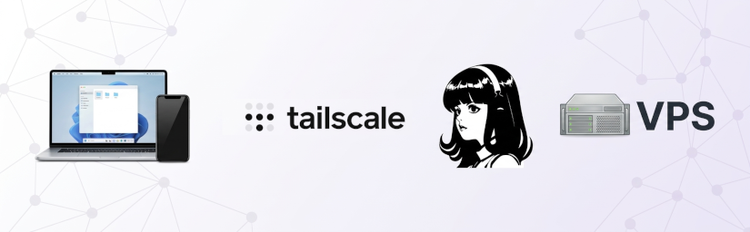

title: Hermes Agent on a VPS reachable through Tailscale
summary: Installing and configuring Hermes Agent, an autonomous open-source AI agent, on a VPS reachable securely through a private Tailscale network.
date: 2026-08-23 20:30:00



The previous article on this blog described how to build a complete agentic development environment with OpenCode, OmniRoute, and Ponytail. That setup gave you a coding agent in the terminal, powered by a model *router* that leveraged the free tiers of dozens of providers and tamed by a *skill* that trims over-engineering. But an agent that connects to a model provider over the API still has a weak point: it depends on your development machine and on that machine being turned on.

That is precisely the gap that [**Hermes Agent**](https://hermes-agent.nousresearch.com/) fills. It is not another autocomplete tool or a chatbot trapped behind an API: it is an **autonomous, general-purpose agent** that lives wherever you decide (a VPS, your home server, a Raspberry Pi) and that you talk to from anywhere. In this article I will explain what it is, why it is worth trying, and how we have installed and configured it on a VPS reachable through a private Tailscale network.

## What Hermes Agent is

Hermes Agent is an open-source AI agent framework created by **Nous Research**, the lab behind the Hermes models. It runs in the terminal, in a desktop application, in a web dashboard, and on messaging platforms, always with the same agentic core. Across a conversation it can read and edit files, run commands, search your session history, launch scheduled tasks, or delegate subtasks to subagents, all using real tools over the system where it runs.

Three properties set it apart from most alternatives:

* **Persistent learning across sessions.** It keeps memory that spans sessions and creates reusable *skills* from experience: if it solves a tricky task, it can save the procedure to reuse later.
* **Model-agnostic.** It works with OpenRouter, Anthropic, OpenAI, DeepSeek, xAI, local models, and more than twenty providers. Switching models requires no code changes. This fits the provider-independence philosophy we explored in the OmniRoute article.
* **Multi-surface.** The same agent serves Telegram, Discord, Slack, WhatsApp, the CLI, the desktop app, or the web dashboard. It is where you are; it does not force you into a specific tool.

It is not a *coding copilot* tied to an IDE: it is an agent that operates on a system, and that you can leave working in the background while you do something else.

## Why a VPS and why Tailscale

The most comfortable way to have an always-available agent is to run it on a **VPS**. A server running 24/7, with a public or private-network IP, becomes the agent's home. From anywhere (your desktop, the laptop in the kitchen, your phone) you send it a message and it works, even if that particular device is off.

The issue is access. The web admin panel used to control the agent should not be exposed to the public internet casually: anyone who knows it could try to use it. This is where **Tailscale** comes in, a private network (VPN) based on WireGuard that joins several of your machines as if they were all on the same LAN. The choice is simple:

| Option | Problem |
| --- | --- |
| Expose the dashboard on `0.0.0.0` | Anyone with the IP and port can try to get in. Bad idea. |
| Listen only on `localhost` | Reachable only from the VPS itself; can be accessed remotely by setting up an SSH tunnel, but it is inconvenient for daily use. |
| **Tailscale** | Only the devices in your *tailnet* can reach the dashboard. Network secrecy by default. |

With Tailscale the agent is used at `http://<private-IP>:9119` from any of your devices, and nothing else. The security is provided by the private network, not by the hope that nobody finds a port.

## How it has been configured

In this section I summarize the essentials of the setup. In my experience the trickiest part is not installing but understanding which piece talks to which.

### The main model and the *tools*

A point worth clarifying from the start: **the reasoning model and the delegated tools are two separate things**. The agent uses a model to reason, but many of its tools (web search, image generation, text-to-speech, browser automation) are served through external services.

In this configuration:

| Piece | Where it comes from |
| --- | --- |
| Reasoning model | **OpenCode Zen**, as a model *router*, with a single API key. |
| Delegated tools (web, image, voice, browser) | **Nous Portal**, the Nous account, which acts as a *gateway* to Firecrawl, FAL, OpenAI Audio, and Browser Use. |

Both coexist without conflict: the model reasons from one place and the tools are served from another. This is a nuance worth knowing because, if you drop the Nous account, the delegated tools stop working and must be reconfigured with alternative services. It is possible, but it forces you to explore numerous free alternatives that, in my experience, have not performed as well (especially the TTS) as the default tools loaded by the Nous Free account.

### The steps, in one pass

Besides the explanation, I like to leave the procedure condensed so I can repeat it on another machine without thinking twice:

```bash
# 1. Install Hermes Agent
curl -fsSL https://hermes-agent.nousresearch.com/install.sh | bash

# 2. Model + local terminal (edit ~/.hermes/config.yaml)
#    model.provider: opencode, model.base_url: https://opencode.ai/zen/v1
#    terminal.backend: local, proxy.enabled: false

# 3. Tailscale
curl -fsSL https://tailscale.com/install.sh | sh
sudo tailscale up        # → open the URL and confirm the device

# 4. Nous account for the delegated tools
hermes auth add nous --no-browser
hermes config set web.backend nous
hermes config set tts.provider nous
hermes config set browser.cloud_provider nous --force
hermes config set image_gen.provider nous --force

# 5. Dashboard credentials (in ~/.hermes/.env)
#    HERMES_DASHBOARD_BASIC_AUTH_USERNAME, _PASSWORD and _SECRET

# 6. Dashboard dependencies
cd ~/.hermes/hermes-agent
.venv/bin/pip install "hermes-agent[web,pty]"

# 7. systemd service (listens only on the Tailscale IP, port 9119)
systemctl --user daemon-reload
systemctl --user enable hermes-dashboard.service
systemctl --user start hermes-dashboard.service
sudo loginctl enable-linger $USER
```

The agent ends up reachable at `http://<Tailscale-IP>:9119`, protected by basic username/password authentication.

### The web dashboard

Hermes has a **web dashboard** for administration where you control everything: messaging channels, tool catalog, memory, and an embedded chat. It is configured to listen only on the VPS's Tailscale IP, so only the devices on your *tailnet* can reach it.

!!! Tip "The authentication secret"
    The dashboard uses a secret key (`HERMES_DASHBOARD_BASIC_AUTH_SECRET`) to sign sessions. It is required when the server listens on a non-`localhost` address, and is generated with `openssl rand -base64 32`. If it changes, you must log in again.

!!! Warning "A browser detail with accented characters"
    With Firefox, typing accented vowels in the dashboard chat produced detached accents (the accent without combining). It was a keyboard composition (dead keys) problem with xterm.js, not the agent. Using Brave fixed it reliably with the Spanish layout. Later I started using Hermes Desktop, so it wasn't a problem anymore.

### The desktop app

Beyond the browser, there is **Hermes Desktop**, a native (Electron) application with chat, a session list, a file browser, and drag-and-drop support. It acts as a client: it connects to the same backend that serves the VPS web dashboard and inherits the session and credentials, so it is not an isolated install but one more window onto the same agent.

!!! Warning "A touch of terminology"
    In Hermes, "gateway" is used in two senses worth not confusing. The *messaging gateway* (`hermes gateway`) is what integrates Telegram, Discord, WhatsApp, etc. On the other hand, when Hermes Desktop talks about a *Remote gateway* it refers to the very backend that serves the web dashboard. The desktop app connects to the **same host and port** as the dashboard; there is no separate port.

#### Installation

Installation is the same as the agent itself, using the official installer:

```bash
curl -fsSL https://hermes-agent.nousresearch.com/install.sh | bash
```

The installer manages the *venv* and Python dependencies, and leaves the `hermes` executable in `~/.local/bin`. One detail worth watching is the **Node.js** version required by the application dependencies: they need **22.18 or newer, or 24**, and Node 23 does not work. If the machine provides an unsuitable Node (e.g. the one `nvm` installs by default), the installer may fail with an `EBADENGINE` error; the fix is to pin a valid version with `nvm` before continuing:

```bash
nvm install 22 && nvm use 22
```

#### Connecting to the VPS gateway

Once launched with `hermes desktop`, the connection is declared from **Settings → Gateways → Add connection → Remote gateway**. Fill in:

* **Name**: a unique name, e.g. `VPS Contabo`.
* **Gateway URL**: `http://<Tailscale-IP-of-VPS>:9119`.

The advantage of going over Tailscale is that this URL is only reachable from your *tailnet*; no port needs to be opened to the outside. After pressing **Test** (it should answer "Reachable") you sign in with the same dashboard credentials.

#### The `.desktop` launcher and a Linux issue

Hermes Desktop installs a launcher entry in the application menu (`~/.local/share/applications/hermes.desktop`) with an icon, so you can start it from the application dock instead of the terminal. On Linux installs this launcher gave me two problems that I had to fix by hand, and which at the time of writing are still present in the version I use (they may be resolved in the future, so it is worth documenting them in case they come back).

The first: the `.desktop` generated by Hermes itself pointed to the Python interpreter that `uv` installs (`~/.local/share/uv/python/...`), which **does not have the dependencies**, instead of to the *venv* that does; running it failed with `ModuleNotFoundError`. And because Hermes **regenerates the `.desktop` on every launch**, any manual edit was lost. The fix was to remove the execute bit from the *script* `hermes` in the repository so the generator picks the persistent `~/.local/bin` *wrapper* (which already resolves the correct *venv*):

```bash
chmod -x ~/.hermes/hermes-agent/hermes
```

The second: the menu launcher runs the application **without loading your shell**, so the `PATH` had no Node (the one provided by `nvm`). Hermes Desktop needed Node and aborted silently. The fix was to make the `hermes` *wrapper* load `nvm` (and pin version 22) before calling its interpreter:

```bash
cat > ~/.local/bin/hermes <<'EOF'
#!/usr/bin/env bash
unset PYTHONPATH
unset PYTHONHOME
export NVM_DIR="$HOME/.nvm"
[ -s "$NVM_DIR/nvm.sh" ] && . "$NVM_DIR/nvm.sh"
nvm use 22 --silent >/dev/null 2>&1 || true
exec "$HOME/.hermes/hermes-agent/venv/bin/python" "$HOME/.hermes/hermes-agent/hermes" "$@"
EOF
chmod 755 ~/.local/bin/hermes
```

After those two steps the `Exec=` of the `.desktop` ends up pointing at the *wrapper* (visible with `cat ~/.local/share/applications/hermes.desktop`), which is what makes the menu launcher work just like the terminal.

!!! Warning "After every `hermes update`"
    The update does a `git checkout` and restores the execute bit of the `hermes` script in the repository, so the `Exec` problem can return. Simply repeat `chmod -x ~/.hermes/hermes-agent/hermes`.

## What you can do with it

Once set up, the agent stops being a curiosity you ask about everything and becomes a workmate that:

* **Writes and publishes.** It can take the documentation of an installation and turn it into a post for a blog and deploy it to the server.
* **Manages the system.** Have it audit services, look for configuration residue (such as an orphaned systemd unit) or clean up stale credentials.
* **Programs.** It edits code in the repository, generates or fixes files, and runs the test commands.
* **Automates.** It launches scheduled tasks delivered to the platforms you have connected (a daily report, a backup, a periodic check).
* **Talks to you.** With quality Spanish text-to-speech and voice-note transcription, from Telegram you forget that behind it there is a server in a datacenter.

All of this is requested in natural language, and it works while you do anything else.

## Conclusion

Hermes Agent is the piece that completes the puzzle we started in the OpenCode article: if there we built a coding agent *on your machine*, here we have an autonomous, *always-available* agent that lives on a VPS and answers from your usual platforms. It is free software, model-agnostic, and with a learning loop that makes it more useful as sessions go by.

The entry cost is zero (the agent itself is free and the model can come from a free tier or a cheap router), in exchange for an admin panel, persistent memory, and the ability to talk to your agent from anywhere. If you like agentic development and do not want to depend on your machine being on, it is worth an afternoon.
