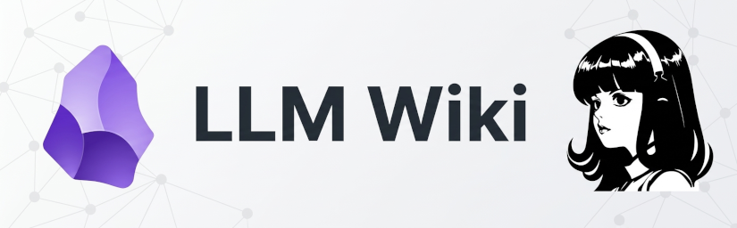

title: Second brain in Obsidian with the LLM Wiki pattern
summary: How I turned my Obsidian vault into a knowledge wiki maintained by an agent: Web Clipper capture, on-demand ingest, cited answers, periodic lint, and git sync across the VPS, my laptops and my phone.
date: 2026-09-19 15:30:00



The previous article ended with an AI agent living on a VPS: on 24 hours a day, reachable from any device over a private Tailscale network, and able to read and write files, run commands and talk over Telegram. Hermes stands out from other agents for keeping memory that spans sessions and for saving *skills* with the procedures it learns. But those memory capabilities are aimed at the agent, not at me. If what I am learning lives in the agent's context, I will depend on it to find it again.

That is the gap a so-called **second brain** comes to fill: an external memory, in plain text files, that I can open and read directly (it is going to live in Obsidian) and that the agent can also read and maintain. I initially planned to use **PARA** by Tiago Forte in the Obsidian vault, but then I came across Andrej Karpathy's *gist* about the **LLM Wiki** pattern and changed my mind. I did not have to build it from scratch: Hermes Agent ships a preinstalled `llm-wiki` *skill* that implements that same pattern with a few additions, so that was my starting point. In this article I describe how the setup turned out: what the pattern is, how the *skill* differs from the original gist, how it has been built in Obsidian, how it connects to the agent, and what I have learned in the first weeks of use.

## The problem with "asking the sources"

The usual way of working with an LLM and your documents is called **RAG**: you hand it a collection of files, the model looks for the relevant fragments at question time and composes an answer. It works, but it has a fundamental drawback: the model rediscovers the knowledge from scratch on every query. Ask something that requires synthesising five documents and it will have to locate and piece together the fragments every time. Nothing is consolidated or organised.

Karpathy's idea is different. Instead of retrieving from the raw documents at question time, the agent **builds and maintains a permanent wiki**, a set of structured markdown files linked to one another, sitting between you and the sources. When a new source arrives, the agent does not just index it. It reads it, extracts what matters and integrates it into the wiki, updating pages, noting where the new material contradicts the old and reinforcing or qualifying the existing synthesis.

The result is an artefact that compounds. The cross-references are already in place, the contradictions are already flagged, the synthesis already reflects everything read. And the division of labour is very clear: you choose the sources and ask the questions; the agent summarises, links, files and keeps the books. In Karpathy's own words, *Obsidian is the IDE, the LLM is the programmer and the wiki is the codebase*.

## The pattern, in three layers

The architecture is simple. There are three layers and two navigation files:

| Layer | What it is | Who writes it |
| --- | --- | --- |
| 1. Sources (`raw/`) | The original material: articles, videos, papers, personal notes, meeting transcripts | Me |
| 2. Wiki (`entities/`, `concepts/`, `comparisons/`, `queries/`) | The linked knowledge pages | The agent |
| 3. Schema (`SCHEMA.md`) | The operating rules and the conventions | Both, it co-evolves |
| Navigation (`index.md`, `log.md`) | The content catalogue and the action log | The agent |

* **Layer 1, immutable.** The files in `raw/` are read, never modified. They are the origin of the information. If a wiki page claims something, you can always go and check exactly what the original said.
* **Layer 2, the agent's job.** I read the pages; it writes them. What we would do by hand in a traditional wiki is delegated here to the agent, with its greater ability to place the information in the right spot and relate it to what already exists.
* **Layer 3, the key file.** It is what gives the agent the rules to turn it into a librarian with my own style. It is the `SCHEMA.md` file (in Karpathy's gist it is tied to specific agents, but here it is generalised), which can be seen as the skill of my particular wiki.

The two navigation files deserve an explanation, because they are what makes this scale without a vector database:

* **`index.md`** is content-oriented: a catalogue with every wiki page, its link and a one-line summary. When I run a query, the agent starts by reading the index and drills down from there to the pages it needs.
* **`log.md`** is chronological and **append-only**: every ingest, every filed query, every lint is recorded at the end, without reordering anything above it.

And the three operations of the pattern:

* **Ingest**: a source comes in and becomes new or updated wiki pages.
* **Query**: a question is answered by reading the wiki and citing the pages the answer comes from.
* **Lint**: a health check of the wiki (broken links, orphan pages, incomplete frontmatter, contradictions).

## The starting point: Hermes's `llm-wiki` *skill*

Karpathy's gist is conceptual. It communicates the idea at a high level and expects your agent to work out the details with you, although in the hands of a good agent it can easily become something operational. But **Hermes Agent ships a preinstalled `llm-wiki` *skill*** that already implements the whole pattern (same origin and same MIT licence) and extends it exactly where the gist falls short or stays generic. It was my base, and these are the differences I can point to:

| | Karpathy's *gist* | The `llm-wiki` *skill* |
| --- | --- | --- |
| Schema | `CLAUDE.md` / `AGENTS.md`, tied to the agent | `SCHEMA.md`, independent of the agent |
| Form | Manifesto: the idea | Step-by-step procedure (ingest, query, lint) |
| Sources in `raw/` | No metadata | Frontmatter with a `sha256` of the body (the details, in the ingest section) |
| Structure | Suggested and free | Fixed directories, a closed tag taxonomy and page thresholds |
| Auditing | Described, not automated | Concrete lint checks (orphans, broken links, frontmatter) |
| Session start | - | Rule to read schema → index → log before touching anything. It is what prevents duplicating pages and repeating work already done in each new session |

Besides this, I feel safer with rigid patterns where it is always clear how to work. So what I did was **adapt, not invent**: I started from the *skill*, kept the gist as a reference for the original idea and adjusted the conventions of *my* vault in a `SCHEMA.md` of my own, which is what I describe a few lines below.

## Installation

There is no program to install and no service to start, and that simplicity was one of the things that convinced me most about the approach. The whole procedure, as I did it, is this:

1. **Any Obsidian vault.** The wiki *is* the folder: it needs no prior format and no special plugins, just open it as a vault in Obsidian.
2. **The *skill* was already in Hermes.** I explained that I wanted to start using it and that I knew a preinstalled *skill* existed for it; Hermes ships `llm-wiki`, so there was nothing to download.
3. **Declare where the vault lives** in the profile's environment file, so the *skill* does not fall back to its default directory. I cover it a few lines below.
4. **Ask it for the initial structure.** That was enough for it to create the scaffold of the three layers: `SCHEMA.md`, `index.md`, `log.md` and the directories for `raw/` and for the pages, which is the tree that appears in the architecture section.

And that is it. What remains is not installation but agreeing how to work, which is what `SCHEMA.md` collects and what has changed with use.

## From PARA to LLM Wiki

PARA organises by folders and by time horizon (Projects, Areas, Resources, Archive). It is a good system, but it is designed to *classify things*, and the question "where do I file this?" comes up again and again. The LLM Wiki pattern solves something else: it does not order documents, it **compiles knowledge**. A single source can touch ten or fifteen pages, and that cross effect is exactly what you are after.

The most useful mindset change when I migrated was separating three worlds we tend to mix up:

* **Action** (`tareas/`): what has to be done. A list with checkboxes, in a single file, readable on the phone without a connection.
* **Personal reflection** (`diario/`): the day-to-day logbook. My territory, the agent does not touch it.
* **Knowledge** (the wiki): what gets compiled, linked and queried.

Neither tasks nor the journal go into the wiki: there is no frontmatter to give them, they are not indexed, they are not linted. The agent only touches them when I explicitly ask. The interesting exception is **promotion**: if one day I note down a configuration that worked or a conclusion about a topic, that note can rise to the wiki as a first-hand source, cited in `sources:`. The journal file stays untouched.

## The vault's architecture

This is what the vault looks like on disk. The subdirectories of `raw/` classify the source by its **nature**, not by topic (the topic is what the wiki pages solve):

```txt
~/obsidian/
├── SCHEMA.md           # rules: workflow, conventions, taxonomy, thresholds
├── index.md            # content catalogue (what the agent reads first)
├── log.md              # chronological action log (append-only)
├── raw/                # LAYER 1: immutable sources
│   ├── articles/       #   websites, docs, gists, videos with transcript
│   ├── papers/         #   papers, PDFs, specs
│   ├── transcripts/    #   own notes, recipes, minutes, course notes
│   └── assets/         #   images the sources reference
├── entities/           # LAYER 2: people, organisations, products, services
├── concepts/           # LAYER 2: topics and concepts
├── comparisons/        # LAYER 2: side-by-side analyses
├── queries/            # LAYER 2: filed answers that would be costly to re-derive
├── tareas/             # outside the wiki - action
└── diario/             # outside the wiki - personal logbook
```

!!! Tip "A git detail"
    The vault is synced with git (I cover it below), and **git does not version empty directories**. The five scaffold directories that had no content yet did not show up on the other devices, which gave the feeling that the vault was being created half-way. The classic solution is a `.gitkeep` file inside each one. It is not markdown, so the wiki does not index it, it does not interfere with the lint and Obsidian does not show it.

## How the agent connects to Obsidian

The agent does not need to interact with the Obsidian application, that is, there is no connection. **The vault *is* the agent's working folder.** Obsidian is simply an application that opens and renders those markdown files on whichever devices I care about.

What does need declaring, as far as Hermes is concerned, is where the vault lives, in the environment file of the profile I use with it:

```bash
# ~/.hermes/profiles/personal/.env
OBSIDIAN_VAULT_PATH=/home/user/obsidian   # used by the Obsidian skill
WIKI_PATH=/home/user/obsidian             # used by the LLM Wiki pattern skill
```

Both variables point to the **same directory**. With the Obsidian vault and the wiki sharing a root, the graph, the views and the phone sync all work on the same material.

As for the *skills* (the procedures the agent loads when a task needs them), there are three pieces:

* **`llm-wiki`**: the preinstalled Hermes *skill* that implements the whole pattern.
* **`obsidian`**: handling the vault's files (reading, searching, creating, linking).
* The specific conventions of *my* vault, implemented in `SCHEMA.md`.

## `SCHEMA.md`

It is the file that decides whether this works or degenerates into a pile of loose notes. It contains:

* The wiki's **domain** and the **workflow** (capture, ingest, query, lint) step by step.
* The agent's **answering rules**: if the information is not in the wiki's sources, **say so explicitly**, without inventing it or filling it in with outside knowledge without marking it as such.
* The **excluded zones** (`tareas/`, `diario/`) with their shared rules.
* The **structure of `raw/`**, with the two rules that matter most to me: **permanence** (a source is not deleted after ingesting it) and **immutability** (the agent adds frontmatter, but never touches the body).
* The mandatory **frontmatter** for pages, the **tag taxonomy** (closed: to use a new one you add it first) and the **page thresholds**.
* The **policy on contradictions**: never overwrite silently; record both positions with date and source.
* And a final section on **what does NOT go into the wiki**.

!!! Tip "The schema stays short; the knowledge goes in the wiki"
    When I asked for concrete examples of each of the use cases mentioned in Karpathy's gist, the temptation was to put them in `SCHEMA.md`. That is a mistake. The schema is *how we work here* (rules, short and stable), and a use-case guide is *knowledge about the pattern*, which belongs in a `concepts/` page with its frontmatter, its index entry and its links.

This section is the worst documented in tutorials and the one that is worth the most: the rules are written so the agent keeps itself in check, not so the repository looks nice.

## Capture: the *Web Clipper* as the front door

For the wiki to grow, feeding sources in has to be cheap. The piece I use is Obsidian's **Web Clipper** browser extension. One click and the content of the page (or the full transcript with *timestamps*, if it is a YouTube video) lands in the vault as markdown with its frontmatter.

This is the template configuration I have:

| Template field | Value |
| --- | --- |
| *Note name* | `{{title\|lower\|replace:" ":"-"\|trim}}` |
| *Note location* | `raw/articles` |
| *Properties* | `source_url: {{url}}`, `ingested: {{date:YYYY-MM-DD HH:mm}}`, `tags: ['clippings']` |
| *Note content* | `{{content}}` |

Clipping YouTube videos is especially handy. The *clipper* extracts the whole transcript, so an ephemeral medium becomes searchable text and citable by timestamp. When the agent claims the video says something, you can go and check it.

!!! Warning "The *clipper* is not the wiki"
    The extension saves files; it does not index, link, compute hashes or write to the log. What turns a clip into knowledge is the ingest that follows.

I made the decision to **not clip everything that interests me**. I still use my bookmark account in Diigo for the light queue of links, the usual ones I think might interest me at some future point. Clipping is reserved for content I already care about, and the natural promotion is exactly that: when a bookmark matures (I have read it, I would use it, I would cite it), it gets clipped and goes into `raw/`. That way the wiki only accumulates what has been digested.

## Ingest: the working cycle

Ingest is **never automatic**, it is requested. I accumulate sources when I see them and processing waits. When I want, I tell Hermes ("ingest what is in `raw/`") and it does this:

1. Add the missing frontmatter to the file in `raw/` (`source_url`, `ingested` and a `sha256` of the body) and rename it to the convention if needed.
2. Check which pages already exist, reading `index.md` and searching the vault, before creating anything.
3. Create or update pages applying the schema's thresholds.
4. Update `index.md` and append the entry to `log.md`.
5. Report every file created or modified.

Of the sources' frontmatter, the only thing that deserves a line of its own is the hash:

```yaml
---
source_url: https://example.com/article
ingested: 2026-09-18
sha256: 5f2c1a9b7e4d3c8f6a1b0e9d8c7b6a5f4e3d2c1b0a9f8e7d6c5b4a3f2e1d0c9b
---
```

That `sha256` is computed over the body, not the frontmatter, and it serves two purposes: if I process the same URL again and the hash has not changed, the work is skipped; if it has changed, it raises the flag that the original source has been edited underneath. In a wiki where pages cite sources, finding out that the source changed is half the maintenance.

One recommendation from Karpathy that I have adopted is **to ingesting sources one at a time with me watching**. Batch ingest exists and is tempting when you have accumulated twenty clips, but it is the shortest path to a degraded wiki.

I would like to stress something important. The wiki has to be a repository of what I have learned and want to keep: material I have read, understood and have something to say about. Not a dumping ground for links or documentation I have not digested. What I do delegate without a problem is the tedious part, which is precisely what made me give up on previous systems: keeping the links, updating the index, flagging contradictions, not leaving orphan pages. The difference is that the agent organises and suggests, while the judgement and the understanding remain mine.

## Query

Querying is the part that justifies all of the above. The agent reads the index, identifies the relevant pages, reads them and composes an answer citing where each thing comes from. And there is a rule that struck me as so sensible that I wrote it into the schema as a permanent rule: if the answer is not in the wiki, it says so. No filling gaps with the web or with what the model has learned during training, which is exactly the opposite of having a second brain.

The other half of the idea is that **a good answer can be filed** as a new wiki page. A comparison, an analysis, a connection we had not seen. If re-deriving it would cost work, it goes to `queries/` or `comparisons/` and stops getting lost in a chat history.

## Maintenance: lint

A wiki that grows also degrades. That is what the **lint** is for, a health pass that checks, among other things: broken links, orphan pages (with no inbound link), consistency between `index.md` and the filesystem, complete frontmatter, tags outside the taxonomy, pages that are too long and altered `raw/` hashes.

My first lint pass found the following:

| Check | Result |
| --- | --- |
| Tags outside the taxonomy | **1** (a tag invented on the spot) → corrected and a category added to the taxonomy |
| Pages with fewer than 2 outbound links | **6** → cross-references reinforced |
| Orphan pages | **2** → linked from other pages |
| Sources in `raw/` without `sha256` | **1** (a clip saved with all the junk of the page around it) → trimmed to the actual content |
| Pages over 200 lines | **1** → exception documented in the schema |

The last one is my favourite because it is a rule I decided not to follow. In that case the honest thing is to document the exception instead of chopping it up. The schema's rules are not dogma, they are decisions, and the ones you break on purpose get written down.

## Syncing across devices: git, not Obsidian Sync

As I mentioned at the start, the idea of the wiki is that a human can query it directly (in this case me) and anywhere, not only on the VPS where it is built. On top of that, web clipping and contributing raw content will happen from different machines (the phone, the personal and the work computers).

Obsidian offers a paid sync service, but for the setup I have built, one of whose most important legs is the instance on the VPS, it is more convenient to put the sync together manually. I chose to do it with a private git repository I keep on GitLab.

The circuit has three kinds of device and they all converge on the same remote repository:

| Device | Mechanism | When it syncs |
| --- | --- | --- |
| Android phone | Termux with a function of its own | manually, or every 15 minutes |
| Laptops | the `Git` community plugin (by Vinzent) | automatically every 5 minutes |
| VPS | `git pull` / `push` on demand and through a systemd daemon | when it reads or writes, and every 5 minutes |

The systemd daemon on the VPS that commits and syncs is this one:

```bash
# ~/.local/bin/obsidian-sync.sh
#!/bin/bash
# Sync of the Obsidian vault (~/obsidian) against GitLab.
# VPS equivalent of Termux's 'ob' script on Android (obsidian-sync skill).
# Log policy: it only writes to ~/obsidian-sync.log when there are problems.
# The detail of every pass stays in the journal: journalctl --user -u obsidian-sync
set -u
VAULT="$HOME/obsidian"
LOG="$HOME/obsidian-sync/obsidian-sync.log"
LOCK=/tmp/obsidian-sync.lock

exec 9>"$LOCK"
flock -n 9 || exit 0   # if a pass is already running, don't overlap

err() { echo "$(date '+%F %T') $1" >> "$LOG"; }

cd "$VAULT" || { err "ERROR en vault"; exit 1; }

# In a systemd service there is no ssh-agent: use the key directly
export GIT_SSH_COMMAND="ssh -i $HOME/.ssh/id_ed25519 -o IdentitiesOnly=yes -o BatchMode=yes"

git add -A 2>>"$LOG" || exit 1
if ! git diff --cached --quiet; then
        git commit -m "vault backup (VPS): $(date '+%F %T')" >/dev/null 2>&1 || { err "ERROR en commit"; exit 1; }
fi
if ! out=$(git pull --no-edit origin main 2>&1); then
    err "ERROR en pull: $out"
    exit 1
fi
if ! out=$(git push origin main 2>&1); then
    err "ERROR en push: $out"
    exit 1
fi
exit 0
```

```ini
# ~/.config/systemd/user/obsidian-sync.service
[Unit]
Description=Sync vault Obsidian (git add/commit/pull/push)

[Service]
Type=oneshot
ExecStart=%h/.local/bin/obsidian-sync.sh
```

```ini
# ~/.config/systemd/user/obsidian-sync.timer
[Unit]
Description=Sync vault Obsidian every 5 minutes

[Timer]
OnCalendar=*:0/5
RandomizedDelaySec=30
Persistent=true

[Install]
WantedBy=timers.target
```

```bash
systemctl --user daemon-reload
systemctl --user enable --now obsidian-sync.timer
sudo loginctl enable-linger $USER   # so it keeps running with no session open
```

## Syncing on Android

On the phone the Obsidian Git plugin is no use, since the extension has no access to the `git` client. The intermediary there is **Termux**, a terminal emulator for Android, and a script of its own that does the job.

1. **Install Termux** from F-Droid (not from Google Play, which has not distributed it for a long time), together with **Termux:Widget**, which adds a button to sync from the home screen.

2. **Prepare Termux:**

    ```bash
    pkg update && pkg upgrade -y
    pkg install git openssh -y
    termux-setup-storage      # access to shared storage
    ```

3. **Git identity and trusted directory.** The `safe.directory` is mandatory because the repository lives outside Termux's *home*, which is the only directory git trusts by default:

    ```bash
    git config --global user.name "Your Name"
    git config --global user.email "you@example.com"
    git config --global --add safe.directory '*'
    ```

4. **An SSH key of its own for the phone.** One per device, because the service stores them as independent keys:

    ```bash
    ssh-keygen -t ed25519 -C "android@example" -f ~/.ssh/id_ed25519 -N ""
    cat ~/.ssh/id_ed25519.pub
    ```

    The public key is pasted into GitLab, under *Preferences → SSH Keys*.

5. **Clone the vault and adjust three things.** The vault goes into shared storage (`~/storage/shared/`, which is `/storage/emulated/0/`) so that Obsidian can open it:

    ```bash
    cd ~/storage/shared/Documents
    git clone git@gitlab.com:user/my-vault.git my-vault
    cd my-vault
    git config core.filemode false   # Android does not store unix permissions: avoids phantom diffs
    git config core.symlinks false   # shared storage does not support symlinks
    git config pull.rebase false
    ```

6. **Open the folder as a vault in Obsidian** (*Open folder as vault*) and **disable the Obsidian Git plugin** on the phone. It does not work, and it will produce errors continuously.

7. **The sync script.** A function in `.bashrc` that commits, pulls and pushes in one go:

    ```bash
    ob(){ cd ~/storage/shared/Documents/my-vault && git add -A && git commit -m "Android $(date +%F-%T)" && git pull --no-edit && git push; }
    ```

    From then on, typing `ob` in Termux syncs in a single command, both up and down. With Termux:Widget that same command can be left as a button on any home screen.

8. **Auto-sync every 15 minutes (optional).** With `cronie`:

    ```bash
    pkg install cronie
    crontab -e
    # sync every 15 minutes:
    */15 * * * * cd ~/storage/shared/Documents/my-vault && git add -A && git commit -m "Android auto $(date +%F-%T)" && git pull --no-edit && git push >/dev/null 2>&1
    ```

A warning about that last point: **Termux's cron is not a system service**, it only runs while Termux is open (or when the phone boots, if `termux-boot` is installed). If the phone has gone days without Termux being opened, that automatic sync has not happened, and that is worth keeping in mind before trusting what is on the remote.

## What I have learned in the first weeks

* **`raw/` is not an inbox, it is the archive.** The natural thing when starting is to think about deleting sources once processed. That would be a mistake: without them, the wiki pages cite a hash of something that no longer exists, and there is no way to check anything again or to reprocess with another approach six months from now.
* **The schema co-evolves.** Every discussion ("does this go in the wiki?", "what about the journal?") ends up as a written rule. And that is the real product of the work, more than the pages.
* **The agent needs you to forbid it from inventing.** It is the default failure mode of any LLM with access to your notes, and it has to be written down explicitly: if it is not in the sources, it says so.
* **The wiki grows by sources, not by pages.** The thresholds exist so you do not create a page for every passing mention. They prevent ending up with a wiki of three hundred irrelevant pages.
* **Curating is half the method.** If everything goes in, `raw/` fills up with material you will never process and the wiki drowns. Hence the separation between the light bookmark queue and conscious clipping.
* **Obsidian plugins do their own thing.** Only a few live here (calendar for the journal, tasks, git sync) and all of them have a clear rule about who writes what. Having the calendar generate a daily file inside the wiki, for example, would have added a new and noisy page every day.

## Conclusion

And that would be all. Now we have a second brain, the Obsidian vault where the agent accumulates knowledge and which syncs over git between the VPS, the laptops and the phone.

To feed it you only have to leave the sources in `raw/` and ask for the ingest. Keeping the pages, the cross-references and the log is its job. The rules it works with are those of my `SCHEMA.md`, which will surely evolve over time.

## Interesting links

* [LLM Wiki (Andrej Karpathy's gist)](https://gist.github.com/karpathy/442a6bf555914893e9891c11519de94f)
* [Todo YouTube está entendiendo MAL el Obsidian de Karpathy con Claude](https://youtu.be/rGjWib3OnQA) (in Spanish)
* [Obsidian](https://obsidian.md/)
* [Obsidian Web Clipper](https://obsidian.md/clipper)
* [Obsidian Git plugin](https://github.com/Vinzent03/obsidian-git)
* [Termux](https://termux.dev/)
* [Hermes Agent on a VPS reachable through Tailscale](2026-08-23_hermes_agent_vps.en.md)
