# KiCad

## Enlaces

* Creating A PCB In Everything: KiCad: [Part 1](https://hackaday.com/2016/11/17/creating-a-pcb-in-everything-kicad-part-1/), [Part 2](https://hackaday.com/2016/12/09/creating-a-pcb-in-everything-kicad-part-2/) y [Part 3](https://hackaday.com/2016/12/23/creating-a-pcb-in-everything-kicad-part-3/)
* [KiCad Best Practices: Library Management](https://hackaday.com/2017/05/18/kicad-best-practises-library-management/)
* [Desing Rules recomendadas para minimizar problemas en fabricación PCB's](http://support.seeedstudio.com/knowledgebase/articles/447362-fusion-pcb-specification)
* [KiCad Templates for new projects](https://github.com/sethhillbrand/kicad_templates): Plantillas con ajustes adecuados para distintos fabricantes de PCBs.
* [Sizing Logos in KiCAD](https://defproc.co.uk/blog/kicad-logo-size/)
* [Librería de componentes de JLCPCB para Assembly Service](https://jlcpcb.com/client/index.html#/parts)
* [Calculadoras de conversión en línea por DigiKey](https://www.digikey.com/es/resources/online-conversion-calculators)
* [Svg2Shenzhen](https://github.com/badgeek/svg2shenzhen): Inkscape extension for exporting drawings into a KiCad PCB.
* Descarga de footprints y modelos 3D:
    * [SnapEDA](https://www.snapeda.com/)
    * [PARTcommunity](https://b2b.partcommunity.com/community/)
* [Interactive HTML BOM plugin for KiCad](https://github.com/openscopeproject/InteractiveHtmlBom/wiki)
* Herramientas de Jan Mrázek:
    * [KiKit](https://github.com/yaqwsx/KiKit): Automation for KiCAD: panelization, automatic DRC check, generating assembly data.
    * [PcbDraw](https://github.com/yaqwsx/PcbDraw), [Pinion](https://github.com/yaqwsx/Pinion): Making nice pinout diagrams for your boards
    * [JLCPars](https://github.com/yaqwsx/jlcparts): Parametric search for electronics components
    * [YSpurGear](https://github.com/yaqwsx/YSpurGear), [YBevelGear](https://github.com/yaqwsx/YBevelGear): Parametric generators for gears in Fusion 360 which allow you to edit the gear parameters in history.
* [Uso de etiquetas en KiCad para la conexión de componentes](https://www.pcbway.com/blog/PCB_Design_Tutorial/USO_DE_ETIQUETAS_EN_KICAD_PARA_LA_CONEXI_N_DE_COMPONENTES.html)
* [Best practices and considerations when designing your PCB](https://www.pcbway.com/blog/PCB_Design_Tutorial/Best_practices_and_considerations_when_designing_your_PCB.html)
* [Solder-stencil.me](https://hackaday.io/project/9550-solder-stencilme): Aplicación/servicio para generar STLs a partir de los Gerber para imprimir stencils con una impresora 3D.

## Gestión de librerías

1. Crear la siguiente estructura de directorios al crear un nuevo proyecto:

        mi_proyecto
         ↳3d_models     // .STEP and .WRL model files for all footprints
         ↳datasheets    // data sheets for components used
         ↳gerber        // final production files
         ↳images        // SVG images and 3D board renders
         ↳lib_sch       // schematic symbols
         ↳lib_fp.pretty // footprints
         ↳pdf           // schematics, board layouts, dimension drawings

2. Conforme se va editando un esquemático, KiCad va incorporando todos los símbolos utilizados (procedentes de las librerías de la aplicación y de las creadas para el proyecto) a una librería de backup llamada "mi_proyecto-cache.lib". Una vez que el esquemático esté completo, copiar dicha librería al directorio `lib_sch`, renombrándola para quitar el sufijo `-cache` del nombre, es decir quedando `lib_sch/mi_proyecto.lib`.
3. En el editor del esquemático abrir el comando de menú `Preferencias > Administrar librerías de símbolos...`, seleccionar la pestaña `Librerías específicas del proyecto` y añadir la librería que hemos copiado en el paso anterior por medio del botón con forma de carpeta (`Add existing library to table`). De esta forma nunca perderemos los símbolos utilizados durante la creación del esquema (se podrían modificar al actualizar las librerías del programa):

    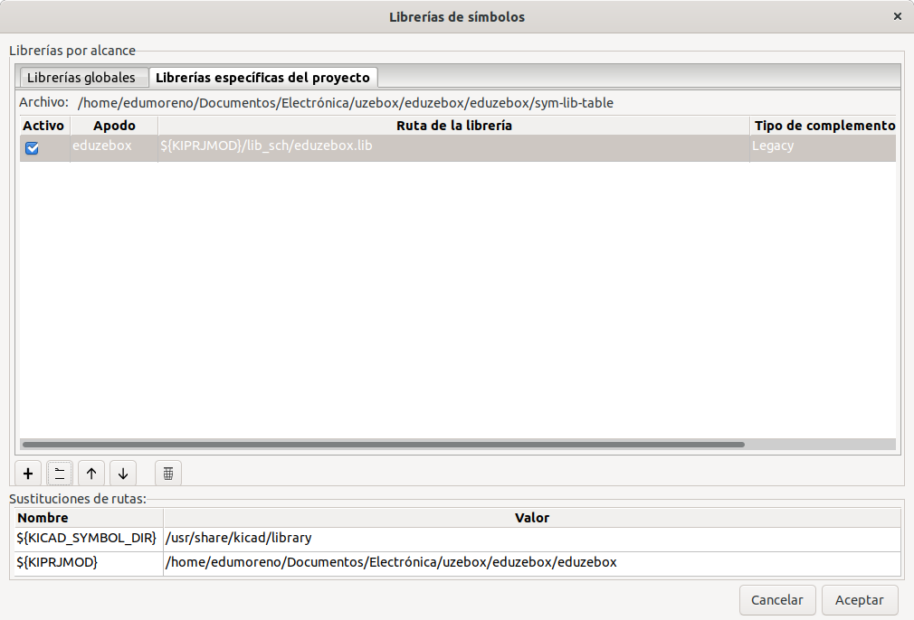

Una alternativa a la forma de trabajar anterior es recoger todos los símbolos y footprints generados en una librería independiente que se pueda añadir a todos los proyectos, una especie de repositorio personal. La incorporaremos como un [submódulo git](../desarrollo/git.md#submodulos). Para ello seguir estos pasos:

1. Inicializar un repositorio git para el proyecto:

    ```
    $ cd mi_proyecto
    $ git init
    ```

2. Instalar la librería como un submódulo git en un directorio llamado `lib`:

    ```
    $ git submodule add git@github.com:eduardofilo/kicad_footprints.git lib
    ```

3. Añadir la librería de símbolos desde `Preferences > Manage Symbol Libraries... > Project Specific Libraries`:

    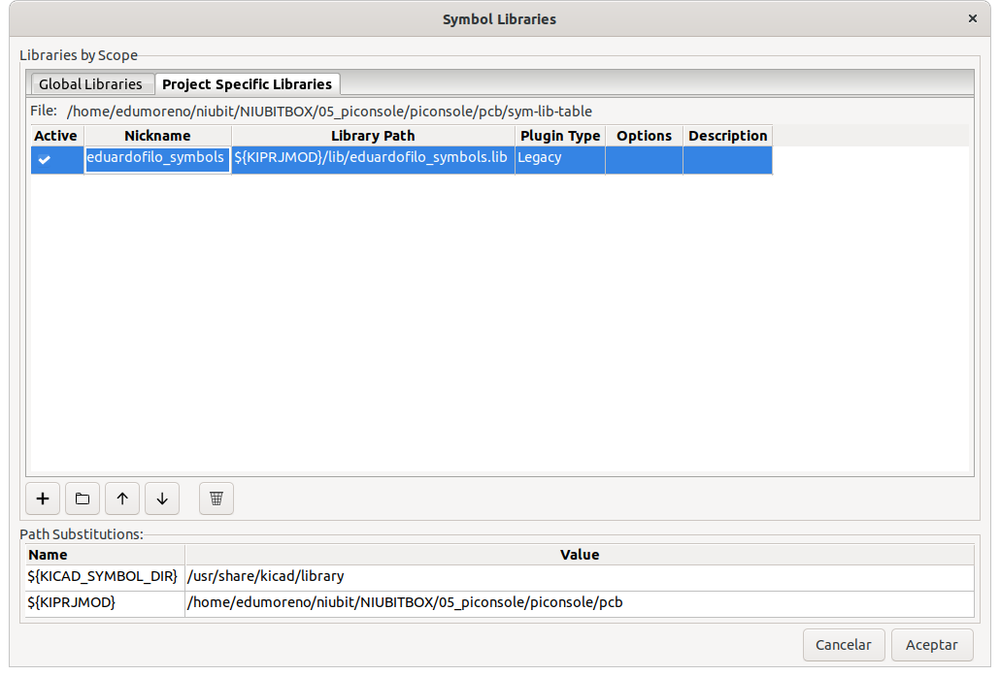

4. Y la librería de footprints desde `Preferences > Manage Footprint Libraries... > Project Specific Libraries`:

    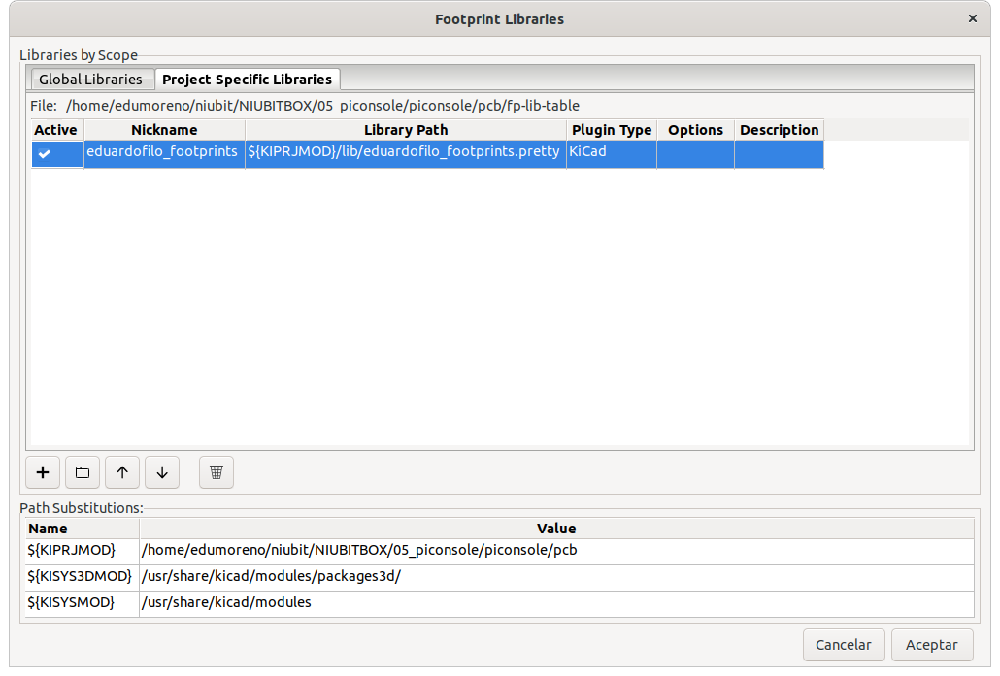

## Workflow

!!! Note
    Este workflow está actualizado para KiCad 10. Muchos de los pasos se pueden contrastar con el tutorial oficial [Getting Started in KiCad](https://docs.kicad.org/10.0/es/getting_started_in_kicad/getting_started_in_kicad.html).

KiCad se utiliza fundamentalmente con atajos de teclado. Para listar todos los atajos disponibles en cualquiera de los editores, ir a `Help > List Hotkeys...`. Hay que tener en cuenta que algunos botones de las barras de herramientas tienen un pequeño triángulo en la esquina inferior derecha: manteniéndolos pulsados se despliega una paleta con herramientas relacionadas (por ejemplo, los distintos tipos de etiquetas).

1. Crear el proyecto:
    1. Desde el KiCad Project Manager, `File > New Project...`, elegir la plantilla `Default`, dar un nombre y marcar `Create a new folder for the project`. Esto crea los ficheros `.kicad_pro` (proyecto), `.kicad_sch` (esquemático) y `.kicad_pcb` (placa), que ahora forman un diseño integrado único.
2. Diseñar un símbolo (solo necesario para componentes que no estén ya en las librerías):
    1. Abrir el `Symbol Editor` desde el Project Manager. 
    2. Para guardar el nuevo símbolo, escoger uno de estos caminos según se quiera mantener exclusivamente dentro del proyecto o de forma global:
        * Crear una nueva librería con `File > New Library...`. En el diálogo que aparece elegir `Project` (la librería se añade a la tabla de librerías del proyecto; las librerías de símbolos son ahora ficheros `.kicad_sym`, así que guardarla como `lib_sch/mi_proyecto.kicad_sym`).
        * Instalar a nivel global (`Preferences > Manage Symbol Libraries...`) las que se mantienen en [este repositorio](https://github.com/eduardofilo/kicad_footprints).
    3. Seleccionar la librería recién creada o importada en el panel `Libraries` (para que el nuevo símbolo se cree dentro de ella) y ejecutar `File > New Symbol...`.
    4. Rellenar el diálogo `New Symbol`: como mínimo darle un nombre y un reference designator por defecto.
    5. Dibujar el símbolo utilizando fundamentalmente los siguientes atajos de teclado:
        * `M`: Mover objeto.
        * `P` / botón `Add a pin`: Crear un pin. El círculo al final de la línea marca el punto de conexión. Pulsar `Insert` para repetir el último pin, autoincrementando su número. 
        * `Del`: Eliminar objeto.
    6. Decorar el símbolo con las herramientas de dibujo.
    7. Guardar los cambios. 
3. Diseñar el esquemático:
    1. Abrir el `Schematic Editor` desde el Project Manager. 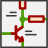
    2. Opcionalmente, configurar primero la hoja con `File > Page Settings...` (título, fecha, tamaño de papel).
    3. Añadir los símbolos que van a componer el esquemático con la ayuda de estos atajos:
        * `A`: Añadir símbolo. 
        * `P`: Añadir un símbolo de alimentación o masa. 
        * `C`: Copiar el símbolo seleccionado.
    4. Una vez colocados todos los símbolos, reorganizarlos y cablearlos con estos atajos de teclado:
        * `M`: Mover objeto (rompe las conexiones).
        * `G`: Arrastrar objeto (mantiene las conexiones).
        * `R`: Rotar objeto.
        * `E`: Editar las propiedades del objeto. También se pueden editar campos concretos directamente: Reference (`U`), Value (`V`) o Footprint (`F`).
        * `W`: Trazar una conexión entre símbolos. Terminar la conexión haciendo clic sobre un pin o con doble clic; pulsar `Esc` para cancelar. 
        * `Q`: Añadir una marca de no conexión.
        * `L`: Añadir una etiqueta de red. 
        * `I`: Añadir una polilínea gráfica. 
        * `T`: Añadir texto.
    5. Dar valores a los componentes que lo necesiten (resistencias, condensadores, diodos, etc.) con `V` o `E`.
    6. Anotar los componentes (asignar reference designators). Ahora los símbolos se anotan automáticamente al colocarlos; se puede activar/desactivar con el botón de anotación de la barra de herramientas izquierda, o reanotar manualmente con el botón `Fill in schematic symbol reference designators`  de la barra superior.
4. Asociar las huellas (footprints) PCB a los símbolos del esquemático:
    1. Abrir la footprint assignment tool (el antiguo *CvPCB*) con su botón en la barra superior. 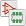
    2. En el panel central seleccionar un símbolo y en el panel derecho hacer doble clic sobre la huella a asignar. Aprovechar los botones de filtrado (filtrar por los filtros del símbolo, por número de pines, por librería seleccionada) y la caja de texto para acotar la lista. Pulsar `OK` al terminar. Las huellas también se pueden asignar desde las propiedades del símbolo (campo `Footprint`).
5. Comprobar el esquemático con el Electrical Rules Check (ERC):
    1. En el `Schematic Editor`, ejecutar el ERC desde `Inspect > Electrical Rules Checker` (o el botón `ERC` de la barra superior) y pulsar `Run ERC`.
    2. Revisar y corregir las violaciones reportadas. Una muy habitual es *"Input Power pin not driven by any Output Power pins"*: añadir un símbolo `PWR_FLAG` (de la librería `Power`) a las redes de alimentación y masa para indicarle a KiCad que esas redes están excitadas, y volver a ejecutar el ERC hasta que pase sin errores.
6. Exportar la BOM:
    1. Ejecutar `Tools > Generate Bill of Materials...`. 
    2. KiCad cuenta ahora con una GUI integrada para la BOM: configurar los campos exportados y la agrupación en la pestaña `Edit` y el formato en la pestaña `Export`, indicar un fichero de salida y pulsar `Export`.
7. Diseñar las huellas que no se encuentren en las librerías:
    1. Abrir el `Footprint Editor` desde el Project Manager. 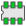
    2. Para guardar la nueva huella, escoger uno de estos caminos según se quiera mantener exclusivamente dentro del proyecto o de forma global:
        * Crear una nueva librería con `File > New Library...`. En el diálogo que aparece elegir `Project` (las librerías de huellas son carpetas terminadas en `.pretty`, p. ej. `lib_fp.pretty`).
        * Instalar a nivel global (`Preferences > Manage Footprint Libraries...`) las que se mantienen en [este repositorio](https://github.com/eduardofilo/kicad_footprints) en el directorio `eduardofilo_footprints.pretty`.
    3. Seleccionar la librería recién creada o importada en el panel `Libraries`, para que la nueva huella se cree dentro de ella.
    4. Ejecutar `File > New Footprint`. 
    5. Editar las propiedades de la huella (botón de la barra superior) para asignarle su nombre y el component type (Through hole / SMD).
    6. Dibujar la huella utilizando fundamentalmente estos atajos de teclado:
        * `M`: Mover objeto.
        * `R`: Rotar objeto.
        * Herramienta `Add a pad`: 
        * `E`: Editar las propiedades del objeto. Sobre los pads es importante asignar correctamente el `Pad number`, ya que es como se enlazan los símbolos con las huellas. Pulsar `Insert` para repetir el último pad, autoincrementando su número.
    7. Decorar la huella con las herramientas de dibujo (capas fab, silkscreen y courtyard).
    8. Guardar los cambios. 
8. Diseñar la PCB. Con el esquemático terminado, ya no hace falta generar/importar el netlist manualmente; la placa se actualiza directamente desde el esquemático:
    1. Abrir el `PCB Editor` desde el Project Manager. 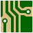
    2. Configurar la placa con `File > Board Setup...`: el physical stackup (número de capas de cobre y espesores), las design rules en `Design Rules > Constraints` y las `Net Classes` (ancho de pista y clearance por grupo de redes). Ajustarlo a las capacidades del fabricante.
    3. Importar el diseño desde el esquemático con `Tools > Update PCB from Schematic...` (`F8`) o su botón en la barra superior. 
    4. En el diálogo `Changes To Be Applied` pulsar `Update PCB`, cerrarlo y hacer clic sobre el lienzo para soltar las huellas.
    5. Recolocar los componentes con `M` (mover), `R` (rotar) y `F` (voltear a la otra cara). Apoyarse en las líneas del *ratsnest* para buscar una disposición fácil de rutear.
    6. Ocultar las etiquetas que no interesen pulsando `E` sobre ellas y desmarcando `Visible`.
    7. Dibujar el perfil de la placa en la capa `Edge.Cuts` con las herramientas de dibujo (p. ej. la herramienta de rectángulo). Debe ser una única forma cerrada.
    8. Rutear utilizando estos atajos de teclado:
        * `X`: Trazar una pista.
        * `V`: Añadir una vía (mientras se rutea).
        * `M`: Mover componente.
        * `R`: Rotar componente.
        * `D`: Arrastrar una pista (manteniéndola conectada).
    9. Crear las zonas rellenas de cobre (normalmente para las *nets* +5V/VCC y GND):
        1. Seleccionar la capa donde irá la zona (`F.Cu` o `B.Cu` habitualmente) en la pestaña Layers del panel Appearance.
        2. Seleccionar la herramienta `Add a filled zone`. 
        3. Delimitar la superficie a rellenar de cobre. Al pinchar el primer vértice aparece un diálogo donde se indican las propiedades de la zona (*net* y capa de cobre).
        4. Las zonas no se rellenan automáticamente: rellenarlas con `Edit > Fill All Zones` (`B`), y volver a rellenar (`B`) cada vez que se modifiquen las pistas.
    10. Ejecutar el Design Rules Check (DRC) con `Inspect > Design Rules Checker` (o su botón en la barra superior) y pulsar `Run DRC`. Corregir todos los errores antes de generar los ficheros de fabricación. 
9. Exportar los Gerber:
    1. Abrir `File > Plot...`. 
    2. En el diálogo, seleccionar las capas a incluir y las opciones que se ven a continuación, e indicar como directorio de salida la carpeta `gerber` del proyecto (en [esta página](https://support.jlcpcb.com/article/149-how-to-generate-gerber-and-drill-files-in-kicad) se muestran las opciones más recomendables para JLCPCB).
        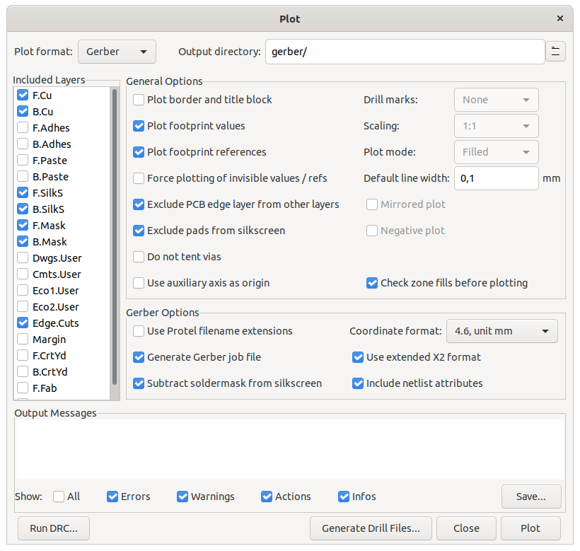
    3. Pulsar `Plot`.
    4. Pulsar `Generate Drill Files...` y, en la nueva ventana, pulsar `Generate Drill File`.
10. Cambios en el esquemático y su propagación:
    1. Hacer el cambio en el `Schematic Editor`.
    2. Asegurarse de que los nuevos componentes están anotados (la anotación automática lo gestiona al colocar los símbolos; si no, usar el botón `Fill in schematic symbol reference designators`  de la barra superior).
    3. Volver al `PCB Editor` y pulsar `Update PCB from Schematic` (`F8`). 
    4. En el diálogo pulsar `Update PCB`. Mostrará un informe de los cambios; si hay componentes nuevos, quedarán enganchados al cursor al cerrarlo para poder colocarlos en la placa.

Las capas más importantes son:

* `F.Cu`: Capa superior de cobre. Atajo de teclado: `PgUp`.
* `B.Cu`: Capa inferior de cobre. Atajo de teclado: `PgDn`.
* `Edge.Cuts`: Perfil de corte de la placa.
* `F.Silkscreen`: Silkscreen superior, donde se representan los símbolos y textos de los componentes, habitualmente en blanco.
* `B.Silkscreen`: Silkscreen inferior.
* `F.Mask`: Máscara de soldadura superior, habitualmente en verde.
* `B.Mask`: Máscara de soldadura inferior.

## Generación modelo 3D de la placa

Es recomendable instalar los paquetes recomendados con apt cuando se instala KiCad. Se puede hacer con la siguiente opción en el comando de instalación:

```bash
$ sudo apt install --install-recommends kicad
```

En caso de no tener las librerías de paquetes 3D o querer forzar el tener la última versión de Github, se puede proceder como sigue:

1. Bajar el repositorio con los modelos de los componentes:

    ```bash
    cd ~/git
    git clone git@gitlab.com:kicad/libraries/kicad-packages3D.git
    ```

2. Abrir el menú `Preferencias > Configure Paths...".
3. Configurar el repositorio recien bajado como la nueva ruta de la librería `KISYS3DMOD` (originalmente la ruta es `/usr/share/kicad/modules/packages3d/`):

    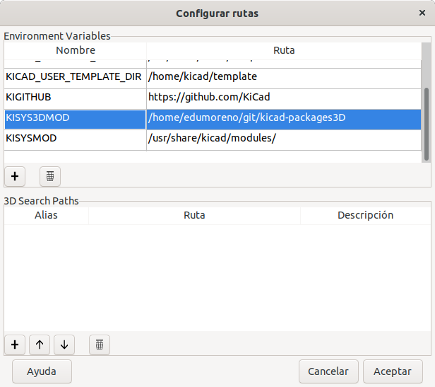)

4. En Pcbnew editar las propiedades de las huellas y en la solapa `Opciones 3D` añadir la ruta del modelo 3D o ajustarla si es que existe.

    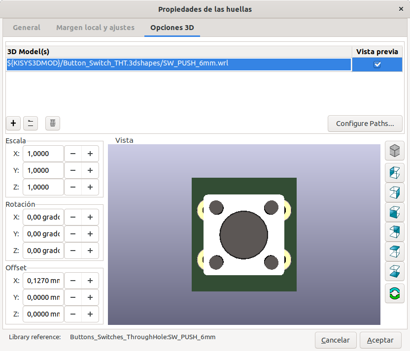)

5. Abrir el menú `Ver > Visor 3D`.

## Designación de componentes

[Fuente](https://dexpcb.com/Manual/standard-reference-designators.htm)

|Referencia|Tipo de componente|
|:----- |:------- |
|A   |Separable assembly or sub-assembly (e.g. printed circuit assembly)|
|AT  |Attenuator or isolator|
|BR  |Bridge Rectifier|
|BT  |Battery|
|C   |Capacitor|
|CN  |Capacitor network|
|D   |Diode (including zeners, thyristors and LEDs)|
|DL  |Delay line|
|DS  |Display|
|F   |Fuse|
|FB or FEB   |Ferrite bead|
|FD  |Fiducial|
|FL  |Filter|
|G   |Generator or oscillator|
|GN  |General network|
|H   |Hardware|
|HY  |Circulator or directional coupler|
|J   |Jack (least-movable connector of a connector pair) \| Jack connector (connector may have "male" pin contacts and/or "female" socket contacts)|
|JP  |Link (Jumper)|
|K   |Relay or contactor|
|L   |Inductor or coil or ferrite bead|
|LS  |Loudspeaker or buzzer|
|M   |Motor|
|MK  |Microphone|
|MP  |Mechanical part (including screws and fasteners)|
|P   |Plug (most-movable connector of a connector pair) \| Plug connector (connector may have "male" pin contacts and/or "female" socket contacts)|
|PS  |Power supply|
|Q   |Transistor (all types)|
|R   |Resistor|
|RN  |Resistor network|
|RT  |Thermistor|
|RV  |Varistor|
|S   |Switch (all types, including push-buttons)|
|T   |Transformer|
|TC  |Thermocouple|
|TUN |Tuner|
|TP  |Test point|
|U   |Inseparable assembly (e.g., integrated circuit)|
|V   |Vacuum Tube|
|VR  |Variable Resistor (potentiometer or rheostat)|
|X   |Socket connector for another item not P or J, paired with the letter symbol for that item (XV for vacuum tube socket, XF for fuse holder, XA for printed circuit assembly connector, XU for integrated circuit connector, XDS for light socket, etc.)|
|Y   |Crystal or oscillator|
|Z   |Zener Diode|

## Componentes

### Tiendas

* [LCSC](https://lcsc.com/)
* [Viinko Electronics HK Ltd](https://viinko.es.aliexpress.com/store/1361740): Acepta pedidos BOM.

### Componentes interesantes, Símbolos y footprints propios KiCad

En [este repositorio](https://github.com/eduardofilo/kicad_footprints).

Antes de crear los símbolos o los footprints, tratar de buscarlos en sitios como [SnapEDA](https://www.snapeda.com/).

|Componente|Symbol|Footprint|Compra|Observaciones|
|:---------|:-----|:--------|:-----|:------------|
|Resistencia 1/4W P=10,16mm| |`Resistor_THT:R_Axial_DIN0207_L6.3mm_D2.5mm_P10.16mm_Horizontal`| |Resistencia convencional|
|Condensador cerámico 100nF P=2,54mm| |`Capacitors_ThroughHole:C_Disc_D3.0mm_W1.6mm_P2.50mm`| |Bypass capacitor convencional|
|LED D=5mm| |`LED_THT:LED_D5.0mm`| |LED convencional 5mm|
|USB micro-B| |`Connect:USB_Micro-B`|[LCSC](https://lcsc.com/product-detail/USB-Connectors_Amphenol-ICC-10118194-0001LF_C132563.html)|Conector microUSB con terminales SMD y 4 agujeros para chasis|
|Lector microSD| |`Connector_Card:microSD_HC_Hirose_DM3AT-SD-PEJMS`|[LCSC](https://lcsc.com/product-detail/Card-Sockets-Connectors_HRS-Hirose_DM3AT-SF-PEJM5_HRS-Hirose-HRS-DM3AT-SF-PEJM5_C114218.html)|Ranura microSD inserción lateral|
|Lector microSD| |`Connector_Card:microSD_HC_Wuerth_693072010801`|[LCSC](https://lcsc.com/product-detail/Card-Sockets-Connectors_Korean-Hroparts-Elec-TF-04A_C145799.html)|Ranura microSD inserción con portezuela superior|
|Lector microSD| | |[LCSC](https://lcsc.com/product-detail/Card-Sockets-Connectors_XUNPU-TF-104_C266612.html)|Ranura microSD inserción deslizante para interior|
|Transistor TO-92| |`Package_TO_SOT_THT:TO-92L_Inline_Wide` o `Package_TO_SOT_THT:TO-92L_HandSolder`| |Transistor convencional, como NPN 2N3904|
|Tactile button 6mm| |`Buttons_Switches_ThroughHole:SW_PUSH_6mm`|[LCSC](https://lcsc.com/product-detail/Others_E-Switch_TL1105AF160Q_E-Switch-TL1105AF160Q_C273465.html)|Tactile switch 6mm convencional|
|AY-8760|eduardofilo_symbols.kicad_sym/AY-3-8760|`Package_DIP:DIP-28_W15.24mm_Socket_LongPads`| | |
|Portapilas 2xAA|eduardofilo_symbols.kicad_sym/Battery_Holder|eduardofilo_footprints.pretty/BatteryHolder_Keystone_1013.kicad_mod|[LCSC](https://lcsc.com/product-detail/Battery-Holders-Clips-Contacts_Keystone-1013_C238059.html)|Keystone 1013|
|Portapilas CR2032|eduardofilo_symbols.kicad_sym/BS-7|eduardofilo_footprints.pretty/BAT_BS-7.kicad_mod|[LCSC](https://lcsc.com/product-detail/Battery-Box-Battery-Holders_Q-J-BS-2-1_C70376.html)| |
|Portapilas LR44|`Device:Battery_Cell`|eduardofilo_footprints.pretty/BatteryHolder_Keystone_2997_1x12mm.kicad_mod|[Digikey](https://www.digikey.es/product-detail/es/keystone-electronics/2997/36-2997-ND/1649360)|Keystone 2997|
|Cargador batería Li y regulador de tensión|eduardofilo_symbols.kicad_sym/DD05CVSA|eduardofilo_footprints.pretty/DD05CVSA.kicad_mod|[Aliexpress](https://www.aliexpress.com/item/4000714467896.html)| |
|MicroSD holder|eduardofilo_symbols.kicad_sym/Micro_SD_Cd|eduardofilo_footprints.pretty/Micro_SD_Cd.kicad_mod|[Aliexpress](https://es.aliexpress.com/item/32802051702.html); [LCSC](https://lcsc.com/product-detail/Card-Sockets-Connectors_HOAUC-HYC77-TF09-200_C341092.html)| |
|Pantalla OLED SSD1306-I2C|eduardofilo_symbols.kicad_sym/OLED-SSD1306-I2C|eduardofilo_footprints.pretty/OLED-SSD1306-I2C.kicad_mod|[Aliexpress](https://www.aliexpress.com/item/32977643629.html)| |
|Pantalla OLED SSD1306-SPI|eduardofilo_symbols.kicad_sym/OLED-SSD1306-SPI|eduardofilo_footprints.pretty/OLED-SSD1306-SPI.kicad_mod|[Aliexpress 0,96"](https://www.aliexpress.com/item/32831561142.html); [Aliexpress 1,54"](https://www.aliexpress.com/item/4001051535838.html)| |
|Potenciómetro|`Device:R_POT`|eduardofilo_footprints.pretty/Potentiometer_Alpha_RD901F-40-00D_Single_Vertical_mod.kicad_mod|[LCSC](https://lcsc.com/product-detail/Potentiometers-Variable-Resistors_ALPSALPINE-RK09K1130A5R_C209779.html)| |
|Raspberry Pi Pico|eduardofilo_symbols.kicad_sym/raspberrypi-pico-module|eduardofilo_footprints.pretty/raspberrypi-pico-module.kicad_mod| | |
|Raspberry Pi Pico|[Símbolo de ncarandini](https://github.com/ncarandini/KiCad-RP-Pico)|[Footprint de ncarandini](https://github.com/ncarandini/KiCad-RP-Pico)| | |
|SCART conector|`Connector:SCART-F`|eduardofilo_symbols.kicad_sym/SCART.kicad_mod|[Aliexpress](https://es.aliexpress.com/item/32997772379.html)| |
|SNES conector|eduardofilo_symbols.kicad_sym/SNES_Connector|eduardofilo_symbols.kicad_sym/SNES.kicad_mod|[Aliexpress](https://es.aliexpress.com/item/32828768824.html)| |
|Switch horizontal|eduardofilo_symbols.kicad_sym/SK12D07VG4|`Button_Switch_THT:SW_CuK_OS102011MA1QN1_SPDT_Angled`|[LCSC](https://lcsc.com/product-detail/Toggle-Switches_SHOU-HAN-SK12D07VG4_C393937.html)|Interruptor horizontal SPDT con 2mm de pitch|
|Switch horizontal|eduardofilo_symbols.kicad_sym/SS-12F44-G5|eduardofilo_footprints.pretty/SS-12F44-G5.kicad_mod|[LCSC](https://lcsc.com/product-detail/Toggle-Switches_Korean-Hroparts-Elec-SS-12F44-G5_C136718.html)|Interruptor vertical SPDT con 3mm de pitch|
|Switch horizontal|`Switch:SW_SPDT`|eduardofilo_footprints.pretty/SW_SPDT_Angled.kicad_mod|[LCSC](https://lcsc.com/product-detail/Toggle-Switches_Korean-Hroparts-Elec-K3-1260D-L1_C92657.html)|Interruptor horizontal SPDT con 2,5mm de pitch sin terminales de chasis|
|Switch horizontal|`Switch:SW_DPDT_x2`|`Button_Switch_THT:SW_E-Switch_EG1271_DPDT`|[Digikey](https://www.digikey.es/es/products/detail/e-switch/EG1271A/251336), [Digikey](https://www.digikey.es/es/products/detail/e-switch/EG1271A/251336), [Digikey](https://www.digikey.es/es/products/detail/c-k/JS202011CQN/1640097), [Digikey](https://www.digikey.es/es/products/detail/c-k/JS202011AQN/1640096)|Interruptor horizontal DPDT con 2,5 de pitch sin terminales de chasis|
|Switch tactile goma 8mm|`Switch:SW_Push`|eduardofilo_footprints.pretty/SW_PUSH_8mm_2pin.kicad_mod|[Aliexpress](https://es.aliexpress.com/item/32668774566.html)| |
|Logo Niubit| |eduardofilo_footprints.pretty/NiubitLogo.kicad_mod| | |
|Vibrador|`Motor:Motor_DC`|eduardofilo_footprints.pretty/Vibrator_Seeed_316040005.kicad_mod|[Digikey](https://www.digikey.es/es/products/detail/seeed-technology-co-ltd/316040005/5487674)| |
|Barrel jack 2.3mm|`Connector:Jack-DC`|eduardofilo_footprints.pretty/Barrel_jack_PJ1-023.kicad_mod|[Digikey](https://www.digikey.es/es/products/detail/cui-devices/PJ1-023/659897)|También compatible con [PJ1-022](https://www.digikey.es/es/products/detail/cui-devices/PJ1-022/659901)|
|Barrel jack 5.5mm|`Connector:Jack-DC`|`Connector_BarrelJack:BarrelJack_Wuerth_6941xx301002`|[LCSC](https://lcsc.com/product-detail/Power-Connectors_XKB-Enterprise-DC-005-5A-2-0_C381116.html)| |
|Zócalo 8 pin (ATtiny85)| |`Housings_DIP:DIP-8_W7.62mm`| |Zócalo DIP-8 convencional|

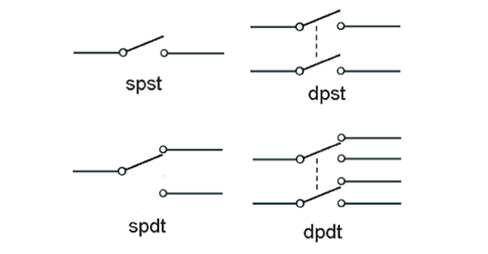

### Valores habituales de resistencias

A pesar de que se fabrican resistencias de prácticamente cualquier valor, como tienen una tolerancia de fabricación amplia (lo normal es utilizar resistencias de en torno al 1-5% de tolerancia), lo habitual es utilizar valores nominales que comiencen con los siguientes valores: 1.0, 1.2, 1.5, 1.8, 2.2, 2.7, 3.3, 3.9, 4.7, 5.6, 6.8, 8.2

[Aquí](https://unicrom.com/tolerancia-valores-normalizados-de-resistores-resistencias/) puede verse una tabla donde se ven los valores normalizados en función de la tolerancia (a menor tolerancia mayor número de valores normalizados).

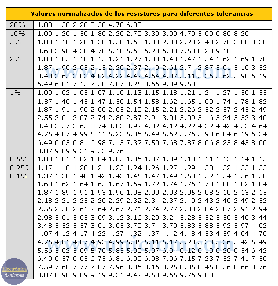

## Panelización

Después de una mala experiencia con [GerberTools](https://github.com/ThisIsNotRocketScience/GerberTools) descrita en [este post](../2020-02-16-panelizar_pcb.md), se encuentra el pack de utilidades [KiKit](https://github.com/yaqwsx/KiKit) que funciona mucho mejor.

En cuanto a la instalación, sobre la versión 1.7.10 de KiCad, no aparecia el plugin `panelize` en el menú `Tools > External Plugins...`, por lo que instalo la versión unstable:

```
$ pip3 install git+https://github.com/yaqwsx/KiKit@master
$ kikit-plugin enable --all
$ kikit-plugin registerlib
```

Aunque se puede parametrizar desde la utilidad que hay en el menú mencionado antes, es mejor utilizar directamente la utilidad de línea de comando, para lo que conviene consultar los siguientes documentos:

* [Panelization CLI](https://github.com/yaqwsx/KiKit/blob/master/doc/panelizeCli.md)
* [Examples](https://github.com/yaqwsx/KiKit/blob/master/doc/examples.md)

Un ejemplo sería:

```
kikit panelize \
    --layout 'rows: 1; cols: 2; rotation: 180deg; alternation: cols;' \
    --source 'tolerance: 50mm;' \
    --post 'millradius: 0.5mm' \
    --cuts vcuts \
    --tabs 'type: fixed; hcount: 2; hwidth: 3mm;' \
    vibrabot.kicad_pcb panel.kicad_pcb
```
