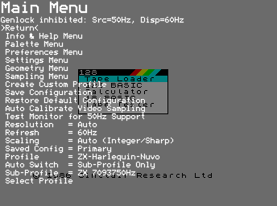
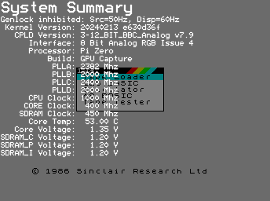

# RGBtoHDMI

## Links

* [Quick Start Guide](https://github.com/hoglet67/RGBtoHDMI/wiki/Quick-Start-Guide)
* [Supported Computers](https://github.com/hoglet67/RGBtoHDMI/wiki/Supported-Computers) and [Cables](https://github.com/hoglet67/RGBtoHDMI/wiki/Cables)
* [Tutorial on Adding a New Profile](https://github.com/hoglet67/RGBtoHDMI/wiki/Tutorial-on-Adding-a-New-Profile)

## Controls

|Button|Situation|Pulsation|Description|
|:-----|:--------|:--------|:----------|
|SW1   |         |Short    |Menu|
|SW1   |         |Long     |Toggle scanlines|
|SW1   |Menu     |Short    |Select menu option or enter editing mode for the selected parameter|
|SW1   |Boot     |Long     |Disable 50Hz support of the monitor (there are monitors that do not support it although they state that they do through EDID).|
|SW2   |         |Short    |Screen capture|
|SW2   |         |Long     |oggle NTSC artifact colours|
|SW2   |Menu     |Short    |Cursor Down or increase selected parameter|
|SW3   |NTSC artifacts enabled|Short    |Cycles though the four NTSC artifact phases|
|SW3   |Manual timing sets enabled|Short    |Switches between set 1 and set 2|
|SW3   |         |Short    |Enables (if disabled) or refreshes the genlock|
|SW3   |         |Long     |Calibrate sampling position|
|SW3   |Menu     |Short    |Cursor Up of decrease selected parameter|
|SW2 y SW3 |Menu     |Short    |Screencap with the menu on screen|
|RST   |         |Short    |Reset|

## Profiles

#### ZX Spectrum +2

The connection between the DIN8 of the Spectrum +2 and the 12-pin IDC of RGBtoHDMI (P2) is ([official documentation](https://github.com/hoglet67/RGBtoHDMI/wiki/Cables#spectrum-128-or-2-4-bit-rgbi-ttl)):

|DIN8|RGBtoHDMI 12 way IDC(P2)|Description                             |
|:---|:-----------------------|:---------------------------------------|
|1   |                        |Composite PAL (75 Ohm, 1.2 V pk-pk)     |
|2   |3                       |GND                                     |
|3   |4                       |Bright output (TTL)                     |
|4   |8                       |Composite sync (TTL)                    |
|5   |                        |Vertical sync (TTL)                     |
|6   |9                       |Green (TTL)                             |
|7   |7                       |Red (TTL)                               |
|8   |11                      |Blue (TTL)                              |

- CPLD firmware: 6-12_BIT_RGB_Analog
- Palette Menu:
    - Palette: RGBrgb (Amstrad)
- Profile: Spectrum +2 (Grey)

#### ZX Harlequin 128

The connection between the miniDIN8 of the Harlequin 128 and the 6-pin IDC of the Analog board is ([official documentation](https://github.com/hoglet67/RGBtoHDMI/wiki/Cables#spectrum-2a-or-3-analog-rgb)):

|miniDIN8(socket)|RGBtoHDMI 6 way IDC (Analog board)|Description                             |
|:---------------|:---------------------------------|:---------------------------------------|
|1               |1                                 |GND                                     |
|2               |                                  |Video switching (12V)                   |
|3               |                                  |Fast switching RGB (75 Ohm, 1 V)        |
|4               |4                                 |Green (75 Ohm, 0.7 V pk-pk)             |
|5               |                                  |Audio (mono)                            |
|6               |5                                 |Red (75 Ohm, 0.7 V pk-pk)               |
|7               |3                                 |Blue (75 Ohm, 0.7 V pk-pk)              |
|8               |2                                 |Composite sync                          |

- CPLD firmware: 3-12_BIT_BBC_Analog
- Palette Menu:
    - Palette: RGBrgb (Spectrum)
- Profile: ZX-Harlequin-Nuvo

## 50Hz support

Many monitors declare in the EDID that they don't support the 50Hz mode, even though they do. If the monitor doesn't switch to 50Hz when it receives a video signal at this frequency, run the test using the menu option `Test Monitor for 50Hz Support` following the [documentation](https://github.com/hoglet67/RGBtoHDMI/wiki/Quick-Start-Guide#configuring-the-refresh-setting). If the test result is positive, change the `Refresh` setting to `Force 50Hz-60Hz` so that it adopts the input signal frequency, ignoring what the EDID declares.