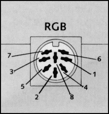
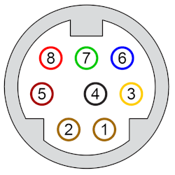
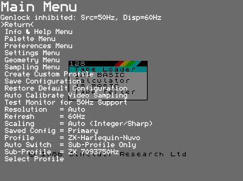
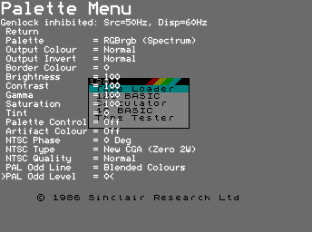
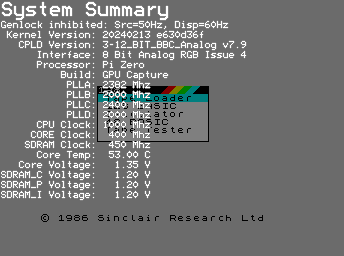

# RGBtoHDMI

## Enlaces

* [Quick Start Guide](https://github.com/hoglet67/RGBtoHDMI/wiki/Quick-Start-Guide)
* [Ordenadores Soportados](https://github.com/hoglet67/RGBtoHDMI/wiki/Supported-Computers) y [Cables](https://github.com/hoglet67/RGBtoHDMI/wiki/Cables)
* [Tutorial on Adding a New Profile](https://github.com/hoglet67/RGBtoHDMI/wiki/Tutorial-on-Adding-a-New-Profile)

## Controles

|Botón|Situación|Pulsación|Descripción|
|:----|:--------|:--------|:----------|
|SW1  |         |Corta    |Menú|
|SW1  |         |Larga    |Alternar scanlines|
|SW1  |Menú     |Corta    |Seleccionar opción o entra en el modo edición del parámetro seleccionado|
|SW1  |Arranque |Larga    |Desactiva soporte 50Hz del monitor (hay monitores que no lo soportan aunque declaran que sí lo hacen a través de EDID)|
|SW2  |         |Corta    |Captura de pantalla|
|SW2  |         |Larga    |Alternar artefactos de color NTSC|
|SW2  |Menú     |Corta    |Cursor abajo o incrementa el parámetro seleccionado|
|SW3  |Artefactos de color NTSC activados|Corta    |Cicla a través de las 4 fases de artefactos NTSC|
|SW3  |Conjunto de timings activados|Corta    |Cicla a través de los conjuntos 1 y 2|
|SW3  |         |Corta    |Activa (si estaba desactivado) o refresca el genlock|
|SW3  |         |Larga    |Calibra la posición de muestreo|
|SW3  |Menú     |Corta    |Cursor arriba o decrementa el parámetro seleccionado|
|SW2 y SW3|Menú     |Corta    |Captura de pantalla incluyendo el menú|
|RST  |         |Corta    |Reset|

## Perfiles

#### ZX Spectrum +2

La conexión entre el DIN8 del Spectrum +2 y el IDC de 12 pines de RGBtoHDMI (P2) es ([documentación oficial](https://github.com/hoglet67/RGBtoHDMI/wiki/Cables#spectrum-128-or-2-4-bit-rgbi-ttl)):

|DIN8|RGBtoHDMI 12 way IDC(P2)|Descripción                             |
|:---|:-----------------------|:---------------------------------------|
|1   |                        |Composite PAL (75 Ohm, 1.2 V pk-pk)     |
|2   |3                       |GND                                     |
|3   |4                       |Bright output (TTL)                     |
|4   |8                       |Composite sync (TTL)                    |
|5   |                        |Vertical sync (TTL)                     |
|6   |9                       |Green (TTL)                             |
|7   |7                       |Red (TTL)                               |
|8   |11                      |Blue (TTL)                              |

- CPLD firmware: 6-12_BIT_RGB_Analog
- Palette Menu:
    - Palette: RGBrgb (Amstrad)
- Profile: Spectrum +2 (Grey)

#### ZX Harlequin 128

La conexión entre el miniDIN8 del Harlequin 128 y el IDC de 6 pines de la Analog board es ([documentación oficial](https://github.com/hoglet67/RGBtoHDMI/wiki/Cables#spectrum-2a-or-3-analog-rgb)):

|miniDIN8(socket)|RGBtoHDMI 6 way IDC (Analog board)|Descripción                             |
|:---------------|:---------------------------------|:---------------------------------------|
|1               |1                                 |GND                                     |
|2               |                                  |Video switching (12V)                   |
|3               |                                  |Fast switching RGB (75 Ohm, 1 V)        |
|4               |4                                 |Green (75 Ohm, 0.7 V pk-pk)             |
|5               |                                  |Audio (mono)                            |
|6               |5                                 |Red (75 Ohm, 0.7 V pk-pk)               |
|7               |3                                 |Blue (75 Ohm, 0.7 V pk-pk)              |
|8               |2                                 |Composite sync                          |

- CPLD firmware: 3-12_BIT_BBC_Analog
- Palette Menu:
    - Palette: RGBrgb (Spectrum)
- Profile: ZX-Harlequin-Nuvo

