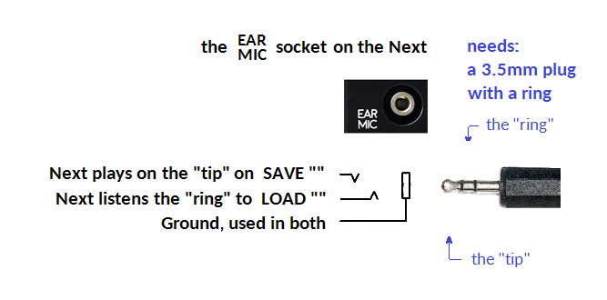
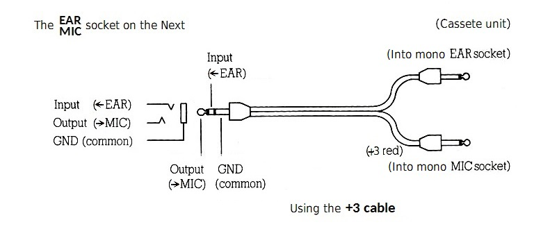

# ZX Spectrum Next / N-GO

## Links

* [ZX Spectrum Next](https://www.specnext.com/)
* [N-GO](https://manuferhi.com/c/n-go)
* [Spectrum Next Stuff - YouTube list](https://www.youtube.com/playlist?list=PL2lCM2mJCG_AonDyHJfqjxFR5VoqBWqoh)
* The master [nextreg](https://gitlab.com/SpectrumNext/ZX_Spectrum_Next_FPGA/-/blob/master/cores/zxnext/nextreg.txt) and [port](https://gitlab.com/SpectrumNext/ZX_Spectrum_Next_FPGA/-/blob/master/cores/zxnext/ports.txt) lists are kept up to date, and fully describe the Next hardware for developers.
* The [pinouts](https://gitlab.com/thesmog358/tbblue/-/blob/master/docs/extra-hw/pinouts/pinouts.txt) list has detailed information on connectors.
* The [NextZXOS change log](https://gitlab.com/thesmog358/tbblue/-/raw/master/docs/nextzxos-changelog.txt) details what was new and fixed in each version of NextZXOS/NextBASIC.
* The four [NextZXOS PDFs](https://gitlab.com/thesmog358/tbblue/-/tree/master/docs/nextzxos) have detailed information on the NextZXOS and esxDOS APIs, NextBASIC sysvars, and NextBASIC syntax.
* varmfskii's [ZX Spectrum Next Programming Notes](https://raw.githubusercontent.com/varmfskii/zxnext_code/master/zx_next_notes/zxnext_notes.pdf) are an attempt to consolidate the Next programming interface into a single location.
* Myopian's [API spreadsheet](https://docs.google.com/spreadsheets/d/1dB8fKIfByGJTts409Ud8ly450a6SLPnLZc-nCBghBl8) summarises NextZXOS/IDEDOS entry points along with calling conditions.
* Myopian's [dot command summary](https://www.cs.hmc.edu/~oneill/specnext/dot-cmds.html) collects together help and readme text for NextZXOS dot commands in one handy place.
* Tomaz's [ZX Spectrum Next Assembly Developer Guide](https://github.com/tomaz/zx-next-dev-guide/releases/latest) is almost like "User manual" for Assembly developers.
* Luzie/Rat Mal's [Almost (In-) Complete List of esxDOS DOT-Commands](https://docs.google.com/spreadsheets/d/17-ifpHcy932_AP7SAv9uBLxg-2ZptcdgTvQ8ILXQLM4/edit?usp=sharing_eil&ts=599361c7) attempts to list dot commands for several systems, including the Next. Some of the non-Next-specific commands may work on the Next, and some may only work on other FPGA/divMMC systems.
* [Beeper](https://wiki.specnext.dev/Beeper_(hardware)): Installation of internal beeper.

## Cheatsheet

#### Keyboard shortcuts

|Shortcut|Used for|Notes|
|:------------|:-------|:------|
|F1 / Reset (long press)|Hard Reset|Resets CPU and Peripherals, reloads the FW and loads the hardware settings anew but doesn't clear the RAM|
|F2|Scandoubler|Doubles the output resolution. Must be off for older monitors and SCART cables|
|F3|50Hz/60Hz Vertical Frequency|Changes the display's vertical frequency from 50 to 60Hz and vice-versa|
|F4 / Reset (short press)|Soft Reset|Resets CPU and Peripherals and reloads the Operating System. Used with Caps Shift it forces a rescan of drives and a reload of the boot screen under esxDOS|
|F5|Not Used| |
|F6|Not Used| |
|F7|Scanlines|Cyclically toggles scan line emulation in 4 steps/intensities: 0%, 25%, 50%, 75%. This emulates the older CRT monitors|
|F8|Turbo modes|Cyclically toggles CPU speed (3.5MHz, 7MHz, 14MHz, 28Mhz)|
|F9|NMI (Multiface)|Simulates pressing the NMI button|
|F10|divMMC NMI (Drive)|Simulates pressing the Drive button (divMMC NMI – used with esxDOS). Used with Caps Shift it forces a rescan of drives and a reload of the boot screen under esxDOS|
|NMI + <numeric keys>|Simulates PS/2 keyboard function keys| |

#### Key files

|File|Description|
|:-------|:------------|
|`machines/next/CONFIG.INI`|Next main core settings (scanlines, scandoubler, screen refresh rate, ULAPlus modes, etc.). Select the default mode from those defined in `machines/next/menu.def`.|

#### Modes

|Mode|Selection|Description|
|:---|:--------|:----------|
|`ZX Spectrum Next (standard)`|Space on hard boot/reset|Normal NextZXOS|
|`ZX Spectrum Next (LG 48K ROM)`|Space on hard boot/reset| |
|`ZX Spectrum 48K`|Space on hard boot/reset and `more...` page in NextZXOS menu| |
|`ZX Spectrum 128k`|Space on hard boot/reset and `more...` page in NextZXOS menu| |
|`ZX Spectrum +2`|Space on hard boot/reset| |
|`ZX Spectrum +2A/+3`|Space on hard boot/reset| |
|`ZX Spectrum +3e`|Space on hard boot/reset| |
|`ZX80 Emulator (c) Paul Farrow`|Space on hard boot/reset and `more...` page in NextZXOS menu| |
|`ZX81 Emulator (c) Paul Farrow`|Space on hard boot/reset and `more...` page in NextZXOS menu| |
|`48K Gosh Wonderful ROM v3.3`|Space on hard boot/reset| |
|`48K Looking Glass ROM v1.07`|Space on hard boot/reset|48K mode with key-to-key commands and bug fixes|
|`48K Looking Glass ROM v1.07-altfont-`|Space on hard boot/reset|48K mode with key-to-key commands and bug fixes. It has a bold font|
|`Timex Sinclair TC2048`|Space on hard boot/reset| |
|`Investronica Spectrum 128K`|Space on hard boot/reset| |
|`Pentagon 128K`|Space on hard boot/reset| |

#### NextBASIC cursor modes

|32 columns (Colour)|64/85 columns (Shape)|Function|
|:---------------------|:---------------------------------|:--------|
|Blue|Horizontal Bar in lower half of character|Normal Text Entry|
|Cyan|Horizontal Bar in upper half of character|CAPS LOCK on (Toggle with CAPS LOCK key)|
|Magenta|Vertical Bar|GRAPHICS mode (Toggle with GRAPHICS key)|
|Green|Horizontal Stripes|EXTEND mode (Toggle with EXTEND key)|
|Red|Rectangular Outline|Error Marker: There's an error in the line that needs correcting|

#### Cassette connections

